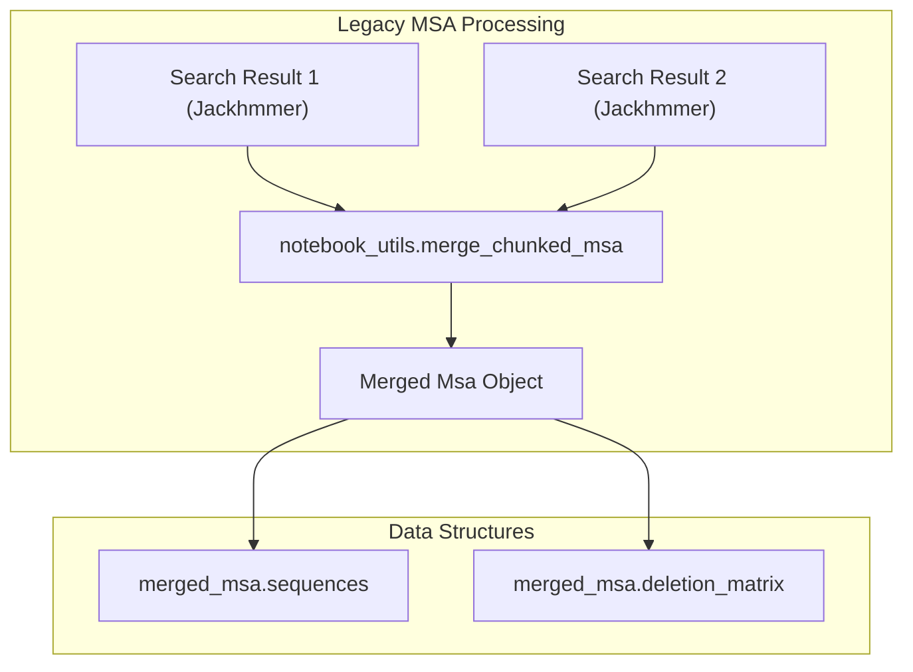

# Deprecated Features

> **Relevant source files**
> * [alphafold/notebooks/notebook_utils_test.py](https://github.com/google-deepmind/alphafold/blob/c77e5d2a/alphafold/notebooks/notebook_utils_test.py)
> * [notebooks/AlphaFold.ipynb](https://github.com/google-deepmind/alphafold/blob/c77e5d2a/notebooks/AlphaFold.ipynb)

This page documents legacy interfaces and utilities within the AlphaFold codebase that are no longer actively maintained or have been superseded by newer platforms. While the code for these features may still exist in the repository for historical reference, users are encouraged to migrate to the recommended alternatives.

## Colab Notebook

The original AlphaFold Colab notebook, previously located in the `notebooks/` directory, has been deprecated. It provided a simplified interface for running AlphaFold without local infrastructure but is now superseded by more robust community and official tools.

### Status and Alternatives

The notebook file `notebooks/AlphaFold.ipynb` now serves as a placeholder directing users to current solutions [notebooks/AlphaFold.ipynb L9-L11](https://github.com/google-deepmind/alphafold/blob/c77e5d2a/notebooks/AlphaFold.ipynb#L9-L11)

* **AlphaFold Server**: The primary official platform for AlphaFold 3 and advanced modeling tasks.
* **ColabFold**: A community-maintained version that offers faster MSA generation using MMseqs2.

### Legacy Notebook Utilities

The `alphafold/notebooks/notebook_utils.py` module contains helper functions originally designed to support the Colab environment. These include sequence validation and MSA merging logic.

#### Sequence Validation

The pipeline includes strict validation for input sequences to ensure they are compatible with the model's requirements.

* `clean_and_validate_single_sequence`: Trims whitespace, converts to uppercase, and checks for valid amino acid characters [alphafold/notebooks/notebook_utils_test.py L114-L116](https://github.com/google-deepmind/alphafold/blob/c77e5d2a/alphafold/notebooks/notebook_utils_test.py#L114-L116)
* **Validation Rules**: Sequences must not contain non-amino acid characters (e.g., 'B', 'J', 'O', 'U', 'X', 'Z') and must fall within specified length constraints [alphafold/notebooks/notebook_utils_test.py L120-L133](https://github.com/google-deepmind/alphafold/blob/c77e5d2a/alphafold/notebooks/notebook_utils_test.py#L120-L133)

#### MSA Merging

The notebook pipeline utilized a chunked MSA generation approach, requiring specialized merging logic to combine results from multiple searches.

The `merge_chunked_msa` function aggregates sequences and their corresponding deletion matrices from multiple `Search` results [alphafold/notebooks/notebook_utils_test.py L162-L173](https://github.com/google-deepmind/alphafold/blob/c77e5d2a/alphafold/notebooks/notebook_utils_test.py#L162-L173)

**Sources:**

* [notebooks/AlphaFold.ipynb L1-L32](https://github.com/google-deepmind/alphafold/blob/c77e5d2a/notebooks/AlphaFold.ipynb#L1-L32)
* [alphafold/notebooks/notebook_utils_test.py L104-L180](https://github.com/google-deepmind/alphafold/blob/c77e5d2a/alphafold/notebooks/notebook_utils_test.py#L104-L180)

## Comparison of Deprecated vs. Current Pipelines

The following table outlines the transition from deprecated notebook-based execution to the current supported methods.

| Feature | Deprecated (Notebook) | Current (AlphaFold Server / Local) |
| --- | --- | --- |
| **MSA Generation** | Sequential Jackhmmer in Colab | AlphaFold Server API or Local Docker Pipeline |
| **Sequence Entry** | Interactive Colab Forms | JSON Job Submission or FASTA files |
| **Validation** | `notebook_utils.clean_and_validate` | `run_alphafold.py` validation & Server Schema |
| **Maintenance** | No longer supported [notebooks/AlphaFold.ipynb L11](https://github.com/google-deepmind/alphafold/blob/c77e5d2a/notebooks/AlphaFold.ipynb#L11-L11) | Actively maintained |

## Implementation Details of Legacy Tests

The test suite for deprecated notebook utilities ensures that even legacy parsing logic remains consistent for those still utilizing the underlying library functions.

### MSA Parser Testing

Tests in `notebook_utils_test.py` verify the handling of Stockholm format strings (`.sto`) and table outputs (`.tbl`) from HMMER searches [alphafold/notebooks/notebook_utils_test.py L26-L100](https://github.com/google-deepmind/alphafold/blob/c77e5d2a/alphafold/notebooks/notebook_utils_test.py#L26-L100)

1. **Empty Hits**: Ensures the system correctly handles cases where only the query sequence is returned [alphafold/notebooks/notebook_utils_test.py L162-L169](https://github.com/google-deepmind/alphafold/blob/c77e5d2a/alphafold/notebooks/notebook_utils_test.py#L162-L169)
2. **Multi-Sequence Merging**: Validates that sequences from different search iterations are correctly deduplicated and appended to the `Msa` object [alphafold/notebooks/notebook_utils_test.py L171-L180](https://github.com/google-deepmind/alphafold/blob/c77e5d2a/alphafold/notebooks/notebook_utils_test.py#L171-L180)

**Sources:**

* [alphafold/notebooks/notebook_utils_test.py L26-L100](https://github.com/google-deepmind/alphafold/blob/c77e5d2a/alphafold/notebooks/notebook_utils_test.py#L26-L100)
* [alphafold/notebooks/notebook_utils_test.py L162-L180](https://github.com/google-deepmind/alphafold/blob/c77e5d2a/alphafold/notebooks/notebook_utils_test.py#L162-L180)