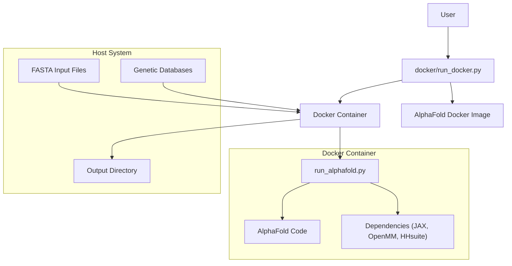
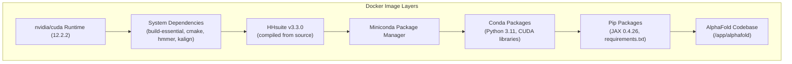
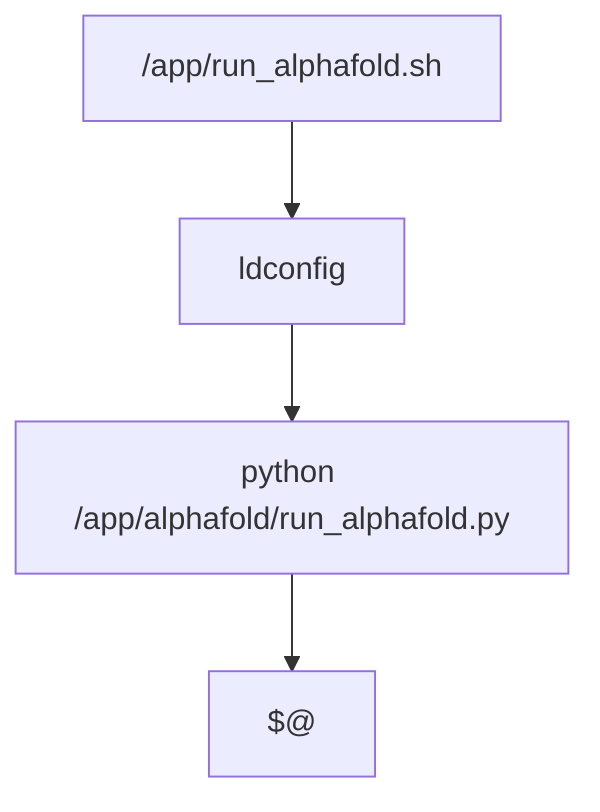
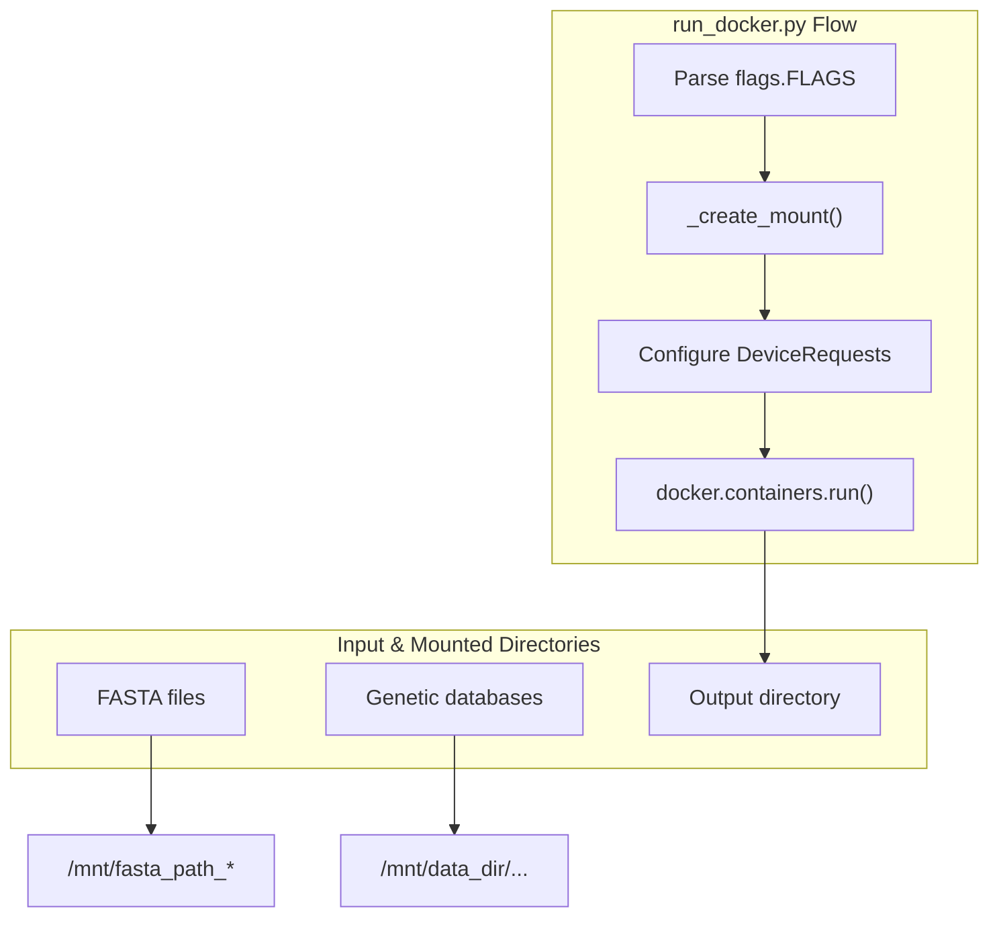
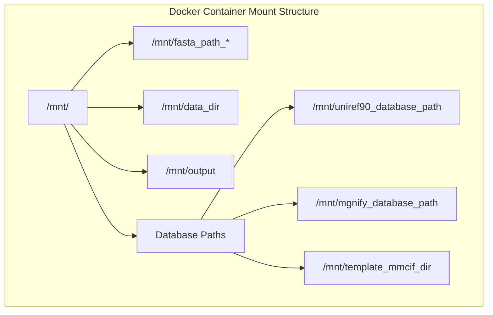

# Docker Environment

> **Relevant source files**
> * [.dockerignore](https://github.com/google-deepmind/alphafold/blob/c77e5d2a/.dockerignore)
> * [docker/Dockerfile](https://github.com/google-deepmind/alphafold/blob/c77e5d2a/docker/Dockerfile)
> * [docker/run_docker.py](https://github.com/google-deepmind/alphafold/blob/c77e5d2a/docker/run_docker.py)
> * [pyproject.toml](https://github.com/google-deepmind/alphafold/blob/c77e5d2a/pyproject.toml)
> * [requirements.txt](https://github.com/google-deepmind/alphafold/blob/c77e5d2a/requirements.txt)
> * [run_alphafold_test.py](https://github.com/google-deepmind/alphafold/blob/c77e5d2a/run_alphafold_test.py)

This document details the Docker-based execution environment for AlphaFold. It covers the Docker image structure, how to build and run the AlphaFold container, and the configuration options available. For information about preparing data needed by AlphaFold, see section 2.2.

## Overview

AlphaFold uses Docker to create a consistent, isolated environment with all necessary dependencies for protein structure prediction. The Docker environment handles complex dependencies like CUDA, JAX, and OpenMM, making it much easier to deploy AlphaFold across different systems.

### Natural Language to Code Entity Space: Execution Flow

The following diagram maps high-level execution steps to the specific code entities responsible for managing the Docker environment.



Sources: [docker/Dockerfile L1-L91](https://github.com/google-deepmind/alphafold/blob/c77e5d2a/docker/Dockerfile#L1-L91)

 [docker/run_docker.py L15-L25](https://github.com/google-deepmind/alphafold/blob/c77e5d2a/docker/run_docker.py#L15-L25)

## Docker Image Structure

The AlphaFold Docker image is built from the `docker/Dockerfile` in the repository and contains all necessary components to run protein structure predictions.

### Base Image and Core Components

The Docker image is based on `nvidia/cuda:12.2.2-cudnn8-runtime-ubuntu20.04` [docker/Dockerfile L15-L16](https://github.com/google-deepmind/alphafold/blob/c77e5d2a/docker/Dockerfile#L15-L16)

 to support GPU acceleration. It installs several key components in layers:

1. **System Dependencies**: Build tools (`build-essential`, `cmake`), `git`, `hmmer`, `kalign`, and `cuda-command-line-tools` [docker/Dockerfile L25-L37](https://github.com/google-deepmind/alphafold/blob/c77e5d2a/docker/Dockerfile#L25-L37)
2. **HHsuite**: Compiled from source (v3.3.0) and installed to `/opt/hhsuite` [docker/Dockerfile L40-L47](https://github.com/google-deepmind/alphafold/blob/c77e5d2a/docker/Dockerfile#L40-L47)
3. **Miniconda**: Python package manager installed to `/opt/conda` [docker/Dockerfile L50-L53](https://github.com/google-deepmind/alphafold/blob/c77e5d2a/docker/Dockerfile#L50-L53)
4. **Conda Packages**: Python 3.11, `pip`, and CUDA libraries [docker/Dockerfile L59-L61](https://github.com/google-deepmind/alphafold/blob/c77e5d2a/docker/Dockerfile#L59-L61)
5. **Python Dependencies**: JAX 0.4.26 with CUDA 12 support, plus packages from `requirements.txt` [docker/Dockerfile L69-L73](https://github.com/google-deepmind/alphafold/blob/c77e5d2a/docker/Dockerfile#L69-L73)
6. **AlphaFold Code**: The complete codebase copied to `/app/alphafold` [docker/Dockerfile L63](https://github.com/google-deepmind/alphafold/blob/c77e5d2a/docker/Dockerfile#L63-L63)



Sources: [docker/Dockerfile L15-L74](https://github.com/google-deepmind/alphafold/blob/c77e5d2a/docker/Dockerfile#L15-L74)

### Entrypoint Configuration

The Docker image configures an entrypoint script (`/app/run_alphafold.sh`) that runs `ldconfig` to ensure GPU visibility, then executes `run_alphafold.py` [docker/Dockerfile L87-L91](https://github.com/google-deepmind/alphafold/blob/c77e5d2a/docker/Dockerfile#L87-L91)



The `ldconfig` command is necessary due to a quirk with Debian-based NVIDIA Docker images where GPUs are not visible until the dynamic linker cache is updated [docker/Dockerfile L81-L83](https://github.com/google-deepmind/alphafold/blob/c77e5d2a/docker/Dockerfile#L81-L83)

 The SETUID bit is added to `/sbin/ldconfig.real` to allow non-root users to run this command [docker/Dockerfile L76](https://github.com/google-deepmind/alphafold/blob/c77e5d2a/docker/Dockerfile#L76-L76)

Sources: [docker/Dockerfile L76-L91](https://github.com/google-deepmind/alphafold/blob/c77e5d2a/docker/Dockerfile#L76-L91)

## Running AlphaFold with Docker

The repository provides `docker/run_docker.py` to simplify running AlphaFold in Docker. This script handles mounting directories, setting up GPU access, and passing command-line arguments to the container.

### Key Components and Data Flow

The script uses `docker.types.Mount` to bind host directories into the container [docker/run_docker.py L150-L155](https://github.com/google-deepmind/alphafold/blob/c77e5d2a/docker/run_docker.py#L150-L155)



Sources: [docker/run_docker.py L133-L157](https://github.com/google-deepmind/alphafold/blob/c77e5d2a/docker/run_docker.py#L133-L157)

 [docker/run_docker.py L159-L250](https://github.com/google-deepmind/alphafold/blob/c77e5d2a/docker/run_docker.py#L159-L250)

### Configuration Flags

The script defines several `absl.flags` to control the environment:

| Flag | Default | Description |
| --- | --- | --- |
| `--use_gpu` | `True` | Enable NVIDIA runtime to run with GPUs [docker/run_docker.py L29](https://github.com/google-deepmind/alphafold/blob/c77e5d2a/docker/run_docker.py#L29-L29) |
| `--gpu_devices` | `'all'` | Comma separated list of devices to pass to NVIDIA_VISIBLE_DEVICES [docker/run_docker.py L47](https://github.com/google-deepmind/alphafold/blob/c77e5d2a/docker/run_docker.py#L47-L47) |
| `--fasta_paths` | `None` | Paths to FASTA files (required) [docker/run_docker.py L51](https://github.com/google-deepmind/alphafold/blob/c77e5d2a/docker/run_docker.py#L51-L51) |
| `--data_dir` | `None` | Path to genetic and template databases (required) [docker/run_docker.py L66](https://github.com/google-deepmind/alphafold/blob/c77e5d2a/docker/run_docker.py#L66-L66) |
| `--output_dir` | `'/tmp/alphafold'` | Path to store results [docker/run_docker.py L61](https://github.com/google-deepmind/alphafold/blob/c77e5d2a/docker/run_docker.py#L61-L61) |
| `--model_preset` | `'monomer'` | Model configuration (monomer, multimer, etc.) [docker/run_docker.py L88](https://github.com/google-deepmind/alphafold/blob/c77e5d2a/docker/run_docker.py#L88-L88) |
| `--db_preset` | `'full_dbs'` | Database configuration (full or reduced) [docker/run_docker.py L81](https://github.com/google-deepmind/alphafold/blob/c77e5d2a/docker/run_docker.py#L81-L81) |
| `--docker_user` | `os.geteuid()` | UID:GID with which to run the container [docker/run_docker.py L120](https://github.com/google-deepmind/alphafold/blob/c77e5d2a/docker/run_docker.py#L120-L120) |

Sources: [docker/run_docker.py L29-L126](https://github.com/google-deepmind/alphafold/blob/c77e5d2a/docker/run_docker.py#L29-L126)

## Python Dependencies

Dependencies are managed through `requirements.txt` and `pyproject.toml`.

### Core Dependencies

| Package | Version | Purpose |
| --- | --- | --- |
| `dm-haiku` | 0.0.12 | Neural network library for JAX [requirements.txt L3](https://github.com/google-deepmind/alphafold/blob/c77e5d2a/requirements.txt#L3-L3) |
| `jax` | 0.4.26 | Core computation engine [requirements.txt L5](https://github.com/google-deepmind/alphafold/blob/c77e5d2a/requirements.txt#L5-L5) |
| `numpy` | 1.24.3 | Numerical computing [requirements.txt L8](https://github.com/google-deepmind/alphafold/blob/c77e5d2a/requirements.txt#L8-L8) |
| `openmm[cuda12]` | 8.2.0 | Structure relaxation [requirements.txt L9](https://github.com/google-deepmind/alphafold/blob/c77e5d2a/requirements.txt#L9-L9) |
| `tensorflow-cpu` | 2.16.1 | Input feature processing [requirements.txt L13](https://github.com/google-deepmind/alphafold/blob/c77e5d2a/requirements.txt#L13-L13) |

The project requires Python >= 3.10 [pyproject.toml L22](https://github.com/google-deepmind/alphafold/blob/c77e5d2a/pyproject.toml#L22-L22)

Sources: [requirements.txt L1-L14](https://github.com/google-deepmind/alphafold/blob/c77e5d2a/requirements.txt#L1-L14)

 [pyproject.toml L39-L51](https://github.com/google-deepmind/alphafold/blob/c77e5d2a/pyproject.toml#L39-L51)

## Building and Execution Details

### Build Command

To build the image manually:

```
docker build -f docker/Dockerfile -t alphafold .
```

### Mount Points and Data Organization

The script `run_docker.py` maps host paths to a standard container structure under `_ROOT_MOUNT_DIRECTORY = '/mnt/'` [docker/run_docker.py L130](https://github.com/google-deepmind/alphafold/blob/c77e5d2a/docker/run_docker.py#L130-L130)



Sources: [docker/run_docker.py L130-L215](https://github.com/google-deepmind/alphafold/blob/c77e5d2a/docker/run_docker.py#L130-L215)

### GPU Visibility Fix

The Dockerfile includes a specific workaround for `libffi` to avoid `undefined_symbol` errors:
`ln -sf /usr/lib/x86_64-linux-gnu/libffi.so.7 /opt/conda/lib/libffi.so.7` [docker/Dockerfile L79](https://github.com/google-deepmind/alphafold/blob/c77e5d2a/docker/Dockerfile#L79-L79)

Sources: [docker/Dockerfile L79-L83](https://github.com/google-deepmind/alphafold/blob/c77e5d2a/docker/Dockerfile#L79-L83)