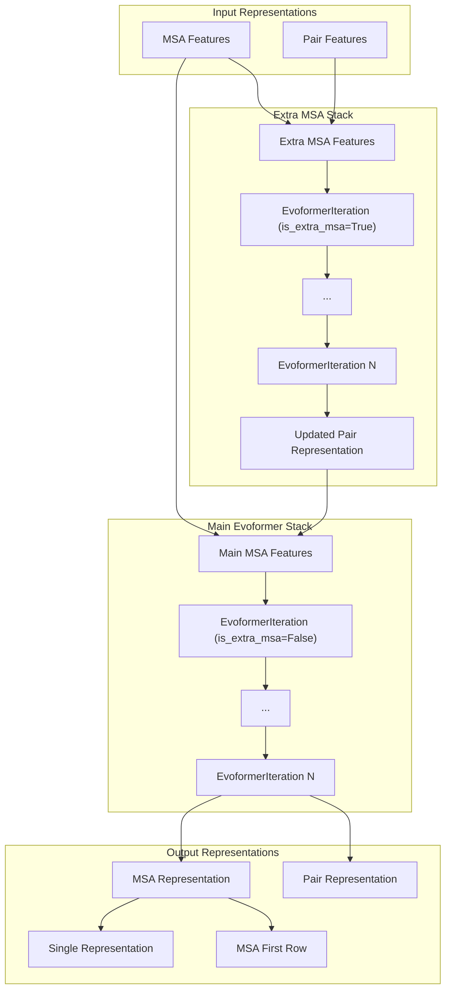
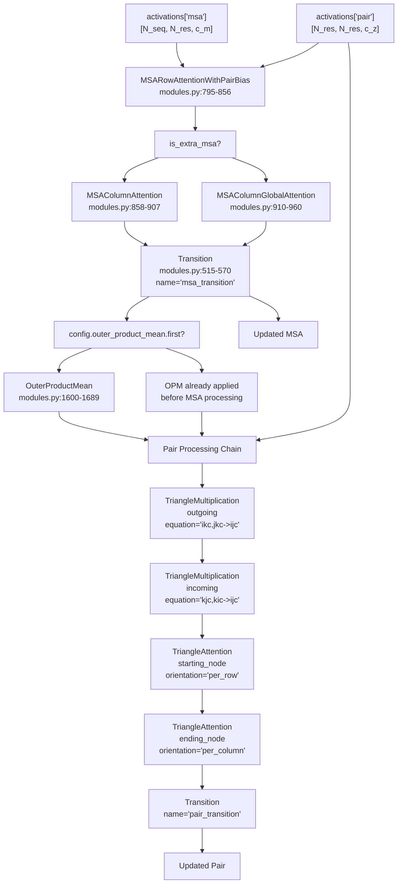
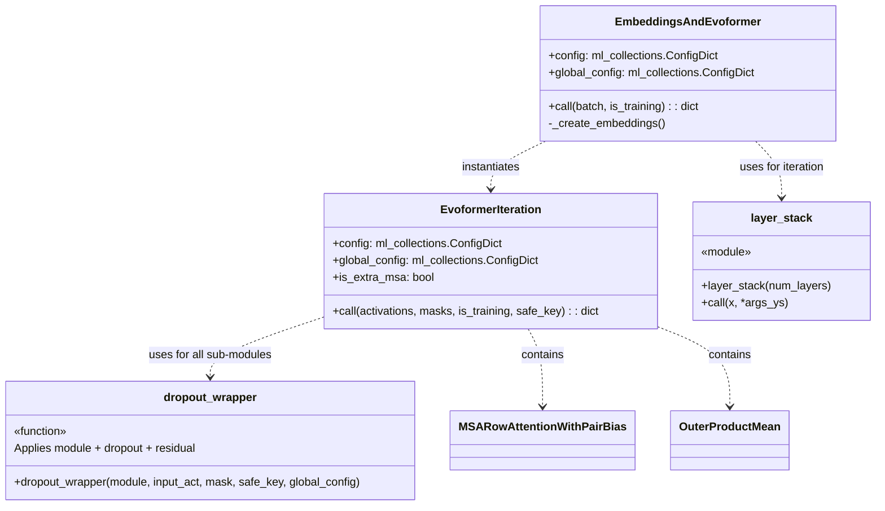
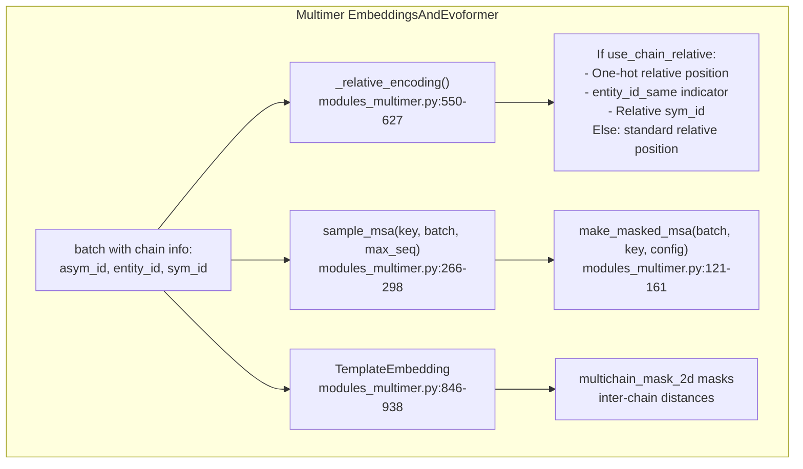

# 4.2 Evoformer Stack

> **Relevant source files**
> * [alphafold/model/folding.py](https://github.com/google-deepmind/alphafold/blob/c77e5d2a/alphafold/model/folding.py)
> * [alphafold/model/layer_stack.py](https://github.com/google-deepmind/alphafold/blob/c77e5d2a/alphafold/model/layer_stack.py)
> * [alphafold/model/mapping.py](https://github.com/google-deepmind/alphafold/blob/c77e5d2a/alphafold/model/mapping.py)
> * [alphafold/model/modules.py](https://github.com/google-deepmind/alphafold/blob/c77e5d2a/alphafold/model/modules.py)
> * [alphafold/model/modules_multimer.py](https://github.com/google-deepmind/alphafold/blob/c77e5d2a/alphafold/model/modules_multimer.py)
> * [alphafold/model/prng.py](https://github.com/google-deepmind/alphafold/blob/c77e5d2a/alphafold/model/prng.py)
> * [alphafold/model/quat_affine.py](https://github.com/google-deepmind/alphafold/blob/c77e5d2a/alphafold/model/quat_affine.py)

The Evoformer stack is the core neural network component that processes Multiple Sequence Alignment (MSA) and residue-pair representations to capture evolutionary and structural patterns. This stack consists of repeated applications of `EvoformerIteration` blocks that refine MSA and pair representations through attention mechanisms and geometric reasoning operations.

## Architecture Overview

The Evoformer processes two primary types of representations:

1. **MSA representation**: Captures evolutionary information across aligned sequences [shape: N_seq × N_res × c_m].
2. **Pair representation**: Encodes relationships between residue pairs [shape: N_res × N_res × c_z].

These representations flow through a stack of identical Evoformer blocks, each applying a series of attention mechanisms and transformations.

Sources: [alphafold/model/modules.py L1904-L2148](https://github.com/google-deepmind/alphafold/blob/c77e5d2a/alphafold/model/modules.py#L1904-L2148)

 [alphafold/model/modules.py L1751-L1901](https://github.com/google-deepmind/alphafold/blob/c77e5d2a/alphafold/model/modules.py#L1751-L1901)

## EvoformerIteration Structure

The `EvoformerIteration` class [alphafold/model/modules.py L1751-L1901](https://github.com/google-deepmind/alphafold/blob/c77e5d2a/alphafold/model/modules.py#L1751-L1901)

 defines the sequence of operations applied to the MSA and pair tensors.

**Diagram: Single EvoformerIteration Block Processing Flow**

Sources: [alphafold/model/modules.py L1751-L1901](https://github.com/google-deepmind/alphafold/blob/c77e5d2a/alphafold/model/modules.py#L1751-L1901)

### MSA Processing Components

The MSA is processed using axial attention, alternating between rows and columns.

**Diagram: MSA Processing Module Details**

```mermaid
flowchart TD

GSwap1["jnp.swapaxes(msa_act, -2, -3)"]
GNorm["LayerNorm<br>name='query_norm'"]
GAttnMod["GlobalAttention<br>uses mask_mean"]
GSwap2["jnp.swapaxes back"]
Swap1["jnp.swapaxes(msa_act, -2, -3)"]
ColNorm["LayerNorm<br>name='query_norm'"]
ColAttnMod["Attention module"]
Swap2["jnp.swapaxes back"]
RowNorm["LayerNorm<br>name='query_norm'"]
RowAttnMod["Attention module<br>with pair bias"]
PairNorm["LayerNorm<br>name='feat_2d_norm'"]
PairBias["pair_act @ feat_2d_weights<br>→ nonbatched_bias"]

subgraph MSAColumnGlobalAttention ["MSAColumnGlobalAttention (modules.py:910-960)"]
    GSwap1
    GNorm
    GAttnMod
    GSwap2
    GSwap1 --> GNorm
    GNorm --> GAttnMod
    GAttnMod --> GSwap2
end

subgraph MSAColumnAttention ["MSAColumnAttention (modules.py:858-907)"]
    Swap1
    ColNorm
    ColAttnMod
    Swap2
    Swap1 --> ColNorm
    ColNorm --> ColAttnMod
    ColAttnMod --> Swap2
end

subgraph MSARowAttentionWithPairBias ["MSARowAttentionWithPairBias (modules.py:795-856)"]
    RowNorm
    RowAttnMod
    PairNorm
    PairBias
    RowNorm --> RowAttnMod
    PairNorm --> PairBias
    PairBias --> RowAttnMod
end
```

1. **`MSARowAttentionWithPairBias`** [alphafold/model/modules.py L795-L856](https://github.com/google-deepmind/alphafold/blob/c77e5d2a/alphafold/model/modules.py#L795-L856) : * Performs multihead attention along MSA rows (per sequence, across residue positions). * Incorporates pair representation as bias: `nonbatched_bias = einsum('qkc,ch->hqk', pair_act, weights)` [alphafold/model/modules.py L837-L842](https://github.com/google-deepmind/alphafold/blob/c77e5d2a/alphafold/model/modules.py#L837-L842) * Uses `config.orientation = 'per_row'`.
2. **`MSAColumnAttention`** [alphafold/model/modules.py L858-L907](https://github.com/google-deepmind/alphafold/blob/c77e5d2a/alphafold/model/modules.py#L858-L907) : * Performs attention along MSA columns (per residue position, across sequences). * Swaps axes to treat columns as rows for attention computation. * Uses `config.orientation = 'per_column'`.
3. **`MSAColumnGlobalAttention`** [alphafold/model/modules.py L910-L960](https://github.com/google-deepmind/alphafold/blob/c77e5d2a/alphafold/model/modules.py#L910-L960) : * Used only for extra MSA processing (`is_extra_msa=True`) [alphafold/model/modules.py L1823-L1830](https://github.com/google-deepmind/alphafold/blob/c77e5d2a/alphafold/model/modules.py#L1823-L1830) * Uses `GlobalAttention` which computes query average via `mask_mean` before attention [alphafold/model/modules.py L943-L945](https://github.com/google-deepmind/alphafold/blob/c77e5d2a/alphafold/model/modules.py#L943-L945) * More efficient for large numbers of extra MSA sequences.

Sources: [alphafold/model/modules.py L795-L856](https://github.com/google-deepmind/alphafold/blob/c77e5d2a/alphafold/model/modules.py#L795-L856)

 [alphafold/model/modules.py L858-L907](https://github.com/google-deepmind/alphafold/blob/c77e5d2a/alphafold/model/modules.py#L858-L907)

 [alphafold/model/modules.py L910-L960](https://github.com/google-deepmind/alphafold/blob/c77e5d2a/alphafold/model/modules.py#L910-L960)

### Pair Processing Components

The pair representation is updated using triangle operations that enforce geometric constraints (e.g., the triangle inequality).

**Diagram: Pair Representation Processing Modules**

```mermaid
flowchart TD

TA_Norm["LayerNorm<br>name='query_norm'"]
TA_Bias["einsum('qkc,ch->hqk', pair_act, feat_2d_weights)"]
TA_Attn["Attention module<br>with nonbatched_bias"]
TA_Swap["orientation == 'per_column'?"]
TM_Norm["LayerNorm<br>name='layer_norm_input'"]
TM_Proj["Linear projections<br>with gating"]
TM_Einsum["einsum(config.equation)<br>outgoing: 'ikc,jkc->ijc'<br>incoming: 'kjc,kic->ijc'"]
TM_Gate["Sigmoid gate<br>name='gating_linear'"]
OPM_Norm["LayerNorm<br>name='layer_norm_input'"]
OPM_Left["Linear(num_outer_channel)<br>name='left_projection'"]
OPM_Right["Linear(num_outer_channel)<br>name='right_projection'"]
OPM_Einsum["einsum('abc,ade->bdce', left, right)<br>then average over sequence dim 'b'"]
OPM_Final["Linear(num_output_channel)<br>name='output_projection'"]

subgraph TriangleAttention ["TriangleAttention (modules.py:963-1024)"]
    TA_Norm
    TA_Bias
    TA_Attn
    TA_Swap
    TA_Norm --> TA_Bias
    TA_Bias --> TA_Attn
    TA_Attn --> TA_Swap
end

subgraph TriangleMultiplication ["TriangleMultiplication (modules.py:1358-1516)"]
    TM_Norm
    TM_Proj
    TM_Einsum
    TM_Gate
    TM_Norm --> TM_Proj
    TM_Proj --> TM_Einsum
    TM_Einsum --> TM_Gate
end

subgraph OuterProductMean ["OuterProductMean (modules.py:1600-1689)"]
    OPM_Norm
    OPM_Left
    OPM_Right
    OPM_Einsum
    OPM_Final
    OPM_Norm --> OPM_Left
    OPM_Norm --> OPM_Right
    OPM_Left --> OPM_Einsum
    OPM_Right --> OPM_Einsum
    OPM_Einsum --> OPM_Final
end
```

1. **`OuterProductMean`** [alphafold/model/modules.py L1600-L1689](https://github.com/google-deepmind/alphafold/blob/c77e5d2a/alphafold/model/modules.py#L1600-L1689) : * Captures pairwise residue correlations by averaging outer products across the MSA. * Projects MSA to `num_outer_channel`, computes outer product, and averages [alphafold/model/modules.py L1653-L1669](https://github.com/google-deepmind/alphafold/blob/c77e5d2a/alphafold/model/modules.py#L1653-L1669) * Normalized by number of sequences to handle variable MSA depth.
2. **`TriangleMultiplication`** [alphafold/model/modules.py L1358-L1516](https://github.com/google-deepmind/alphafold/blob/c77e5d2a/alphafold/model/modules.py#L1358-L1516) : * Updates the edge $(i, j)$ using information from a third node $k$. * Two variants: * **Outgoing** (`'ikc,jkc->ijc'`): Node $i$ and $j$ both act as "sources" [alphafold/model/modules.py L1463-L1466](https://github.com/google-deepmind/alphafold/blob/c77e5d2a/alphafold/model/modules.py#L1463-L1466) * **Incoming** (`'kjc,kic->ijc'`): Node $i$ and $j$ both act as "targets" [alphafold/model/modules.py L1468-L1471](https://github.com/google-deepmind/alphafold/blob/c77e5d2a/alphafold/model/modules.py#L1468-L1471) * Includes gating mechanism for controlling information flow.
3. **`TriangleAttention`** [alphafold/model/modules.py L963-L1024](https://github.com/google-deepmind/alphafold/blob/c77e5d2a/alphafold/model/modules.py#L963-L1024) : * Attention mechanism within the pair representation. * Uses pair features as bias: `nonbatched_bias = einsum('qkc,ch->hqk', pair_act, weights)` [alphafold/model/modules.py L1003-L1008](https://github.com/google-deepmind/alphafold/blob/c77e5d2a/alphafold/model/modules.py#L1003-L1008) * Two orientations: `'per_row'` (starting node) and `'per_column'` (ending node).
4. **`Transition`** [alphafold/model/modules.py L515-L570](https://github.com/google-deepmind/alphafold/blob/c77e5d2a/alphafold/model/modules.py#L515-L570) : * A standard feed-forward network: `LayerNorm → Linear → ReLU → Linear` [alphafold/model/modules.py L548-L568](https://github.com/google-deepmind/alphafold/blob/c77e5d2a/alphafold/model/modules.py#L548-L568) * Applied to both MSA and pair representations to increase non-linearity.

Sources: [alphafold/model/modules.py L1600-L1689](https://github.com/google-deepmind/alphafold/blob/c77e5d2a/alphafold/model/modules.py#L1600-L1689)

 [alphafold/model/modules.py L1358-L1516](https://github.com/google-deepmind/alphafold/blob/c77e5d2a/alphafold/model/modules.py#L1358-L1516)

 [alphafold/model/modules.py L963-L1024](https://github.com/google-deepmind/alphafold/blob/c77e5d2a/alphafold/model/modules.py#L963-L1024)

 [alphafold/model/modules.py L515-L570](https://github.com/google-deepmind/alphafold/blob/c77e5d2a/alphafold/model/modules.py#L515-L570)

## Implementation Details

### Key Classes and Functions

**Diagram: Evoformer Class Structure and Relationships**

Sources: [alphafold/model/modules.py L1904-L2148](https://github.com/google-deepmind/alphafold/blob/c77e5d2a/alphafold/model/modules.py#L1904-L2148)

 [alphafold/model/modules.py L1751-L1901](https://github.com/google-deepmind/alphafold/blob/c77e5d2a/alphafold/model/modules.py#L1751-L1901)

 [alphafold/model/layer_stack.py L212-L221](https://github.com/google-deepmind/alphafold/blob/c77e5d2a/alphafold/model/layer_stack.py#L212-L221)

1. **`EmbeddingsAndEvoformer`** [alphafold/model/modules.py L1904-L2148](https://github.com/google-deepmind/alphafold/blob/c77e5d2a/alphafold/model/modules.py#L1904-L2148) : * Orchestrates the initial embedding of features and the subsequent Evoformer stacks. * Handles the "Extra MSA" stack (fewer channels, more sequences) before the main Evoformer. * Manages recycling of features from previous iterations (`prev_msa_first_row`, `prev_pair`, `prev_pos`) [alphafold/model/modules.py L1949-L1972](https://github.com/google-deepmind/alphafold/blob/c77e5d2a/alphafold/model/modules.py#L1949-L1972)
2. **`EvoformerIteration`** [alphafold/model/modules.py L1751-L1901](https://github.com/google-deepmind/alphafold/blob/c77e5d2a/alphafold/model/modules.py#L1751-L1901) : * Encapsulates one full pass of MSA and pair updates. * Wrapped in `layer_stack` to run $N$ blocks efficiently via `hk.scan`.
3. **`dropout_wrapper`** [alphafold/model/modules.py L66-L105](https://github.com/google-deepmind/alphafold/blob/c77e5d2a/alphafold/model/modules.py#L66-L105) : * Utility that applies a module, then dropout, then adds the residual connection. * Logic: `new_act = output_act + apply_dropout(module(input_act))` [alphafold/model/modules.py L103-L105](https://github.com/google-deepmind/alphafold/blob/c77e5d2a/alphafold/model/modules.py#L103-L105)

### Execution Workflow

The `EmbeddingsAndEvoformer.__call__` method [alphafold/model/modules.py L1916-L2148](https://github.com/google-deepmind/alphafold/blob/c77e5d2a/alphafold/model/modules.py#L1916-L2148)

 follows these steps:

1. **Feature Embedding**: Linear projections of `target_feat` and `msa_feat`.
2. **Recycling**: Adds information from the previous recycling iteration if available.
3. **Relative Position Encoding**: Adds one-hot relative residue distances to the pair representation [alphafold/model/modules.py L1977-L1991](https://github.com/google-deepmind/alphafold/blob/c77e5d2a/alphafold/model/modules.py#L1977-L1991)
4. **Extra MSA Stack**: Processes a larger set of MSA sequences through a small stack (default 4 blocks) to refine the pair representation [alphafold/model/modules.py L2004-L2042](https://github.com/google-deepmind/alphafold/blob/c77e5d2a/alphafold/model/modules.py#L2004-L2042)
5. **Main Evoformer Stack**: Processes the clustered MSA and pair representation through the primary stack (default 48 blocks) [alphafold/model/modules.py L2108-L2129](https://github.com/google-deepmind/alphafold/blob/c77e5d2a/alphafold/model/modules.py#L2108-L2129)

Sources: [alphafold/model/modules.py L1904-L2148](https://github.com/google-deepmind/alphafold/blob/c77e5d2a/alphafold/model/modules.py#L1904-L2148)

 [alphafold/model/modules.py L1751-L1901](https://github.com/google-deepmind/alphafold/blob/c77e5d2a/alphafold/model/modules.py#L1751-L1901)

## Multimer Extensions

AlphaFold-Multimer uses specialized logic in `modules_multimer.py` to handle multiple chains.

**Diagram: Multimer-Specific Components in Evoformer**

1. **Chain-Relative Position Encoding** [alphafold/model/modules_multimer.py L550-L627](https://github.com/google-deepmind/alphafold/blob/c77e5d2a/alphafold/model/modules_multimer.py#L550-L627) : * Extends standard relative encoding to include chain-level offsets and indicators for whether residues belong to the same entity.
2. **MSA Sampling** [alphafold/model/modules_multimer.py L266-L298](https://github.com/google-deepmind/alphafold/blob/c77e5d2a/alphafold/model/modules_multimer.py#L266-L298) : * Uses the Gumbel-max trick [alphafold/model/modules_multimer.py L73-L89](https://github.com/google-deepmind/alphafold/blob/c77e5d2a/alphafold/model/modules_multimer.py#L73-L89)  to sample MSA sequences within the model, facilitating end-to-end training of the sampling process.
3. **BERT-style MSA Masking** [alphafold/model/modules_multimer.py L121-L161](https://github.com/google-deepmind/alphafold/blob/c77e5d2a/alphafold/model/modules_multimer.py#L121-L161) : * Randomly masks MSA positions to train the model's ability to recover missing evolutionary information.

Sources: [alphafold/model/modules_multimer.py L550-L627](https://github.com/google-deepmind/alphafold/blob/c77e5d2a/alphafold/model/modules_multimer.py#L550-L627)

 [alphafold/model/modules_multimer.py L266-L298](https://github.com/google-deepmind/alphafold/blob/c77e5d2a/alphafold/model/modules_multimer.py#L266-L298)

 [alphafold/model/modules_multimer.py L121-L161](https://github.com/google-deepmind/alphafold/blob/c77e5d2a/alphafold/model/modules_multimer.py#L121-L161)

## Outputs and Downstream Usage

The Evoformer produces several key representations:

| Output | Shape | Purpose |
| --- | --- | --- |
| `msa` | `[N_seq, N_res, c_m]` | Full refined MSA representation. |
| `pair` | `[N_res, N_res, c_z]` | Refined pairwise relationship features. |
| `single` | `[N_res, c_s]` | Per-residue features derived from the first MSA row [alphafold/model/modules.py L2131-L2134](https://github.com/google-deepmind/alphafold/blob/c77e5d2a/alphafold/model/modules.py#L2131-L2134) |
| `msa_first_row` | `[N_res, c_m]` | Extracted first row for recycling [alphafold/model/modules.py L2144](https://github.com/google-deepmind/alphafold/blob/c77e5d2a/alphafold/model/modules.py#L2144-L2144) |

The `single` and `pair` representations are passed directly to the **Structure Module** to predict the final 3D coordinates.

Sources: [alphafold/model/modules.py L2131-L2145](https://github.com/google-deepmind/alphafold/blob/c77e5d2a/alphafold/model/modules.py#L2131-L2145)