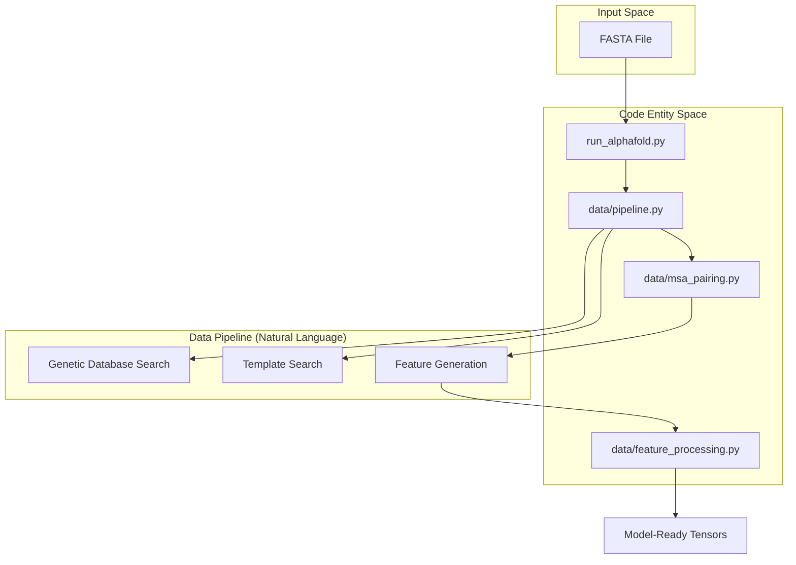
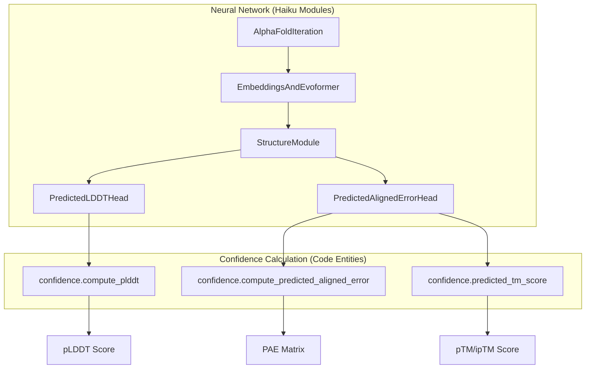

# Glossary

> **Relevant source files**
> * [README.md](https://github.com/google-deepmind/alphafold/blob/c77e5d2a/README.md?plain=1)
> * [afdb/README.md](https://github.com/google-deepmind/alphafold/blob/c77e5d2a/afdb/README.md?plain=1)
> * [alphafold/common/confidence.py](https://github.com/google-deepmind/alphafold/blob/c77e5d2a/alphafold/common/confidence.py)
> * [alphafold/common/confidence_test.py](https://github.com/google-deepmind/alphafold/blob/c77e5d2a/alphafold/common/confidence_test.py)
> * [alphafold/common/residue_constants.py](https://github.com/google-deepmind/alphafold/blob/c77e5d2a/alphafold/common/residue_constants.py)
> * [alphafold/data/mmcif_parsing.py](https://github.com/google-deepmind/alphafold/blob/c77e5d2a/alphafold/data/mmcif_parsing.py)
> * [alphafold/data/msa_pairing.py](https://github.com/google-deepmind/alphafold/blob/c77e5d2a/alphafold/data/msa_pairing.py)
> * [alphafold/model/common_modules.py](https://github.com/google-deepmind/alphafold/blob/c77e5d2a/alphafold/model/common_modules.py)
> * [alphafold/model/config.py](https://github.com/google-deepmind/alphafold/blob/c77e5d2a/alphafold/model/config.py)
> * [alphafold/model/geometry/struct_of_array.py](https://github.com/google-deepmind/alphafold/blob/c77e5d2a/alphafold/model/geometry/struct_of_array.py)
> * [alphafold/model/modules.py](https://github.com/google-deepmind/alphafold/blob/c77e5d2a/alphafold/model/modules.py)
> * [alphafold/model/modules_multimer.py](https://github.com/google-deepmind/alphafold/blob/c77e5d2a/alphafold/model/modules_multimer.py)
> * [alphafold/model/utils.py](https://github.com/google-deepmind/alphafold/blob/c77e5d2a/alphafold/model/utils.py)
> * [alphafold/notebooks/notebook_utils.py](https://github.com/google-deepmind/alphafold/blob/c77e5d2a/alphafold/notebooks/notebook_utils.py)
> * [alphafold/relax/utils.py](https://github.com/google-deepmind/alphafold/blob/c77e5d2a/alphafold/relax/utils.py)
> * [docker/requirements.txt](https://github.com/google-deepmind/alphafold/blob/c77e5d2a/docker/requirements.txt)
> * [server/README.md](https://github.com/google-deepmind/alphafold/blob/c77e5d2a/server/README.md?plain=1)
> * [server/example.json](https://github.com/google-deepmind/alphafold/blob/c77e5d2a/server/example.json)

This glossary provides definitions for codebase-specific terminology, domain jargon, and implementation details within the AlphaFold repository. It is intended to help onboarding engineers navigate the intersection of structural biology and deep learning as implemented in the AlphaFold pipeline.

## Biological and Data Pipeline Terms

### MSA (Multiple Sequence Alignment)

A collection of biological sequences (protein, DNA, or RNA) aligned so that their similar regions can be identified. AlphaFold uses MSAs to extract evolutionary information and co-variation signals.

* **A3M/Stockholm**: File formats for MSAs. `parsers.py` contains logic to parse these [alphafold/data/parsers.py L1-L20](https://github.com/google-deepmind/alphafold/blob/c77e5d2a/alphafold/data/parsers.py#L1-L20)
* **Deduplication**: MSAs are deduplicated to preserve unique sequences [alphafold/notebooks/notebook_utils.py L121-L122](https://github.com/google-deepmind/alphafold/blob/c77e5d2a/alphafold/notebooks/notebook_utils.py#L121-L122)
* **Pairing**: In multimer mode, MSAs from different chains are paired based on species information to identify co-evolving residues across interfaces [alphafold/data/msa_pairing.py L15-L20](https://github.com/google-deepmind/alphafold/blob/c77e5d2a/alphafold/data/msa_pairing.py#L15-L20)

### Genetic Search Tools

* **HHsuite**: A software suite for HMM-HMM alignment. Includes `HHblits` (fast remote homology detection) and `HHsearch`.
* **HMMER**: A suite for biological sequence analysis using Hidden Markov Models. Includes `Jackhmmer` and `HMMsearch` [README.md L151-L165](https://github.com/google-deepmind/alphafold/blob/c77e5d2a/README.md?plain=1#L151-L165)

### Databases

* **BFD**: Big Fantastic Database, a large collection of protein families.
* **MGnify**: A resource for metagenomics data.
* **UniRef90/UniRef30**: Clustered subsets of the UniProt Knowledgebase.
* **PDB / PDB70**: The Protein Data Bank, used for structural templates.
* **AFDB**: AlphaFold Protein Structure Database, a public database of over 200 million predicted structures.

### mmCIF

The Macromolecular Crystallographic Information File format. It is the standard for structural data in the PDB and the primary format AlphaFold uses for templates and final outputs [alphafold/data/mmcif_parsing.py L15-L20](https://github.com/google-deepmind/alphafold/blob/c77e5d2a/alphafold/data/mmcif_parsing.py#L15-L20)

### CCD Code

Chemical Component Dictionary code. A unique 3-letter identifier for small molecules, ions, and modified amino acids (e.g., `ATP`, `MG`, `SEP`) [server/README.md L92-L99](https://github.com/google-deepmind/alphafold/blob/c77e5d2a/server/README.md?plain=1#L92-L99)

### PTM (Post-Translational Modification)

Chemical modifications of a protein after its translation. The AlphaFold Server supports specific modifications defined by CCD codes [server/README.md L89-L99](https://github.com/google-deepmind/alphafold/blob/c77e5d2a/server/README.md?plain=1#L89-L99)

---

## Architecture and Modeling Terms

### Evoformer

The core transformer-like architecture of AlphaFold that processes MSA and pair representations. It utilizes axial attention and triangular updates to refine structural information [alphafold/model/modules.py L171-L175](https://github.com/google-deepmind/alphafold/blob/c77e5d2a/alphafold/model/modules.py#L171-L175)

### Recycling

An iterative refinement process where the model's outputs (representations and coordinates) are fed back as inputs for a fixed number of cycles (default is 3).

* **Implementation**: Controlled by `num_recycle` in the config [alphafold/model/config.py L146](https://github.com/google-deepmind/alphafold/blob/c77e5d2a/alphafold/model/config.py#L146-L146)
* **Function**: Executed within `AlphaFoldIteration` [alphafold/model/modules.py L134-L145](https://github.com/google-deepmind/alphafold/blob/c77e5d2a/alphafold/model/modules.py#L134-L145)

### Structural Representations

* **atom37**: A standardized representation where every residue is mapped to a fixed-size array of 37 possible atom types [alphafold/model/config.py L181](https://github.com/google-deepmind/alphafold/blob/c77e5d2a/alphafold/model/config.py#L181-L181)
* **atom14**: A memory-efficient representation containing only the atoms actually present in a specific residue (maximum 14) [alphafold/model/config.py L175-L180](https://github.com/google-deepmind/alphafold/blob/c77e5d2a/alphafold/model/config.py#L175-L180)
* **Rigid Groups**: Local coordinate frames defined for the backbone and sidechain chi angles [alphafold/common/residue_constants.py L131-L142](https://github.com/google-deepmind/alphafold/blob/c77e5d2a/alphafold/common/residue_constants.py#L131-L142)

### Triangle Operations

Operations in the Evoformer that enforce geometric constraints (like the triangle inequality) on the pair representation.

* **TriangleMultiplication**: Updates the pair representation based on edges sharing a common vertex [alphafold/model/config.py L124-L127](https://github.com/google-deepmind/alphafold/blob/c77e5d2a/alphafold/model/config.py#L124-L127)

### FAPE (Frame Aligned Point Error)

The primary structural loss function. It measures the distance between predicted and ground-truth atom positions after aligning their respective local frames, making it invariant to global rotation and translation.

---

## Numerical and Optimization Terms

### bfloat16_context

A context manager used to perform operations in `bfloat16` precision for memory efficiency and speed on supported hardware (TPUs/GPUs), while maintaining critical variables in `float32` for stability [alphafold/model/utils.py L59-L62](https://github.com/google-deepmind/alphafold/blob/c77e5d2a/alphafold/model/utils.py#L59-L62)

### padding_consistent_rng

A wrapper for JAX random number generation that ensures the same random values are produced for a sub-array regardless of how much padding is applied to the global array [alphafold/model/utils.py L124-L145](https://github.com/google-deepmind/alphafold/blob/c77e5d2a/alphafold/model/utils.py#L124-L145)

### StructOfArray

A data pattern where a collection of objects is represented by several arrays (one per field) rather than an array of objects. This is used in `alphafold/model/geometry/struct_of_array.py` for efficient JAX transformations.

### subbatch_size

A configuration parameter used to break down large tensors into smaller chunks during compute-intensive operations (like attention) to prevent Out-of-Memory (OOM) errors.

---

## Confidence Metrics

| Metric | Full Name | Definition |
| --- | --- | --- |
| **pLDDT** | Predicted Local Distance Difference Test | Per-residue confidence score (0-100). Scores >90 are high confidence [alphafold/common/confidence.py L30-L44](https://github.com/google-deepmind/alphafold/blob/c77e5d2a/alphafold/common/confidence.py#L30-L44) |
| **PAE** | Predicted Aligned Error | The expected error (in Ångströms) at residue $x$ when the predicted and true structures are aligned on residue $y$ [alphafold/common/confidence.py L127-L143](https://github.com/google-deepmind/alphafold/blob/c77e5d2a/alphafold/common/confidence.py#L127-L143) |
| **pTM** | Predicted TM-score | A global confidence metric (0-1) predicting the Template Modeling score of the structure [alphafold/common/confidence.py L184-L205](https://github.com/google-deepmind/alphafold/blob/c77e5d2a/alphafold/common/confidence.py#L184-L205) |
| **ipTM** | Interface pTM | For multimers, a score predicting the accuracy of the complex interface [alphafold/common/confidence.py L189-L201](https://github.com/google-deepmind/alphafold/blob/c77e5d2a/alphafold/common/confidence.py#L189-L201) |

---

## System Configuration Terms

### model_preset

A high-level flag (e.g., `monomer`, `multimer`, `monomer_ptm`) that selects the appropriate model architecture and weights [alphafold/model/config.py L30-L52](https://github.com/google-deepmind/alphafold/blob/c77e5d2a/alphafold/model/config.py#L30-L52)

### CONFIG_DIFFS

A dictionary containing overrides for the `BaseConfig`, used to differentiate between specific model versions (e.g., Model 1 vs Model 3) [alphafold/model/config.py L55-L118](https://github.com/google-deepmind/alphafold/blob/c77e5d2a/alphafold/model/config.py#L55-L118)

### asym_id / entity_id / sym_id

Identifiers used in multimer modeling:

* **entity_id**: Unique ID for a distinct chemical entity (e.g., a specific protein sequence).
* **asym_id**: Unique ID for a specific instance of an entity in the complex (asymmetric unit).
* **sym_id**: ID for symmetry-related copies [alphafold/data/msa_pairing.py L52-L54](https://github.com/google-deepmind/alphafold/blob/c77e5d2a/alphafold/data/msa_pairing.py#L52-L54)

---

## Data Flow Diagrams

### Prediction Pipeline Overview

This diagram maps the natural language steps of a prediction to the primary code entities responsible for them.

Title: Prediction Data Flow

Sources: [alphafold/data/pipeline.py](https://github.com/google-deepmind/alphafold/blob/c77e5d2a/alphafold/data/pipeline.py)

 [alphafold/data/msa_pairing.py L15-L68](https://github.com/google-deepmind/alphafold/blob/c77e5d2a/alphafold/data/msa_pairing.py#L15-L68)

 [README.md L131-L145](https://github.com/google-deepmind/alphafold/blob/c77e5d2a/README.md?plain=1#L131-L145)

### Model Execution and Confidence

This diagram bridges the internal model modules with the confidence metrics they produce.

Title: Model Modules to Confidence Output

Sources: [alphafold/model/modules.py L134-L215](https://github.com/google-deepmind/alphafold/blob/c77e5d2a/alphafold/model/modules.py#L134-L215)

 [alphafold/common/confidence.py L30-L205](https://github.com/google-deepmind/alphafold/blob/c77e5d2a/alphafold/common/confidence.py#L30-L205)