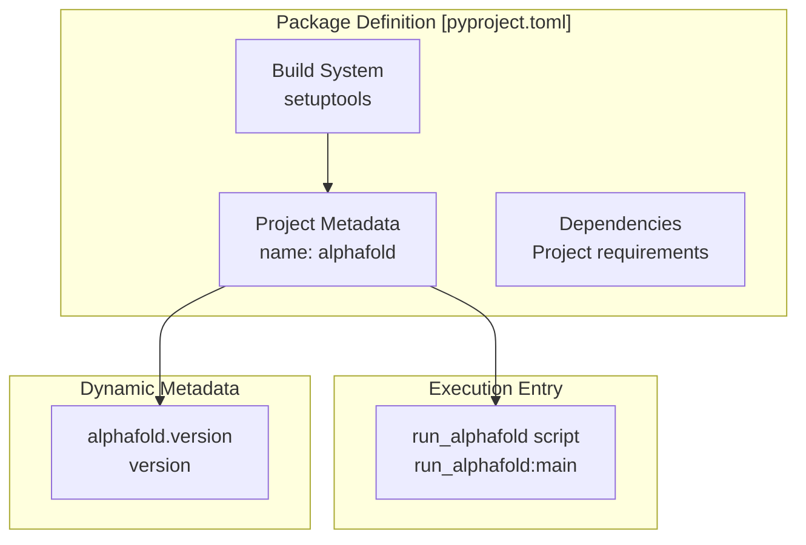
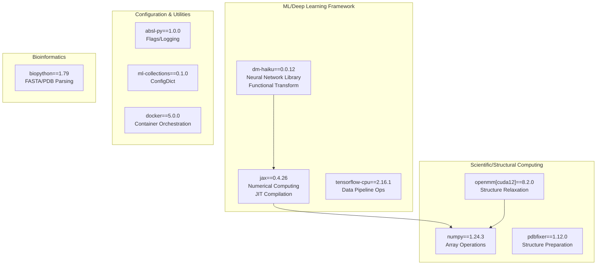
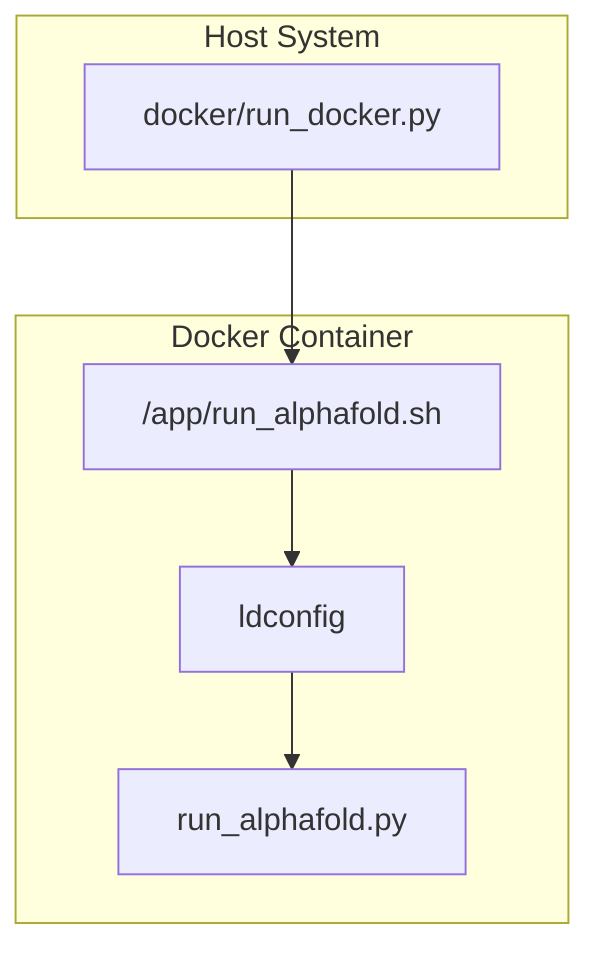

# Installation and Dependencies

> **Relevant source files**
> * [.dockerignore](https://github.com/google-deepmind/alphafold/blob/c77e5d2a/.dockerignore)
> * [README.md](https://github.com/google-deepmind/alphafold/blob/c77e5d2a/README.md?plain=1)
> * [docker/Dockerfile](https://github.com/google-deepmind/alphafold/blob/c77e5d2a/docker/Dockerfile)
> * [pyproject.toml](https://github.com/google-deepmind/alphafold/blob/c77e5d2a/pyproject.toml)
> * [requirements.txt](https://github.com/google-deepmind/alphafold/blob/c77e5d2a/requirements.txt)

## Purpose and Scope

This page documents the AlphaFold package installation process and its Python dependencies. It covers the package metadata defined in `pyproject.toml`, the pinned dependency versions in `requirements.txt`, and the role each dependency plays in the system. For Docker-based deployment and environment setup, see [Docker Environment](/google-deepmind/alphafold/2.1-docker-environment). For database dependencies and external tools (Jackhmmer, HHsuite), see [Database Setup](/google-deepmind/alphafold/2.2-database-setup).

---

## Installation Overview

AlphaFold is distributed as a Python package. While legacy versions used `setup.py`, the current codebase defines its metadata and build system in [pyproject.toml L15-L67](https://github.com/google-deepmind/alphafold/blob/c77e5d2a/pyproject.toml#L15-L67)

 Production-ready pinned versions for the inference pipeline are specified in [requirements.txt L1-L13](https://github.com/google-deepmind/alphafold/blob/c77e5d2a/requirements.txt#L1-L13)

### Package Metadata



**Package Metadata Diagram**: Shows the package structure defined by `pyproject.toml`.

Sources: [pyproject.toml L15-L67](https://github.com/google-deepmind/alphafold/blob/c77e5d2a/pyproject.toml#L15-L67)

 [requirements.txt L1-L13](https://github.com/google-deepmind/alphafold/blob/c77e5d2a/requirements.txt#L1-L13)

| Property | Value |
| --- | --- |
| Package Name | `alphafold` |
| Version Source | `alphafold.version.__version__` |
| License | Apache License, Version 2.0 |
| Repository | [https://github.com/deepmind/alphafold](https://github.com/deepmind/alphafold) |
| Entry Script | `run_alphafold` (mapped to `run_alphafold:main`) |
| Python Support | >= 3.10 |
| Operating System | POSIX/Linux |

Sources: [pyproject.toml L19-L38](https://github.com/google-deepmind/alphafold/blob/c77e5d2a/pyproject.toml#L19-L38)

 [pyproject.toml L59-L63](https://github.com/google-deepmind/alphafold/blob/c77e5d2a/pyproject.toml#L59-L63)

### Installation Methods

**Standard Installation**:
AlphaFold can be installed directly from the source directory. The build system uses `setuptools` [pyproject.toml L16-L17](https://github.com/google-deepmind/alphafold/blob/c77e5d2a/pyproject.toml#L16-L17)

```
pip install .
```

**Dependency Management**:
The codebase provides two ways to manage dependencies:

1. **Flexible**: `pip install .` uses the ranges defined in `pyproject.toml` [pyproject.toml L39-L51](https://github.com/google-deepmind/alphafold/blob/c77e5d2a/pyproject.toml#L39-L51)
2. **Pinned**: `pip install -r requirements.txt` uses exact versions for reproducibility [requirements.txt L1-L13](https://github.com/google-deepmind/alphafold/blob/c77e5d2a/requirements.txt#L1-L13)

**Docker Environment**:
For a reproducible environment including non-Python dependencies (HH-Suite, HMMER), AlphaFold uses a Docker-based setup [docker/Dockerfile L1-L91](https://github.com/google-deepmind/alphafold/blob/c77e5d2a/docker/Dockerfile#L1-L91)

Sources: [pyproject.toml L39-L51](https://github.com/google-deepmind/alphafold/blob/c77e5d2a/pyproject.toml#L39-L51)

 [requirements.txt L1-L13](https://github.com/google-deepmind/alphafold/blob/c77e5d2a/requirements.txt#L1-L13)

 [docker/Dockerfile L1-L91](https://github.com/google-deepmind/alphafold/blob/c77e5d2a/docker/Dockerfile#L1-L91)

---

## Core Dependencies

AlphaFold depends on several key libraries, categorized by their role in the system:



**Dependency Architecture**: Dependencies categorized by functional role.

Sources: [requirements.txt L1-L13](https://github.com/google-deepmind/alphafold/blob/c77e5d2a/requirements.txt#L1-L13)

 [pyproject.toml L39-L51](https://github.com/google-deepmind/alphafold/blob/c77e5d2a/pyproject.toml#L39-L51)

### Machine Learning Framework Stack

**JAX (0.4.26)**

* Core numerical computing framework. AlphaFold uses JAX for its high-performance XLA-compiled kernels [requirements.txt L5](https://github.com/google-deepmind/alphafold/blob/c77e5d2a/requirements.txt#L5-L5)
* In the Docker environment, specific versions of `jaxlib` with CUDA support are installed to enable GPU acceleration [docker/Dockerfile L70-L73](https://github.com/google-deepmind/alphafold/blob/c77e5d2a/docker/Dockerfile#L70-L73)

**dm-haiku (0.0.12)**

* A functional neural network library for JAX [requirements.txt L3](https://github.com/google-deepmind/alphafold/blob/c77e5d2a/requirements.txt#L3-L3)
* Used to define the Evoformer and Structure Module layers.

**tensorflow-cpu (2.16.1)**

* Used primarily for the data loading and feature processing pipeline [requirements.txt L13](https://github.com/google-deepmind/alphafold/blob/c77e5d2a/requirements.txt#L13-L13)
* The CPU-only version is used to avoid resource contention with JAX on the GPU.

Sources: [requirements.txt L3-L13](https://github.com/google-deepmind/alphafold/blob/c77e5d2a/requirements.txt#L3-L13)

 [docker/Dockerfile L70-L73](https://github.com/google-deepmind/alphafold/blob/c77e5d2a/docker/Dockerfile#L70-L73)

### Structural Computing and Relaxation

**OpenMM (8.2.0) & PDBFixer (1.12.0)**

* Used for the final "relaxation" step of the predicted structure to resolve stereochemical violations [requirements.txt L9-L10](https://github.com/google-deepmind/alphafold/blob/c77e5d2a/requirements.txt#L9-L10)
* OpenMM is configured with CUDA 12 support in the standard requirements [requirements.txt L9](https://github.com/google-deepmind/alphafold/blob/c77e5d2a/requirements.txt#L9-L9)

**Biopython (1.79)**

* Essential for parsing input FASTA files and handling mmCIF/PDB structure data [requirements.txt L2](https://github.com/google-deepmind/alphafold/blob/c77e5d2a/requirements.txt#L2-L2)

Sources: [requirements.txt L2-L10](https://github.com/google-deepmind/alphafold/blob/c77e5d2a/requirements.txt#L2-L10)

---

## Docker Environment Setup

The [docker/Dockerfile](https://github.com/google-deepmind/alphafold/blob/c77e5d2a/docker/Dockerfile)

 provides the authoritative environment for running AlphaFold. It bridges Python dependencies with system-level bioinformatics tools.

### System-Level Dependencies

The Docker image installs several non-Python tools required for the data pipeline:

* **HMMER & Kalign**: For MSA generation [docker/Dockerfile L31-L32](https://github.com/google-deepmind/alphafold/blob/c77e5d2a/docker/Dockerfile#L31-L32)
* **HH-Suite**: Compiled from source (v3.3.0) to provide `hhblits` and `hhsearch` [docker/Dockerfile L40-L47](https://github.com/google-deepmind/alphafold/blob/c77e5d2a/docker/Dockerfile#L40-L47)
* **CUDA/cuDNN**: Base image uses `nvidia/cuda:12.2.2-cudnn8-runtime-ubuntu20.04` [docker/Dockerfile L15-L16](https://github.com/google-deepmind/alphafold/blob/c77e5d2a/docker/Dockerfile#L15-L16)

### Data Flow: Environment to Execution



**Execution Flow**: Interaction between the host management script and the containerized environment.

Sources: [docker/Dockerfile L87-L91](https://github.com/google-deepmind/alphafold/blob/c77e5d2a/docker/Dockerfile#L87-L91)

 [README.md L139-L145](https://github.com/google-deepmind/alphafold/blob/c77e5d2a/README.md?plain=1#L139-L145)

---

## Dependency Versioning Matrix

AlphaFold maintains strict versioning in [requirements.txt](https://github.com/google-deepmind/alphafold/blob/c77e5d2a/requirements.txt)

 and [pyproject.toml](https://github.com/google-deepmind/alphafold/blob/c77e5d2a/pyproject.toml)

| Dependency | Version | Role | File |
| --- | --- | --- | --- |
| `jax` | 0.4.26 | Transformation/JIT | [requirements.txt L5](https://github.com/google-deepmind/alphafold/blob/c77e5d2a/requirements.txt#L5-L5) |
| `dm-haiku` | 0.0.12 | Model Definition | [requirements.txt L3](https://github.com/google-deepmind/alphafold/blob/c77e5d2a/requirements.txt#L3-L3) |
| `numpy` | 1.24.3 | Data Representation | [requirements.txt L8](https://github.com/google-deepmind/alphafold/blob/c77e5d2a/requirements.txt#L8-L8) |
| `openmm[cuda12]` | 8.2.0 | AMBER Relaxation | [requirements.txt L9](https://github.com/google-deepmind/alphafold/blob/c77e5d2a/requirements.txt#L9-L9) |
| `tensorflow-cpu` | 2.16.1 | Input Preprocessing | [requirements.txt L13](https://github.com/google-deepmind/alphafold/blob/c77e5d2a/requirements.txt#L13-L13) |
| `biopython` | 1.79 | Sequence/Structure I/O | [requirements.txt L2](https://github.com/google-deepmind/alphafold/blob/c77e5d2a/requirements.txt#L2-L2) |
| `ml-collections` | 0.1.0 | Configuration | [requirements.txt L7](https://github.com/google-deepmind/alphafold/blob/c77e5d2a/requirements.txt#L7-L7) |

### System Requirements

* **OS**: Linux (AlphaFold does not support other operating systems) [README.md L40](https://github.com/google-deepmind/alphafold/blob/c77e5d2a/README.md?plain=1#L40-L40)
* **Disk**: ~3 TB for full genetic databases [README.md L41](https://github.com/google-deepmind/alphafold/blob/c77e5d2a/README.md?plain=1#L41-L41)
* **GPU**: Modern NVIDIA GPU required for reasonable inference times [README.md L42](https://github.com/google-deepmind/alphafold/blob/c77e5d2a/README.md?plain=1#L42-L42)
* **Python**: 3.10 to 3.12 [pyproject.toml L34-L36](https://github.com/google-deepmind/alphafold/blob/c77e5d2a/pyproject.toml#L34-L36)

Sources: [README.md L40-L43](https://github.com/google-deepmind/alphafold/blob/c77e5d2a/README.md?plain=1#L40-L43)

 [pyproject.toml L34-L36](https://github.com/google-deepmind/alphafold/blob/c77e5d2a/pyproject.toml#L34-L36)

 [requirements.txt L1-L13](https://github.com/google-deepmind/alphafold/blob/c77e5d2a/requirements.txt#L1-L13)

---

## Installation Verification

To verify the installation within the provided Docker environment, the entry point script [run_alphafold.py](https://github.com/google-deepmind/alphafold/blob/c77e5d2a/run_alphafold.py)

 is invoked. A successful installation is confirmed when the pipeline can load the JAX kernels and access the external tools.

```markdown
# Verify Docker builddocker build -f docker/Dockerfile -t alphafold . # Verify GPU visibility within containerdocker run --rm --gpus all alphafold nvidia-smi
```

Sources: [README.md L88-L106](https://github.com/google-deepmind/alphafold/blob/c77e5d2a/README.md?plain=1#L88-L106)

 [docker/Dockerfile L87-L91](https://github.com/google-deepmind/alphafold/blob/c77e5d2a/docker/Dockerfile#L87-L91)