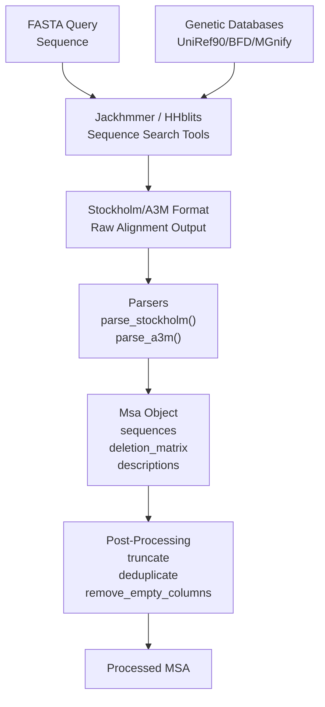
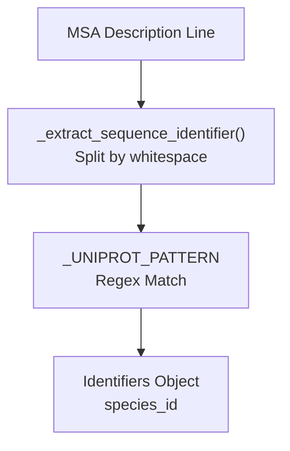

# MSA Generation

> **Relevant source files**
> * [alphafold/data/feature_processing.py](https://github.com/google-deepmind/alphafold/blob/c77e5d2a/alphafold/data/feature_processing.py)
> * [alphafold/data/msa_identifiers.py](https://github.com/google-deepmind/alphafold/blob/c77e5d2a/alphafold/data/msa_identifiers.py)
> * [alphafold/data/parsers.py](https://github.com/google-deepmind/alphafold/blob/c77e5d2a/alphafold/data/parsers.py)
> * [alphafold/data/pipeline.py](https://github.com/google-deepmind/alphafold/blob/c77e5d2a/alphafold/data/pipeline.py)
> * [alphafold/data/pipeline_multimer.py](https://github.com/google-deepmind/alphafold/blob/c77e5d2a/alphafold/data/pipeline_multimer.py)
> * [alphafold/data/tools/hhblits.py](https://github.com/google-deepmind/alphafold/blob/c77e5d2a/alphafold/data/tools/hhblits.py)
> * [alphafold/data/tools/hhsearch.py](https://github.com/google-deepmind/alphafold/blob/c77e5d2a/alphafold/data/tools/hhsearch.py)
> * [alphafold/data/tools/hmmbuild.py](https://github.com/google-deepmind/alphafold/blob/c77e5d2a/alphafold/data/tools/hmmbuild.py)
> * [alphafold/data/tools/hmmsearch.py](https://github.com/google-deepmind/alphafold/blob/c77e5d2a/alphafold/data/tools/hmmsearch.py)
> * [alphafold/data/tools/jackhmmer.py](https://github.com/google-deepmind/alphafold/blob/c77e5d2a/alphafold/data/tools/jackhmmer.py)
> * [alphafold/data/tools/kalign.py](https://github.com/google-deepmind/alphafold/blob/c77e5d2a/alphafold/data/tools/kalign.py)
> * [alphafold/relax/amber_minimize.py](https://github.com/google-deepmind/alphafold/blob/c77e5d2a/alphafold/relax/amber_minimize.py)
> * [alphafold/relax/relax.py](https://github.com/google-deepmind/alphafold/blob/c77e5d2a/alphafold/relax/relax.py)

## Purpose and Scope

This document covers the generation of Multiple Sequence Alignments (MSAs) in AlphaFold, which is the first stage of the data processing pipeline. MSA generation involves searching genetic databases using tools like **Jackhmmer** and **HHblits** to find homologous sequences, then parsing the resulting alignments into structured data representations.

For information about template structure search, see [Template Processing](/google-deepmind/alphafold/3.2-template-processing). For MSA pairing in multimer predictions, see [Multimer MSA Pairing](/google-deepmind/alphafold/3.3-multimer-msa-pairing). For converting MSAs into model-ready features, see [Feature Processing](/google-deepmind/alphafold/3.4-feature-processing).

## Overview

MSA generation transforms a query FASTA sequence into a multiple sequence alignment containing homologous sequences from genetic databases (UniRef90, BFD, MGnify). This process provides evolutionary information that AlphaFold uses to predict protein structure.

### System Flow: From Sequence to MSA Object

**Sources:** [alphafold/data/tools/jackhmmer.py L31-L170](https://github.com/google-deepmind/alphafold/blob/c77e5d2a/alphafold/data/tools/jackhmmer.py#L31-L170)

 [alphafold/data/parsers.py L29-L59](https://github.com/google-deepmind/alphafold/blob/c77e5d2a/alphafold/data/parsers.py#L29-L59)

 [alphafold/data/pipeline.py L57-L91](https://github.com/google-deepmind/alphafold/blob/c77e5d2a/alphafold/data/pipeline.py#L57-L91)

## Search Tool Wrappers

AlphaFold wraps several bioinformatics tools to perform sequence searches. The primary tools are **Jackhmmer** (HMMER suite) and **HHblits** (HH-suite).

### Jackhmmer Tool Wrapper

The `Jackhmmer` class in [alphafold/data/tools/jackhmmer.py L31-L234](https://github.com/google-deepmind/alphafold/blob/c77e5d2a/alphafold/data/tools/jackhmmer.py#L31-L234)

 provides a Python interface to the Jackhmmer binary, which performs iterative sequence searches against protein databases.

#### Key Parameters and Configuration

| Parameter | Type | Default | Description |
| --- | --- | --- | --- |
| `binary_path` | str | - | Path to the jackhmmer executable [alphafold/data/tools/jackhmmer.py L72](https://github.com/google-deepmind/alphafold/blob/c77e5d2a/alphafold/data/tools/jackhmmer.py#L72-L72) |
| `database_path` | str | - | Path to the FASTA database [alphafold/data/tools/jackhmmer.py L73](https://github.com/google-deepmind/alphafold/blob/c77e5d2a/alphafold/data/tools/jackhmmer.py#L73-L73) |
| `n_cpu` | int | 8 | Number of CPUs for parallel execution [alphafold/data/tools/jackhmmer.py L80](https://github.com/google-deepmind/alphafold/blob/c77e5d2a/alphafold/data/tools/jackhmmer.py#L80-L80) |
| `n_iter` | int | 1 | Number of iterative search rounds [alphafold/data/tools/jackhmmer.py L81](https://github.com/google-deepmind/alphafold/blob/c77e5d2a/alphafold/data/tools/jackhmmer.py#L81-L81) |
| `e_value` | float | 0.0001 | E-value threshold for sequence inclusion [alphafold/data/tools/jackhmmer.py L82](https://github.com/google-deepmind/alphafold/blob/c77e5d2a/alphafold/data/tools/jackhmmer.py#L82-L82) |
| `filter_f1/f2/f3` | float | - | MSV, Viterbi, and Forward pre-filter thresholds [alphafold/data/tools/jackhmmer.py L84-L86](https://github.com/google-deepmind/alphafold/blob/c77e5d2a/alphafold/data/tools/jackhmmer.py#L84-L86) |

#### Search Execution

The `_query_chunk` method handles the subprocess invocation. It constructs a command with flags like `-A` for Stockholm output and `--noali` to suppress alignments in stdout [alphafold/data/tools/jackhmmer.py L107-L134](https://github.com/google-deepmind/alphafold/blob/c77e5d2a/alphafold/data/tools/jackhmmer.py#L107-L134)

### HHblits Tool Wrapper

The `HHBlits` class in [alphafold/data/tools/hhblits.py L32-L164](https://github.com/google-deepmind/alphafold/blob/c77e5d2a/alphafold/data/tools/hhblits.py#L32-L164)

 is used primarily for searching the BFD and UniRef30 databases. It generates output in A3M format [alphafold/data/tools/hhblits.py L113](https://github.com/google-deepmind/alphafold/blob/c77e5d2a/alphafold/data/tools/hhblits.py#L113-L113)

**Sources:** [alphafold/data/tools/jackhmmer.py L31-L170](https://github.com/google-deepmind/alphafold/blob/c77e5d2a/alphafold/data/tools/jackhmmer.py#L31-L170)

 [alphafold/data/tools/hhblits.py L32-L164](https://github.com/google-deepmind/alphafold/blob/c77e5d2a/alphafold/data/tools/hhblits.py#L32-L164)

## MSA File Format Parsers

The `parsers` module converts raw tool outputs into a unified `Msa` dataclass.

### The Msa Dataclass

Defined in [alphafold/data/parsers.py L29-L59](https://github.com/google-deepmind/alphafold/blob/c77e5d2a/alphafold/data/parsers.py#L29-L59)

 this structure holds the essential data for downstream feature processing:

* `sequences`: A list of aligned amino acid strings [alphafold/data/parsers.py L33](https://github.com/google-deepmind/alphafold/blob/c77e5d2a/alphafold/data/parsers.py#L33-L33)
* `deletion_matrix`: A 2D list where `deletion_matrix[i][j]` is the number of residues deleted from sequence `i` at position `j` [alphafold/data/parsers.py L34](https://github.com/google-deepmind/alphafold/blob/c77e5d2a/alphafold/data/parsers.py#L34-L34)
* `descriptions`: Sequence headers/identifiers [alphafold/data/parsers.py L35](https://github.com/google-deepmind/alphafold/blob/c77e5d2a/alphafold/data/parsers.py#L35-L35)

### Format Specific Parsing

#### Stockholm Format (Jackhmmer)

The `parse_stockholm` function [alphafold/data/parsers.py L104-L163](https://github.com/google-deepmind/alphafold/blob/c77e5d2a/alphafold/data/parsers.py#L104-L163)

 identifies the query sequence (the first row), removes columns that are gaps in the query, and calculates the deletion matrix based on insertions relative to the query [alphafold/data/parsers.py L137-L157](https://github.com/google-deepmind/alphafold/blob/c77e5d2a/alphafold/data/parsers.py#L137-L157)

#### A3M Format (HHblits)

The `parse_a3m` function [alphafold/data/parsers.py L166-L202](https://github.com/google-deepmind/alphafold/blob/c77e5d2a/alphafold/data/parsers.py#L166-L202)

 leverages the A3M convention where lowercase letters represent insertions. It counts these to build the `deletion_matrix` and then strips them to create the aligned `sequences` [alphafold/data/parsers.py L187-L197](https://github.com/google-deepmind/alphafold/blob/c77e5d2a/alphafold/data/parsers.py#L187-L197)

**Sources:** [alphafold/data/parsers.py L29-L202](https://github.com/google-deepmind/alphafold/blob/c77e5d2a/alphafold/data/parsers.py#L29-L202)

## Data Pipeline Integration

The `DataPipeline` (monomer) and `DataPipeline` (multimer) classes orchestrate the execution of these tools.

### Monomer Pipeline Execution

In `pipeline.DataPipeline.process`, the system runs searches against multiple databases sequentially:

1. **UniRef90**: Using `jackhmmer_uniref90_runner` [alphafold/data/pipeline.py L187-L193](https://github.com/google-deepmind/alphafold/blob/c77e5d2a/alphafold/data/pipeline.py#L187-L193)
2. **MGnify**: Using `jackhmmer_mgnify_runner` [alphafold/data/pipeline.py L207-L213](https://github.com/google-deepmind/alphafold/blob/c77e5d2a/alphafold/data/pipeline.py#L207-L213)
3. **BFD/UniRef30**: Using either `hhblits_bfd_uniref_runner` or a small BFD Jackhmmer runner [alphafold/data/pipeline.py L151-L167](https://github.com/google-deepmind/alphafold/blob/c77e5d2a/alphafold/data/pipeline.py#L151-L167)

### MSA Feature Assembly

Once alignments are gathered, `make_msa_features` [alphafold/data/pipeline.py L57-L91](https://github.com/google-deepmind/alphafold/blob/c77e5d2a/alphafold/data/pipeline.py#L57-L91)

 converts the `Msa` objects into a `FeatureDict`:

* `msa`: Integer-encoded amino acids using `HHBLITS_AA_TO_ID` [alphafold/data/pipeline.py L74](https://github.com/google-deepmind/alphafold/blob/c77e5d2a/alphafold/data/pipeline.py#L74-L74)
* `deletion_matrix_int`: The parsed deletion counts [alphafold/data/pipeline.py L85](https://github.com/google-deepmind/alphafold/blob/c77e5d2a/alphafold/data/pipeline.py#L85-L85)
* `msa_species_identifiers`: Extracted using `msa_identifiers.get_identifiers` [alphafold/data/pipeline.py L77-L80](https://github.com/google-deepmind/alphafold/blob/c77e5d2a/alphafold/data/pipeline.py#L77-L80)

### Multimer Specifics

For multimers, the pipeline runs the monomer process for each unique chain [alphafold/data/pipeline_multimer.py L213-L220](https://github.com/google-deepmind/alphafold/blob/c77e5d2a/alphafold/data/pipeline_multimer.py#L213-L220)

 and then performs additional searches against **UniProt** using Jackhmmer for sequence pairing [alphafold/data/pipeline_multimer.py L228-L234](https://github.com/google-deepmind/alphafold/blob/c77e5d2a/alphafold/data/pipeline_multimer.py#L228-L234)

**Sources:** [alphafold/data/pipeline.py L123-L230](https://github.com/google-deepmind/alphafold/blob/c77e5d2a/alphafold/data/pipeline.py#L123-L230)

 [alphafold/data/pipeline_multimer.py L184-L250](https://github.com/google-deepmind/alphafold/blob/c77e5d2a/alphafold/data/pipeline_multimer.py#L184-L250)

## MSA Post-Processing Utilities

AlphaFold includes several utilities to manage the size and quality of MSAs:

1. **Truncation**: `truncate_stockholm_msa` [alphafold/data/parsers.py L294-L314](https://github.com/google-deepmind/alphafold/blob/c77e5d2a/alphafold/data/parsers.py#L294-L314)  limits the number of sequences in a Stockholm file to avoid memory issues.
2. **Deduplication**: MSAs are deduplicated in `make_msa_features` to ensure only unique sequences contribute to the representation [alphafold/data/pipeline.py L70-L72](https://github.com/google-deepmind/alphafold/blob/c77e5d2a/alphafold/data/pipeline.py#L70-L72)
3. **Identifier Extraction**: `msa_identifiers.get_identifiers` [alphafold/data/msa_identifiers.py L84-L90](https://github.com/google-deepmind/alphafold/blob/c77e5d2a/alphafold/data/msa_identifiers.py#L84-L90)  uses regex patterns to extract species information from UniProt-style headers, which is vital for multimer pairing.

### Species Identifier Logic

**Sources:** [alphafold/data/parsers.py L294-L314](https://github.com/google-deepmind/alphafold/blob/c77e5d2a/alphafold/data/parsers.py#L294-L314)

 [alphafold/data/msa_identifiers.py L25-L90](https://github.com/google-deepmind/alphafold/blob/c77e5d2a/alphafold/data/msa_identifiers.py#L25-L90)

 [alphafold/data/pipeline.py L70-L72](https://github.com/google-deepmind/alphafold/blob/c77e5d2a/alphafold/data/pipeline.py#L70-L72)

## Summary of Data Flow

| Stage | Input | Tool/Function | Output |
| --- | --- | --- | --- |
| **Search** | Query FASTA | `Jackhmmer.query` / `HHBlits.query` | Raw `.sto` or `.a3m` string |
| **Parsing** | Raw String | `parsers.parse_stockholm` / `parse_a3m` | `parsers.Msa` object |
| **Feature Conversion** | `Sequence[Msa]` | `pipeline.make_msa_features` | `msa`, `deletion_matrix_int` arrays |
| **Cropping** | `FeatureDict` | `feature_processing.crop_chains` | Reduced MSA (e.g., 2048 seqs) |

**Sources:** [alphafold/data/pipeline.py L57-L120](https://github.com/google-deepmind/alphafold/blob/c77e5d2a/alphafold/data/pipeline.py#L57-L120)

 [alphafold/data/feature_processing.py L110-L140](https://github.com/google-deepmind/alphafold/blob/c77e5d2a/alphafold/data/feature_processing.py#L110-L140)