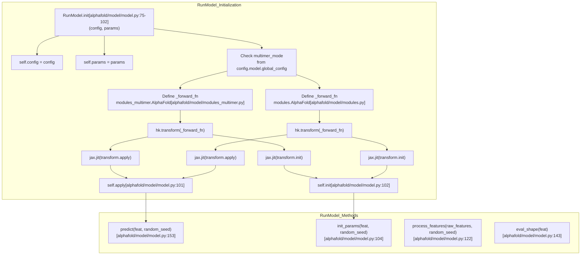
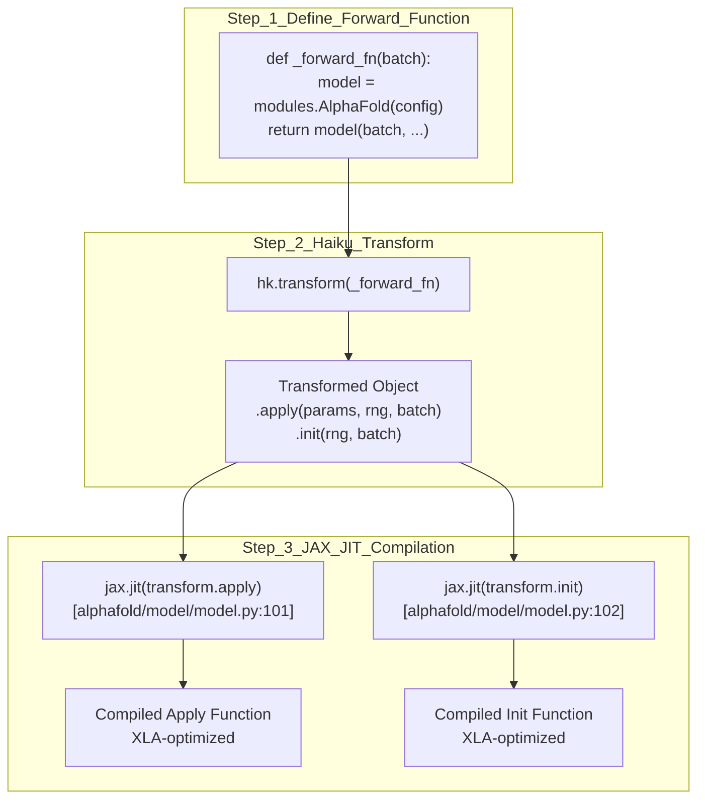
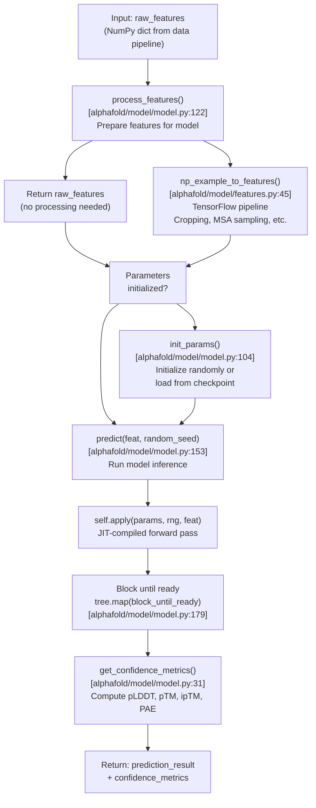
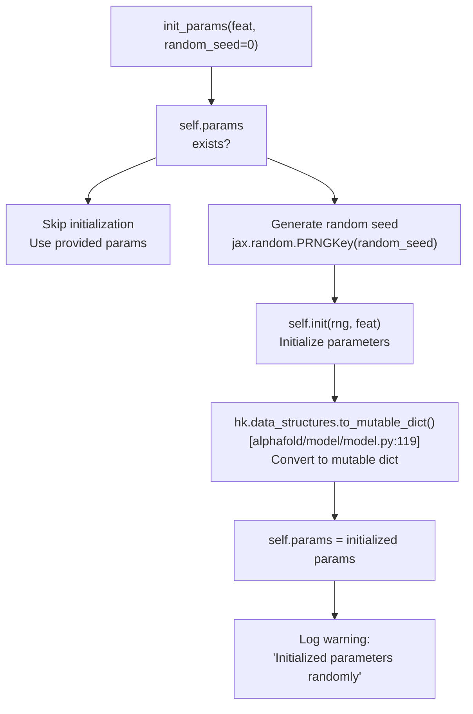
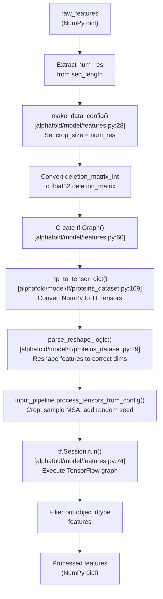
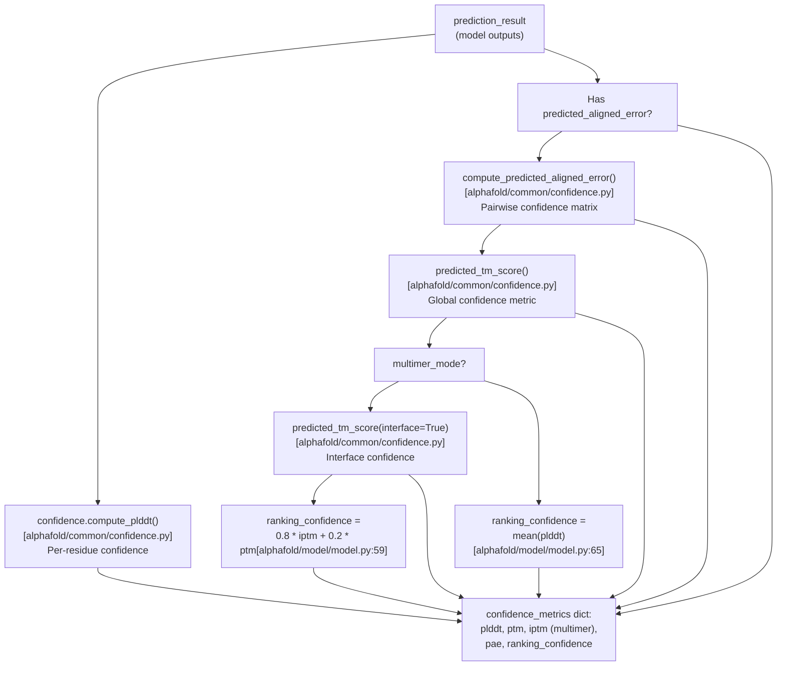
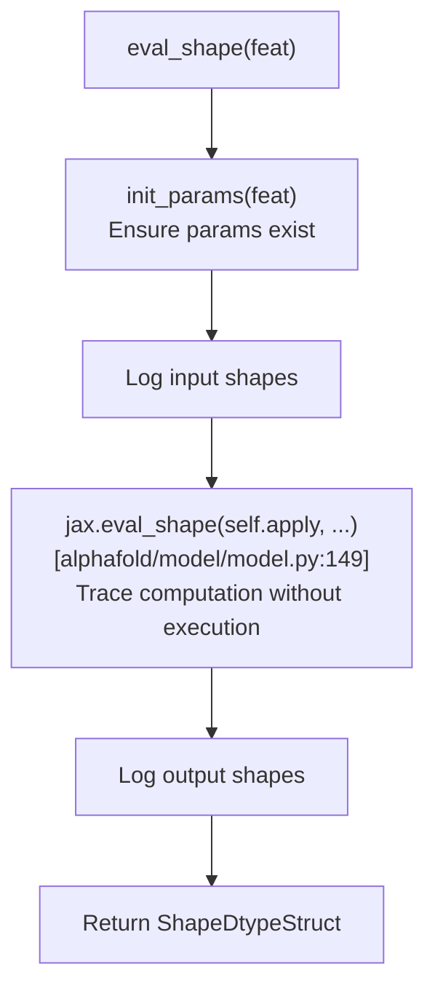

# Model Execution

> **Relevant source files**
> * [alphafold/model/features.py](https://github.com/google-deepmind/alphafold/blob/c77e5d2a/alphafold/model/features.py)
> * [alphafold/model/model.py](https://github.com/google-deepmind/alphafold/blob/c77e5d2a/alphafold/model/model.py)
> * [alphafold/model/modules.py](https://github.com/google-deepmind/alphafold/blob/c77e5d2a/alphafold/model/modules.py)
> * [alphafold/model/modules_multimer.py](https://github.com/google-deepmind/alphafold/blob/c77e5d2a/alphafold/model/modules_multimer.py)
> * [alphafold/model/tf/proteins_dataset.py](https://github.com/google-deepmind/alphafold/blob/c77e5d2a/alphafold/model/tf/proteins_dataset.py)

## Purpose and Scope

This document describes how AlphaFold models are executed at runtime. It covers the `RunModel` class, which serves as the primary interface for model inference, including parameter initialization, feature processing, Haiku functional transformations, JAX JIT compilation, and the prediction workflow that produces structural predictions and confidence metrics.

For information about the model architecture that gets executed, see [Evoformer Stack](/google-deepmind/alphafold/4.2-evoformer-stack) and [Structure Module](/google-deepmind/alphafold/4.3-structure-module). For configuration options that control execution, see [Configuration System](/google-deepmind/alphafold/4.1-configuration-system). For post-prediction structure refinement, see [Structure Relaxation](/google-deepmind/alphafold/6.2-structure-relaxation).

## RunModel Class Overview

The `RunModel` class ([alphafold/model/model.py L72-L184](https://github.com/google-deepmind/alphafold/blob/c77e5d2a/alphafold/model/model.py#L72-L184)

) is a container that wraps the AlphaFold neural network model for inference. It handles the transformation of the model into a functional form using Haiku, JIT compilation with JAX, parameter management, and the execution pipeline.

### Class Structure



**Sources:** [alphafold/model/model.py L72-L103](https://github.com/google-deepmind/alphafold/blob/c77e5d2a/alphafold/model/model.py#L72-L103)

 [alphafold/model/modules.py L134-L143](https://github.com/google-deepmind/alphafold/blob/c77e5d2a/alphafold/model/modules.py#L134-L143)

 [alphafold/model/modules_multimer.py L15-L21](https://github.com/google-deepmind/alphafold/blob/c77e5d2a/alphafold/model/modules_multimer.py#L15-L21)

### Key Attributes

| Attribute | Type | Description |
| --- | --- | --- |
| `config` | `ml_collections.ConfigDict` | Model configuration dictionary |
| `params` | `Mapping[str, Mapping[str, jax.Array]]` | Model parameters (weights) |
| `multimer_mode` | `bool` | Whether to use multimer architecture |
| `apply` | JIT-compiled function | Forward pass function for inference |
| `init` | JIT-compiled function | Parameter initialization function |

**Sources:** [alphafold/model/model.py L75-L102](https://github.com/google-deepmind/alphafold/blob/c77e5d2a/alphafold/model/model.py#L75-L102)

## Haiku Transforms and JAX JIT Compilation

AlphaFold uses Haiku's functional programming paradigm combined with JAX's JIT compilation for efficient execution.

### Haiku Transform Process



**Sources:** [alphafold/model/model.py L86-L102](https://github.com/google-deepmind/alphafold/blob/c77e5d2a/alphafold/model/model.py#L86-L102)

### Forward Function Definitions

The forward function differs between monomer and multimer modes:

**Monomer Mode** ([alphafold/model/model.py L92-L99](https://github.com/google-deepmind/alphafold/blob/c77e5d2a/alphafold/model/model.py#L92-L99)

):

```python
def _forward_fn(batch):    model = modules.AlphaFold(self.config.model)    return model(        batch,        is_training=False,        compute_loss=False,        ensemble_representations=True,    )
```

**Multimer Mode** ([alphafold/model/model.py L86-L88](https://github.com/google-deepmind/alphafold/blob/c77e5d2a/alphafold/model/model.py#L86-L88)

):

```python
def _forward_fn(batch):    model = modules_multimer.AlphaFold(self.config.model)    return model(batch, is_training=False)
```

**Sources:** [alphafold/model/model.py L84-L99](https://github.com/google-deepmind/alphafold/blob/c77e5d2a/alphafold/model/model.py#L84-L99)

### JIT Compilation Benefits

JAX's JIT compilation ([alphafold/model/model.py L101-L102](https://github.com/google-deepmind/alphafold/blob/c77e5d2a/alphafold/model/model.py#L101-L102)

) provides:

* XLA-optimized execution on GPU/TPU
* Automatic parallelization
* Efficient memory usage
* Compiled once, executed many times

## Prediction Workflow

The complete prediction workflow involves several stages, coordinated by methods of the `RunModel` class.



**Sources:** [alphafold/model/model.py L104-L184](https://github.com/google-deepmind/alphafold/blob/c77e5d2a/alphafold/model/model.py#L104-L184)

 [alphafold/model/features.py L45-L76](https://github.com/google-deepmind/alphafold/blob/c77e5d2a/alphafold/model/features.py#L45-L76)

### Parameter Initialization

The `init_params` method ([alphafold/model/model.py L104-L120](https://github.com/google-deepmind/alphafold/blob/c77e5d2a/alphafold/model/model.py#L104-L120)

) handles model parameter initialization:



**Sources:** [alphafold/model/model.py L104-L120](https://github.com/google-deepmind/alphafold/blob/c77e5d2a/alphafold/model/model.py#L104-L120)

### Feature Processing

Feature processing differs significantly between monomer and multimer modes:

| Mode | Processing | Implementation |
| --- | --- | --- |
| **Multimer** | No processing | Returns `raw_features` as-is ([alphafold/model/model.py L137](https://github.com/google-deepmind/alphafold/blob/c77e5d2a/alphafold/model/model.py#L137-L137) <br> ) |
| **Monomer** | TensorFlow pipeline | Calls `features.np_example_to_features()` ([alphafold/model/model.py L139-L141](https://github.com/google-deepmind/alphafold/blob/c77e5d2a/alphafold/model/model.py#L139-L141) <br> ) |

**Sources:** [alphafold/model/model.py L122-L141](https://github.com/google-deepmind/alphafold/blob/c77e5d2a/alphafold/model/model.py#L122-L141)

#### Monomer Feature Processing Pipeline

For monomer mode, features are processed through a TensorFlow pipeline ([alphafold/model/features.py L45-L76](https://github.com/google-deepmind/alphafold/blob/c77e5d2a/alphafold/model/features.py#L45-L76)

):



**Sources:** [alphafold/model/features.py L45-L76](https://github.com/google-deepmind/alphafold/blob/c77e5d2a/alphafold/model/features.py#L45-L76)

 [alphafold/model/tf/proteins_dataset.py L109-L131](https://github.com/google-deepmind/alphafold/blob/c77e5d2a/alphafold/model/tf/proteins_dataset.py#L109-L131)

### Model Prediction

The `predict` method ([alphafold/model/model.py L153-L184](https://github.com/google-deepmind/alphafold/blob/c77e5d2a/alphafold/model/model.py#L153-L184)

) executes the model:

| Step | Operation | Code Reference |
| --- | --- | --- |
| 1 | Initialize parameters if needed | `self.init_params(feat)` [alphafold/model/model.py L169](https://github.com/google-deepmind/alphafold/blob/c77e5d2a/alphafold/model/model.py#L169-L169) |
| 2 | Log input shapes | `logging.info(...)` [alphafold/model/model.py L170-L173](https://github.com/google-deepmind/alphafold/blob/c77e5d2a/alphafold/model/model.py#L170-L173) |
| 3 | Run JIT-compiled model | `result = self.apply(...)` [alphafold/model/model.py L174](https://github.com/google-deepmind/alphafold/blob/c77e5d2a/alphafold/model/model.py#L174-L174) |
| 4 | Block until outputs ready | `tree.map(lambda x: x.block_until_ready(), result)` [alphafold/model/model.py L179](https://github.com/google-deepmind/alphafold/blob/c77e5d2a/alphafold/model/model.py#L179-L179) |
| 5 | Compute confidence metrics | `get_confidence_metrics(result, multimer_mode)` [alphafold/model/model.py L181](https://github.com/google-deepmind/alphafold/blob/c77e5d2a/alphafold/model/model.py#L181-L181) |
| 6 | Update result dict | `result.update(confidence_metrics)` [alphafold/model/model.py L180-L182](https://github.com/google-deepmind/alphafold/blob/c77e5d2a/alphafold/model/model.py#L180-L182) |
| 7 | Log output shapes | `logging.info(...)` [alphafold/model/model.py L183](https://github.com/google-deepmind/alphafold/blob/c77e5d2a/alphafold/model/model.py#L183-L183) |
| 8 | Return results | `return result` [alphafold/model/model.py L184](https://github.com/google-deepmind/alphafold/blob/c77e5d2a/alphafold/model/model.py#L184-L184) |

**Sources:** [alphafold/model/model.py L153-L184](https://github.com/google-deepmind/alphafold/blob/c77e5d2a/alphafold/model/model.py#L153-L184)

## Confidence Metric Computation

The `get_confidence_metrics` function ([alphafold/model/model.py L31-L69](https://github.com/google-deepmind/alphafold/blob/c77e5d2a/alphafold/model/model.py#L31-L69)

) post-processes model outputs to compute confidence scores.



**Sources:** [alphafold/model/model.py L31-L69](https://github.com/google-deepmind/alphafold/blob/c77e5d2a/alphafold/model/model.py#L31-L69)

### Confidence Metrics Summary

| Metric | Computation | Monomer | Multimer | Purpose |
| --- | --- | --- | --- | --- |
| **pLDDT** | `confidence.compute_plddt()` | ✓ | ✓ | Per-residue confidence (0-100) |
| **PAE** | `confidence.compute_predicted_aligned_error()` | ✓* | ✓* | Pairwise alignment error matrix |
| **pTM** | `confidence.predicted_tm_score()` (asym_id=None) | ✓* | ✓* | Global TM-score prediction |
| **ipTM** | `confidence.predicted_tm_score()` (interface=True) | ✗ | ✓* | Interface TM-score (multi-chain) |
| **ranking_confidence** | mean(pLDDT) or 0.8×ipTM + 0.2×pTM | ✓ | ✓ | Used to rank multiple predictions |

*Only available if model has `predicted_aligned_error` head (e.g., `*_ptm` models)

**Sources:** [alphafold/model/model.py L31-L69](https://github.com/google-deepmind/alphafold/blob/c77e5d2a/alphafold/model/model.py#L31-L69)

## Monomer vs Multimer Execution Differences

The execution path diverges based on the `multimer_mode` configuration flag ([alphafold/model/model.py L82](https://github.com/google-deepmind/alphafold/blob/c77e5d2a/alphafold/model/model.py#L82-L82)

).

### Comparison Table

| Aspect | Monomer | Multimer |
| --- | --- | --- |
| **Architecture Module** | `modules.AlphaFold` [alphafold/model/model.py L93](https://github.com/google-deepmind/alphafold/blob/c77e5d2a/alphafold/model/model.py#L93-L93) | `modules_multimer.AlphaFold` [alphafold/model/model.py L87](https://github.com/google-deepmind/alphafold/blob/c77e5d2a/alphafold/model/model.py#L87-L87) |
| **Forward Function Args** | `is_training=False`, `ensemble_representations=True` [alphafold/model/model.py L96-L98](https://github.com/google-deepmind/alphafold/blob/c77e5d2a/alphafold/model/model.py#L96-L98) | `is_training=False` [alphafold/model/model.py L88](https://github.com/google-deepmind/alphafold/blob/c77e5d2a/alphafold/model/model.py#L88-L88) |
| **Feature Processing** | TensorFlow pipeline [alphafold/model/model.py L139](https://github.com/google-deepmind/alphafold/blob/c77e5d2a/alphafold/model/model.py#L139-L139) | No processing [alphafold/model/model.py L137](https://github.com/google-deepmind/alphafold/blob/c77e5d2a/alphafold/model/model.py#L137-L137) |
| **Random Seed Usage** | Controls MSA sampling in processing | Controls MSA sampling in model [alphafold/model/model.py L156](https://github.com/google-deepmind/alphafold/blob/c77e5d2a/alphafold/model/model.py#L156-L156) |
| **ipTM Computation** | Not computed | Computed for interface confidence [alphafold/model/model.py L53-L58](https://github.com/google-deepmind/alphafold/blob/c77e5d2a/alphafold/model/model.py#L53-L58) |
| **Ranking Metric** | `mean(plddt)` [alphafold/model/model.py L65-L67](https://github.com/google-deepmind/alphafold/blob/c77e5d2a/alphafold/model/model.py#L65-L67) | `0.8 * iptm + 0.2 * ptm` [alphafold/model/model.py L59-L61](https://github.com/google-deepmind/alphafold/blob/c77e5d2a/alphafold/model/model.py#L59-L61) |

**Sources:** [alphafold/model/model.py L84-L99](https://github.com/google-deepmind/alphafold/blob/c77e5d2a/alphafold/model/model.py#L84-L99)

 [alphafold/model/model.py L122-L141](https://github.com/google-deepmind/alphafold/blob/c77e5d2a/alphafold/model/model.py#L122-L141)

 [alphafold/model/model.py L51-L67](https://github.com/google-deepmind/alphafold/blob/c77e5d2a/alphafold/model/model.py#L51-L67)

## Evaluation Shape Utility

The `eval_shape` method ([alphafold/model/model.py L143-L151](https://github.com/google-deepmind/alphafold/blob/c77e5d2a/alphafold/model/model.py#L143-L151)

) is a utility for determining output shapes without running the full computation using `jax.eval_shape`.



**Sources:** [alphafold/model/model.py L143-L151](https://github.com/google-deepmind/alphafold/blob/c77e5d2a/alphafold/model/model.py#L143-L151)

## Usage Pattern

Typical usage of the `RunModel` class follows this pattern:

1. **Instantiate** with configuration and optional pre-trained parameters ([alphafold/model/model.py L75-L81](https://github.com/google-deepmind/alphafold/blob/c77e5d2a/alphafold/model/model.py#L75-L81) ).
2. **Process features** from raw data pipeline output ([alphafold/model/model.py L122-L141](https://github.com/google-deepmind/alphafold/blob/c77e5d2a/alphafold/model/model.py#L122-L141) ).
3. **Predict** to run inference and get results ([alphafold/model/model.py L153-L184](https://github.com/google-deepmind/alphafold/blob/c77e5d2a/alphafold/model/model.py#L153-L184) ).
4. Use confidence metrics for ranking and filtering ([alphafold/model/model.py L31-L69](https://github.com/google-deepmind/alphafold/blob/c77e5d2a/alphafold/model/model.py#L31-L69) ).

The class is designed to be reused for multiple predictions with the same model configuration, amortizing the JIT compilation cost across many inference calls.

**Sources:** [alphafold/model/model.py L72-L184](https://github.com/google-deepmind/alphafold/blob/c77e5d2a/alphafold/model/model.py#L72-L184)