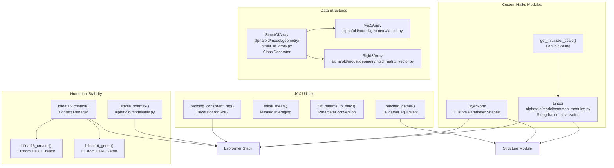
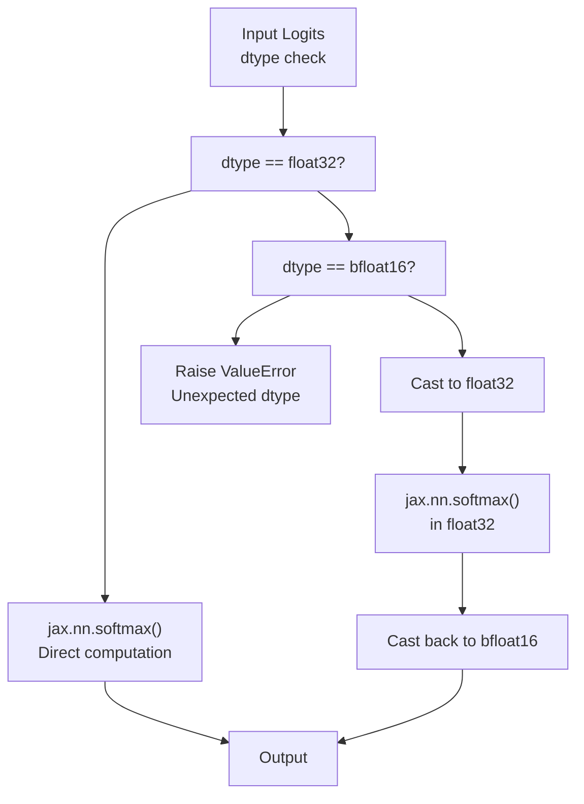
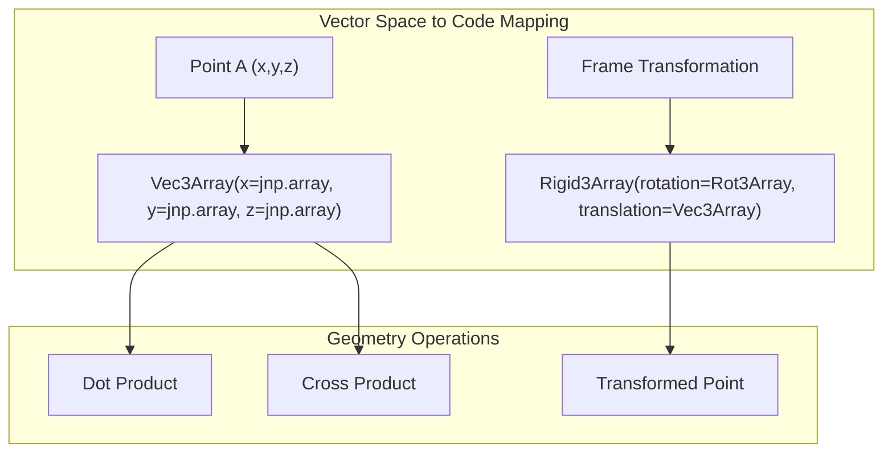

# Model Utilities

> **Relevant source files**
> * [alphafold/model/common_modules.py](https://github.com/google-deepmind/alphafold/blob/c77e5d2a/alphafold/model/common_modules.py)
> * [alphafold/model/geometry/rigid_matrix_vector.py](https://github.com/google-deepmind/alphafold/blob/c77e5d2a/alphafold/model/geometry/rigid_matrix_vector.py)
> * [alphafold/model/geometry/rotation_matrix.py](https://github.com/google-deepmind/alphafold/blob/c77e5d2a/alphafold/model/geometry/rotation_matrix.py)
> * [alphafold/model/geometry/struct_of_array.py](https://github.com/google-deepmind/alphafold/blob/c77e5d2a/alphafold/model/geometry/struct_of_array.py)
> * [alphafold/model/geometry/vector.py](https://github.com/google-deepmind/alphafold/blob/c77e5d2a/alphafold/model/geometry/vector.py)
> * [alphafold/model/prng_test.py](https://github.com/google-deepmind/alphafold/blob/c77e5d2a/alphafold/model/prng_test.py)
> * [alphafold/model/r3.py](https://github.com/google-deepmind/alphafold/blob/c77e5d2a/alphafold/model/r3.py)
> * [alphafold/model/utils.py](https://github.com/google-deepmind/alphafold/blob/c77e5d2a/alphafold/model/utils.py)
> * [docker/requirements.txt](https://github.com/google-deepmind/alphafold/blob/c77e5d2a/docker/requirements.txt)

## Purpose and Scope

This document covers the utility functions and modules that support the AlphaFold model implementation. These utilities provide three primary categories of functionality:

1. **Numerical Stability**: Functions for handling `bfloat16` precision and numerically stable operations.
2. **Custom Neural Network Modules**: Haiku-based layers with AlphaFold-specific initialization and features.
3. **JAX Helper Functions**: Utilities for array operations, masking, parameter conversion, and random number generation.
4. **Geometric Utilities**: Efficient struct-of-array representations for 3D coordinates and transformations.

For information about the core model architecture components that use these utilities, see [Model Architecture](https://github.com/google-deepmind/alphafold/blob/c77e5d2a/Model Architecture)

 For geometric transformations and rigid body operations, see [Atom Representations and Geometry](https://github.com/google-deepmind/alphafold/blob/c77e5d2a/Atom Representations and Geometry)

---

## System Overview

**Sources:** [alphafold/model/utils.py L1-L178](https://github.com/google-deepmind/alphafold/blob/c77e5d2a/alphafold/model/utils.py#L1-L178)

 [alphafold/model/common_modules.py L1-L202](https://github.com/google-deepmind/alphafold/blob/c77e5d2a/alphafold/model/common_modules.py#L1-L202)

 [alphafold/model/geometry/struct_of_array.py L1-L233](https://github.com/google-deepmind/alphafold/blob/c77e5d2a/alphafold/model/geometry/struct_of_array.py#L1-L233)

 [alphafold/model/geometry/vector.py L32-L48](https://github.com/google-deepmind/alphafold/blob/c77e5d2a/alphafold/model/geometry/vector.py#L32-L48)

 [alphafold/model/geometry/rigid_matrix_vector.py L31-L37](https://github.com/google-deepmind/alphafold/blob/c77e5d2a/alphafold/model/geometry/rigid_matrix_vector.py#L31-L37)

---

## Numerical Stability Utilities

### BFloat16 Precision Handling

AlphaFold supports mixed-precision training and inference using `bfloat16` (Brain Floating Point 16-bit), which provides memory and computational efficiency while maintaining numerical stability. The utilities in [alphafold/model/utils.py](https://github.com/google-deepmind/alphafold/blob/c77e5d2a/alphafold/model/utils.py)

 handle the complexities of `bfloat16` operations.

#### Stable Softmax

The `stable_softmax()` function ensures numerical stability for softmax operations, particularly when working with `bfloat16`:

The `bfloat16` path explicitly converts to `float32` before computing softmax to avoid numerical issues with large negative values [alphafold/model/utils.py L34-L38](https://github.com/google-deepmind/alphafold/blob/c77e5d2a/alphafold/model/utils.py#L34-L38)

 Large negatives occur when masking logits by adding large negative values so they softmax to zero.

#### BFloat16 Context Manager

The `bfloat16_context()` [alphafold/model/utils.py L59-L62](https://github.com/google-deepmind/alphafold/blob/c77e5d2a/alphafold/model/utils.py#L59-L62)

 provides a context manager that modifies Haiku's parameter creation and retrieval:

* **`bfloat16_creator`**: Creates `float32` variables even when `bfloat16` is requested [alphafold/model/utils.py L44-L48](https://github.com/google-deepmind/alphafold/blob/c77e5d2a/alphafold/model/utils.py#L44-L48)
* **`bfloat16_getter`**: Casts the stored `float32` parameters to `bfloat16` upon retrieval [alphafold/model/utils.py L51-L56](https://github.com/google-deepmind/alphafold/blob/c77e5d2a/alphafold/model/utils.py#L51-L56)

**Sources:** [alphafold/model/utils.py L29-L62](https://github.com/google-deepmind/alphafold/blob/c77e5d2a/alphafold/model/utils.py#L29-L62)

---

## Custom Haiku Modules

### Linear Layer

The `Linear` class in [alphafold/model/common_modules.py L54-L135](https://github.com/google-deepmind/alphafold/blob/c77e5d2a/alphafold/model/common_modules.py#L54-L135)

 extends standard Haiku linear layers with AlphaFold-specific features:

| Feature | Description |
| --- | --- |
| **Arbitrary Rank** | Supports inputs and outputs of arbitrary rank beyond 2D [alphafold/model/common_modules.py L58](https://github.com/google-deepmind/alphafold/blob/c77e5d2a/alphafold/model/common_modules.py#L58-L58) |
| **String Initializers** | Specifies initializers via strings: `'linear'`, `'relu'`, or `'zeros'` [alphafold/model/common_modules.py L77-L78](https://github.com/google-deepmind/alphafold/blob/c77e5d2a/alphafold/model/common_modules.py#L77-L78) |
| **Einsum Projection** | Uses `jnp.einsum` for flexible projection across `num_input_dims` [alphafold/model/common_modules.py L122-L124](https://github.com/google-deepmind/alphafold/blob/c77e5d2a/alphafold/model/common_modules.py#L122-L124) |

**Initialization Formula:**
The `get_initializer_scale` function [alphafold/model/common_modules.py L31-L51](https://github.com/google-deepmind/alphafold/blob/c77e5d2a/alphafold/model/common_modules.py#L31-L51)

 computes fan-in scaling. The standard deviation is adjusted for truncation using `TRUNCATED_NORMAL_STDDEV_FACTOR` (~0.8796) [alphafold/model/common_modules.py L25-L27](https://github.com/google-deepmind/alphafold/blob/c77e5d2a/alphafold/model/common_modules.py#L25-L27)

### LayerNorm

The custom `LayerNorm` [alphafold/model/common_modules.py L138-L201](https://github.com/google-deepmind/alphafold/blob/c77e5d2a/alphafold/model/common_modules.py#L138-L201)

 differs from `hk.LayerNorm` by ensuring parameter shapes are always vectors (1D) rather than higher-rank tensors [alphafold/model/common_modules.py L141-L143](https://github.com/google-deepmind/alphafold/blob/c77e5d2a/alphafold/model/common_modules.py#L141-L143)

 It also includes internal `float32` casting for `bfloat16` inputs to maintain stability [alphafold/model/common_modules.py L173-L175](https://github.com/google-deepmind/alphafold/blob/c77e5d2a/alphafold/model/common_modules.py#L173-L175)

**Sources:** [alphafold/model/common_modules.py L31-L201](https://github.com/google-deepmind/alphafold/blob/c77e5d2a/alphafold/model/common_modules.py#L31-L201)

---

## Geometric Representations

AlphaFold uses specialized data structures for 3D geometry to improve performance and precision on accelerators like TPUs, which are suboptimal for small 3x3 matrix multiplications [alphafold/model/geometry/vector.py L37-L40](https://github.com/google-deepmind/alphafold/blob/c77e5d2a/alphafold/model/geometry/vector.py#L37-L40)

### Vec3Array and Rot3Array

* **`Vec3Array`**: Represents 3D vectors as a "Struct of Arrays" (separate `x`, `y`, `z` arrays) [alphafold/model/geometry/vector.py L33-L48](https://github.com/google-deepmind/alphafold/blob/c77e5d2a/alphafold/model/geometry/vector.py#L33-L48)
* **`Rot3Array`**: Represents 3x3 rotation matrices using 9 separate components (`xx`, `xy`, etc.) [alphafold/model/geometry/rotation_matrix.py L33-L44](https://github.com/google-deepmind/alphafold/blob/c77e5d2a/alphafold/model/geometry/rotation_matrix.py#L33-L44)
* **`Rigid3Array`**: Combines a `Rot3Array` and `Vec3Array` to represent a full rigid transformation [alphafold/model/geometry/rigid_matrix_vector.py L32-L36](https://github.com/google-deepmind/alphafold/blob/c77e5d2a/alphafold/model/geometry/rigid_matrix_vector.py#L32-L36)

### Struct of Array Pattern

The `StructOfArray` class decorator [alphafold/model/geometry/struct_of_array.py L191-L233](https://github.com/google-deepmind/alphafold/blob/c77e5d2a/alphafold/model/geometry/struct_of_array.py#L191-L233)

 automates the conversion of standard dataclasses into PyTrees that JAX can manipulate efficiently.

**Sources:** [alphafold/model/geometry/vector.py L32-L113](https://github.com/google-deepmind/alphafold/blob/c77e5d2a/alphafold/model/geometry/vector.py#L32-L113)

 [alphafold/model/geometry/rotation_matrix.py L32-L73](https://github.com/google-deepmind/alphafold/blob/c77e5d2a/alphafold/model/geometry/rotation_matrix.py#L32-L73)

 [alphafold/model/geometry/rigid_matrix_vector.py L31-L51](https://github.com/google-deepmind/alphafold/blob/c77e5d2a/alphafold/model/geometry/rigid_matrix_vector.py#L31-L51)

 [alphafold/model/geometry/struct_of_array.py L191-L233](https://github.com/google-deepmind/alphafold/blob/c77e5d2a/alphafold/model/geometry/struct_of_array.py#L191-L233)

---

## JAX Helper Functions

### Masked Mean

The `mask_mean()` function [alphafold/model/utils.py L80-L109](https://github.com/google-deepmind/alphafold/blob/c77e5d2a/alphafold/model/utils.py#L80-L109)

 computes averages while ignoring masked elements. It handles broadcasting where the mask may have a size of 1 in a dimension that the value tensor does not [alphafold/model/utils.py L102-L103](https://github.com/google-deepmind/alphafold/blob/c77e5d2a/alphafold/model/utils.py#L102-L103)

### Padding-Consistent RNG

`padding_consistent_rng()` [alphafold/model/utils.py L124-L178](https://github.com/google-deepmind/alphafold/blob/c77e5d2a/alphafold/model/utils.py#L124-L178)

 is a decorator that ensures random number generation is invariant to padding. It works by generating a grid of RNG keys based on indices using `jax.random.fold_in` [alphafold/model/utils.py L162-L165](https://github.com/google-deepmind/alphafold/blob/c77e5d2a/alphafold/model/utils.py#L162-L165)

 so that the random value at index `(i, j)` remains the same regardless of the total array shape.

### Batched Gather

`batched_gather()` [alphafold/model/utils.py L72-L77](https://github.com/google-deepmind/alphafold/blob/c77e5d2a/alphafold/model/utils.py#L72-L77)

 implements a JAX version of `tf.gather` with support for `axis` and `batch_dims` by recursively applying `jax.vmap` over `jnp.take`.

**Sources:** [alphafold/model/utils.py L72-L178](https://github.com/google-deepmind/alphafold/blob/c77e5d2a/alphafold/model/utils.py#L72-L178)