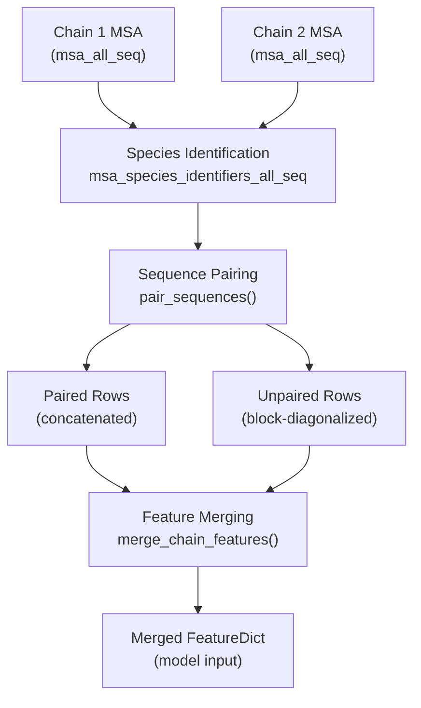
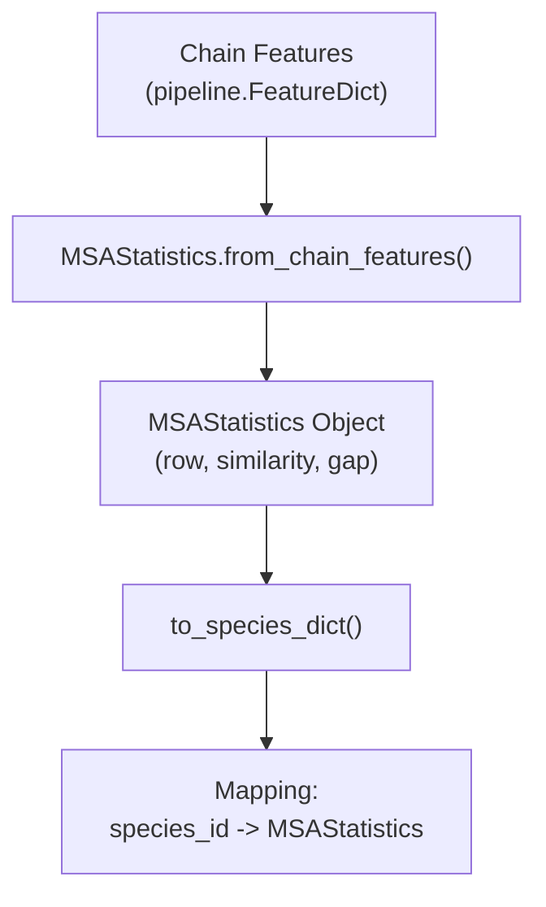
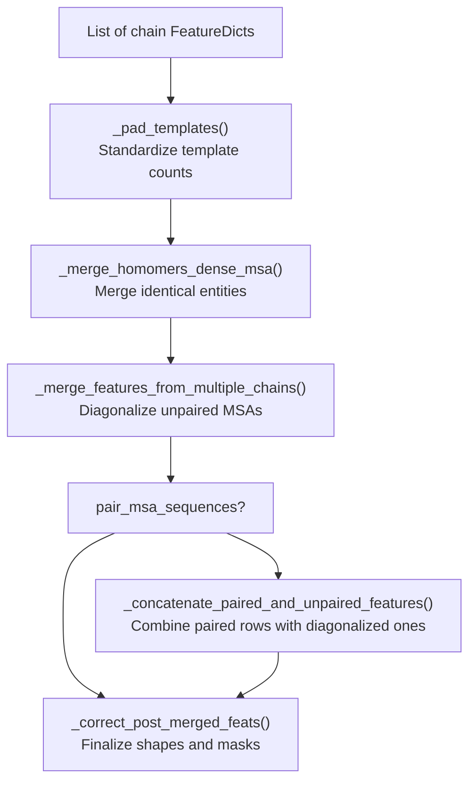

# Multimer MSA Pairing

> **Relevant source files**
> * [alphafold/data/msa_pairing.py](https://github.com/google-deepmind/alphafold/blob/c77e5d2a/alphafold/data/msa_pairing.py)
> * [alphafold/data/pipeline.py](https://github.com/google-deepmind/alphafold/blob/c77e5d2a/alphafold/data/pipeline.py)
> * [alphafold/data/pipeline_multimer.py](https://github.com/google-deepmind/alphafold/blob/c77e5d2a/alphafold/data/pipeline_multimer.py)
> * [alphafold/data/tools/hhsearch.py](https://github.com/google-deepmind/alphafold/blob/c77e5d2a/alphafold/data/tools/hhsearch.py)
> * [alphafold/data/tools/hmmbuild.py](https://github.com/google-deepmind/alphafold/blob/c77e5d2a/alphafold/data/tools/hmmbuild.py)
> * [alphafold/data/tools/hmmsearch.py](https://github.com/google-deepmind/alphafold/blob/c77e5d2a/alphafold/data/tools/hmmsearch.py)

## Purpose and Scope

This document describes the MSA (Multiple Sequence Alignment) pairing logic for multimer protein complex predictions in AlphaFold. When predicting the structure of protein complexes with multiple chains, identifying which sequences in each chain's MSA correspond to the same organism is critical, as these co-evolved sequences provide signal for inter-chain interactions.

This page focuses on the pairing algorithm and feature merging logic implemented in [alphafold/data/msa_pairing.py](https://github.com/google-deepmind/alphafold/blob/c77e5d2a/alphafold/data/msa_pairing.py)

 This logic is a key component of the multimer data pipeline described in [alphafold/data/pipeline_multimer.py](https://github.com/google-deepmind/alphafold/blob/c77e5d2a/alphafold/data/pipeline_multimer.py)

**Sources:** [alphafold/data/msa_pairing.py L1-L15](https://github.com/google-deepmind/alphafold/blob/c77e5d2a/alphafold/data/msa_pairing.py#L1-L15)

 [alphafold/data/pipeline_multimer.py L1-L15](https://github.com/google-deepmind/alphafold/blob/c77e5d2a/alphafold/data/pipeline_multimer.py#L1-L15)

---

## Overview: The Pairing Problem

In multimer prediction, each chain has its own MSA generated independently (see [3.1 MSA Generation](/google-deepmind/alphafold/3.1-msa-generation)). The pairing system must:

1. **Identify common species** across chain MSAs using species identifiers.
2. **Match sequences** from the same species across chains based on sequence similarity to the target.
3. **Merge features**—paired sequences are concatenated horizontally, while unpaired sequences are block-diagonalized.

**Diagram: High-Level MSA Pairing and Merging Flow**

**Sources:** [alphafold/data/msa_pairing.py L153-L186](https://github.com/google-deepmind/alphafold/blob/c77e5d2a/alphafold/data/msa_pairing.py#L153-L186)

 [alphafold/data/msa_pairing.py L256-L319](https://github.com/google-deepmind/alphafold/blob/c77e5d2a/alphafold/data/msa_pairing.py#L256-L319)

 [alphafold/data/msa_pairing.py L513-L543](https://github.com/google-deepmind/alphafold/blob/c77e5d2a/alphafold/data/msa_pairing.py#L513-L543)

---

## MSA Statistics and Species Grouping

### MSAStatistics Dataclass

The `MSAStatistics` class [alphafold/data/msa_pairing.py L70-L151](https://github.com/google-deepmind/alphafold/blob/c77e5d2a/alphafold/data/msa_pairing.py#L70-L151)

 provides a structured representation of MSA properties for a single chain:

| Attribute | Type | Description |
| --- | --- | --- |
| `species_identifiers` | `np.ndarray` | Species identifier for each MSA row (e.g., from UniProt metadata). |
| `row` | `np.ndarray` | Original row indices in the MSA. |
| `similarity` | `np.ndarray` | Sequence similarity to the target sequence (range: 0-1). |
| `gap` | `np.ndarray` | Gap percentage for each sequence (range: 0-1). |

### Key Methods

* **`from_chain_features()`** [alphafold/data/msa_pairing.py L87-L122](https://github.com/google-deepmind/alphafold/blob/c77e5d2a/alphafold/data/msa_pairing.py#L87-L122) : Creates an `MSAStatistics` object. It computes similarity by checking `target_seq[None] == chain_msa` [alphafold/data/msa_pairing.py L112-L116](https://github.com/google-deepmind/alphafold/blob/c77e5d2a/alphafold/data/msa_pairing.py#L112-L116)  and gap percentages using `chain_msa == MSA_GAP_IDX` [alphafold/data/msa_pairing.py L117-L121](https://github.com/google-deepmind/alphafold/blob/c77e5d2a/alphafold/data/msa_pairing.py#L117-L121)
* **`to_species_dict()`** [alphafold/data/msa_pairing.py L132-L150](https://github.com/google-deepmind/alphafold/blob/c77e5d2a/alphafold/data/msa_pairing.py#L132-L150) : Groups MSA rows by species identifier, returning a mapping from species bytes to `MSAStatistics` objects.
* **`get_top_msa_rows()`** [alphafold/data/msa_pairing.py L127-L130](https://github.com/google-deepmind/alphafold/blob/c77e5d2a/alphafold/data/msa_pairing.py#L127-L130) : Returns row indices sorted by descending sequence similarity.

**Diagram: MSAStatistics Construction and Species Grouping**

**Sources:** [alphafold/data/msa_pairing.py L70-L151](https://github.com/google-deepmind/alphafold/blob/c77e5d2a/alphafold/data/msa_pairing.py#L70-L151)

---

## Sequence Pairing Algorithm

### The Pairing Process

The core logic resides in `pair_sequences()` [alphafold/data/msa_pairing.py L256-L319](https://github.com/google-deepmind/alphafold/blob/c77e5d2a/alphafold/data/msa_pairing.py#L256-L319)

 It identifies which rows across multiple MSAs should be linked.

1. **Initialize with target sequences**: The first row of each MSA (the target) is always paired [alphafold/data/msa_pairing.py L282-L284](https://github.com/google-deepmind/alphafold/blob/c77e5d2a/alphafold/data/msa_pairing.py#L282-L284)
2. **Find common species**: It identifies all species present in at least two chains [alphafold/data/msa_pairing.py L270-L280](https://github.com/google-deepmind/alphafold/blob/c77e5d2a/alphafold/data/msa_pairing.py#L270-L280)
3. **Filter and Match**: * It skips species present in only one chain [alphafold/data/msa_pairing.py L298-L300](https://github.com/google-deepmind/alphafold/blob/c77e5d2a/alphafold/data/msa_pairing.py#L298-L300) * It skips species with more than 600 sequences in a single chain to avoid combinatorial explosion [alphafold/data/msa_pairing.py L302-L310](https://github.com/google-deepmind/alphafold/blob/c77e5d2a/alphafold/data/msa_pairing.py#L302-L310) * It calls `_match_rows_by_sequence_similarity()` to perform greedy matching [alphafold/data/msa_pairing.py L312](https://github.com/google-deepmind/alphafold/blob/c77e5d2a/alphafold/data/msa_pairing.py#L312-L312)

### Greedy Similarity Matching

The `_match_rows_by_sequence_similarity()` function [alphafold/data/msa_pairing.py L220-L253](https://github.com/google-deepmind/alphafold/blob/c77e5d2a/alphafold/data/msa_pairing.py#L220-L253)

 performs the following:

* Sorts sequences of the same species in each chain by similarity to the target [alphafold/data/msa_pairing.py L248](https://github.com/google-deepmind/alphafold/blob/c77e5d2a/alphafold/data/msa_pairing.py#L248-L248)
* Pairs the top $N$ sequences across chains, where $N$ is the count in the chain with the fewest sequences for that species [alphafold/data/msa_pairing.py L240-L252](https://github.com/google-deepmind/alphafold/blob/c77e5d2a/alphafold/data/msa_pairing.py#L240-L252)
* If a chain is missing a species entirely, it uses a padding index `-1` [alphafold/data/msa_pairing.py L250](https://github.com/google-deepmind/alphafold/blob/c77e5d2a/alphafold/data/msa_pairing.py#L250-L250)

### Reordering

`reorder_paired_rows()` [alphafold/data/msa_pairing.py L322-L346](https://github.com/google-deepmind/alphafold/blob/c77e5d2a/alphafold/data/msa_pairing.py#L322-L346)

 sorts the final paired set. It prioritizes pairings that include the most chains (descending order of `num_chains_paired`) [alphafold/data/msa_pairing.py L340](https://github.com/google-deepmind/alphafold/blob/c77e5d2a/alphafold/data/msa_pairing.py#L340-L340)

**Sources:** [alphafold/data/msa_pairing.py L220-L346](https://github.com/google-deepmind/alphafold/blob/c77e5d2a/alphafold/data/msa_pairing.py#L220-L346)

---

## Feature Merging Strategies

AlphaFold Multimer uses two distinct merging strategies for MSA features.

### 1. Paired Concatenation

Paired sequences (those identified by `pair_sequences`) are concatenated horizontally along the residue dimension. This creates a "dense" MSA row representing the entire complex.

### 2. Block Diagonalization (Unpaired)

Unpaired sequences (sequences found in one chain's MSA that couldn't be paired) are block-diagonalized using `block_diag()` [alphafold/data/msa_pairing.py L349-L355](https://github.com/google-deepmind/alphafold/blob/c77e5d2a/alphafold/data/msa_pairing.py#L349-L355)

 This means a sequence for Chain A is padded with gaps for all positions belonging to Chain B.

| Feature Type | Paired Rows | Unpaired Rows |
| --- | --- | --- |
| **MSA** (`msa`) | Concatenated | Block-diagonalized |
| **Deletion Matrix** | Concatenated | Block-diagonalized |
| **Sequence** (`aatype`) | Concatenated | Concatenated |
| **Templates** | Concatenated | Concatenated |

**Sources:** [alphafold/data/msa_pairing.py L349-L355](https://github.com/google-deepmind/alphafold/blob/c77e5d2a/alphafold/data/msa_pairing.py#L349-L355)

 [alphafold/data/msa_pairing.py L434-L466](https://github.com/google-deepmind/alphafold/blob/c77e5d2a/alphafold/data/msa_pairing.py#L434-L466)

---

## The Complete Merging Pipeline

The function `merge_chain_features()` [alphafold/data/msa_pairing.py L513-L543](https://github.com/google-deepmind/alphafold/blob/c77e5d2a/alphafold/data/msa_pairing.py#L513-L543)

 is the high-level orchestrator that assembles the final model features.

**Diagram: merge_chain_features() Execution Flow**

### Key Pipeline Components

* **`_merge_homomers_dense_msa()`** [alphafold/data/msa_pairing.py L469-L495](https://github.com/google-deepmind/alphafold/blob/c77e5d2a/alphafold/data/msa_pairing.py#L469-L495) : Handles chains with the same `entity_id` (homomers). These are merged with concatenation to provide a dense representation.
* **`_correct_post_merged_feats()`** [alphafold/data/msa_pairing.py L358-L408](https://github.com/google-deepmind/alphafold/blob/c77e5d2a/alphafold/data/msa_pairing.py#L358-L408) : Updates `num_alignments` and `seq_length`. It also generates the `cluster_bias_mask` [alphafold/data/msa_pairing.py L391-L393](https://github.com/google-deepmind/alphafold/blob/c77e5d2a/alphafold/data/msa_pairing.py#L391-L393)  and initializes the `bert_mask` [alphafold/data/msa_pairing.py L395-L396](https://github.com/google-deepmind/alphafold/blob/c77e5d2a/alphafold/data/msa_pairing.py#L395-L396)
* **`deduplicate_unpaired_sequences()`** [alphafold/data/msa_pairing.py L546-L567](https://github.com/google-deepmind/alphafold/blob/c77e5d2a/alphafold/data/msa_pairing.py#L546-L567) : Removes any unpaired sequences that are identical to sequences already present in the paired MSA section to reduce redundancy.

**Sources:** [alphafold/data/msa_pairing.py L358-L567](https://github.com/google-deepmind/alphafold/blob/c77e5d2a/alphafold/data/msa_pairing.py#L358-L567)

---

## Feature Padding and Constants

The system uses specific padding values defined in `MSA_PAD_VALUES` [alphafold/data/msa_pairing.py L31-L40](https://github.com/google-deepmind/alphafold/blob/c77e5d2a/alphafold/data/msa_pairing.py#L31-L40)

:

* `msa`: `MSA_GAP_IDX` (20) [alphafold/data/msa_pairing.py L36](https://github.com/google-deepmind/alphafold/blob/c77e5d2a/alphafold/data/msa_pairing.py#L36-L36)
* `msa_mask`: 1 [alphafold/data/msa_pairing.py L37](https://github.com/google-deepmind/alphafold/blob/c77e5d2a/alphafold/data/msa_pairing.py#L37-L37)
* `deletion_matrix`: 0 [alphafold/data/msa_pairing.py L38](https://github.com/google-deepmind/alphafold/blob/c77e5d2a/alphafold/data/msa_pairing.py#L38-L38)

The `pad_features()` function [alphafold/data/msa_pairing.py L188-L217](https://github.com/google-deepmind/alphafold/blob/c77e5d2a/alphafold/data/msa_pairing.py#L188-L217)

 is used to add a single "padding" row to the end of a feature array, which is then indexed by the pairing algorithm when a chain lacks a specific species match.

**Sources:** [alphafold/data/msa_pairing.py L27-L40](https://github.com/google-deepmind/alphafold/blob/c77e5d2a/alphafold/data/msa_pairing.py#L27-L40)

 [alphafold/data/msa_pairing.py L188-L217](https://github.com/google-deepmind/alphafold/blob/c77e5d2a/alphafold/data/msa_pairing.py#L188-L217)