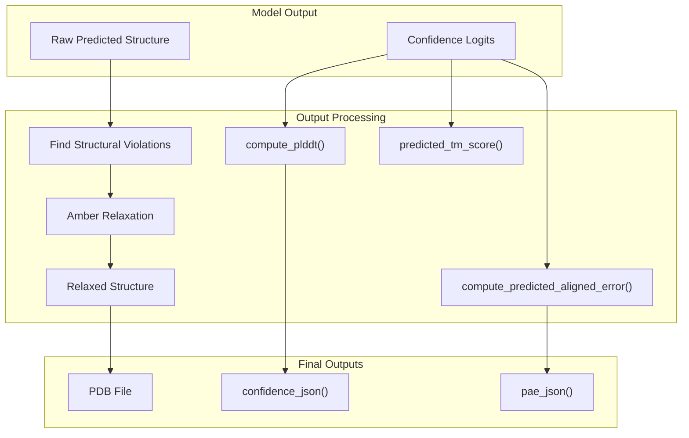
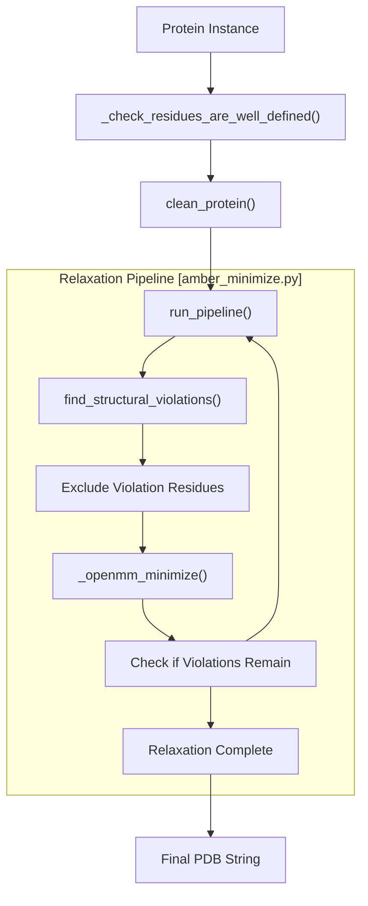
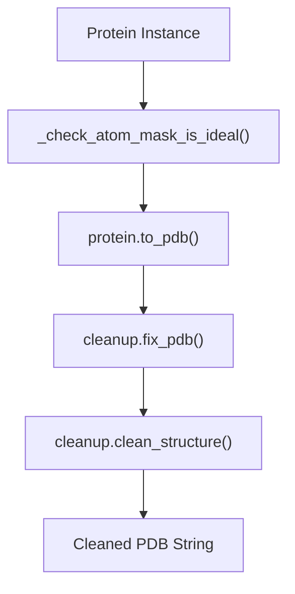
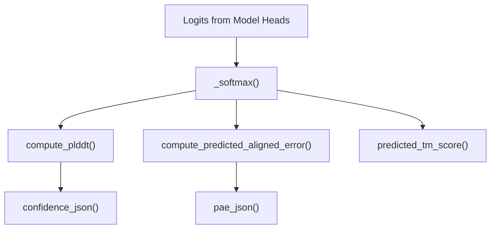

# Output Processing

> **Relevant source files**
> * [alphafold/common/confidence.py](https://github.com/google-deepmind/alphafold/blob/c77e5d2a/alphafold/common/confidence.py)
> * [alphafold/common/confidence_test.py](https://github.com/google-deepmind/alphafold/blob/c77e5d2a/alphafold/common/confidence_test.py)
> * [alphafold/data/parsers.py](https://github.com/google-deepmind/alphafold/blob/c77e5d2a/alphafold/data/parsers.py)
> * [alphafold/data/tools/jackhmmer.py](https://github.com/google-deepmind/alphafold/blob/c77e5d2a/alphafold/data/tools/jackhmmer.py)
> * [alphafold/notebooks/notebook_utils.py](https://github.com/google-deepmind/alphafold/blob/c77e5d2a/alphafold/notebooks/notebook_utils.py)
> * [alphafold/relax/amber_minimize.py](https://github.com/google-deepmind/alphafold/blob/c77e5d2a/alphafold/relax/amber_minimize.py)
> * [alphafold/relax/relax.py](https://github.com/google-deepmind/alphafold/blob/c77e5d2a/alphafold/relax/relax.py)

This page describes how AlphaFold processes and refines its raw predicted protein structures to produce the final outputs. The output processing consists primarily of two main components: structure relaxation (using Amber) and generation of confidence metrics to evaluate prediction quality.

For information about how confidence metrics are calculated in detail, see [Confidence Metrics](/google-deepmind/alphafold/6.1-confidence-metrics). For specifics on the structure relaxation process, see [Structure Relaxation](/google-deepmind/alphafold/6.2-structure-relaxation).

## Overview of Output Processing

Output processing takes the raw structure prediction from AlphaFold's Structure Module and transforms it into refined structures with associated confidence metrics. These steps are critical for producing biologically plausible structures and providing users with information about prediction reliability.

Sources:

* [alphafold/relax/amber_minimize.py L426-L505](https://github.com/google-deepmind/alphafold/blob/c77e5d2a/alphafold/relax/amber_minimize.py#L426-L505)
* [alphafold/common/confidence.py L30-L45](https://github.com/google-deepmind/alphafold/blob/c77e5d2a/alphafold/common/confidence.py#L30-L45)
* [alphafold/common/confidence.py L127-L155](https://github.com/google-deepmind/alphafold/blob/c77e5d2a/alphafold/common/confidence.py#L127-L155)
* [alphafold/common/confidence.py L184-L205](https://github.com/google-deepmind/alphafold/blob/c77e5d2a/alphafold/common/confidence.py#L184-L205)

## Structure Refinement Process

After the AlphaFold model predicts a protein structure, it needs to be refined to resolve any structural violations (like steric clashes) and create a physically plausible model. This is achieved through the `AmberRelaxation` pipeline, which applies energy minimization via OpenMM with restraints to avoid large deviations from the predicted structure.

Sources:

* [alphafold/relax/amber_minimize.py L79-L113](https://github.com/google-deepmind/alphafold/blob/c77e5d2a/alphafold/relax/amber_minimize.py#L79-L113)
* [alphafold/relax/amber_minimize.py L145-L153](https://github.com/google-deepmind/alphafold/blob/c77e5d2a/alphafold/relax/amber_minimize.py#L145-L153)
* [alphafold/relax/amber_minimize.py L162-L191](https://github.com/google-deepmind/alphafold/blob/c77e5d2a/alphafold/relax/amber_minimize.py#L162-L191)
* [alphafold/relax/relax.py L23-L90](https://github.com/google-deepmind/alphafold/blob/c77e5d2a/alphafold/relax/relax.py#L23-L90)

## Structure Cleaning and Preparation

Before relaxation, the predicted structure must be cleaned to ensure compatibility with the OpenMM simulation package. This involves adding missing atoms and ensuring the atom mask is ideal. The `clean_protein` function handles the conversion of a `Protein` instance into a PDB string and fixes it using the `cleanup` module.

Sources:

* [alphafold/relax/amber_minimize.py L155-L161](https://github.com/google-deepmind/alphafold/blob/c77e5d2a/alphafold/relax/amber_minimize.py#L155-L161)
* [alphafold/relax/amber_minimize.py L162-L191](https://github.com/google-deepmind/alphafold/blob/c77e5d2a/alphafold/relax/amber_minimize.py#L162-L191)
* [alphafold/relax/cleanup.py L15-L127](https://github.com/google-deepmind/alphafold/blob/c77e5d2a/alphafold/relax/cleanup.py#L15-L127)

## Structural Violation Detection

A key part of the refinement process is finding and resolving structural violations. The system analyzes the protein structure to identify residues involved in violations, such as steric clashes or bond geometry issues. In `amber_minimize.py`, the system generates an `atom14` representation to perform these checks.

Sources:

* [alphafold/relax/amber_minimize.py L194-L220](https://github.com/google-deepmind/alphafold/blob/c77e5d2a/alphafold/relax/amber_minimize.py#L194-L220)
* [alphafold/relax/amber_minimize.py L320-L366](https://github.com/google-deepmind/alphafold/blob/c77e5d2a/alphafold/relax/amber_minimize.py#L320-L366)

## OpenMM Minimization Process

The actual structure relaxation uses `openmm` to perform energy minimization. It uses the `amber99sb.xml` force field and applies harmonic restraints to atoms (either `non_hydrogen` or `c_alpha`) to maintain the overall predicted fold while allowing local adjustments.

Sources:

* [alphafold/relax/amber_minimize.py L40-L47](https://github.com/google-deepmind/alphafold/blob/c77e5d2a/alphafold/relax/amber_minimize.py#L40-L47)
* [alphafold/relax/amber_minimize.py L49-L77](https://github.com/google-deepmind/alphafold/blob/c77e5d2a/alphafold/relax/amber_minimize.py#L49-L77)
* [alphafold/relax/amber_minimize.py L79-L113](https://github.com/google-deepmind/alphafold/blob/c77e5d2a/alphafold/relax/amber_minimize.py#L79-L113)

## Confidence Metrics Calculation

AlphaFold generates several confidence metrics to help users assess the reliability of predictions:

1. **pLDDT**: Per-residue confidence score (0-100) calculated in `compute_plddt`.
2. **PAE**: Predicted Aligned Error, calculated in `compute_predicted_aligned_error`.
3. **pTM/ipTM**: Predicted TM-score and interface TM-score for complexes, calculated in `predicted_tm_score`.

Sources:

* [alphafold/common/confidence.py L23-L27](https://github.com/google-deepmind/alphafold/blob/c77e5d2a/alphafold/common/confidence.py#L23-L27)
* [alphafold/common/confidence.py L30-L45](https://github.com/google-deepmind/alphafold/blob/c77e5d2a/alphafold/common/confidence.py#L30-L45)
* [alphafold/common/confidence.py L61-L81](https://github.com/google-deepmind/alphafold/blob/c77e5d2a/alphafold/common/confidence.py#L61-L81)
* [alphafold/common/confidence.py L127-L155](https://github.com/google-deepmind/alphafold/blob/c77e5d2a/alphafold/common/confidence.py#L127-L155)
* [alphafold/common/confidence.py L158-L181](https://github.com/google-deepmind/alphafold/blob/c77e5d2a/alphafold/common/confidence.py#L158-L181)
* [alphafold/common/confidence.py L184-L212](https://github.com/google-deepmind/alphafold/blob/c77e5d2a/alphafold/common/confidence.py#L184-L212)

## Output File Generation

The final output includes multiple files representing the structural coordinates and the confidence metrics.

| Output File | Content | Format | Source Function |
| --- | --- | --- | --- |
| `relaxed_model.pdb` | Minimized coordinates | PDB | `AmberRelaxation.process` |
| `confidence.json` | pLDDT and categories | JSON | `confidence_json` |
| `pae.json` | PAE matrix | JSON | `pae_json` |

Sources:

* [alphafold/relax/relax.py L60-L90](https://github.com/google-deepmind/alphafold/blob/c77e5d2a/alphafold/relax/relax.py#L60-L90)
* [alphafold/common/confidence.py L61-L81](https://github.com/google-deepmind/alphafold/blob/c77e5d2a/alphafold/common/confidence.py#L61-L81)
* [alphafold/common/confidence.py L158-L181](https://github.com/google-deepmind/alphafold/blob/c77e5d2a/alphafold/common/confidence.py#L158-L181)

## Technical Implementation Details

### Amber Relaxation Parameters

The `AmberRelaxation` class (defined in `alphafold/relax/relax.py`) manages the refinement pipeline with the following key parameters:

* `max_iterations`: Limit for L-BFGS iterations.
* `tolerance`: Energy tolerance for convergence.
* `stiffness`: Spring constant for heavy atom restraints.
* `max_outer_iterations`: Number of violation-informed iterations (defaulting to iterative procedure if violations persist).

Sources:

* [alphafold/relax/relax.py L23-L58](https://github.com/google-deepmind/alphafold/blob/c77e5d2a/alphafold/relax/relax.py#L23-L58)
* [alphafold/relax/amber_minimize.py L426-L450](https://github.com/google-deepmind/alphafold/blob/c77e5d2a/alphafold/relax/amber_minimize.py#L426-L450)

### Confidence Metric Calculations

Confidence scores are derived from the predicted distribution over distance or error bins:

* **pLDDT**: Uses `PredictedLDDTHead` logits to calculate an expected value of the LDDT per residue.
* **PAE**: Uses `PredictedAlignedErrorHead` logits to calculate expected distance error between residue pairs.
* **Categories**: pLDDT is categorized into 'D' (disordered < 50), 'L' (low < 70), 'M' (medium < 90), and 'H' (high > 90).

Sources:

* [alphafold/common/confidence.py L30-L45](https://github.com/google-deepmind/alphafold/blob/c77e5d2a/alphafold/common/confidence.py#L30-L45)
* [alphafold/common/confidence.py L47-L59](https://github.com/google-deepmind/alphafold/blob/c77e5d2a/alphafold/common/confidence.py#L47-L59)
* [alphafold/common/confidence.py L102-L124](https://github.com/google-deepmind/alphafold/blob/c77e5d2a/alphafold/common/confidence.py#L102-L124)