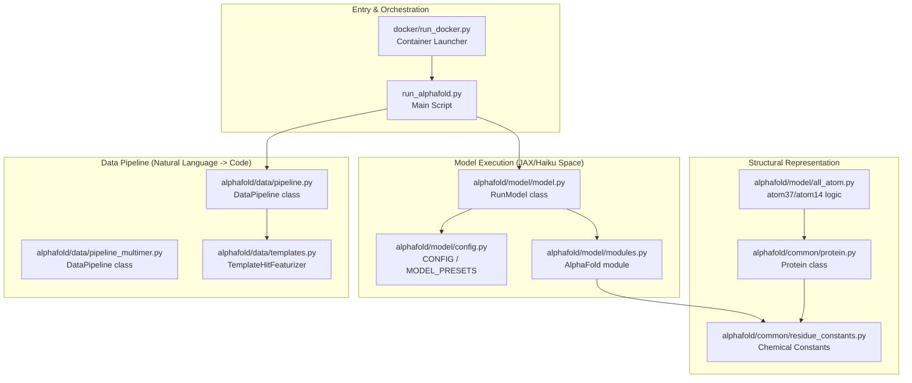
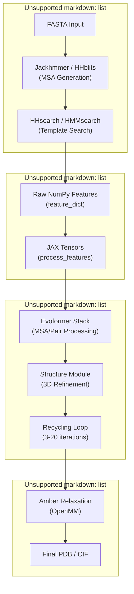

# Overview

> **Relevant source files**
> * [README.md](https://github.com/google-deepmind/alphafold/blob/c77e5d2a/README.md?plain=1)
> * [docs/technical_note_v2.3.0.md](https://github.com/google-deepmind/alphafold/blob/c77e5d2a/docs/technical_note_v2.3.0.md?plain=1)
> * [run_alphafold.py](https://github.com/google-deepmind/alphafold/blob/c77e5d2a/run_alphafold.py)

## Purpose and Scope

This page provides a high-level introduction to the AlphaFold codebase architecture, its purpose, and its overall system design. It serves as the primary entry point for engineers and researchers to understand the prediction pipeline from sequence input to 3D structure.

For detailed technical instructions on environment setup, see **[Installation and Dependencies](/google-deepmind/alphafold/1.1-installation-and-dependencies)**.

## What is AlphaFold?

AlphaFold is a deep learning system developed by Google DeepMind that predicts the 3D structure of a protein from its amino acid sequence. This repository contains the implementation of the inference pipeline for AlphaFold v2, including:

* **Monomer Prediction**: Single-chain protein folding using the CASP14-winning architecture [README.md L5-L7](https://github.com/google-deepmind/alphafold/blob/c77e5d2a/README.md?plain=1#L5-L7)
* **Multimer Prediction**: AlphaFold-Multimer for predicting protein complexes [README.md L11-L14](https://github.com/google-deepmind/alphafold/blob/c77e5d2a/README.md?plain=1#L11-L14)
* **Updated v2.3.0 Models**: Fine-tuned weights with a 2021-09-30 training cutoff and support for larger complexes [docs/technical_note_v2.3.0.md L8-L22](https://github.com/google-deepmind/alphafold/blob/c77e5d2a/docs/technical_note_v2.3.0.md?plain=1#L8-L22)
* **CASP15 Baselines**: Documentation and predictions for the CASP15 assessment [README.md L17-L18](https://github.com/google-deepmind/alphafold/blob/c77e5d2a/README.md?plain=1#L17-L18)

**Sources:** [README.md L1-L28](https://github.com/google-deepmind/alphafold/blob/c77e5d2a/README.md?plain=1#L1-L28)

 [docs/technical_note_v2.3.0.md L1-L51](https://github.com/google-deepmind/alphafold/blob/c77e5d2a/docs/technical_note_v2.3.0.md?plain=1#L1-L51)

## System Architecture

The AlphaFold system is structured as a multi-stage pipeline that transitions from biological sequence data to numerical feature tensors, and finally to geometric 3D coordinates.

### High-Level Code Entity Mapping

The following diagram bridges the high-level functional stages with the specific code entities responsible for them.

**Sources:** [run_alphafold.py L30-L41](https://github.com/google-deepmind/alphafold/blob/c77e5d2a/run_alphafold.py#L30-L41)

 [README.md L139-L145](https://github.com/google-deepmind/alphafold/blob/c77e5d2a/README.md?plain=1#L139-L145)

 [alphafold/model/model.py L38-L50](https://github.com/google-deepmind/alphafold/blob/c77e5d2a/alphafold/model/model.py#L38-L50)

## Prediction Pipeline Flow

The transformation of a FASTA file into a 3D structure follows a linear progression through four major stages.

### Pipeline Execution Diagram

**Sources:** [run_alphafold.py L57-L225](https://github.com/google-deepmind/alphafold/blob/c77e5d2a/run_alphafold.py#L57-L225)

 [docs/technical_note_v2.3.0.md L41-L45](https://github.com/google-deepmind/alphafold/blob/c77e5d2a/docs/technical_note_v2.3.0.md?plain=1#L41-L45)

 [README.md L151-L164](https://github.com/google-deepmind/alphafold/blob/c77e5d2a/README.md?plain=1#L151-L164)

## Core Components

### 1. Data Pipeline

The data pipeline is responsible for searching massive genetic databases (BFD, MGnify, UniRef90, PDB) to find evolutionary conserved patterns. It uses tools like `jackhmmer`, `hhblits`, and `hhsearch` to generate Multiple Sequence Alignments (MSAs) and structural templates [run_alphafold.py L71-L113](https://github.com/google-deepmind/alphafold/blob/c77e5d2a/run_alphafold.py#L71-L113)

### 2. Model Architecture

The neural network, implemented in JAX and Haiku, consists of the **Evoformer** (which processes MSA and residue-pair representations) and the **Structure Module** (which predicts 3D coordinates using Invariant Point Attention). The system supports different `model_preset` options such as `monomer`, `monomer_ptm`, and `multimer` [run_alphafold.py L168-L175](https://github.com/google-deepmind/alphafold/blob/c77e5d2a/run_alphafold.py#L168-L175)

### 3. Structural Representation

AlphaFold uses specialized representations like **atom37** (a dense representation of all heavy atoms) and **atom14** (an efficient representation for loss calculations). These are defined in `residue_constants.py` and managed via the `Protein` dataclass [run_alphafold.py L30-L32](https://github.com/google-deepmind/alphafold/blob/c77e5d2a/run_alphafold.py#L30-L32)

### 4. Relaxation and Scoring

Predicted structures can be "relaxed" using the Amber force field to resolve stereochemical violations [run_alphafold.py L50-L55](https://github.com/google-deepmind/alphafold/blob/c77e5d2a/run_alphafold.py#L50-L55)

 The model also outputs confidence metrics:

* **pLDDT**: Local confidence per residue.
* **pTM / ipTM**: Global confidence for the structure and interface [docs/technical_note_v2.3.0.md L47-L51](https://github.com/google-deepmind/alphafold/blob/c77e5d2a/docs/technical_note_v2.3.0.md?plain=1#L47-L51)

**Sources:** [run_alphafold.py L30-L41](https://github.com/google-deepmind/alphafold/blob/c77e5d2a/run_alphafold.py#L30-L41)

 [README.md L151-L164](https://github.com/google-deepmind/alphafold/blob/c77e5d2a/README.md?plain=1#L151-L164)

 [docs/technical_note_v2.3.0.md L1-L51](https://github.com/google-deepmind/alphafold/blob/c77e5d2a/docs/technical_note_v2.3.0.md?plain=1#L1-L51)

## Codebase Organization

| Directory | Description |
| --- | --- |
| `alphafold/common/` | Shared constants (residues, atoms) and basic data structures (`Protein`). |
| `alphafold/data/` | Logic for MSA generation, template searching, and multimer pairing. |
| `alphafold/model/` | JAX/Haiku implementation of the Evoformer, Structure Module, and model configs. |
| `alphafold/relax/` | Interface for OpenMM and Amber-based structure minimization. |
| `docker/` | Dockerfile and `run_docker.py` for environment isolation. |
| `scripts/` | Shell scripts for downloading the required 2.6TB+ genetic databases. |

**Sources:** [README.md L38-L149](https://github.com/google-deepmind/alphafold/blob/c77e5d2a/README.md?plain=1#L38-L149)

 [run_alphafold.py L15-L41](https://github.com/google-deepmind/alphafold/blob/c77e5d2a/run_alphafold.py#L15-L41)

## Next Steps

For detailed information on how to set up the environment and its requirements, please see the child page:

* **[Installation and Dependencies](/google-deepmind/alphafold/1.1-installation-and-dependencies)** — Detailed breakdown of `setup.py`, `requirements.txt`, and system prerequisites.

**Sources:** [README.md L38-L149](https://github.com/google-deepmind/alphafold/blob/c77e5d2a/README.md?plain=1#L38-L149)