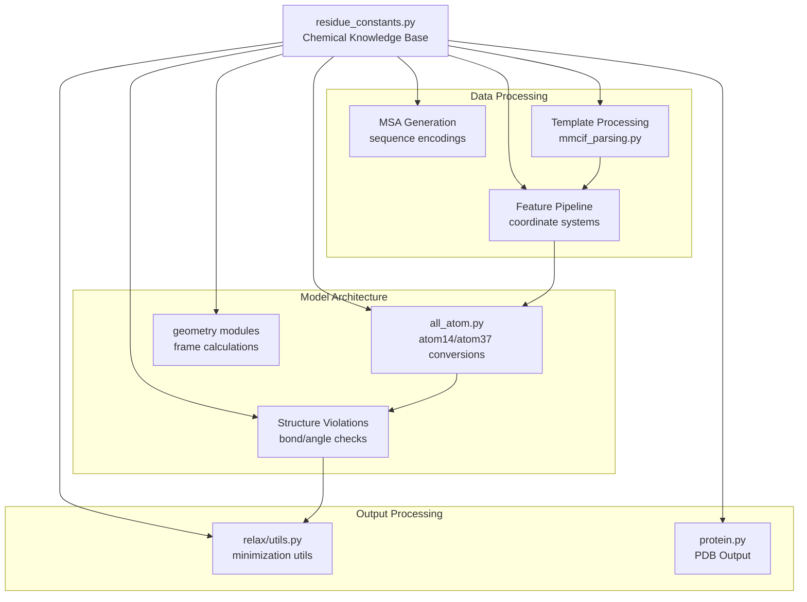
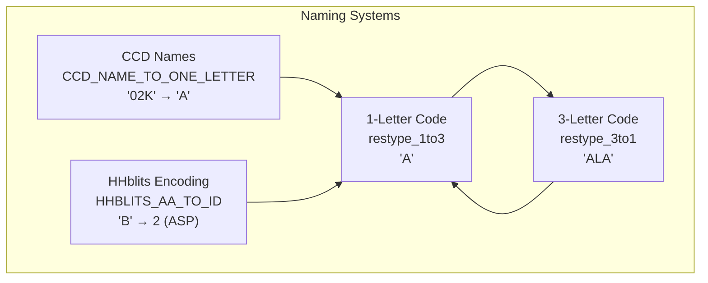
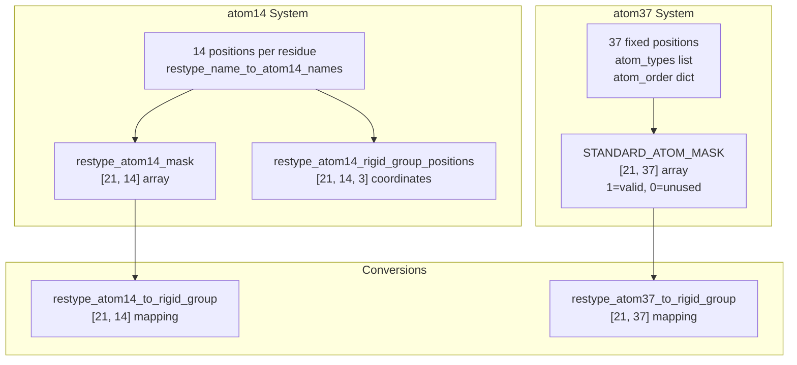
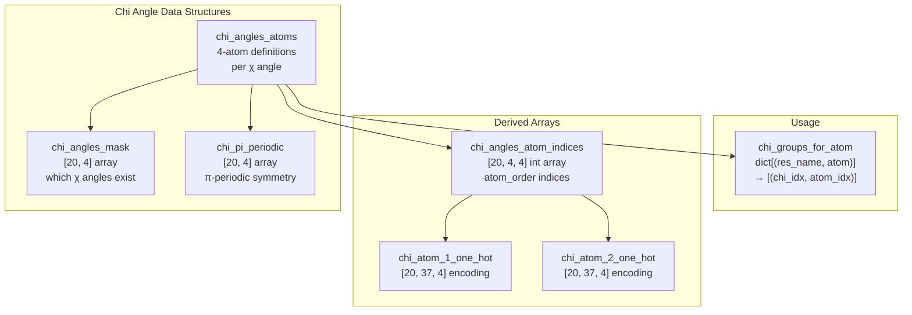
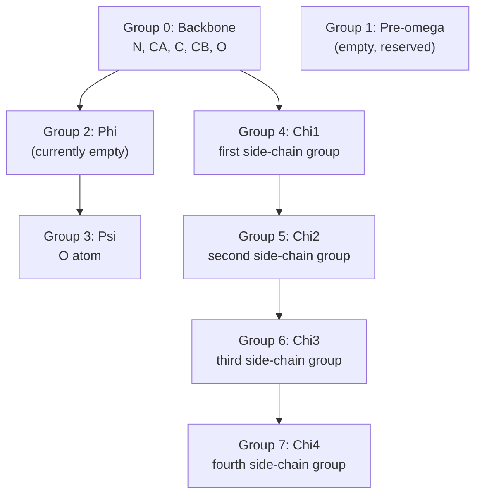

# Residue Constants

> **Relevant source files**
> * [alphafold/common/protein.py](https://github.com/google-deepmind/alphafold/blob/c77e5d2a/alphafold/common/protein.py)
> * [alphafold/common/residue_constants.py](https://github.com/google-deepmind/alphafold/blob/c77e5d2a/alphafold/common/residue_constants.py)
> * [alphafold/data/mmcif_parsing.py](https://github.com/google-deepmind/alphafold/blob/c77e5d2a/alphafold/data/mmcif_parsing.py)
> * [alphafold/data/templates.py](https://github.com/google-deepmind/alphafold/blob/c77e5d2a/alphafold/data/templates.py)
> * [alphafold/model/tf/protein_features.py](https://github.com/google-deepmind/alphafold/blob/c77e5d2a/alphafold/model/tf/protein_features.py)
> * [alphafold/relax/utils.py](https://github.com/google-deepmind/alphafold/blob/c77e5d2a/alphafold/relax/utils.py)

## Purpose and Scope

The `residue_constants` module ([alphafold/common/residue_constants.py](https://github.com/google-deepmind/alphafold/blob/c77e5d2a/alphafold/common/residue_constants.py)

) serves as AlphaFold's comprehensive chemical knowledge base for protein structure. It defines all amino acid properties, atom types, stereochemical parameters, and naming conventions required for structure prediction and validation. This module provides the fundamental constants used throughout feature processing, geometric calculations, structure building, and validation.

For information about geometric transformations and frame calculations using these constants, see [Atom Representations and Geometry](/google-deepmind/alphafold/5.2-atom-representations-and-geometry). For structure refinement that validates against these constants, see [Structure Relaxation](/google-deepmind/alphafold/6.2-structure-relaxation).

**Sources:** [alphafold/common/residue_constants.py L1-L1198](https://github.com/google-deepmind/alphafold/blob/c77e5d2a/alphafold/common/residue_constants.py#L1-L1198)

## Overview: Role in the System



The `residue_constants` module is dependency-free and provides constants to all major subsystems. It contains no algorithmic code—only data definitions.

**Sources:** [alphafold/common/residue_constants.py L15-L26](https://github.com/google-deepmind/alphafold/blob/c77e5d2a/alphafold/common/residue_constants.py#L15-L26)

 [alphafold/data/mmcif_parsing.py L23](https://github.com/google-deepmind/alphafold/blob/c77e5d2a/alphafold/data/mmcif_parsing.py#L23-L23)

 [alphafold/relax/utils.py L17](https://github.com/google-deepmind/alphafold/blob/c77e5d2a/alphafold/relax/utils.py#L17-L17)

 [alphafold/common/protein.py L23](https://github.com/google-deepmind/alphafold/blob/c77e5d2a/alphafold/common/protein.py#L23-L23)

## Amino Acid Encoding Systems

### Standard Residue Types

The module defines the canonical 20 amino acids in alphabetical order by their 3-letter codes:

```css
restypes = ['A', 'R', 'N', 'D', 'C', 'Q', 'E', 'G', 'H', 'I',             'L', 'K', 'M', 'F', 'P', 'S', 'T', 'W', 'Y', 'V']restype_order = {restype: i for i, restype in enumerate(restypes)}restype_num = 20unk_restype_index = 20  # Index for unknown amino acids
```

**Sources:** [alphafold/common/residue_constants.py L573-L581](https://github.com/google-deepmind/alphafold/blob/c77e5d2a/alphafold/common/residue_constants.py#L573-L581)

### Naming Convention Mappings



| Mapping | Definition | Purpose |
| --- | --- | --- |
| `restype_1to3` | 1-letter → 3-letter (e.g., 'A' → 'ALA') | Standard conversion |
| `restype_3to1` | 3-letter → 1-letter (inverse of above) | PDB parsing |
| `CCD_NAME_TO_ONE_LETTER` | Chemical Component Dictionary names → 1-letter | mmCIF parsing for non-standard residues |
| `HHBLITS_AA_TO_ID` | HHblits codes → integer IDs | MSA alignment processing |
| `ID_TO_HHBLITS_AA` | Integer IDs → HHblits codes | Inverse MSA mapping |

The HHblits mapping follows specific conventions: 'B'→'D', 'J'/'O'→'X', 'U'→'C', 'Z'→'E'. Codes 'X' (any amino acid) and '-' (gap) are mapped to indices 20 and 21.

**Sources:** [alphafold/common/residue_constants.py L632-L653](https://github.com/google-deepmind/alphafold/blob/c77e5d2a/alphafold/common/residue_constants.py#L632-L653)

 [alphafold/common/residue_constants.py L685-L689](https://github.com/google-deepmind/alphafold/blob/c77e5d2a/alphafold/common/residue_constants.py#L685-L689)

 [alphafold/common/residue_constants.py L698-L765](https://github.com/google-deepmind/alphafold/blob/c77e5d2a/alphafold/common/residue_constants.py#L698-L765)

 [alphafold/common/residue_constants.py L987-L1197](https://github.com/google-deepmind/alphafold/blob/c77e5d2a/alphafold/common/residue_constants.py#L987-L1197)

## Atom Representation Systems

### The atom37 Representation

AlphaFold uses two primary atom encoding schemes. The **atom37** representation is a fixed-size array that can accommodate any amino acid:

```
atom_types = ['N', 'CA', 'C', 'CB', 'O', 'CG', 'CG1', 'CG2', 'OG', 'OG1', 'SG', 'CD',              'CD1', 'CD2', 'ND1', 'ND2', 'OD1', 'OD2', 'SD', 'CE', 'CE1', 'CE2', 'CE3',              'NE', 'NE1', 'NE2', 'OE1', 'OE2', 'CH2', 'NH1', 'NH2', 'OH', 'CZ', 'CZ2',              'CZ3', 'NZ', 'OXT']atom_order = {atom_type: i for i, atom_type in enumerate(atom_types)}atom_type_num = 37
```

Each residue type has a specific subset of these 37 positions occupied, defined in `STANDARD_ATOM_MASK` ([alphafold/common/residue_constants.py L768-L781](https://github.com/google-deepmind/alphafold/blob/c77e5d2a/alphafold/common/residue_constants.py#L768-L781)

).

**Sources:** [alphafold/common/residue_constants.py L526-L534](https://github.com/google-deepmind/alphafold/blob/c77e5d2a/alphafold/common/residue_constants.py#L526-L534)

### The atom14 Representation

The **atom14** representation is a compact encoding that stores up to 14 atoms per residue:

```css
restype_name_to_atom14_names = {    'ALA': ['N', 'CA', 'C', 'O', 'CB', '', '', '', '', '', '', '', '', ''],    'ARG': ['N', 'CA', 'C', 'O', 'CB', 'CG', 'CD', 'NE', 'CZ', 'NH1', 'NH2', '', '', ''],    'TRP': ['N', 'CA', 'C', 'O', 'CB', 'CG', 'CD1', 'CD2', 'NE1', 'CE2', 'CE3', 'CZ2', 'CZ3', 'CH2'],    # ... (all 20 amino acids + 'UNK')}
```

Empty strings indicate unused positions. The atom14 representation is more memory-efficient for neural network operations where all residues are processed in parallel.

**Sources:** [alphafold/common/residue_constants.py L541-L564](https://github.com/google-deepmind/alphafold/blob/c77e5d2a/alphafold/common/residue_constants.py#L541-L564)

### Atom Representation Comparison



Both systems have associated rigid group mappings that specify which rotation group each atom belongs to (discussed in the next section).

**Sources:** [alphafold/common/residue_constants.py L851-L857](https://github.com/google-deepmind/alphafold/blob/c77e5d2a/alphafold/common/residue_constants.py#L851-L857)

 [alphafold/common/residue_constants.py L860-L877](https://github.com/google-deepmind/alphafold/blob/c77e5d2a/alphafold/common/residue_constants.py#L860-L877)

## Chi Angles and Side-Chain Torsion

### Chi Angle Definition

Chi (χ) angles describe side-chain conformations via dihedral angles. Each angle is defined by four atoms:

```css
chi_angles_atoms = {    'ALA': [],  # No side-chain torsions    'ARG': [        ['N', 'CA', 'CB', 'CG'],    # χ1        ['CA', 'CB', 'CG', 'CD'],   # χ2        ['CB', 'CG', 'CD', 'NE'],   # χ3        ['CG', 'CD', 'NE', 'CZ'],   # χ4    ],    'SER': [['N', 'CA', 'CB', 'OG']],  # χ1 only    # ... (all 20 amino acids)}
```

**Sources:** [alphafold/common/residue_constants.py L34-L78](https://github.com/google-deepmind/alphafold/blob/c77e5d2a/alphafold/common/residue_constants.py#L34-L78)

### Chi Angle Properties



| Array | Shape | Purpose |
| --- | --- | --- |
| `chi_angles_mask` | `[20, 4]` | Binary mask: 1.0 if χ angle exists for this residue type |
| `chi_pi_periodic` | `[20, 4]` | Binary mask: 1.0 if χ angle is π-periodic (symmetric under 180° rotation) |
| `chi_angles_atom_indices` | `[20, 4, 4]` | Atom indices for computing each χ angle |
| `chi_atom_1_one_hot` | `[20, 37, 4]` | One-hot encoding of 2nd atom in χ definition |
| `chi_atom_2_one_hot` | `[20, 37, 4]` | One-hot encoding of 3rd atom in χ definition |

Pi-periodic angles occur in residues with symmetric side chains (ASP, GLU, PHE, TYR χ2).

**Sources:** [alphafold/common/residue_constants.py L82-L103](https://github.com/google-deepmind/alphafold/blob/c77e5d2a/alphafold/common/residue_constants.py#L82-L103)

 [alphafold/common/residue_constants.py L107-L129](https://github.com/google-deepmind/alphafold/blob/c77e5d2a/alphafold/common/residue_constants.py#L107-L129)

 [alphafold/common/residue_constants.py L786-L828](https://github.com/google-deepmind/alphafold/blob/c77e5d2a/alphafold/common/residue_constants.py#L786-L828)

## Rigid Groups and Coordinate Frames

### Rigid Group Hierarchy

AlphaFold represents protein structure using 8 rigid groups per residue, defined by backbone and side-chain torsion angles:



Each atom is assigned to exactly one rigid group. Atoms in a rigid group move together when the corresponding torsion angle rotates.

**Sources:** [alphafold/common/residue_constants.py L131-L142](https://github.com/google-deepmind/alphafold/blob/c77e5d2a/alphafold/common/residue_constants.py#L131-L142)

### Rigid Group Atom Positions

The `rigid_group_atom_positions` dictionary defines 3D coordinates for each atom relative to its rigid group's local frame:

```css
rigid_group_atom_positions = {    'ALA': [        ['N', 0, (-0.525, 1.363, 0.000)],   # Group 0: backbone        ['CA', 0, (0.000, 0.000, 0.000)],   # Group 0: backbone        ['C', 0, (1.526, -0.000, -0.000)],  # Group 0: backbone        ['CB', 0, (-0.529, -0.774, -1.205)],# Group 0: backbone        ['O', 3, (0.627, 1.062, 0.000)],    # Group 3: psi    ],    # ... (all 20 amino acids with their atom positions)}
```

Format: `[atom_name, group_idx, (x, y, z)]` where coordinates are in Ångströms relative to the rotation axis endpoint. The local frame is oriented such that:

* x-axis: direction of rotation axis
* y-axis: perpendicular to x, placing the angle-defining atom in xy-plane with positive y

**Sources:** [alphafold/common/residue_constants.py L143-L352](https://github.com/google-deepmind/alphafold/blob/c77e5d2a/alphafold/common/residue_constants.py#L143-L352)

### Frame Transformations

The module computes default 4×4 transformation matrices between consecutive rigid groups:

```
restype_rigid_group_default_frame = np.zeros([21, 8, 4, 4], dtype=np.float32)
```

Shape: `[21 residue types, 8 groups, 4×4 homogeneous transform]`

These are computed by `_make_rigid_group_constants()` using:

1. Backbone-to-backbone: identity
2. Backbone-to-phi: based on N-CA vector
3. Backbone-to-psi: based on C-CA vector
4. Backbone-to-chi1: based on chi1 atom positions
5. Chi(n)-to-chi(n+1): based on chi angle axis

**Sources:** [alphafold/common/residue_constants.py L857](https://github.com/google-deepmind/alphafold/blob/c77e5d2a/alphafold/common/residue_constants.py#L857-L857)

 [alphafold/common/residue_constants.py L860-L936](https://github.com/google-deepmind/alphafold/blob/c77e5d2a/alphafold/common/residue_constants.py#L860-L936)

## Stereochemical Properties

### Bond Lengths and Angles from Literature

The function `load_stereo_chemical_props()` loads ideal bond lengths and angles from `stereo_chemical_props.txt`:

```python
Bond = collections.namedtuple('Bond', ['atom1_name', 'atom2_name', 'length', 'stddev'])BondAngle = collections.namedtuple('BondAngle',     ['atom1_name', 'atom2_name', 'atom3name', 'angle_rad', 'stddev']) residue_bonds: Mapping[str, List[Bond]]residue_virtual_bonds: Mapping[str, List[Bond]]  # Computed from angles via law of cosinesresidue_bond_angles: Mapping[str, List[BondAngle]]
```

The function returns three dictionaries mapping residue names to their stereochemical constraints. Virtual bonds are distances between atoms that don't share a direct bond but are connected via an angle.

**Sources:** [alphafold/common/residue_constants.py L403-L511](https://github.com/google-deepmind/alphafold/blob/c77e5d2a/alphafold/common/residue_constants.py#L403-L511)

### Inter-Residue Bonds

Constants for peptide bonds between consecutive residues:

| Parameter | General | Proline | Units |
| --- | --- | --- | --- |
| C-N bond length | 1.329 | 1.341 | Å |
| C-N bond stddev | 0.014 | 0.016 | Å |
| cos(∠C-N-CA) | -0.5203 | 0.0353 | - |
| cos(∠CA-C-N) | -0.4473 | 0.0311 | - |

Note: Proline has different geometry due to its cyclic structure.

**Sources:** [alphafold/common/residue_constants.py L514-L521](https://github.com/google-deepmind/alphafold/blob/c77e5d2a/alphafold/common/residue_constants.py#L514-L521)

### Van der Waals Radii and Clash Detection

```css
van_der_waals_radius = {    'C': 1.7,   # Carbon    'N': 1.55,  # Nitrogen    'O': 1.52,  # Oxygen    'S': 1.8,   # Sulfur}
```

These radii are used in `make_atom14_dists_bounds()` to compute acceptable distance bounds between atoms for clash detection. The function produces:

```css
{    'lower_bound': restype_atom14_bond_lower_bound,  # [21, 14, 14]    'upper_bound': restype_atom14_bond_upper_bound,  # [21, 14, 14]    'stddev': restype_atom14_bond_stddev,            # [21, 14, 14]}
```

Default clash distance: `atom1_radius + atom2_radius - overlap_tolerance` (default overlap_tolerance=1.5 Å)

**Sources:** [alphafold/common/residue_constants.py L395-L401](https://github.com/google-deepmind/alphafold/blob/c77e5d2a/alphafold/common/residue_constants.py#L395-L401)

 [alphafold/common/residue_constants.py L939-L983](https://github.com/google-deepmind/alphafold/blob/c77e5d2a/alphafold/common/residue_constants.py#L939-L983)

## Atom Naming Conventions

### Residue Atom Lists

The `residue_atoms` dictionary lists all heavy atoms (excluding hydrogen) for each residue type using PDB naming conventions:

```css
residue_atoms = {    'ALA': ['C', 'CA', 'CB', 'N', 'O'],    'ARG': ['C', 'CA', 'CB', 'CG', 'CD', 'CZ', 'N', 'NE', 'O', 'NH1', 'NH2'],    # ... (all 20 amino acids)}
```

**Sources:** [alphafold/common/residue_constants.py L357-L378](https://github.com/google-deepmind/alphafold/blob/c77e5d2a/alphafold/common/residue_constants.py#L357-L378)

### Ambiguous Atom Naming

Due to symmetries, some atoms have ambiguous naming:

```css
residue_atom_renaming_swaps = {    'ASP': {'OD1': 'OD2'},                      # Carboxylate oxygens    'GLU': {'OE1': 'OE2'},                      # Carboxylate oxygens    'PHE': {'CD1': 'CD2', 'CE1': 'CE2'},       # Phenyl ring    'TYR': {'CD1': 'CD2', 'CE1': 'CE2'},       # Phenyl ring}
```

These mappings define valid atom name swaps that produce equivalent structures due to chemical symmetry.

**Sources:** [alphafold/common/residue_constants.py L382-L393](https://github.com/google-deepmind/alphafold/blob/c77e5d2a/alphafold/common/residue_constants.py#L382-L393)

### Atom ID to Element Type

```python
def atom_id_to_type(atom_id: str) -> str:    """Convert atom ID to atom type for standard protein residues."""    if atom_id.startswith('C'): return 'C'    elif atom_id.startswith('N'): return 'N'    elif atom_id.startswith('O'): return 'O'    elif atom_id.startswith('H'): return 'H'    elif atom_id.startswith('S'): return 'S'
```

Simple string-prefix-based classification for element identification.

**Sources:** [alphafold/common/residue_constants.py L659-L682](https://github.com/google-deepmind/alphafold/blob/c77e5d2a/alphafold/common/residue_constants.py#L659-L682)

## Utility Functions

### Sequence to One-Hot Encoding

```python
def sequence_to_onehot(    sequence: str,     mapping: Mapping[str, int],     map_unknown_to_x: bool = False) -> np.ndarray:
```

Converts amino acid sequences to one-hot encoded matrices. Used throughout the data pipeline for sequence feature representation.

**Sources:** [alphafold/common/residue_constants.py L587-L629](https://github.com/google-deepmind/alphafold/blob/c77e5d2a/alphafold/common/residue_constants.py#L587-L629)

### Special Residue Categories

```css
unk_restype = 'UNK'                        # Unknown residue typeresnames = [restype_1to3[r] for r in restypes] + [unk_restype]resname_to_idx = {resname: i for i, resname in enumerate(resnames)} PROTEIN_CHAIN: Final[str] = 'polypeptide(L)'POLYMER_CHAIN: Final[str] = 'polymer'
```

Constants for handling unknown residues and chain type identification in mmCIF files.

**Sources:** [alphafold/common/residue_constants.py L692-L695](https://github.com/google-deepmind/alphafold/blob/c77e5d2a/alphafold/common/residue_constants.py#L692-L695)

 [alphafold/common/residue_constants.py L655-L656](https://github.com/google-deepmind/alphafold/blob/c77e5d2a/alphafold/common/residue_constants.py#L655-L656)

## Integration with Other Modules

### Usage in mmCIF Parsing

The `mmcif_parsing.py` module uses `CCD_NAME_TO_ONE_LETTER` to convert non-standard residue names during parsing:

```
code = residue_constants.CCD_NAME_TO_ONE_LETTER.get(monomer.id, 'X')
```

This enables parsing of PDB structures containing modified or non-standard amino acids into the standard 1-letter representation.

**Sources:** [alphafold/data/mmcif_parsing.py L271-L272](https://github.com/google-deepmind/alphafold/blob/c77e5d2a/alphafold/data/mmcif_parsing.py#L271-L272)

### Usage in Relaxation

The `relax/utils.py` module uses atom constants for B-factor manipulation and coordinate validation:

```
atom.bfactor = bfactors[idx, residue_constants.atom_order['CA']]oxt = residue_constants.atom_order['OXT']
```

Also validates atom masks using `atom_type_num`:

```
if bfactors.shape[-1] != residue_constants.atom_type_num:    raise ValueError(...)
```

**Sources:** [alphafold/relax/utils.py L34](https://github.com/google-deepmind/alphafold/blob/c77e5d2a/alphafold/relax/utils.py#L34-L34)

 [alphafold/relax/utils.py L55](https://github.com/google-deepmind/alphafold/blob/c77e5d2a/alphafold/relax/utils.py#L55-L55)

 [alphafold/relax/utils.py L69](https://github.com/google-deepmind/alphafold/blob/c77e5d2a/alphafold/relax/utils.py#L69-L69)

### Usage in Protein Data Type

The `Protein` class in `alphafold/common/protein.py` relies on `residue_constants` for mapping atom names to their standard indices and filtering valid atoms:

```markdown
res_shortname = residue_constants.restype_3to1.get(res.resname, 'X')restype_idx = residue_constants.restype_order.get(    res_shortname, residue_constants.restype_num)# ...if atom.name not in residue_constants.atom_types:    continuepos[residue_constants.atom_order[atom.name]] = atom.coord
```

**Sources:** [alphafold/common/protein.py L144-L154](https://github.com/google-deepmind/alphafold/blob/c77e5d2a/alphafold/common/protein.py#L144-L154)

## Key Constants Reference Table

| Constant | Type | Shape/Size | Purpose |
| --- | --- | --- | --- |
| `restypes` | list[str] | 20 | 1-letter amino acid codes (alphabetically sorted) |
| `restype_num` | int | 20 | Number of standard amino acids |
| `atom_types` | list[str] | 37 | All possible heavy atom names |
| `atom_type_num` | int | 37 | Size of atom37 representation |
| `chi_angles_atoms` | dict | 20 residues | Four-atom definitions for each χ angle |
| `chi_angles_mask` | list | [20, 4] | Binary mask for valid χ angles |
| `rigid_group_atom_positions` | dict | 20 residues | 3D coordinates in local frames |
| `restype_atom14_to_rigid_group` | np.ndarray | [21, 14] | Rigid group assignment for atom14 |
| `restype_atom37_to_rigid_group` | np.ndarray | [21, 37] | Rigid group assignment for atom37 |
| `restype_rigid_group_default_frame` | np.ndarray | [21, 8, 4, 4] | Transformation matrices between groups |
| `ca_ca` | float | - | Distance between consecutive Cα atoms (3.802 Å) |
| `van_der_waals_radius` | dict | 4 elements | Atomic radii for C, N, O, S |
| `CCD_NAME_TO_ONE_LETTER` | dict | ~987 entries | mmCIF residue name mapping |
| `HHBLITS_AA_TO_ID` | dict | 22 entries | HHblits to integer encoding |

**Sources:** [alphafold/common/residue_constants.py L28-L29](https://github.com/google-deepmind/alphafold/blob/c77e5d2a/alphafold/common/residue_constants.py#L28-L29)

 [alphafold/common/residue_constants.py L573-L580](https://github.com/google-deepmind/alphafold/blob/c77e5d2a/alphafold/common/residue_constants.py#L573-L580)

 [alphafold/common/residue_constants.py L526-L534](https://github.com/google-deepmind/alphafold/blob/c77e5d2a/alphafold/common/residue_constants.py#L526-L534)

 [alphafold/common/residue_constants.py L82-L103](https://github.com/google-deepmind/alphafold/blob/c77e5d2a/alphafold/common/residue_constants.py#L82-L103)

 [alphafold/common/residue_constants.py L143-L352](https://github.com/google-deepmind/alphafold/blob/c77e5d2a/alphafold/common/residue_constants.py#L143-L352)

 [alphafold/common/residue_constants.py L851-L857](https://github.com/google-deepmind/alphafold/blob/c77e5d2a/alphafold/common/residue_constants.py#L851-L857)

 [alphafold/common/residue_constants.py L395-L401](https://github.com/google-deepmind/alphafold/blob/c77e5d2a/alphafold/common/residue_constants.py#L395-L401)

 [alphafold/common/residue_constants.py L987-L1197](https://github.com/google-deepmind/alphafold/blob/c77e5d2a/alphafold/common/residue_constants.py#L987-L1197)

 [alphafold/common/residue_constants.py L705-L733](https://github.com/google-deepmind/alphafold/blob/c77e5d2a/alphafold/common/residue_constants.py#L705-L733)