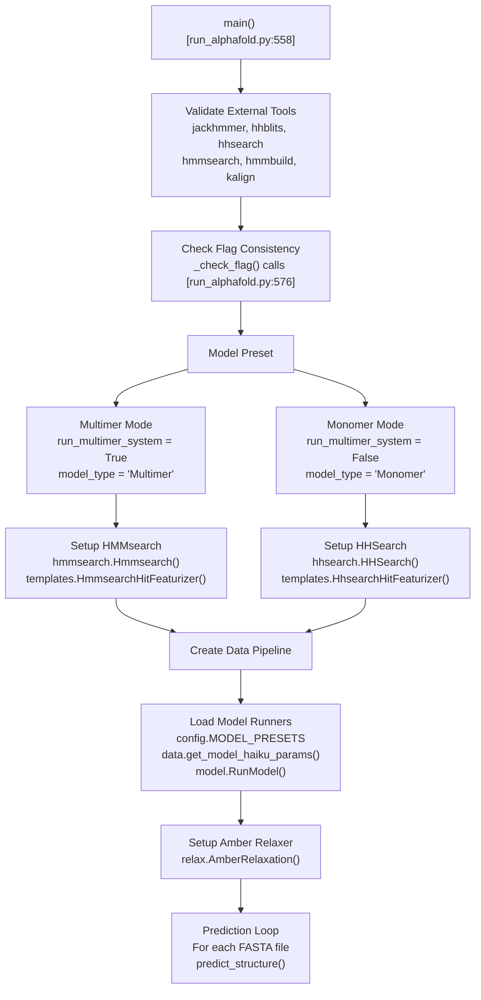
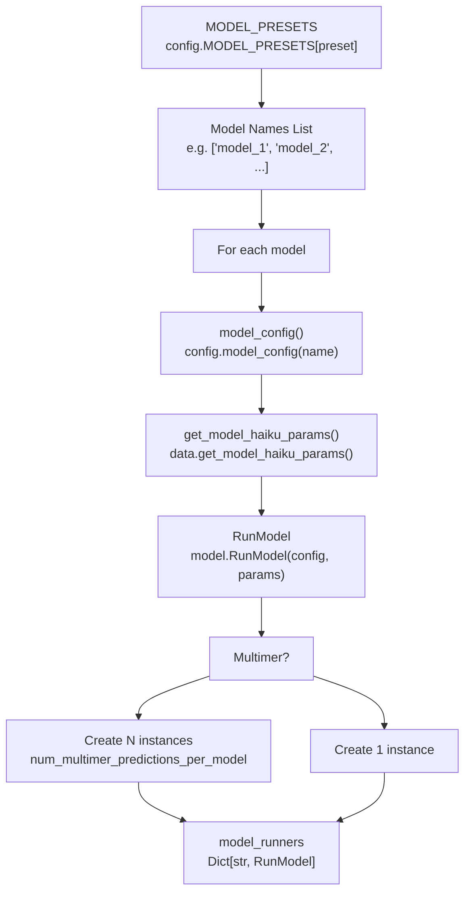
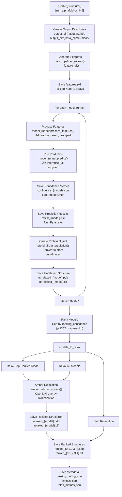

# Running AlphaFold

> **Relevant source files**
> * [docker/run_docker.py](https://github.com/google-deepmind/alphafold/blob/c77e5d2a/docker/run_docker.py)
> * [run_alphafold.py](https://github.com/google-deepmind/alphafold/blob/c77e5d2a/run_alphafold.py)
> * [run_alphafold_test.py](https://github.com/google-deepmind/alphafold/blob/c77e5d2a/run_alphafold_test.py)

This page describes the main execution pipeline for AlphaFold predictions via the `run_alphafold.py` script. It covers the prediction workflow from FASTA input through feature generation, model inference, structure relaxation, and output generation.

For Docker containerization and environment setup, see [Docker Environment](/google-deepmind/alphafold/2.1-docker-environment). For database installation and configuration, see [Database Setup](/google-deepmind/alphafold/2.2-database-setup). For a detailed reference of all command-line flags and configuration options, see [Command-Line Interface](/google-deepmind/alphafold/2.4-command-line-interface).

---

## Overview

The AlphaFold prediction pipeline is orchestrated by `run_alphafold.py`, which serves as the main entry point for structure prediction [run_alphafold.py L15](https://github.com/google-deepmind/alphafold/blob/c77e5d2a/run_alphafold.py#L15-L15)

 The script accepts FASTA files as input and produces predicted protein structures along with confidence metrics and auxiliary outputs [run_alphafold.py L57-L65](https://github.com/google-deepmind/alphafold/blob/c77e5d2a/run_alphafold.py#L57-L65)

The execution flow follows this sequence:

1. **Initialization**: Parse command-line flags and validate configuration [run_alphafold.py L558-L610](https://github.com/google-deepmind/alphafold/blob/c77e5d2a/run_alphafold.py#L558-L610)
2. **Pipeline Setup**: Initialize data pipeline for either monomer or multimer mode [run_alphafold.py L611-L667](https://github.com/google-deepmind/alphafold/blob/c77e5d2a/run_alphafold.py#L611-L667)
3. **Model Loading**: Load model configurations and pre-trained parameters [run_alphafold.py L669-L686](https://github.com/google-deepmind/alphafold/blob/c77e5d2a/run_alphafold.py#L669-L686)
4. **Feature Generation**: Process input sequences to generate model-ready features [run_alphafold.py L367-L377](https://github.com/google-deepmind/alphafold/blob/c77e5d2a/run_alphafold.py#L367-L377)
5. **Model Inference**: Run predictions using one or more models with different random seeds [run_alphafold.py L385-L446](https://github.com/google-deepmind/alphafold/blob/c77e5d2a/run_alphafold.py#L385-L446)
6. **Structure Refinement**: Apply Amber relaxation to improve local geometry [run_alphafold.py L481-L514](https://github.com/google-deepmind/alphafold/blob/c77e5d2a/run_alphafold.py#L481-L514)
7. **Output Generation**: Rank predictions and save results in multiple formats [run_alphafold.py L521-L551](https://github.com/google-deepmind/alphafold/blob/c77e5d2a/run_alphafold.py#L521-L551)

**Sources**: [run_alphafold.py L15-L733](https://github.com/google-deepmind/alphafold/blob/c77e5d2a/run_alphafold.py#L15-L733)

---

## Main Entry Point and Configuration

### Script Initialization

The `main()` function [run_alphafold.py L558-L717](https://github.com/google-deepmind/alphafold/blob/c77e5d2a/run_alphafold.py#L558-L717)

 serves as the entry point and performs the following initialization steps:

### Execution Flow Diagram

Title: AlphaFold Execution Flow



**Sources**: [run_alphafold.py L558-L717](https://github.com/google-deepmind/alphafold/blob/c77e5d2a/run_alphafold.py#L558-L717)

### Pipeline Mode Selection

The script supports two execution modes determined by the `--model_preset` flag [run_alphafold.py L169-L175](https://github.com/google-deepmind/alphafold/blob/c77e5d2a/run_alphafold.py#L169-L175)

:

| Mode | Model Preset Values | Template Search | Pairing Database | Data Pipeline Class |
| --- | --- | --- | --- | --- |
| **Monomer** | `monomer`, `monomer_casp14`, `monomer_ptm` | HHsearch on PDB70 | N/A | `pipeline.DataPipeline` |
| **Multimer** | `multimer` | HMMsearch on PDB seqres | UniProt | `pipeline_multimer.DataPipeline` |

The mode selection logic occurs at [run_alphafold.py L585-L599](https://github.com/google-deepmind/alphafold/blob/c77e5d2a/run_alphafold.py#L585-L599)

:

```
run_multimer_system = 'multimer' in FLAGS.model_presetmodel_type = 'Multimer' if run_multimer_system else 'Monomer'
```

For multimer predictions, the data pipeline [run_alphafold.py L656-L664](https://github.com/google-deepmind/alphafold/blob/c77e5d2a/run_alphafold.py#L656-L664)

 wraps the monomer pipeline and adds cross-chain MSA pairing capabilities.

**Sources**: [run_alphafold.py L585-L599](https://github.com/google-deepmind/alphafold/blob/c77e5d2a/run_alphafold.py#L585-L599)

 [run_alphafold.py L611-L667](https://github.com/google-deepmind/alphafold/blob/c77e5d2a/run_alphafold.py#L611-L667)

---

## Data Pipeline Initialization

### Template Search Configuration

The template search mechanism differs between monomer and multimer modes:

* **Monomer Mode** [run_alphafold.py L627-L639](https://github.com/google-deepmind/alphafold/blob/c77e5d2a/run_alphafold.py#L627-L639) : Uses `hhsearch.HHSearch` to search the PDB70 database and featurizes hits using `templates.HhsearchHitFeaturizer`.
* **Multimer Mode** [run_alphafold.py L612-L625](https://github.com/google-deepmind/alphafold/blob/c77e5d2a/run_alphafold.py#L612-L625) : Uses `hmmsearch.Hmmsearch` to search the PDB seqres database and featurizes hits using `templates.HmmsearchHitFeaturizer`.

Both featurizers use the `max_template_date` [run_alphafold.py L148-L152](https://github.com/google-deepmind/alphafold/blob/c77e5d2a/run_alphafold.py#L148-L152)

 to filter templates by release date and are limited to `MAX_TEMPLATE_HITS = 20` [run_alphafold.py L261](https://github.com/google-deepmind/alphafold/blob/c77e5d2a/run_alphafold.py#L261-L261)

### Data Pipeline Construction

The monomer data pipeline is instantiated at [run_alphafold.py L641-L654](https://github.com/google-deepmind/alphafold/blob/c77e5d2a/run_alphafold.py#L641-L654)

 If multimer mode is selected, it is passed into the `pipeline_multimer.DataPipeline` [run_alphafold.py L656-L664](https://github.com/google-deepmind/alphafold/blob/c77e5d2a/run_alphafold.py#L656-L664)

**Sources**: [run_alphafold.py L612-L667](https://github.com/google-deepmind/alphafold/blob/c77e5d2a/run_alphafold.py#L612-L667)

---

## Model Runner Configuration

### Loading Model Parameters

The script loads model configurations and parameters for all models specified by the preset [run_alphafold.py L669-L682](https://github.com/google-deepmind/alphafold/blob/c77e5d2a/run_alphafold.py#L669-L682)

:

Title: Model Runner Initialization



### Model Preset Selection

The available model presets are defined in `config.MODEL_PRESETS` [run_alphafold.py L169-L175](https://github.com/google-deepmind/alphafold/blob/c77e5d2a/run_alphafold.py#L169-L175)

 The ensemble size is set based on the preset [run_alphafold.py L601-L604](https://github.com/google-deepmind/alphafold/blob/c77e5d2a/run_alphafold.py#L601-L604)

:

```
if FLAGS.model_preset == 'monomer_casp14':  num_ensemble = 8else:  num_ensemble = 1
```

For multimer predictions, multiple seeds are generated per model [run_alphafold.py L678-L682](https://github.com/google-deepmind/alphafold/blob/c77e5d2a/run_alphafold.py#L678-L682)

 controlled by `num_multimer_predictions_per_model` [run_alphafold.py L193-L201](https://github.com/google-deepmind/alphafold/blob/c77e5d2a/run_alphafold.py#L193-L201)

**Sources**: [run_alphafold.py L669-L686](https://github.com/google-deepmind/alphafold/blob/c77e5d2a/run_alphafold.py#L669-L686)

 [run_alphafold.py L169-L201](https://github.com/google-deepmind/alphafold/blob/c77e5d2a/run_alphafold.py#L169-L201)

---

## Prediction Workflow

### The predict_structure Function

The core prediction logic is implemented in `predict_structure()` [run_alphafold.py L345-L556](https://github.com/google-deepmind/alphafold/blob/c77e5d2a/run_alphafold.py#L345-L556)

 which orchestrates the entire prediction pipeline for a single input.

### Prediction Logic Diagram

Title: predict_structure Execution



**Sources**: [run_alphafold.py L345-L556](https://github.com/google-deepmind/alphafold/blob/c77e5d2a/run_alphafold.py#L345-L556)

### Feature Generation Phase

The feature generation phase [run_alphafold.py L367-L377](https://github.com/google-deepmind/alphafold/blob/c77e5d2a/run_alphafold.py#L367-L377)

 calls the data pipeline to produce model-ready features and writes them to disk as `features.pkl`.

### Model Inference Loop

For each model, the script performs prediction [run_alphafold.py L385-L446](https://github.com/google-deepmind/alphafold/blob/c77e5d2a/run_alphafold.py#L385-L446)

 It derives a `model_random_seed` [run_alphafold.py L392](https://github.com/google-deepmind/alphafold/blob/c77e5d2a/run_alphafold.py#L392-L392)

 processes features via `model_runner.process_features` [run_alphafold.py L394-L396](https://github.com/google-deepmind/alphafold/blob/c77e5d2a/run_alphafold.py#L394-L396)

 and executes the JAX inference via `model_runner.predict` [run_alphafold.py L401-L403](https://github.com/google-deepmind/alphafold/blob/c77e5d2a/run_alphafold.py#L401-L403)

**Sources**: [run_alphafold.py L387-L446](https://github.com/google-deepmind/alphafold/blob/c77e5d2a/run_alphafold.py#L387-L446)

---

## Confidence Metrics and Ranking

### Confidence Score Calculation

The script saves confidence metrics in JSON format:

* **Per-Residue Confidence (pLDDT)**: Computed and saved via `_save_confidence_json_file` [run_alphafold.py L288-L298](https://github.com/google-deepmind/alphafold/blob/c77e5d2a/run_alphafold.py#L288-L298)
* **Predicted Aligned Error (PAE)**: Saved via `_save_pae_json_file` [run_alphafold.py L326-L342](https://github.com/google-deepmind/alphafold/blob/c77e5d2a/run_alphafold.py#L326-L342)  for models that produce pairwise error estimates.

### Model Ranking

Models are ranked by their `ranking_confidence` score [run_alphafold.py L473-L479](https://github.com/google-deepmind/alphafold/blob/c77e5d2a/run_alphafold.py#L473-L479)

 The best model is assigned index 0 [run_alphafold.py L538-L545](https://github.com/google-deepmind/alphafold/blob/c77e5d2a/run_alphafold.py#L538-L545)

**Sources**: [run_alphafold.py L427-L479](https://github.com/google-deepmind/alphafold/blob/c77e5d2a/run_alphafold.py#L427-L479)

 [run_alphafold.py L538-L545](https://github.com/google-deepmind/alphafold/blob/c77e5d2a/run_alphafold.py#L538-L545)

---

## Structure Relaxation

### Amber Relaxation Configuration

Structures are refined using Amber force field minimization [run_alphafold.py L688-L695](https://github.com/google-deepmind/alphafold/blob/c77e5d2a/run_alphafold.py#L688-L695)

 Relaxation constants (energy tolerance, stiffness, etc.) are defined at [run_alphafold.py L262-L266](https://github.com/google-deepmind/alphafold/blob/c77e5d2a/run_alphafold.py#L262-L266)

### Selective Relaxation

The `ModelsToRelax` enum [run_alphafold.py L50-L55](https://github.com/google-deepmind/alphafold/blob/c77e5d2a/run_alphafold.py#L50-L55)

 and the `--models_to_relax` flag [run_alphafold.py L213-L225](https://github.com/google-deepmind/alphafold/blob/c77e5d2a/run_alphafold.py#L213-L225)

 control which predictions are relaxed:

* `BEST`: Relax only the top-ranked model [run_alphafold.py L482](https://github.com/google-deepmind/alphafold/blob/c77e5d2a/run_alphafold.py#L482-L482)
* `ALL`: Relax all models [run_alphafold.py L484](https://github.com/google-deepmind/alphafold/blob/c77e5d2a/run_alphafold.py#L484-L484)
* `NONE`: Skip relaxation [run_alphafold.py L486](https://github.com/google-deepmind/alphafold/blob/c77e5d2a/run_alphafold.py#L486-L486)

**Sources**: [run_alphafold.py L481-L514](https://github.com/google-deepmind/alphafold/blob/c77e5d2a/run_alphafold.py#L481-L514)

 [run_alphafold.py L688-L695](https://github.com/google-deepmind/alphafold/blob/c77e5d2a/run_alphafold.py#L688-L695)

---

## Output File Organization

### Output Directory Structure

The script creates a structured output directory for each prediction target [run_alphafold.py L556-L598](https://github.com/google-deepmind/alphafold/blob/c77e5d2a/run_alphafold.py#L556-L598)

| File Type | Pattern | Description |
| --- | --- | --- |
| **Features** | `features.pkl` | Input feature dictionary [run_alphafold.py L374-L377](https://github.com/google-deepmind/alphafold/blob/c77e5d2a/run_alphafold.py#L374-L377) |
| **Raw Results** | `result_model_*.pkl` | Complete model output [run_alphafold.py L442-L445](https://github.com/google-deepmind/alphafold/blob/c77e5d2a/run_alphafold.py#L442-L445) |
| **Unrelaxed PDB** | `unrelaxed_model_*.pdb` | Coordinates with pLDDT in B-factors [run_alphafold.py L461-L463](https://github.com/google-deepmind/alphafold/blob/c77e5d2a/run_alphafold.py#L461-L463) |
| **Unrelaxed mmCIF** | `unrelaxed_model_*.cif` | mmCIF format structure [run_alphafold.py L465-L471](https://github.com/google-deepmind/alphafold/blob/c77e5d2a/run_alphafold.py#L465-L471) |
| **Relaxed PDB** | `relaxed_model_*.pdb` | Minimized structure [run_alphafold.py L505-L507](https://github.com/google-deepmind/alphafold/blob/c77e5d2a/run_alphafold.py#L505-L507) |
| **Ranked PDB** | `ranked_{0-4}.pdb` | Confidence-sorted output [run_alphafold.py L538-L541](https://github.com/google-deepmind/alphafold/blob/c77e5d2a/run_alphafold.py#L538-L541) |
| **Confidence** | `confidence_model_*.json` | Per-residue pLDDT [run_alphafold.py L428-L430](https://github.com/google-deepmind/alphafold/blob/c77e5d2a/run_alphafold.py#L428-L430) |
| **PAE** | `pae_model_*.json` | Pairwise error matrix [run_alphafold.py L433-L435](https://github.com/google-deepmind/alphafold/blob/c77e5d2a/run_alphafold.py#L433-L435) |

**Sources**: [run_alphafold.py L374-L551](https://github.com/google-deepmind/alphafold/blob/c77e5d2a/run_alphafold.py#L374-L551)

---

## Error Handling and Validation

### Flag Validation

The script validates flag consistency using `_check_flag()` [run_alphafold.py L269-L275](https://github.com/google-deepmind/alphafold/blob/c77e5d2a/run_alphafold.py#L269-L275)

 This ensures required database paths are provided for the selected `db_preset` and `model_preset` [run_alphafold.py L576-L599](https://github.com/google-deepmind/alphafold/blob/c77e5d2a/run_alphafold.py#L576-L599)

### Required Flags

Several flags are marked as required to ensure the pipeline has all necessary data and tool paths [run_alphafold.py L720-L730](https://github.com/google-deepmind/alphafold/blob/c77e5d2a/run_alphafold.py#L720-L730)

### External Tool Validation

The script verifies the existence of all required binary paths (JackHMMER, HHblits, etc.) before starting the pipeline [run_alphafold.py L562-L574](https://github.com/google-deepmind/alphafold/blob/c77e5d2a/run_alphafold.py#L562-L574)

**Sources**: [run_alphafold.py L269-L275](https://github.com/google-deepmind/alphafold/blob/c77e5d2a/run_alphafold.py#L269-L275)

 [run_alphafold.py L562-L609](https://github.com/google-deepmind/alphafold/blob/c77e5d2a/run_alphafold.py#L562-L609)

 [run_alphafold.py L720-L730](https://github.com/google-deepmind/alphafold/blob/c77e5d2a/run_alphafold.py#L720-L730)

---

## Random Seed Management

### Seed Generation

If no seed is provided via `--random_seed` [run_alphafold.py L184-L192](https://github.com/google-deepmind/alphafold/blob/c77e5d2a/run_alphafold.py#L184-L192)

 a random value is generated [run_alphafold.py L697-L700](https://github.com/google-deepmind/alphafold/blob/c77e5d2a/run_alphafold.py#L697-L700)

 This seed is used to derive per-model seeds [run_alphafold.py L392](https://github.com/google-deepmind/alphafold/blob/c77e5d2a/run_alphafold.py#L392-L392)

 ensuring that different model runs (or multimer predictions) explore different stochastic variations while remaining reproducible if the seed is fixed.

**Sources**: [run_alphafold.py L184-L192](https://github.com/google-deepmind/alphafold/blob/c77e5d2a/run_alphafold.py#L184-L192)

 [run_alphafold.py L392-L395](https://github.com/google-deepmind/alphafold/blob/c77e5d2a/run_alphafold.py#L392-L395)

 [run_alphafold.py L697-L700](https://github.com/google-deepmind/alphafold/blob/c77e5d2a/run_alphafold.py#L697-L700)