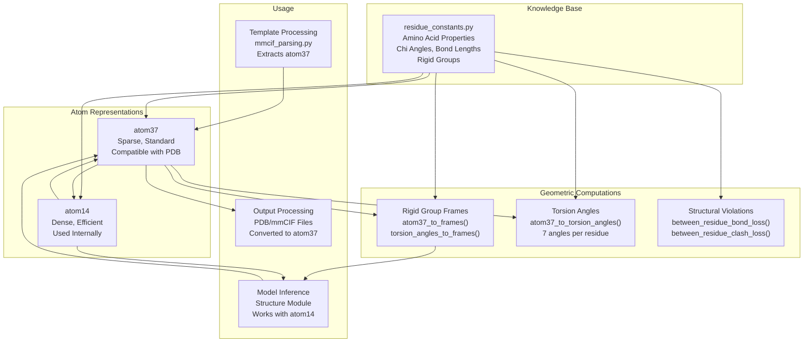
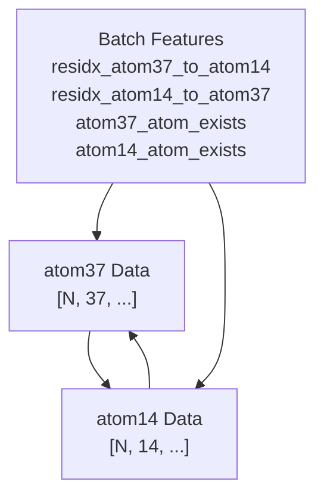
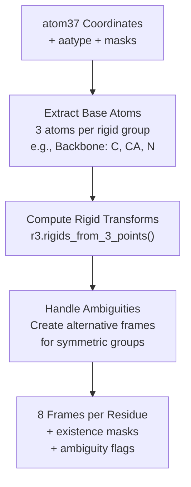
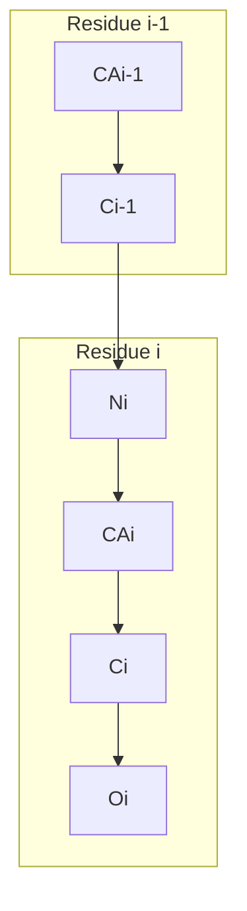

# Structural Representations

> **Relevant source files**
> * [alphafold/common/residue_constants.py](https://github.com/google-deepmind/alphafold/blob/c77e5d2a/alphafold/common/residue_constants.py)
> * [alphafold/common/residue_constants_test.py](https://github.com/google-deepmind/alphafold/blob/c77e5d2a/alphafold/common/residue_constants_test.py)
> * [alphafold/data/mmcif_parsing.py](https://github.com/google-deepmind/alphafold/blob/c77e5d2a/alphafold/data/mmcif_parsing.py)
> * [alphafold/model/all_atom.py](https://github.com/google-deepmind/alphafold/blob/c77e5d2a/alphafold/model/all_atom.py)
> * [alphafold/model/all_atom_test.py](https://github.com/google-deepmind/alphafold/blob/c77e5d2a/alphafold/model/all_atom_test.py)
> * [alphafold/relax/utils.py](https://github.com/google-deepmind/alphafold/blob/c77e5d2a/alphafold/relax/utils.py)

## Purpose and Scope

This page describes how protein structures are represented and manipulated throughout the AlphaFold codebase. It covers the two primary atom representations (atom37 and atom14), rigid group frames, torsion angles, and coordinate transformations. For detailed information about amino acid properties and chemical constants, see [Residue Constants](/google-deepmind/alphafold/5.1-residue-constants). For specifics about atom coordinate conversions and geometric computations, see [Atom Representations and Geometry](/google-deepmind/alphafold/5.2-atom-representations-and-geometry).

## Overview

AlphaFold uses multiple representations of protein structures to balance computational efficiency with compatibility with standard structural biology formats. The codebase maintains a comprehensive chemical knowledge base and provides utilities to convert between representations, compute structural properties, and detect violations of chemical geometry.



**Sources:** [alphafold/model/all_atom.py L15-L34](https://github.com/google-deepmind/alphafold/blob/c77e5d2a/alphafold/model/all_atom.py#L15-L34)

 [alphafold/common/residue_constants.py L1-L26](https://github.com/google-deepmind/alphafold/blob/c77e5d2a/alphafold/common/residue_constants.py#L1-L26)

## Atom Representations

AlphaFold employs two distinct atom representations, each optimized for different purposes:

### atom37 Representation

The **atom37** representation is a sparse, non-amino-acid-specific format where each heavy atom corresponds to a fixed position in a 37-dimensional array. This mapping is consistent across all residue types:

| Position | Atom Type | Example Residues |
| --- | --- | --- |
| 0 | N | All residues |
| 1 | CA | All residues |
| 2 | C | All residues |
| 3 | CB | All except GLY |
| 4 | O | All residues |
| 5-36 | Various | Side-chain specific |

The atom37 format facilitates conversion to standard PDB/mmCIF formats and is used for input/output operations. Positions not present for a given amino acid are zeroed out with an accompanying mask.

**Sources:** [alphafold/model/all_atom.py L17-L22](https://github.com/google-deepmind/alphafold/blob/c77e5d2a/alphafold/model/all_atom.py#L17-L22)

 [alphafold/common/residue_constants.py L526-L534](https://github.com/google-deepmind/alphafold/blob/c77e5d2a/alphafold/common/residue_constants.py#L526-L534)

 (Note: residue_constants defines `atom_types` and `atom_order`).

### atom14 Representation

The **atom14** representation is a dense format using 14 slots per residue, chosen because 14 is the maximum number of heavy atoms in any standard amino acid (TRP). In this representation, a given slot corresponds to different atom types depending on the amino acid:

| Residue | Slot 5 | Slot 6 | Slot 7 |
| --- | --- | --- | --- |
| ALA | (empty) | (empty) | (empty) |
| ARG | CG | CD | NE |
| ASN | CG | OD1 | ND2 |
| ILE | CG1 | CG2 | CD1 |

The atom14 representation is used internally by the model because it is computationally more efficient—operations can be performed on fixed-size tensors without wasting memory on padded positions.

**Sources:** [alphafold/model/all_atom.py L23-L31](https://github.com/google-deepmind/alphafold/blob/c77e5d2a/alphafold/model/all_atom.py#L23-L31)

 [alphafold/common/residue_constants.py L541-L564](https://github.com/google-deepmind/alphafold/blob/c77e5d2a/alphafold/common/residue_constants.py#L541-L564)

 (Note: residue_constants defines `restype_name_to_atom14_names`).

### Conversion Between Representations



The conversion functions use precomputed lookup tables stored in the batch features:

* `atom37_to_atom14()`: Converts atom37 representation to atom14 using `residx_atom14_to_atom37` indices [alphafold/model/all_atom.py L95-L112](https://github.com/google-deepmind/alphafold/blob/c77e5d2a/alphafold/model/all_atom.py#L95-L112)
* `atom14_to_atom37()`: Converts atom14 representation to atom37 using `residx_atom37_to_atom14` indices [alphafold/model/all_atom.py L75-L92](https://github.com/google-deepmind/alphafold/blob/c77e5d2a/alphafold/model/all_atom.py#L75-L92)
* Both functions apply appropriate existence masks to zero out non-existent atoms.

**Sources:** [alphafold/model/all_atom.py L75-L112](https://github.com/google-deepmind/alphafold/blob/c77e5d2a/alphafold/model/all_atom.py#L75-L112)

## Rigid Groups and Frames

Each residue is decomposed into **up to 8 rigid groups** that move relative to each other through torsion angles. This decomposition allows efficient computation of all-atom coordinates from backbone geometry and torsion angles.

### The 8 Rigid Groups

| Group Index | Name | Description |
| --- | --- | --- |
| 0 | Backbone | N, CA, C, CB, O atoms |
| 1 | Pre-omega | (Currently empty) |
| 2 | Phi-group | (Currently empty, defines only hydrogens) |
| 3 | Psi-group | Atoms affected by psi rotation |
| 4 | Chi1-group | Atoms affected by chi1 rotation |
| 5 | Chi2-group | Atoms affected by chi2 rotation |
| 6 | Chi3-group | Atoms affected by chi3 rotation |
| 7 | Chi4-group | Atoms affected by chi4 rotation |

Each rigid group is defined by a coordinate frame (rotation + translation) that specifies its position and orientation relative to a reference frame.

**Sources:** [alphafold/model/all_atom.py L148-L152](https://github.com/google-deepmind/alphafold/blob/c77e5d2a/alphafold/model/all_atom.py#L148-L152)

 [alphafold/common/residue_constants.py L131-L137](https://github.com/google-deepmind/alphafold/blob/c77e5d2a/alphafold/common/residue_constants.py#L131-L137)

### Rigid Group Atom Positions

Atom positions within each rigid group are stored in the local coordinate frame of that group. The `rigid_group_atom_positions` dictionary in `residue_constants.py` contains literature values for atom positions relative to the rotation axis of each group:

```python
# Example for ALA from residue_constants.py [alphafold/common/residue_constants.py:143-150]'ALA': [    ['N', 0, (-0.525, 1.363, 0.000)],   # Group 0 (backbone)    ['CA', 0, (0.000, 0.000, 0.000)],   # Group 0 (backbone)    ['C', 0, (1.526, -0.000, -0.000)],  # Group 0 (backbone)    ['CB', 0, (-0.529, -0.774, -1.205)],# Group 0 (backbone)    ['O', 3, (0.627, 1.062, 0.000)],    # Group 3 (psi-group)]
```

**Sources:** [alphafold/common/residue_constants.py L143-L352](https://github.com/google-deepmind/alphafold/blob/c77e5d2a/alphafold/common/residue_constants.py#L143-L352)

### Computing Frames from Coordinates

The `atom37_to_frames()` function computes the 8 rigid group frames from atom37 coordinates by:

1. Selecting three base atoms per rigid group that define the frame [alphafold/model/all_atom.py L166-L180](https://github.com/google-deepmind/alphafold/blob/c77e5d2a/alphafold/model/all_atom.py#L166-L180)
2. Computing the rigid transformation from these three points using `r3.rigids_from_3_points()` [alphafold/model/all_atom.py L228-L232](https://github.com/google-deepmind/alphafold/blob/c77e5d2a/alphafold/model/all_atom.py#L228-L232)
3. Handling alternative frames for ambiguous atom naming (e.g., symmetric aromatic rings) [alphafold/model/all_atom.py L236-L258](https://github.com/google-deepmind/alphafold/blob/c77e5d2a/alphafold/model/all_atom.py#L236-L258)



**Sources:** [alphafold/model/all_atom.py L115-L285](https://github.com/google-deepmind/alphafold/blob/c77e5d2a/alphafold/model/all_atom.py#L115-L285)

### Computing Coordinates from Frames

The reverse operation—going from torsion angles and backbone frames to all-atom coordinates—is performed by:

1. `torsion_angles_to_frames()`: Converts 7 torsion angles to 8 rigid group frames [alphafold/model/all_atom.py L495-L585](https://github.com/google-deepmind/alphafold/blob/c77e5d2a/alphafold/model/all_atom.py#L495-L585)
2. `frames_and_literature_positions_to_atom14_pos()`: Places atoms at literature positions within their frames [alphafold/model/all_atom.py L588-L644](https://github.com/google-deepmind/alphafold/blob/c77e5d2a/alphafold/model/all_atom.py#L588-L644)

**Sources:** [alphafold/model/all_atom.py L495-L644](https://github.com/google-deepmind/alphafold/blob/c77e5d2a/alphafold/model/all_atom.py#L495-L644)

## Torsion Angles

AlphaFold represents protein backbone and side-chain conformations using **7 torsion angles per residue**: pre-omega, phi, psi, and up to 4 chi angles.

### Backbone Torsion Angles



| Angle | Atoms | Description |
| --- | --- | --- |
| pre-omega (ω) | CAi-1, Ci-1, Ni, CAi | Peptide bond rotation (usually ~180°) |
| phi (φ) | Ci-1, Ni, CAi, Ci | Backbone N-CA rotation |
| psi (ψ) | Ni, CAi, Ci, Oi | Backbone CA-C rotation |

**Sources:** [alphafold/model/all_atom.py L288-L300](https://github.com/google-deepmind/alphafold/blob/c77e5d2a/alphafold/model/all_atom.py#L288-L300)

### Side-Chain Torsion Angles (Chi Angles)

Chi angles describe side-chain conformations. The number and definition of chi angles varies by residue type:

| Residue | Chi1 | Chi2 | Chi3 | Chi4 |
| --- | --- | --- | --- | --- |
| ALA, GLY | - | - | - | - |
| CYS, SER, THR, VAL | ✓ | - | - | - |
| ASN, ASP, HIS, ILE, LEU, PHE, PRO, TRP, TYR | ✓ | ✓ | - | - |
| GLN, GLU, MET | ✓ | ✓ | ✓ | - |
| ARG, LYS | ✓ | ✓ | ✓ | ✓ |

Each chi angle is defined by four atoms. For example, ARG chi1 is defined by atoms N-CA-CB-CG [alphafold/common/residue_constants.py L37-L42](https://github.com/google-deepmind/alphafold/blob/c77e5d2a/alphafold/common/residue_constants.py#L37-L42)

**Sources:** [alphafold/common/residue_constants.py L34-L78](https://github.com/google-deepmind/alphafold/blob/c77e5d2a/alphafold/common/residue_constants.py#L34-L78)

 [alphafold/common/residue_constants.py L82-L103](https://github.com/google-deepmind/alphafold/blob/c77e5d2a/alphafold/common/residue_constants.py#L82-L103)

### Computing Torsion Angles from Coordinates

The `atom37_to_torsion_angles()` function computes torsion angles from atom37 coordinates by extracting the four atoms defining each torsion angle and computing the position of the fourth atom in a local frame [alphafold/model/all_atom.py L288-L492](https://github.com/google-deepmind/alphafold/blob/c77e5d2a/alphafold/model/all_atom.py#L288-L492)

The function returns angles in sin/cos encoding rather than radians to avoid discontinuities:

```css
# Output format [alphafold/model/all_atom.py:302-306]{    'torsion_angles_sin_cos': jnp.ndarray,      # (B, N, 7, 2)    'alt_torsion_angles_sin_cos': jnp.ndarray,  # (B, N, 7, 2) - for ambiguous atoms    'torsion_angles_mask': jnp.ndarray          # (B, N, 7) - which angles exist}
```

**Sources:** [alphafold/model/all_atom.py L288-L492](https://github.com/google-deepmind/alphafold/blob/c77e5d2a/alphafold/model/all_atom.py#L288-L492)

### Chi Angle Periodicity

Some chi angles are **π-periodic** due to symmetry in the side chain, meaning rotation by 180° produces an equivalent conformation. This is defined in `chi_pi_periodic` [alphafold/common/residue_constants.py L107-L129](https://github.com/google-deepmind/alphafold/blob/c77e5d2a/alphafold/common/residue_constants.py#L107-L129)

**Sources:** [alphafold/common/residue_constants.py L105-L129](https://github.com/google-deepmind/alphafold/blob/c77e5d2a/alphafold/common/residue_constants.py#L105-L129)

## Structural Violations

AlphaFold detects violations of expected protein geometry to assess prediction quality and compute auxiliary losses during training.

### Between-Residue Bond Violations

The `between_residue_bond_loss()` function checks the peptide bond geometry between consecutive residues [alphafold/model/all_atom.py L685-L827](https://github.com/google-deepmind/alphafold/blob/c77e5d2a/alphafold/model/all_atom.py#L685-L827)

**Checked Violations:**

| Metric | Expected Value | Standard Deviation |
| --- | --- | --- |
| C-N bond length | 1.329 Å (1.341 Å for Pro) | 0.014 Å (0.016 Å for Pro) |
| CA-C-N angle (cosine) | -0.5203 | 0.0353 |
| C-N-CA angle (cosine) | -0.4473 | 0.0311 |

**Sources:** [alphafold/model/all_atom.py L685-L827](https://github.com/google-deepmind/alphafold/blob/c77e5d2a/alphafold/model/all_atom.py#L685-L827)

 [alphafold/common/residue_constants.py L514-L521](https://github.com/google-deepmind/alphafold/blob/c77e5d2a/alphafold/common/residue_constants.py#L514-L521)

 [alphafold/model/all_atom_test.py L27-L30](https://github.com/google-deepmind/alphafold/blob/c77e5d2a/alphafold/model/all_atom_test.py#L27-L30)

### Within-Residue Violations

The `make_atom14_dists_bounds()` function precomputes upper and lower bounds for all atom pairs in the atom14 representation based on van der Waals radii and bond lengths [alphafold/model/all_atom.py L939-L983](https://github.com/google-deepmind/alphafold/blob/c77e5d2a/alphafold/model/all_atom.py#L939-L983)

**Sources:** [alphafold/model/all_atom.py L939-L983](https://github.com/google-deepmind/alphafold/blob/c77e5d2a/alphafold/model/all_atom.py#L939-L983)

 [alphafold/common/residue_constants.py L396-L401](https://github.com/google-deepmind/alphafold/blob/c77e5d2a/alphafold/common/residue_constants.py#L396-L401)

 [alphafold/common/residue_constants.py L412-L511](https://github.com/google-deepmind/alphafold/blob/c77e5d2a/alphafold/common/residue_constants.py#L412-L511)

### Clash Detection

The `between_residue_clash_loss()` function detects steric clashes between atoms in different residues [alphafold/model/all_atom.py L847-L920](https://github.com/google-deepmind/alphafold/blob/c77e5d2a/alphafold/model/all_atom.py#L847-L920)

**Sources:** [alphafold/model/all_atom.py L847-L920](https://github.com/google-deepmind/alphafold/blob/c77e5d2a/alphafold/model/all_atom.py#L847-L920)

## Integration with Other Components

### Template Processing

The mmCIF parser extracts structural templates in atom37 format [alphafold/data/mmcif_parsing.py L169-L290](https://github.com/google-deepmind/alphafold/blob/c77e5d2a/alphafold/data/mmcif_parsing.py#L169-L290)

**Sources:** [alphafold/data/mmcif_parsing.py L169-L290](https://github.com/google-deepmind/alphafold/blob/c77e5d2a/alphafold/data/mmcif_parsing.py#L169-L290)

### Model Inference

The Structure Module operates on atom14 representations for efficiency, then converts to atom37 for output [alphafold/model/all_atom.py L495-L644](https://github.com/google-deepmind/alphafold/blob/c77e5d2a/alphafold/model/all_atom.py#L495-L644)

**Sources:** [alphafold/model/all_atom.py L495-L644](https://github.com/google-deepmind/alphafold/blob/c77e5d2a/alphafold/model/all_atom.py#L495-L644)

### Structure Relaxation

After prediction, structures are relaxed using Amber force fields. The relaxation process requires valid atom positions and uses residue constants to identify atom types, specifically for overwriting B-factors [alphafold/relax/utils.py L22-L61](https://github.com/google-deepmind/alphafold/blob/c77e5d2a/alphafold/relax/utils.py#L22-L61)

**Sources:** [alphafold/relax/utils.py L22-L74](https://github.com/google-deepmind/alphafold/blob/c77e5d2a/alphafold/relax/utils.py#L22-L74)

## Chemical Knowledge Base

All structural representations rely on the comprehensive chemical knowledge base in `residue_constants.py`, which includes atom naming, bond lengths, chi definitions, and rigid group decompositions [alphafold/common/residue_constants.py L1-L936](https://github.com/google-deepmind/alphafold/blob/c77e5d2a/alphafold/common/residue_constants.py#L1-L936)

**Sources:** [alphafold/common/residue_constants.py L1-L936](https://github.com/google-deepmind/alphafold/blob/c77e5d2a/alphafold/common/residue_constants.py#L1-L936)