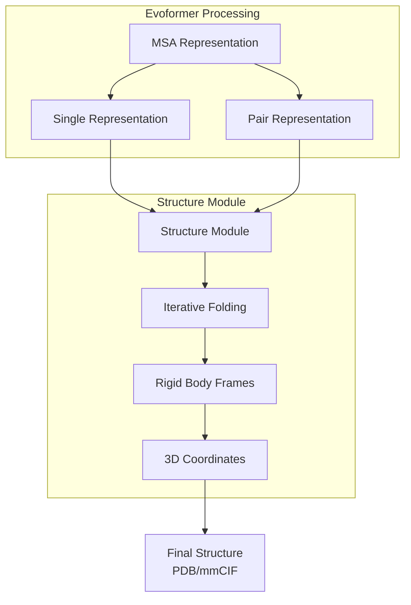
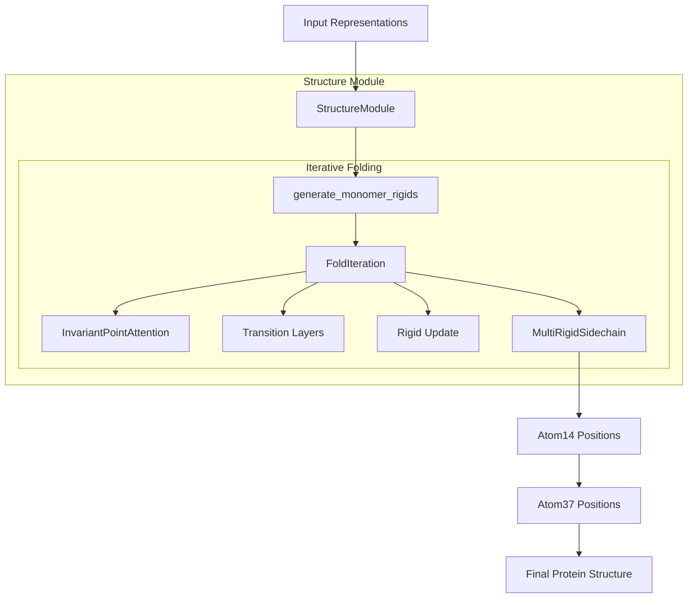
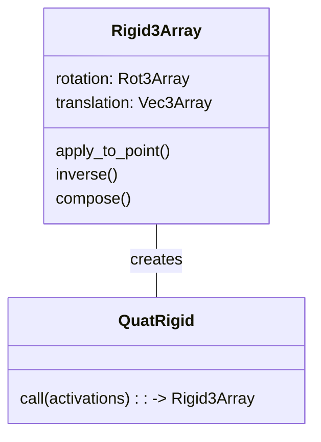
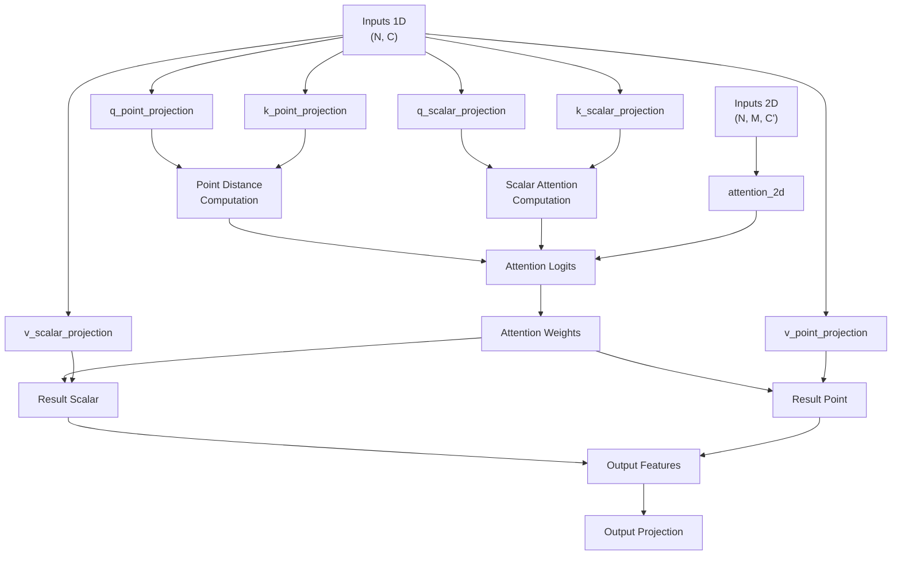
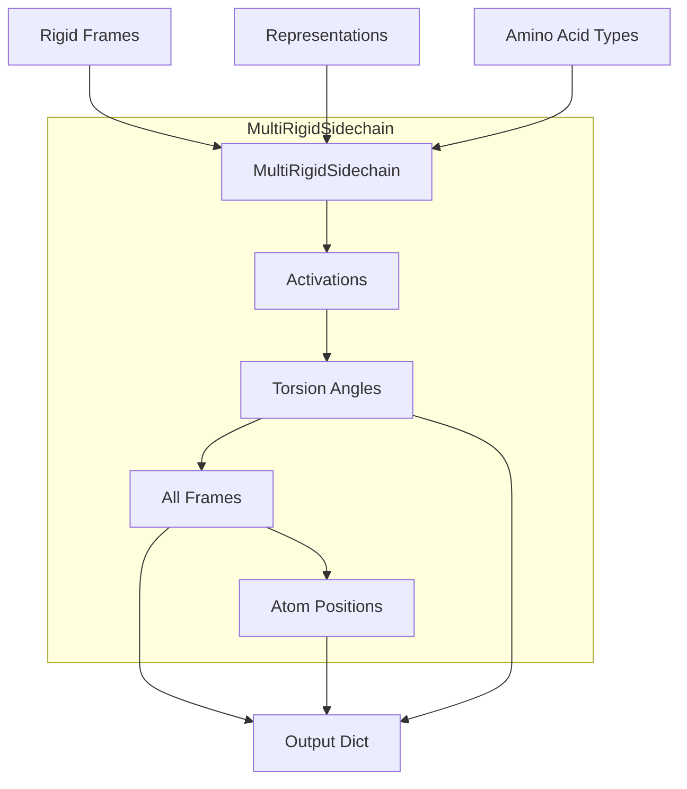
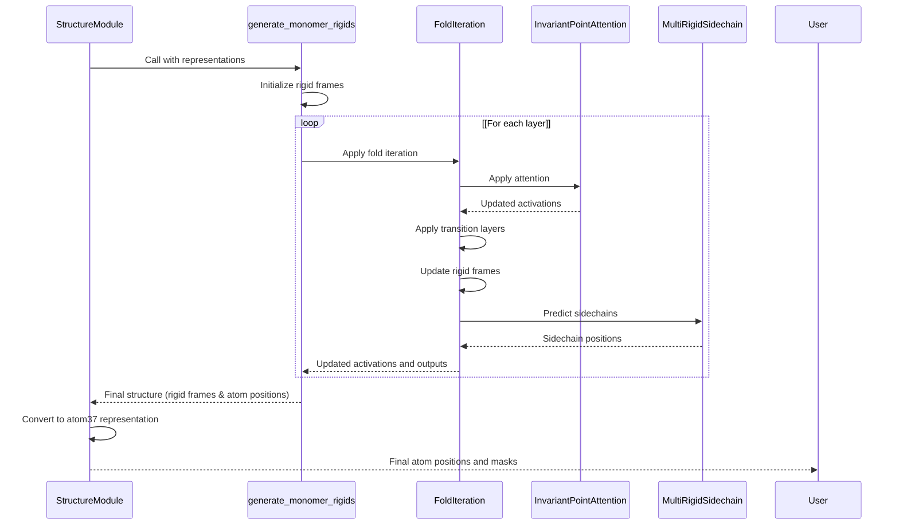
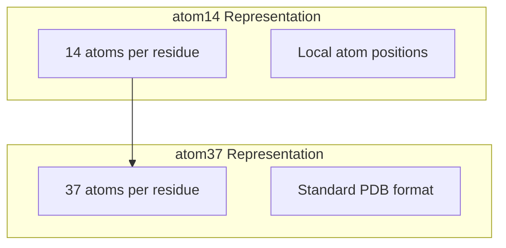
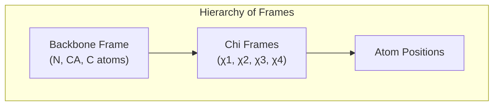
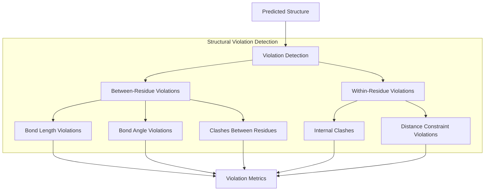
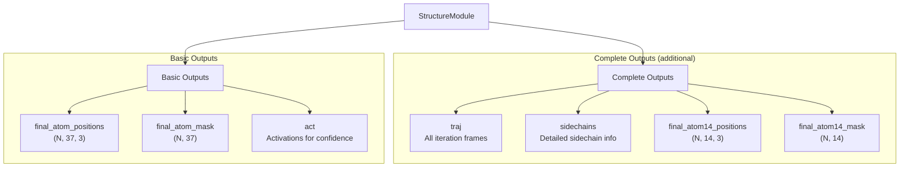

# Structure Module

> **Relevant source files**
> * [alphafold/common/residue_constants_test.py](https://github.com/google-deepmind/alphafold/blob/c77e5d2a/alphafold/common/residue_constants_test.py)
> * [alphafold/model/all_atom.py](https://github.com/google-deepmind/alphafold/blob/c77e5d2a/alphafold/model/all_atom.py)
> * [alphafold/model/all_atom_multimer.py](https://github.com/google-deepmind/alphafold/blob/c77e5d2a/alphafold/model/all_atom_multimer.py)
> * [alphafold/model/all_atom_test.py](https://github.com/google-deepmind/alphafold/blob/c77e5d2a/alphafold/model/all_atom_test.py)
> * [alphafold/model/folding.py](https://github.com/google-deepmind/alphafold/blob/c77e5d2a/alphafold/model/folding.py)
> * [alphafold/model/folding_multimer.py](https://github.com/google-deepmind/alphafold/blob/c77e5d2a/alphafold/model/folding_multimer.py)
> * [alphafold/model/mapping.py](https://github.com/google-deepmind/alphafold/blob/c77e5d2a/alphafold/model/mapping.py)
> * [alphafold/model/prng.py](https://github.com/google-deepmind/alphafold/blob/c77e5d2a/alphafold/model/prng.py)
> * [alphafold/model/quat_affine.py](https://github.com/google-deepmind/alphafold/blob/c77e5d2a/alphafold/model/quat_affine.py)

The Structure Module is a critical component of AlphaFold that transforms the abstract representations from the Evoformer into 3D atomic coordinates. It implements an iterative, attention-based folding process that produces physically plausible protein structures. This document explains the architecture, key components, and operating principles of the Structure Module.

## 1. Role in AlphaFold Pipeline

The Structure Module is the final major computational step in the AlphaFold architecture that performs the actual 3D structure prediction. It receives pair and single representations from the Evoformer and outputs atomic coordinates.

Sources:

* [alphafold/model/folding_multimer.py L556-L625](https://github.com/google-deepmind/alphafold/blob/c77e5d2a/alphafold/model/folding_multimer.py#L556-L625)

## 2. Core Architecture and Components

The Structure Module follows an iterative refinement approach where it gradually improves the 3D structure through multiple folding iterations.

Sources:

* [alphafold/model/folding_multimer.py L556-L625](https://github.com/google-deepmind/alphafold/blob/c77e5d2a/alphafold/model/folding_multimer.py#L556-L625)
* [alphafold/model/folding_multimer.py L374-L476](https://github.com/google-deepmind/alphafold/blob/c77e5d2a/alphafold/model/folding_multimer.py#L374-L476)
* [alphafold/model/folding_multimer.py L478-L553](https://github.com/google-deepmind/alphafold/blob/c77e5d2a/alphafold/model/folding_multimer.py#L478-L553)

## 3. Key Components

### 3.1 Rigid Body Representations

The Structure Module uses rigid body transformations (`Rigid3Array`) to represent the position and orientation of residues and atoms in 3D space. These consist of:

1. **Rotation**: Represented using `Rot3Array` (often parameterized as quaternions)
2. **Translation**: Represented using `Vec3Array` for 3D positions

Sources:

* [alphafold/model/folding_multimer.py L65-L137](https://github.com/google-deepmind/alphafold/blob/c77e5d2a/alphafold/model/folding_multimer.py#L65-L137)
* [alphafold/model/folding_multimer.py L512](https://github.com/google-deepmind/alphafold/blob/c77e5d2a/alphafold/model/folding_multimer.py#L512-L512)
* [alphafold/model/quat_affine.py L200-L222](https://github.com/google-deepmind/alphafold/blob/c77e5d2a/alphafold/model/quat_affine.py#L200-L222)

### 3.2 Invariant Point Attention

The `InvariantPointAttention` module is a specialized attention mechanism that works in 3D space. Unlike standard attention which operates solely on feature vectors, InvariantPointAttention:

1. Projects queries and keys as points in 3D space via `PointProjection` [alphafold/model/folding_multimer.py L144-L192](https://github.com/google-deepmind/alphafold/blob/c77e5d2a/alphafold/model/folding_multimer.py#L144-L192)
2. Computes attention based on Euclidean distances between these points.
3. Combines 3D point-based attention with traditional scalar attention.
4. Enables the model to reason about spatial relationships in a geometrically meaningful way.

Sources:

* [alphafold/model/folding_multimer.py L188-L371](https://github.com/google-deepmind/alphafold/blob/c77e5d2a/alphafold/model/folding_multimer.py#L188-L371)
* [alphafold/model/folding.py L37-L198](https://github.com/google-deepmind/alphafold/blob/c77e5d2a/alphafold/model/folding.py#L37-L198)

### 3.3 FoldIteration

The `FoldIteration` class performs a single step of the iterative folding process and is composed of:

1. **Attention Layer**: Uses `InvariantPointAttention` to update residue features [alphafold/model/folding_multimer.py L408-L414](https://github.com/google-deepmind/alphafold/blob/c77e5d2a/alphafold/model/folding_multimer.py#L408-L414)
2. **Transition Layers**: Several feed-forward layers to transform the features [alphafold/model/folding_multimer.py L446-L455](https://github.com/google-deepmind/alphafold/blob/c77e5d2a/alphafold/model/folding_multimer.py#L446-L455)
3. **Rigid Update**: Updates the rigid frames using the refined features via `QuatRigid` [alphafold/model/folding_multimer.py L461-L468](https://github.com/google-deepmind/alphafold/blob/c77e5d2a/alphafold/model/folding_multimer.py#L461-L468)
4. **Sidechain Prediction**: Predicts sidechain positions using `MultiRigidSidechain` [alphafold/model/folding_multimer.py L470-L476](https://github.com/google-deepmind/alphafold/blob/c77e5d2a/alphafold/model/folding_multimer.py#L470-L476)

Sources:

* [alphafold/model/folding_multimer.py L374-L476](https://github.com/google-deepmind/alphafold/blob/c77e5d2a/alphafold/model/folding_multimer.py#L374-L476)

### 3.4 MultiRigidSidechain

The `MultiRigidSidechain` class predicts the positions of sidechain atoms using:

1. Residue representations to predict torsion angles (chi angles) [alphafold/model/folding_multimer.py L1124-L1129](https://github.com/google-deepmind/alphafold/blob/c77e5d2a/alphafold/model/folding_multimer.py#L1124-L1129)
2. Conversion of torsion angles to 3D frames via `torsion_angles_to_frames` [alphafold/model/all_atom_multimer.py L374-L438](https://github.com/google-deepmind/alphafold/blob/c77e5d2a/alphafold/model/all_atom_multimer.py#L374-L438)
3. Placement of atoms according to standard residue templates via `frames_and_literature_positions_to_atom14_pos` [alphafold/model/all_atom_multimer.py L441-L472](https://github.com/google-deepmind/alphafold/blob/c77e5d2a/alphafold/model/all_atom_multimer.py#L441-L472)

Sources:

* [alphafold/model/folding_multimer.py L1079-L1162](https://github.com/google-deepmind/alphafold/blob/c77e5d2a/alphafold/model/folding_multimer.py#L1079-L1162)
* [alphafold/model/all_atom_multimer.py L374-L438](https://github.com/google-deepmind/alphafold/blob/c77e5d2a/alphafold/model/all_atom_multimer.py#L374-L438)
* [alphafold/model/all_atom_multimer.py L441-L472](https://github.com/google-deepmind/alphafold/blob/c77e5d2a/alphafold/model/all_atom_multimer.py#L441-L472)

## 4. Folding Process

The Structure Module implements protein folding as an iterative process through the `generate_monomer_rigids` function:

1. **Initialization**: Start with a flat structure (identity rigid transforms) [alphafold/model/folding_multimer.py L497-L512](https://github.com/google-deepmind/alphafold/blob/c77e5d2a/alphafold/model/folding_multimer.py#L497-L512)
2. **Iterative Refinement**: Apply multiple layers of `FoldIteration` [alphafold/model/folding_multimer.py L514-L531](https://github.com/google-deepmind/alphafold/blob/c77e5d2a/alphafold/model/folding_multimer.py#L514-L531)
3. **Final Structure**: Produce the final atom positions and frames [alphafold/model/folding_multimer.py L533-L553](https://github.com/google-deepmind/alphafold/blob/c77e5d2a/alphafold/model/folding_multimer.py#L533-L553)

Sources:

* [alphafold/model/folding_multimer.py L478-L553](https://github.com/google-deepmind/alphafold/blob/c77e5d2a/alphafold/model/folding_multimer.py#L478-L553)
* [alphafold/model/folding_multimer.py L570-L625](https://github.com/google-deepmind/alphafold/blob/c77e5d2a/alphafold/model/folding_multimer.py#L570-L625)

## 5. Coordinate Systems and Representations

The Structure Module uses different representations for atom positions and transformations:

### 5.1 Atom Representation Formats

1. **atom14**: Compact representation with 14 atoms per residue [alphafold/model/all_atom.py L23-L28](https://github.com/google-deepmind/alphafold/blob/c77e5d2a/alphafold/model/all_atom.py#L23-L28)
2. **atom37**: Complete representation with 37 atoms per residue [alphafold/model/all_atom.py L18-L22](https://github.com/google-deepmind/alphafold/blob/c77e5d2a/alphafold/model/all_atom.py#L18-L22)

The module converts between these formats as needed using `atom14_to_atom37` [alphafold/model/all_atom.py L75-L92](https://github.com/google-deepmind/alphafold/blob/c77e5d2a/alphafold/model/all_atom.py#L75-L92)

 and `atom37_to_atom14` [alphafold/model/all_atom.py L95-L112](https://github.com/google-deepmind/alphafold/blob/c77e5d2a/alphafold/model/all_atom.py#L95-L112)

Sources:

* [alphafold/model/folding_multimer.py L604-L615](https://github.com/google-deepmind/alphafold/blob/c77e5d2a/alphafold/model/folding_multimer.py#L604-L615)
* [alphafold/model/all_atom.py L15-L34](https://github.com/google-deepmind/alphafold/blob/c77e5d2a/alphafold/model/all_atom.py#L15-L34)
* [alphafold/model/all_atom_multimer.py L225-L254](https://github.com/google-deepmind/alphafold/blob/c77e5d2a/alphafold/model/all_atom_multimer.py#L225-L254)

### 5.2 Rigid Transformations and Frames

The module uses a hierarchical system of rigid body frames:

1. **Backbone Frame**: Defines the position/orientation of each residue (N, CA, C atoms) [alphafold/model/folding_multimer.py L52-L62](https://github.com/google-deepmind/alphafold/blob/c77e5d2a/alphafold/model/folding_multimer.py#L52-L62)
2. **Sidechain Frames**: 8 frames per residue (1 backbone + 7 for sidechains/torsions) [alphafold/model/all_atom.py L115-L147](https://github.com/google-deepmind/alphafold/blob/c77e5d2a/alphafold/model/all_atom.py#L115-L147)
3. **Global Coordinates**: Final atom positions in global coordinate system.

Sources:

* [alphafold/model/all_atom_multimer.py L275-L371](https://github.com/google-deepmind/alphafold/blob/c77e5d2a/alphafold/model/all_atom_multimer.py#L275-L371)
* [alphafold/model/all_atom_multimer.py L374-L438](https://github.com/google-deepmind/alphafold/blob/c77e5d2a/alphafold/model/all_atom_multimer.py#L374-L438)

## 6. Loss Functions and Violation Detection

During training, the Structure Module evaluates the quality of predicted structures using several loss functions:

1. **Frame-Aligned Point Error (FAPE)**: Measures structural accuracy by aligning frames and computing positional errors [alphafold/model/all_atom.py L533-L596](https://github.com/google-deepmind/alphafold/blob/c77e5d2a/alphafold/model/all_atom.py#L533-L596)
2. **Sidechain Loss**: FAPE applied to sidechain atoms [alphafold/model/folding_multimer.py L831-L868](https://github.com/google-deepmind/alphafold/blob/c77e5d2a/alphafold/model/folding_multimer.py#L831-L868)
3. **Chi Angle Loss**: Penalizes incorrect torsion angles [alphafold/model/folding_multimer.py L874-L877](https://github.com/google-deepmind/alphafold/blob/c77e5d2a/alphafold/model/folding_multimer.py#L874-L877)
4. **Structural Violation Loss**: Detects and penalizes physically impossible structures [alphafold/model/folding_multimer.py L889-L978](https://github.com/google-deepmind/alphafold/blob/c77e5d2a/alphafold/model/folding_multimer.py#L889-L978)

The module also includes comprehensive violation detection via `find_structural_violations` [alphafold/model/all_atom_multimer.py L679-L727](https://github.com/google-deepmind/alphafold/blob/c77e5d2a/alphafold/model/all_atom_multimer.py#L679-L727)

:

Sources:

* [alphafold/model/folding_multimer.py L781-L1008](https://github.com/google-deepmind/alphafold/blob/c77e5d2a/alphafold/model/folding_multimer.py#L781-L1008)
* [alphafold/model/all_atom_multimer.py L475-L727](https://github.com/google-deepmind/alphafold/blob/c77e5d2a/alphafold/model/all_atom_multimer.py#L475-L727)
* [alphafold/model/all_atom_test.py L96-L190](https://github.com/google-deepmind/alphafold/blob/c77e5d2a/alphafold/model/all_atom_test.py#L96-L190)

## 7. Outputs and Integration

The Structure Module produces several key outputs:

1. **Atom Positions**: 3D coordinates for all atoms in atom14 and atom37 formats.
2. **Atom Masks**: Binary indicators of which atoms are present.
3. **Rigid Frames**: Positional and orientational information for residues.

Sources:

* [alphafold/model/folding_multimer.py L591-L624](https://github.com/google-deepmind/alphafold/blob/c77e5d2a/alphafold/model/folding_multimer.py#L591-L624)

## 8. Technical Implementation Details

### 8.1 Invariant Point Attention Details

The InvariantPointAttention mechanism is a key innovation that enables geometric reasoning. It:

1. Projects points in local reference frames.
2. Converts them to a global frame for distance calculations.
3. Combines scalar, point-based, and pair attention.

| Component | Dimension | Purpose |
| --- | --- | --- |
| q_point | (N, num_head, num_point_qk) | Query points |
| k_point | (N, num_head, num_point_qk) | Key points |
| q_scalar | (N, num_head, num_scalar_qk) | Query scalars |
| k_scalar | (N, num_head, num_scalar_qk) | Key scalars |
| v_scalar | (N, num_head, num_scalar_v) | Value scalars |
| v_point | (N, num_head, num_point_v) | Value points |
| attention_2d | (N, N, num_head) | Pair bias attention |

Sources:

* [alphafold/model/folding_multimer.py L188-L371](https://github.com/google-deepmind/alphafold/blob/c77e5d2a/alphafold/model/folding_multimer.py#L188-L371)
* [alphafold/model/folding.py L115-L166](https://github.com/google-deepmind/alphafold/blob/c77e5d2a/alphafold/model/folding.py#L115-L166)

### 8.2 Ambiguous Atom Handling

The Structure Module handles ambiguous atom naming in sidechains (e.g., symmetric atoms in PHE, TYR, ASP, GLU) by:

1. Considering alternative namesakes for ambiguous residues via `_make_renaming_matrices` [alphafold/model/all_atom_multimer.py L57-L83](https://github.com/google-deepmind/alphafold/blob/c77e5d2a/alphafold/model/all_atom_multimer.py#L57-L83)
2. Computing optimal renaming to maximize structure accuracy.
3. Applying the optimal naming during evaluation in `supervised_chi_loss` [alphafold/model/all_atom_multimer.py L730-L782](https://github.com/google-deepmind/alphafold/blob/c77e5d2a/alphafold/model/all_atom_multimer.py#L730-L782)

Sources:

* [alphafold/model/folding_multimer.py L752-L778](https://github.com/google-deepmind/alphafold/blob/c77e5d2a/alphafold/model/folding_multimer.py#L752-L778)
* [alphafold/model/all_atom_multimer.py L57-L83](https://github.com/google-deepmind/alphafold/blob/c77e5d2a/alphafold/model/all_atom_multimer.py#L57-L83)
* [alphafold/model/all_atom_multimer.py L730-L782](https://github.com/google-deepmind/alphafold/blob/c77e5d2a/alphafold/model/all_atom_multimer.py#L730-L782)

## 9. Integration with Rest of AlphaFold

The Structure Module integrates with the rest of AlphaFold by:

1. Receiving representations from the Evoformer module.
2. Processing these representations to produce 3D structures.
3. Supporting the calculation of confidence metrics (pLDDT, PAE).
4. Providing structures for relaxation via the Amber force field.

The final outputs of the Structure Module include atom positions that can be directly converted to PDB/mmCIF format for visualization and analysis.

Sources:

* [alphafold/model/folding_multimer.py L556-L625](https://github.com/google-deepmind/alphafold/blob/c77e5d2a/alphafold/model/folding_multimer.py#L556-L625)