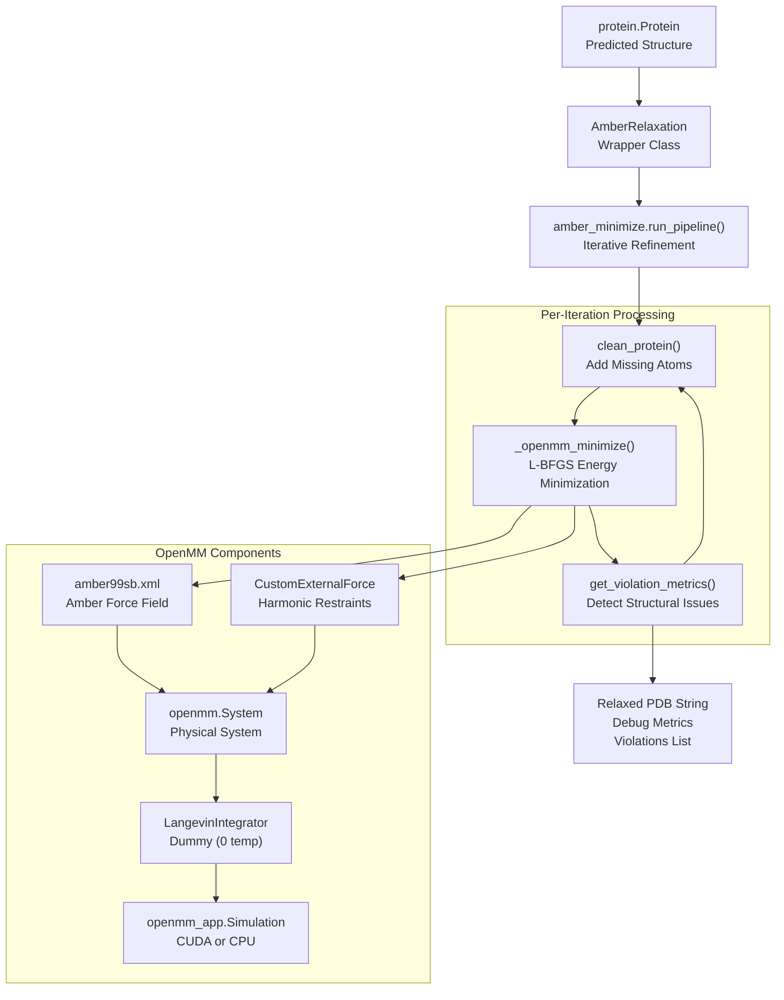
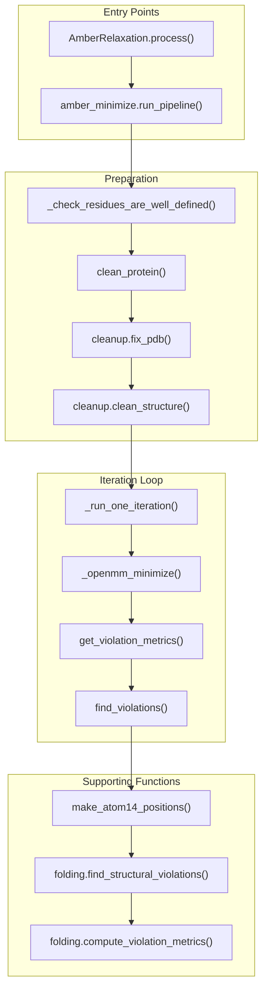
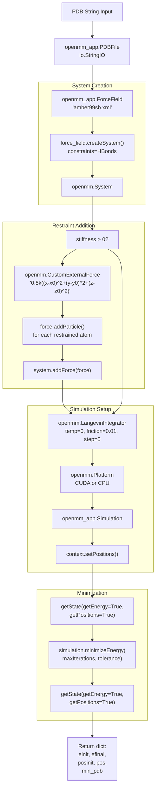

# Structure Relaxation

> **Relevant source files**
> * [alphafold/data/parsers.py](https://github.com/google-deepmind/alphafold/blob/c77e5d2a/alphafold/data/parsers.py)
> * [alphafold/data/tools/jackhmmer.py](https://github.com/google-deepmind/alphafold/blob/c77e5d2a/alphafold/data/tools/jackhmmer.py)
> * [alphafold/relax/amber_minimize.py](https://github.com/google-deepmind/alphafold/blob/c77e5d2a/alphafold/relax/amber_minimize.py)
> * [alphafold/relax/amber_minimize_test.py](https://github.com/google-deepmind/alphafold/blob/c77e5d2a/alphafold/relax/amber_minimize_test.py)
> * [alphafold/relax/cleanup.py](https://github.com/google-deepmind/alphafold/blob/c77e5d2a/alphafold/relax/cleanup.py)
> * [alphafold/relax/relax.py](https://github.com/google-deepmind/alphafold/blob/c77e5d2a/alphafold/relax/relax.py)
> * [alphafold/relax/relax_test.py](https://github.com/google-deepmind/alphafold/blob/c77e5d2a/alphafold/relax/relax_test.py)

## Purpose and Scope

This document describes the structure relaxation system in AlphaFold, which refines predicted protein structures using Amber force fields and OpenMM molecular dynamics. The relaxation process minimizes energy while maintaining structural integrity through restraints, iteratively resolving violations until a stable conformation is achieved.

For information about the model architecture that produces the initial predictions, see [Model Architecture](/google-deepmind/alphafold/4-model-architecture). For details on structural representations and violations used during relaxation, see [Atom Representations and Geometry](/google-deepmind/alphafold/5.2-atom-representations-and-geometry).

**Sources:** [alphafold/relax/amber_minimize.py L1-L15](https://github.com/google-deepmind/alphafold/blob/c77e5d2a/alphafold/relax/amber_minimize.py#L1-L15)

 [alphafold/relax/relax.py L1-L15](https://github.com/google-deepmind/alphafold/blob/c77e5d2a/alphafold/relax/relax.py#L1-L15)

---

## System Overview

The relaxation system takes a predicted protein structure and performs energy minimization using the Amber99sb force field through OpenMM. The process adds missing atoms (particularly hydrogens), applies harmonic restraints to prevent large deviations from the predicted structure, and iteratively refines the structure by excluding residues with violations from restraints.

### Component Relationship Diagram



**Sources:** [alphafold/relax/relax.py L23-L91](https://github.com/google-deepmind/alphafold/blob/c77e5d2a/alphafold/relax/relax.py#L23-L91)

 [alphafold/relax/amber_minimize.py L446-L533](https://github.com/google-deepmind/alphafold/blob/c77e5d2a/alphafold/relax/amber_minimize.py#L446-L533)

 [alphafold/relax/amber_minimize.py L79-L113](https://github.com/google-deepmind/alphafold/blob/c77e5d2a/alphafold/relax/amber_minimize.py#L79-L113)

---

## Main Components

### AmberRelaxation Class

The `AmberRelaxation` class provides a high-level interface for structure relaxation. It wraps the `amber_minimize.run_pipeline()` function with configurable parameters.

| Parameter | Type | Description |
| --- | --- | --- |
| `max_iterations` | int | Maximum L-BFGS iterations per relaxation round (0 = unlimited) |
| `tolerance` | float | Force tolerance in kcal/(mol·nm) for convergence |
| `stiffness` | float | Spring constant in kcal/(mol·Å²) for restraining potential |
| `exclude_residues` | Sequence[int] | Zero-indexed residues to exclude from restraints |
| `max_outer_iterations` | int | Maximum violation-informed iterations (typically 20) |
| `use_gpu` | bool | Whether to use CUDA acceleration |

The `process()` method executes the relaxation and returns:

1. **Minimized PDB string** - The refined structure with hydrogens [alphafold/relax/relax.py L82](https://github.com/google-deepmind/alphafold/blob/c77e5d2a/alphafold/relax/relax.py#L82-L82)
2. **Debug data dictionary** - Contains `initial_energy`, `final_energy`, `attempts`, `rmsd` [alphafold/relax/relax.py L76-L81](https://github.com/google-deepmind/alphafold/blob/c77e5d2a/alphafold/relax/relax.py#L76-L81)
3. **Violations list** - Per-residue violation flags [alphafold/relax/relax.py L87-L89](https://github.com/google-deepmind/alphafold/blob/c77e5d2a/alphafold/relax/relax.py#L87-L89)

**Sources:** [alphafold/relax/relax.py L23-L91](https://github.com/google-deepmind/alphafold/blob/c77e5d2a/alphafold/relax/relax.py#L23-L91)

### Pipeline Architecture

The execution flow bridges the gap between high-level JAX-compatible `Protein` objects and the OpenMM simulation environment.



**Sources:** [alphafold/relax/relax.py L60-L90](https://github.com/google-deepmind/alphafold/blob/c77e5d2a/alphafold/relax/relax.py#L60-L90)

 [alphafold/relax/amber_minimize.py L446-L533](https://github.com/google-deepmind/alphafold/blob/c77e5d2a/alphafold/relax/amber_minimize.py#L446-L533)

 [alphafold/relax/amber_minimize.py L383-L443](https://github.com/google-deepmind/alphafold/blob/c77e5d2a/alphafold/relax/amber_minimize.py#L383-L443)

---

## Minimization Process

### OpenMM Minimization Setup

The `_openmm_minimize()` function performs the actual energy minimization using OpenMM:

1. **Parse input structure** - Convert PDB string to `openmm_app.PDBFile` [alphafold/relax/amber_minimize.py L90-L91](https://github.com/google-deepmind/alphafold/blob/c77e5d2a/alphafold/relax/amber_minimize.py#L90-L91)
2. **Create force field system** - Use `amber99sb.xml` with HBonds constraints [alphafold/relax/amber_minimize.py L93-L95](https://github.com/google-deepmind/alphafold/blob/c77e5d2a/alphafold/relax/amber_minimize.py#L93-L95)
3. **Add restraints** - Apply harmonic restraints via `CustomExternalForce` [alphafold/relax/amber_minimize.py L97](https://github.com/google-deepmind/alphafold/blob/c77e5d2a/alphafold/relax/amber_minimize.py#L97-L97)
4. **Configure integrator** - Use `LangevinIntegrator` with 0 temperature (dummy) [alphafold/relax/amber_minimize.py L99](https://github.com/google-deepmind/alphafold/blob/c77e5d2a/alphafold/relax/amber_minimize.py#L99-L99)
5. **Select platform** - CUDA (GPU) or CPU based on configuration [alphafold/relax/amber_minimize.py L100](https://github.com/google-deepmind/alphafold/blob/c77e5d2a/alphafold/relax/amber_minimize.py#L100-L100)
6. **Create simulation** - Initialize `openmm_app.Simulation` context [alphafold/relax/amber_minimize.py L101](https://github.com/google-deepmind/alphafold/blob/c77e5d2a/alphafold/relax/amber_minimize.py#L101-L101)
7. **Minimize energy** - Run L-BFGS until convergence or max iterations [alphafold/relax/amber_minimize.py L108](https://github.com/google-deepmind/alphafold/blob/c77e5d2a/alphafold/relax/amber_minimize.py#L108-L108)



**Sources:** [alphafold/relax/amber_minimize.py L79-L113](https://github.com/google-deepmind/alphafold/blob/c77e5d2a/alphafold/relax/amber_minimize.py#L79-L113)

 [alphafold/relax/amber_minimize.py L49-L76](https://github.com/google-deepmind/alphafold/blob/c77e5d2a/alphafold/relax/amber_minimize.py#L49-L76)

---

## Protein Cleaning and Preparation

### clean_protein() Function

Before minimization, the predicted structure must be prepared by adding missing atoms, particularly hydrogens. The `clean_protein()` function performs this preparation using `pdbfixer` [alphafold/relax/cleanup.py L24-L61](https://github.com/google-deepmind/alphafold/blob/c77e5d2a/alphafold/relax/cleanup.py#L24-L61)

The cleaning process:

1. Validates that the input protein has an ideal atom mask (up to terminal OXT) [alphafold/relax/amber_minimize.py L173](https://github.com/google-deepmind/alphafold/blob/c77e5d2a/alphafold/relax/amber_minimize.py#L173-L173)
2. Converts the protein to PDB format [alphafold/relax/amber_minimize.py L176](https://github.com/google-deepmind/alphafold/blob/c77e5d2a/alphafold/relax/amber_minimize.py#L176-L176)
3. Uses `cleanup.fix_pdb()` to fix non-standard residues and add missing heavy atoms [alphafold/relax/amber_minimize.py L179](https://github.com/google-deepmind/alphafold/blob/c77e5d2a/alphafold/relax/amber_minimize.py#L179-L179)
4. Uses `cleanup.clean_structure()` to handle edge cases like Selenium in MET and single-amino-acid chains [alphafold/relax/amber_minimize.py L182](https://github.com/google-deepmind/alphafold/blob/c77e5d2a/alphafold/relax/amber_minimize.py#L182-L182)  [alphafold/relax/cleanup.py L64-L73](https://github.com/google-deepmind/alphafold/blob/c77e5d2a/alphafold/relax/cleanup.py#L64-L73)
5. Verifies that existing atom positions were not altered [alphafold/relax/amber_minimize.py L190](https://github.com/google-deepmind/alphafold/blob/c77e5d2a/alphafold/relax/amber_minimize.py#L190-L190)

**Sources:** [alphafold/relax/amber_minimize.py L162-L191](https://github.com/google-deepmind/alphafold/blob/c77e5d2a/alphafold/relax/amber_minimize.py#L162-L191)

 [alphafold/relax/cleanup.py L27-L61](https://github.com/google-deepmind/alphafold/blob/c77e5d2a/alphafold/relax/cleanup.py#L27-L61)

 [alphafold/relax/cleanup.py L64-L73](https://github.com/google-deepmind/alphafold/blob/c77e5d2a/alphafold/relax/cleanup.py#L64-L73)

---

## Restraint System

### Restraint Types

The system supports two restraint sets controlled by the `restraint_set` parameter [alphafold/relax/amber_minimize.py L40-L47](https://github.com/google-deepmind/alphafold/blob/c77e5d2a/alphafold/relax/amber_minimize.py#L40-L47)

:

| Restraint Set | Atoms Restrained | Implementation Detail |
| --- | --- | --- |
| `"non_hydrogen"` | All non-hydrogen atoms | `atom.element.name != "hydrogen"` |
| `"c_alpha"` | Only C-alpha atoms | `atom.name == "CA"` |

### Harmonic Restraint Implementation

Restraints are implemented as a `CustomExternalForce` with the potential [alphafold/relax/amber_minimize.py L59-L61](https://github.com/google-deepmind/alphafold/blob/c77e5d2a/alphafold/relax/amber_minimize.py#L59-L61)

:

```
E = 0.5 * k * ((x-x0)² + (y-y0)² + (z-z0)²)
```

Where `k` is the global stiffness parameter and `(x0, y0, z0)` are per-particle parameters representing the reference coordinates [alphafold/relax/amber_minimize.py L62-L64](https://github.com/google-deepmind/alphafold/blob/c77e5d2a/alphafold/relax/amber_minimize.py#L62-L64)

**Sources:** [alphafold/relax/amber_minimize.py L40-L76](https://github.com/google-deepmind/alphafold/blob/c77e5d2a/alphafold/relax/amber_minimize.py#L40-L76)

---

## Violation Detection and Iterative Refinement

### Structural Violation Analysis

The `find_violations()` function analyzes the structure for violations using the folding module's structural checks. It converts the protein to an `atom14` representation before calling `folding.find_structural_violations` [alphafold/relax/amber_minimize.py L333-L356](https://github.com/google-deepmind/alphafold/blob/c77e5d2a/alphafold/relax/amber_minimize.py#L333-L356)

The violation detection checks:

* **Between-residue bond violations** - Unusual bond lengths/connections [alphafold/relax/amber_minimize.py L358-L364](https://github.com/google-deepmind/alphafold/blob/c77e5d2a/alphafold/relax/amber_minimize.py#L358-L364)
* **Between-residue clashes** - Atoms too close to each other [alphafold/relax/amber_minimize.py L365-L369](https://github.com/google-deepmind/alphafold/blob/c77e5d2a/alphafold/relax/amber_minimize.py#L365-L369)
* **Within-residue violations** - Unusual bond angles and lengths within residues [alphafold/relax/amber_minimize.py L370-L374](https://github.com/google-deepmind/alphafold/blob/c77e5d2a/alphafold/relax/amber_minimize.py#L370-L374)

**Sources:** [alphafold/relax/amber_minimize.py L333-L380](https://github.com/google-deepmind/alphafold/blob/c77e5d2a/alphafold/relax/amber_minimize.py#L333-L380)

 [alphafold/relax/amber_minimize.py L194-L330](https://github.com/google-deepmind/alphafold/blob/c77e5d2a/alphafold/relax/amber_minimize.py#L194-L330)

### Iterative Refinement Loop

The `run_pipeline()` function implements an iterative refinement strategy. If violations are detected after minimization, the residues involved are added to an exclusion set, and the process repeats [alphafold/relax/amber_minimize.py L516-L525](https://github.com/google-deepmind/alphafold/blob/c77e5d2a/alphafold/relax/amber_minimize.py#L516-L525)

**Iterative strategy:**

1. Start with all atoms restrained.
2. Minimize energy with restraints.
3. Detect residues participating in structural violations.
4. Add violating residues to exclusion list.
5. Re-minimize with violated residues unrestrained.
6. Repeat until no violations remain or `max_outer_iterations` is reached.

**Sources:** [alphafold/relax/amber_minimize.py L446-L533](https://github.com/google-deepmind/alphafold/blob/c77e5d2a/alphafold/relax/amber_minimize.py#L446-L533)

---

## Error Handling and Robustness

### Retry Mechanism

The `_run_one_iteration()` function implements a retry mechanism to handle transient OpenMM errors or numerical instabilities during minimization [alphafold/relax/amber_minimize.py L423-L437](https://github.com/google-deepmind/alphafold/blob/c77e5d2a/alphafold/relax/amber_minimize.py#L423-L437)

```
attempts = 0while not minimized and attempts < max_attempts:    attempts += 1    try:        ret = _openmm_minimize(...)        minimized = True    except Exception as e:        logging.info(e)
```

### Validation Checks

The system performs several validation checks:

1. **Well-defined residues** - `_check_residues_are_well_defined()` ensures no residues have empty atom sets [alphafold/relax/amber_minimize.py L145-L153](https://github.com/google-deepmind/alphafold/blob/c77e5d2a/alphafold/relax/amber_minimize.py#L145-L153)
2. **Ideal atom mask** - `_check_atom_mask_is_ideal()` validates the atom mask matches expectations [alphafold/relax/amber_minimize.py L155-L160](https://github.com/google-deepmind/alphafold/blob/c77e5d2a/alphafold/relax/amber_minimize.py#L155-L160)
3. **Position preservation** - `_check_cleaned_atoms()` verifies cleaning didn't alter existing atom coordinates [alphafold/relax/amber_minimize.py L123-L143](https://github.com/google-deepmind/alphafold/blob/c77e5d2a/alphafold/relax/amber_minimize.py#L123-L143)
4. **B-factor preservation** - `utils.overwrite_b_factors()` ensures the confidence metrics (pLDDT) are preserved in the output PDB [alphafold/relax/relax.py L83](https://github.com/google-deepmind/alphafold/blob/c77e5d2a/alphafold/relax/relax.py#L83-L83)

**Sources:** [alphafold/relax/amber_minimize.py L123-L160](https://github.com/google-deepmind/alphafold/blob/c77e5d2a/alphafold/relax/amber_minimize.py#L123-L160)

 [alphafold/relax/relax.py L83-L86](https://github.com/google-deepmind/alphafold/blob/c77e5d2a/alphafold/relax/relax.py#L83-L86)