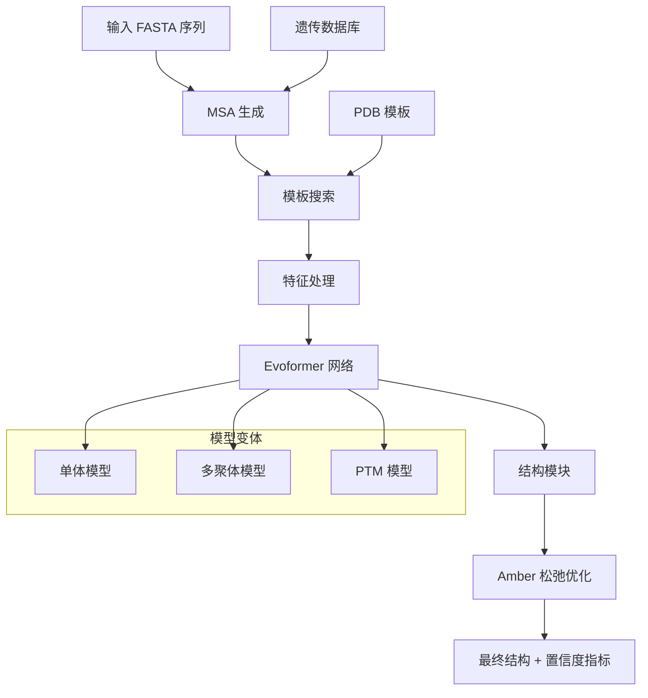

---
slug:1-overview
blog_type:normal
---


AlphaFold 是一种革命性的蛋白质结构预测系统，它使用深度学习技术从氨基酸序列预测蛋白质的三维结构，具有极高的准确性。本实现提供了 AlphaFold v2.3.0 的完整推理流程，包括单体和多聚体预测功能。

## AlphaFold 的功能

AlphaFold 解决了基础的"蛋白质折叠问题"——即仅根据氨基酸序列预测蛋白质链如何折叠成其三维结构。这一突破彻底改变了结构生物学、药物发现以及我们对生物过程的理解。

该系统结合了多序列比对(MSA)、模板结构和复杂的神经网络架构，生成高精度的结构预测结果并提供置信度指标。

## 系统架构

AlphaFold 系统采用模块化架构，通过几个关键阶段处理输入序列：



## 核心组件

### 数据处理流程
数据处理系统 ([alphafold/data/pipeline.py](alphafold/data/pipeline.py#L1)) 负责处理：
- 使用 JackHMMER、HHblits 等搜索工具生成**多序列比对(MSA)**
- **模板结构**的识别与处理
- **特征工程**：将原始生物数据转换为模型兼容的张量

### 神经网络架构
核心模型 ([alphafold/model/model.py](alphafold/model/model.py#L1)) 包含：
- **Evoformer**：基于注意力机制的模块，处理 MSA 和成对表示
- **结构模块**：从学习到的表示生成三维坐标
- **置信度预测头**：预测残基级别(pLDDT)和成对(PAE)的置信度分数

### 模型变体
AlphaFold 支持不同的模型配置：

| 模型类型 | 描述 | 用例 |
|------------|-------------|----------|
| **单体** | 标准单链蛋白质预测 | 大多数蛋白质结构 |
| **多聚体** | 蛋白质复合物预测 | 多条相互作用链 |
| **PTM** | 包含预测 TM 分数头 | 增强的置信度指标 |
| **CASP14** | 专门用于竞赛的集成模型 | 性能基准测试 |

## 关键特性

### 置信度指标
AlphaFold 提供复杂的置信度评估：
- **pLDDT** (预测 LDDT)：残基级别置信度分数(0-100)
- **PAE** (预测比对误差)：残基间的成对误差估计
- **pTM** (预测 TM 分数)：全局结构质量评估

### 数据库集成
系统集成多个生物数据库：
- **BFD**：用于深度 MSA 的大型数据库
- **UniRef90/UniRef30**：聚类处理的 UniProt 序列
- **MGnify**：宏基因组序列
- **PDB**：蛋白质结构模板
- **UniProt**：用于多聚体的额外序列数据

### Amber 松弛优化
使用分子动力学进行后处理优化 ([alphafold/relax/](alphafold/relax/)) 可改善结构质量并消除空间冲突。

## 项目结构

代码库按逻辑模块组织：

```
alphafold/
├── common/          # 共享工具和数据结构
├── data/           # 数据处理和特征生成
├── model/          # 神经网络架构和训练
├── relax/          # 结构优化和精修
└── notebooks/      # 使用示例和可视化
```

<CgxTip>模块化设计使研究人员能够在保持整体流程完整性的同时定制各个组件。</CgxTip>

## 快速开始

要开始使用 AlphaFold，你需要：

1. **硬件要求**：配备现代 NVIDIA GPU 的 Linux 系统和 2-3 TB 存储空间
2. **软件设置**：安装 Docker 和 NVIDIA Container Toolkit
3. **数据库下载**：556 GB 的压缩遗传数据库
4. **输入准备**：包含目标序列的 FASTA 文件

主要入口点是通过 Docker 容器 ([docker/run_docker.py](docker/run_docker.py#L1)) 或原生脚本 ([run_alphafold.py](run_alphafold.py#L1))。

## 后续步骤

详细设置说明请参考 [快速入门](2-quick-start)。安装指南请见 [Docker 安装](3-docker-installation)。了解数据库要求请访问 [数据库配置](4-database-configuration)。

如需深入的技术理解，请探索 [模型架构概述](11-model-architecture-overview) 或了解 [Evoformer 模块设计](9-evoformer-module-design)。