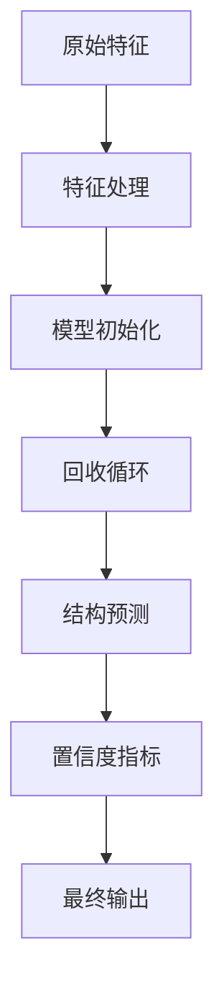

---
slug:11-model-architecture-overview
blog_type:normal
---

AlphaFold的架构通过深度学习与生物学原理的创新融合，代表了蛋白质结构预测领域的突破性进展。该系统采用精密的多阶段处理流程，整合序列信息、进化数据和结构模板，从而生成高精度的三维蛋白质模型。

## 核心架构组件

AlphaFold模型围绕多个关键架构模块构建，这些模块协同工作，将输入特征转化为结构预测：

### 1. 输入处理与嵌入

模型首先通过`EmbeddingsAndEvoformer`模块[modules.py#L1904-L1940]将原始输入特征嵌入到学习到的表示空间中。此阶段处理：

- **MSA嵌入**：多序列比对特征通过线性投影处理，生成初始MSA表示
- **配对表示**：目标特征转化为捕获残基间关系的配对表示
- **模板整合**：结构模板信息被嵌入并整合到表示空间中

### 2. Evoformer堆栈

AlphaFold的核心是Evoformer堆栈，通过重复的`EvoformerIteration`块[modules.py#L1751-L1766]实现。每次迭代执行：

- **MSA注意力**：按行和按列的注意力机制处理进化信息
- **配对表示更新**：三角形注意力和乘法运算优化残基关系
- **信息交换**：`OuterProductMean`模块[modules.py#L1600-L1615]连接MSA和配对表示

### 3. 结构模块

结构模块在`folding.py`中实现，通过以下方式将学习到的表示转换为三维坐标：

- **不变点注意力**：在三维空间中运行的几何感知注意力机制[folding.py#L37-L100]
- **刚体变换**：更新蛋白质主链和侧链位置
- **迭代优化**：多次折叠迭代逐步提升结构精度

## 模型变体与配置

AlphaFold提供多种针对不同预测任务优化的模型预设：

| 模型类型 | 变体 | 关键特性 |
|----------|------|----------|
| **单体** | model_1-5 | 单链蛋白质预测 |
| **单体PTM** | model_1_ptm-5_ptm | 包含预测TM-score输出层 |
| **多聚体** | model_1_multimer_v3-5_multimer_v3 | 蛋白质复合物预测 |

配置系统[config.py#L30-L53]允许对模型参数进行精细调整，针对不同用例提供优化预设。各变体在模板使用、MSA处理深度和输出层等方面存在差异。

## 回收机制

关键架构创新是在`AlphaFold`类[modules.py#L289-L320]中实现的回收机制。模型通过反馈中间结果迭代优化预测：

1. 基于原始输入的初始预测
2. 从预测结构中提取特征
3. 带附加上下文的重新输入
4. 最终优化预测

这种方法使模型能够逐步提升对蛋白质几何结构及序列-结构关系的理解。

## 预测输出层

模型通过专用预测输出层生成多种输出：

- **距离图输出层**[modules.py#L1519-L1560]：预测残基间距离分布
- **预测LDDT输出层**[modules.py#L1079-L1134]：估算每个残基的置信度分数
- **预测对齐误差输出层**[modules.py#L1181-L1225]：提供模型排序的对齐误差估计
- **掩码MSA输出层**[modules.py#1027-L1069]：进化信息学习的辅助任务

## 模型执行流程

`RunModel`类[model.py#L73-L194]提供模型执行接口：

该流程支持单体和多聚体模式，根据模型类型自动配置。系统处理特征预处理、参数初始化和置信度指标的后处理。

## 关键架构创新

AlphaFold的成功源于多项架构创新：

1. **三角形注意力**：遵循蛋白质几何特性的专用注意力模式
2. **Evoformer设计**：通过多模态迭代优化表示
3. **端到端可微性**：从序列到结构的直接优化
4. **模板整合**：在保持灵活性的同时利用已知结构

该架构展示了神经网络组件的精心设计如何捕获复杂的生物学关系，并在蛋白质结构预测领域实现前所未有的精度。

要深入了解特定组件，请参考[Evoformer模块设计](9-evoformer-module-design)和[注意力机制](10-attention-mechanisms)章节，其中提供了核心架构创新的详细分析。