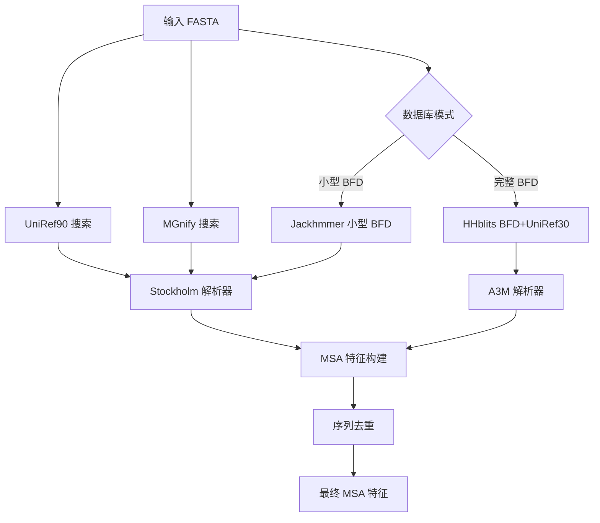

---
slug:12-msa-generation-and-processing
blog_type:normal
---

# 多序列比对（MSA）生成与处理流程

多序列比对（MSA）生成与处理流程是 AlphaFold 输入准备工作流中的关键组成部分。该系统通过搜索多个蛋白质数据库来收集进化信息，这些信息通过同源序列分析为结构预测提供依据。

## MSA 生成架构

AlphaFold 采用多数据库搜索策略来构建全面的多序列比对。核心 `DataPipeline` 类使用专业比对工具协调三个主要数据库的搜索：

- **UniRef90**：90% 相似度阈值下的高质量非冗余序列
- **BFD/UniRef30**：用于更广泛覆盖的宏基因组和聚类序列
- **MGnify**：环境宏基因组序列

该流程根据计算资源支持两种运行模式：
- **小型 BFD 模式**：使用 Jackhmmer 进行紧凑型数据库搜索
- **完整 BFD 模式**：采用 HHblits 实现全面的宏基因组覆盖

## 比对工具与配置

### Jackhmmer 集成

Jackhmmer 封装器提供基于 HMM 的迭代搜索，支持可配置参数：

- **迭代次数**：默认为 1，可根据灵敏度需求调整
- **E 值阈值**：0.0001 用于显著匹配
- **CPU 并行化**：可配置的线程分配
- **数据库流式处理**：支持大型数据库分块处理

UniRef90 搜索的关键配置参数包括 `uniref_max_hits`（默认 10,000）用于控制结果大小，以及 `mgnify_max_hits`（默认 501）用于宏基因组序列。

### HHblits 集成

HHblits 能够对大型数据库进行快速谱 HMM 搜索：

- **默认参数**：20 次迭代，Z 值截断为 500
- **数据库链式搜索**：同时进行 BFD 和 UniRef30 搜索
- **序列过滤**：可配置的 maxseq 和过滤阈值

## MSA 特征处理

### 特征构建流程

`make_msa_features` 函数将原始比对数据转换为模型就绪的特征：

1. **序列编码**：使用 `HHBLITS_AA_TO_ID` 映射将氨基酸转换为整数 ID
2. **删除矩阵**：跟踪相对于查询序列的比对间隙和插入
3. **物种识别**：从序列头信息中提取分类学信息
4. **去重处理**：移除所有数据库中的冗余序列

### 数据结构

每个处理后的 MSA 包含：
- **`msa`**：整数编码的比对矩阵 [序列数量 × 序列长度]
- **`deletion_matrix_int`**：每个位置的间隙计数 [序列数量 × 序列长度]
- **`msa_species_identifiers`**：用于进化权重的分类学元数据
- **`num_alignments`**：每个残位点的总序列数

### 解析器实现

系统支持多种比对格式：

#### Stockholm 格式解析器
- 处理以查询序列为中心的比对并保留间隙
- 通过比较查询序列与比对序列计算删除矩阵
- 移除查询序列间隙列以优化比对密度

#### A3M 格式解析器
- 处理 HHblits 输出并处理插入序列
- 在移除不必要间隙的同时保持比对结构
- 支持序列截断以进行内存管理

## 物种识别与元数据

`msa_identifiers` 模块从序列头信息中提取生物学上下文：

- **UniProt 模式匹配**：识别 `db|UniqueIdentifier|EntryName` 格式
- **物种提取**：识别分类学来源用于进化权重计算
- **元数据解析**：处理各种数据库标识符约定

这些信息使模型能够应用适当的进化约束，并将预测偏向生物学上合理的构象。

## 模板集成

MSA 处理直接输入到模板搜索工作流中：

1. **MSA 预处理**：为模板搜索进行去重和间隙移除
2. **格式转换**：在模板搜索器需要时将 Stockholm 转换为 A3M 格式
3. **模板特征生成**：使用处理后的 MSA 识别结构同源物

该流程确保模板搜索能够受益于与基于 MSA 的预测所使用的相同高质量比对数据。

## 性能考虑

### 内存管理
- **流式支持**：大型数据库以可配置的分块方式处理
- **序列截断**：根据资源限制对比对大小进行可选限制
- **格式优化**：优先使用 Stockholm 格式以提高内存效率

### 计算扩展性
- **并行处理**：多线程比对工具执行
- **预计算 MSA**：支持缓存以重复序列分析
- **数据库选择**：根据可用计算资源进行配置

MSA 生成流程在全面的进化覆盖率和计算效率之间实现了复杂的平衡，为 AlphaFold 提供了准确结构预测所需的丰富序列信息。

要了解这些 MSA 特征如何与模板搜索集成，请参阅[模板搜索集成](13-template-search-integration)。处理后的 MSA 数据输入到[特征工程](14-feature-engineering)流程中进行最终的模型输入准备。