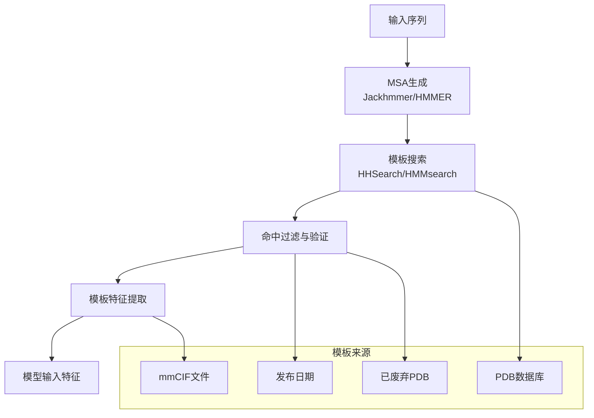

---
slug:13-template-search-integration
blog_type:normal
---

模板搜索集成是AlphaFold蛋白质结构预测流程中的关键组件，使模型能够利用已知蛋白质结构的进化信息。该系统识别并处理同源蛋白质模板，为目标序列提供结构约束。

## 模板搜索架构

模板搜索集成采用多阶段流程，结合基于序列的搜索与结构特征提取。该过程从MSA生成开始，经过模板识别、过滤和特征提取等步骤。

## 模板搜索方法

AlphaFold支持两种主要的模板搜索算法，每种算法都通过专门的特征提取器类实现：

### HHSearch集成

`HhsearchHitFeaturizer`类处理来自HHSearch的模板命中结果，该方法使用隐马尔可夫模型来寻找远缘同源体[templates.py#L985-L991](alphafold/data/templates.py#L985-L991)。这种方法在检测远距离进化关系时特别有效。

### HMMsearch集成

`HmmsearchHitFeaturizer`处理来自HMMsearch的模板命中结果，提供另一种搜索策略，可能更适合某些蛋白质家族[templates.py#L1053-L1058](alphafold/data/templates.py#L1053-L1058)。

两种特征提取器都继承自抽象基类`TemplateHitFeaturizer`，确保一致的接口和处理逻辑[templates.py#L914-L982](alphafold/data/templates.py#L914-L982)。

## 模板特征集

模板系统为每个有效模板提取五个关键特征：

| 特征 | 数据类型 | 描述 |
|---------|-----------|-------------|
| `template_aatype` | np.float32 | 模板残基的氨基酸类型 |
| `template_all_atom_masks` | np.float32 | 原子可用性的二进制掩码 |
| `template_all_atom_positions` | np.float32 | 模板原子的3D坐标 |
| `template_domain_names` | object | PDB标识符和链信息 |
| `template_sequence` | object | 模板蛋白质序列 |
| `template_sum_probs` | np.float32 | 模板质量评分 |

这些特征在`TEMPLATE_FEATURES`常量中定义[templates.py#L88-L95](alphafold/data/templates.py#L88-L95)。

## 流程集成

模板搜索通过`DataPipeline`类无缝集成到AlphaFold的主数据流程中[pipeline.py#L123-L144](alphafold/data/pipeline.py#L123-L144)。该过程在MSA生成之后、特征组装之前进行：

1. **MSA准备**：Uniref90 MSA经过去重和格式化处理以供模板搜索使用[pipeline.py#L206-L210](alphafold/data/pipeline.py#L206-L210)

2. **模板查询**：格式化后的MSA在模板数据库中进行查询[pipeline.py#L212-L221](alphafold/data/pipeline.py#L212-L221)

3. **命中处理**：解析并验证模板命中结果[pipeline.py#L232-L234](alphafold/data/pipeline.py#L232-L234)

4. **特征提取**：将有效模板转换为模型特征[pipeline.py#L257-L259](alphafold/data/pipeline.py#L257-L259)

## 模板验证与过滤

模板经过严格验证以确保质量并防止数据泄露：

### 预过滤标准

`_assess_hhsearch_hit`函数实现了多项验证检查[templates.py#L175-L206](alphafold/data/templates.py#L175-L206)：

- **日期验证**：排除截止日期之后发布的模板，防止时间数据泄露
- **比对比例**：与查询序列的最小序列比对比例为10%（`min_align_ratio = 0.1`）
- **重复检测**：拒绝作为查询序列子序列的模板（>95%重叠）
- **长度要求**：模板必须满足最小长度标准

### 已废弃PDB处理

系统维护已废弃PDB条目与其替代品的映射关系，确保正确处理或跳过已弃用的结构[templates.py#L777-L785](alphafold/data/templates.py#L777-L785)。

## 错误处理与鲁棒性

模板系统通过专门的异常类提供全面的错误处理：

- **预过滤错误**：`DateError`、`AlignRatioError`、`DuplicateError`、`LengthError`[templates.py#L68-L85](alphafold/data/templates.py#L68-L85)
- **处理错误**：`NoChainsError`、`SequenceNotInTemplateError`、`NoAtomDataInTemplateError`[templates.py#L39-L52](alphafold/data/templates.py#L39-L52)

每个模板命中结果都独立处理，收集错误和警告用于报告，而不会停止整个流程[templates.py#L763-L800](alphafold/data/templates.py#L763-L800)。

## 模板特征提取

核心特征提取在`_extract_template_features`中进行，该函数将模板结构与查询序列对齐并提取原子坐标[templates.py#L544-L580](alphafold/data/templates.py#L544-L580)。该过程包括：

- **序列比对**：使用Kalign将模板序列重新比对到查询序列
- **原子位置映射**：索引模板原子以匹配查询残基
- **距离验证**：检查CA-CA距离以确保结构完整性

<CgxTip>模板特征对于准确的结构预测至关重要，它们提供进化约束，引导模型生成生物学上合理的构象。</CgxTip>

## 配置与自定义

模板系统通过特征提取器构造函数参数实现高度可配置：

- `max_template_date`：控制模板包含的时间截止点
- `max_hits`：限制处理的模板数量（默认值因实现而异）
- `strict_error_check`：为关键应用启用更严格的验证
- `mmcif_dir`：指定模板结构文件的位置

<CgxTip>模板搜索集成设计为模块化，允许研究人员替换不同的搜索算法或验证标准，同时保持与主AlphaFold流程的兼容性。</CgxTip>

## 后续步骤

要了解模板特征如何在模型架构中使用，请参阅[模板嵌入系统](22-template-embedding-systems)。有关完整的数据处理流程，请参考[特征工程](14-feature-engineering)。要了解使用这些模板特征的整体模型架构，请参见[模型架构概述](11-model-architecture-overview)。