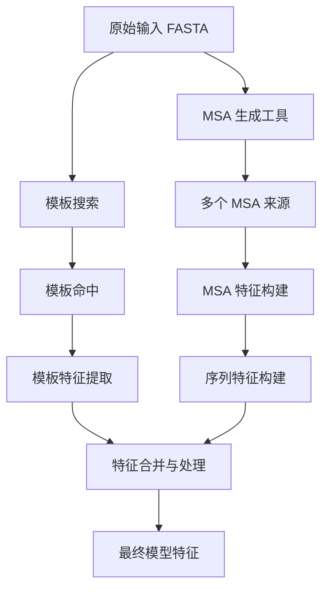
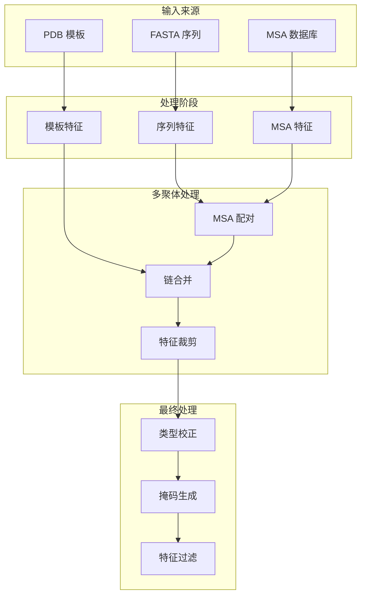

---
slug:14-feature-engineering
blog_type:normal
---


AlphaFold 中的特征工程通过复杂的多阶段管道将原始生物数据转换为结构化的神经网络输入。该过程将序列、多序列比对(MSA)和结构模板转换为驱动 Evoformer 架构的特征表示。

## 核心特征管道架构

特征工程管道遵循分层转换过程：



### 主要数据来源

该管道整合三个基础数据来源：

**MSA 生成**：多序列比对工具查询多样化数据库：
- **UniRef90**：通过 JackHMMER 获取高质量序列簇
- **BFD/Small BFD**：通过 HHblits 获取海量序列集合
- **MGnify**：通过 JackHMMER 获取宏基因组序列

**模板搜索**：通过 HHsearch 或 HMMsearch 对 PDB 数据库进行结构同源体识别，并采用时间过滤防止信息泄露 [pipeline.py#L174-L220](alphafold/data/pipeline.py#L174-L220)。

**序列特征**：将氨基酸主序列转换为独热编码和位置编码 [pipeline.py#L37-L56](alphafold/data/pipeline.py#L37-L56)。

## 特征构建过程

### 序列特征生成

`make_sequence_features` 函数创建基础的序列表示：

```python
features['aatype'] = residue_constants.sequence_to_onehot(
    sequence=sequence,
    mapping=residue_constants.restype_order_with_x,
    map_unknown_to_x=True,
)
features['residue_index'] = np.array(range(num_res), dtype=np.int32)
features['seq_length'] = np.array([num_res] * num_res, dtype=np.int32)
```

这会生成独热编码的氨基酸类型、残基位置和序列长度指示符，作为所有后续特征处理的主干 [pipeline.py#L37-L56](alphafold/data/pipeline.py#L37-L56)。

### MSA 特征构建

`make_msa_features` 函数将多序列比对处理为结构化数组：

**核心 MSA 特征**：
- `msa`：所有比对中的整数编码氨基酸序列
- `deletion_matrix_int`：每个比对位置的间隙信息
- `msa_species_identifiers`：用于进化加权的分类学信息
- `num_alignments`：MSA 中的序列总数

系统会对序列进行去重并提取物种标识符以支持进化多样性分析 [pipeline.py#L57-L93](alphafold/data/pipeline.py#L57-L93)。

### 模板特征提取

模板处理将结构同源体转换为空间特征：

**模板特征集** [templates.py#L88-L97](alphafold/data/templates.py#L88-L97)：
- `template_aatype`：独热编码的模板序列
- `template_all_atom_positions`：所有原子的 3D 坐标
- `template_all_atom_masks`：原子位置的有效性指示符
- `template_sum_probs`：比对置信度分数
- `template_domain_names`：模板识别元数据

`TemplateHitFeaturizer` 处理复杂操作，包括序列重新比对、距离验证和时间过滤以确保模板质量 [templates.py#L914-L983](alphafold/data/templates.py#L914-L983)。

## 多聚体特征处理

对于蛋白质复合物，管道采用复杂的配对策略：

### MSA 配对逻辑

`pair_and_merge` 函数协调多聚体特异性处理 [feature_processing.py#L74-L110](alphafold/data/feature_processing.py#L74-L110)：

1. **同源寡聚体检测**：识别相同链以跳过不必要的配对
2. **序列配对**：使用相似性度量匹配链间的直系同源序列
3. **特征裁剪**：限制 MSA 大小以防止内存问题 (`MSA_CROP_SIZE = 2048`)
4. **链合并**：使用适当的填充和掩码合并特征

### MSA 统计与配对

`MSAStatistics` 类通过分析实现智能序列配对：

- **物种多样性**：按分类学标识符对序列分组
- **序列相似性**：计算与目标序列的相似度
- **间隙含量**：通过间隙百分比衡量比对质量

这些信息驱动 `create_paired_features` 函数，该函数基于进化关系匹配链间序列 [msa_pairing.py#L153-L187](alphafold/data/msa_pairing.py#L153-L187)。

<CgxTip>
配对算法使用 90% 序列相似性阈值和 50% 间隙含量阈值，确保高质量的链间匹配，同时在最终特征集中保持进化多样性。
</CgxTip>

## 最终特征处理

`process_final` 函数在模型输入前应用关键转换：

### 特征标准化

**MSA 残基类型校正**：使用映射数组将氨基酸编码与模型期望对齐 [feature_processing.py#L207-L214](alphafold/data/feature_processing.py#L207-L214)。

**掩码生成**：为序列有效性和 MSA 覆盖率创建二进制掩码：
```python
np_example['seq_mask'] = (np_example['entity_id'] > 0).astype(np.float32)
np_example['msa_mask'] = np.ones_like(np_example['msa'], dtype=np.float32)
```

**特征过滤**：使用 `REQUIRED_FEATURES` 常量确保只有必需的特征到达模型 [feature_processing.py#L231-L233](alphafold/data/feature_processing.py#L231-L233)。

### 张量处理

模型特征模块通过 `np_example_to_features` 和 `tf_example_to_features` 函数提供基于 TensorFlow 的预处理。这些函数处理：

- **数据类型转换**：确保神经网络操作的正确数据类型
- **删除矩阵处理**：将整数矩阵转换为浮点表示
- **批处理**：对特征集应用一致的转换 [features.py#L82-L114](alphafold/model/features.py#L82-L114)。

## 特征集成架构

完整的特征工程管道代表一个复杂的数据转换系统：



<CgxTip>
管道严格区分单体和多聚体处理路径，多聚体管道因 MSA 配对和链合并操作增加约 30% 的计算开销。
</CgxTip>

## 与模型架构的集成

工程化特征直接输入到 Evoformer 模块中，其中：

- **MSA 特征**驱动 MSA 堆栈进行进化信息处理
- **模板特征**通过模板堆栈提供结构先验
- **序列特征**为成对表示建立基础
- **掩码和元数据**确保正确的注意力计算和损失计算

特征工程与模型架构之间的紧密集成使 AlphaFold 能够对蛋白质结构和进化进行复杂理解。

要深入了解这些特征在模型中的使用方式，请参阅 [Evoformer 模块设计](9-evoformer-module-design) 和 [模型架构概述](11-model-architecture-overview)。