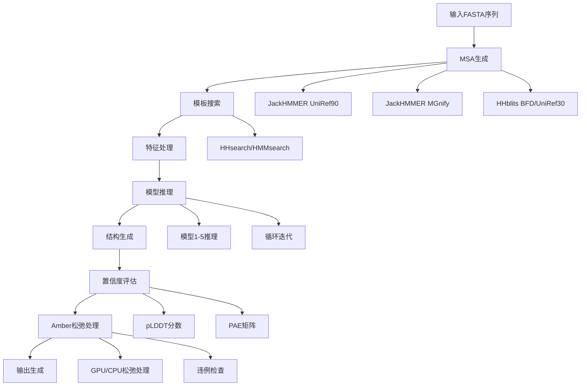

---
slug:15-structure-prediction-workflow
blog_type:normal
---

AlphaFold结构预测工作流是一个复杂的处理管道，通过一系列明确定义的计算阶段将蛋白质序列转化为三维结构模型。该工作流整合了多序列比对、模板搜索、神经网络推理和结构优化，以生成高置信度的蛋白质结构预测。

## 工作流概述

完整的结构预测过程遵循由主脚本`run_alphafold.py`[run_alphafold.py](run_alphafold.py#L15)协调的系统化管道。该工作流可视化为多阶段过程：

## 输入处理与特征生成

工作流通过数据管道组件处理输入的FASTA文件开始。`DataPipeline.process()`方法[pipeline.py](alphafold/data/pipeline.py#L174)协调多序列比对生成和模板搜索：

1. **MSA生成**：执行三个并行搜索：
   - **UniRef90**：使用JackHMMER寻找同源序列[pipeline.py](alphafold/data/pipeline.py#L185)
   - **MGnify**：通过JackHMMER进行宏基因组数据库搜索[pipeline.py](alphafold/data/pipeline.py#L193)
   - **BFD/UniRef30**：使用完整BFD数据库的HHblits或小型BFD的JackHMMER[pipeline.py](alphafold/data/pipeline.py#L238)

2. **模板搜索**：管道基于MSA结果使用HHsearch或HMMsearch搜索结构模板[pipeline.py](alphafold/data/pipeline.py#L207)

3. **特征组装**：所有生成的特征被组合成包含序列特征、MSA特征和模板特征的综合特征字典[pipeline.py](alphafold/data/pipeline.py#L270)

## 模型推理与结构生成

特征准备就绪后，工作流进入神经网络推理阶段：

### 模型处理管道

`predict_structure()`函数[run_alphafold.py](run_alphafold.py#L345)管理核心推理循环：

1. **特征处理**：每个模型运行器通过`model_runner.process_features()`处理原始特征[run_alphafold.py](run_alphafold.py#L395)

2. **结构预测**：神经网络通过`model_runner.predict()`预测三维坐标和置信度指标[run_alphafold.py](run_alphafold.py#L402)

3. **结构模块**：折叠过程使用`StructureModule`[folding.py](alphafold/model/folding.py#L465)，该模块通过多次折叠迭代实现核心结构生成算法

### 置信度指标生成

模型生成多个置信度指标：

- **pLDDT**（预测LDDT）：存储在B因子列中的残基级置信度分数[run_alphafold.py](run_alphafold.py#L438)
- **PAE**（预测对齐误差）：用于多聚体评估的残基间误差估计[run_alphafold.py](run_alphafold.py#L446)
- **排序置信度**：用于模型选择的整体模型置信度[run_alphafold.py](run_alphafold.py#L447)

## 结构优化与输出生成

### Amber松弛处理

预测结构通过Amber松弛处理进行优化：

1. **松弛选择**：根据`models_to_relax`参数，最佳模型、所有模型或无模型进行松弛处理[run_alphafold.py](run_alphafold.py#L466)

2. **Amber处理**：`AmberRelaxation.process()`方法[relax.py](alphafold/relax/relax.py#L60)执行能量最小化以解决结构违例并改善立体化学

3. **违例评估**：系统跟踪剩余结构违例并生成松弛指标[run_alphafold.py](run_alphafold.py#L476)

### 输出生成

工作流生成多种输出格式：

| 输出类型 | 描述 | 文件格式 |
|-------------|-------------|-------------|
| 未松弛结构 | 原始神经网络预测 | PDB, mmCIF |
| 松弛结构 | 能量最小化预测 | PDB, mmCIF |
| 置信度指标 | pLDDT和PAE分数 | JSON |
| 排序结果 | 模型置信度排序 | 排序PDB文件 |
| 特征 | 完整特征字典 | Pickle |

<CgxTip>
工作流通过不同的模型预设（'monomer'、'monomer_casp14'、'monomer_ptm'、'multimer'）支持单体和多聚体预测模式[run_alphafold.py](run_alphafold.py#L169)，每种模式针对特定预测场景进行了优化。
</CgxTip>

## 性能优化

工作流包含多项优化功能：

- **基准模式**：从计时测量中排除编译时间[run_alphafold.py](run_alphafold.py#L176]
- **预计算MSA**：允许重用先前生成的MSA数据[run_alphafold.py](run_alphafold.py#L203]
- **GPU加速**：可选的基于GPU的松弛处理以加快处理速度[run_alphafold.py](run_alphafold.py#L227]
- **并行处理**：为不同MSA工具配置CPU分配[run_alphafold.py](run_alphafold.py#L235]

<CgxTip>
工作流在整个管道中实现了复杂的计时跟踪，能够对每个计算阶段进行性能分析和优化识别[run_alphafold.py](run_alphafold.py#L398]。
</CgxTip>

## 模型选择与排序

所有模型完成推理后，系统基于置信度分数对预测进行排序：

1. **置信度提取**：从预测结果中提取每个模型的排序置信度[run_alphafold.py](run_alphafold.py#L447]

2. **模型排序**：模型按置信度降序排列[run_alphafold.py](run_alphafold.py#L463]

3. **最终输出**：生成带数字前缀（ranked_0.pdb、ranked_1.pdb等）的排序PDB文件，表示置信度顺序[run_alphafold.py](run_alphafold.py#L508]

这个全面的工作流确保用户不仅能获得结构预测，还能获得详细的置信度评估和多种排序选项，从而在下游应用中做出明智决策。

有关特定组件的更多详细信息，你可以探索[置信度指标（pLDDT、PAE）](16-confidence-metrics-plddt-pae)和[Amber松弛处理过程](17-amber-relaxation-process)文档。