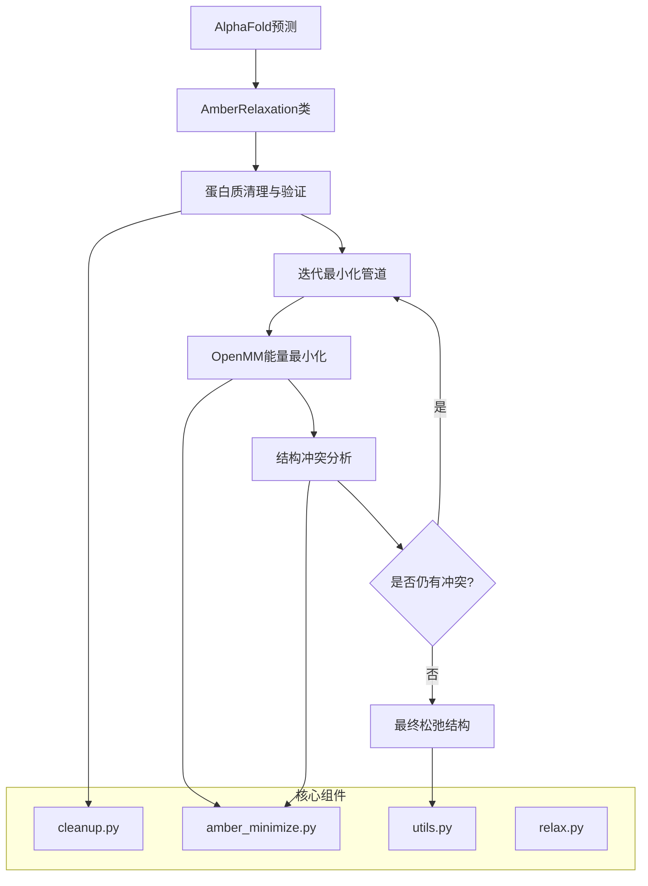
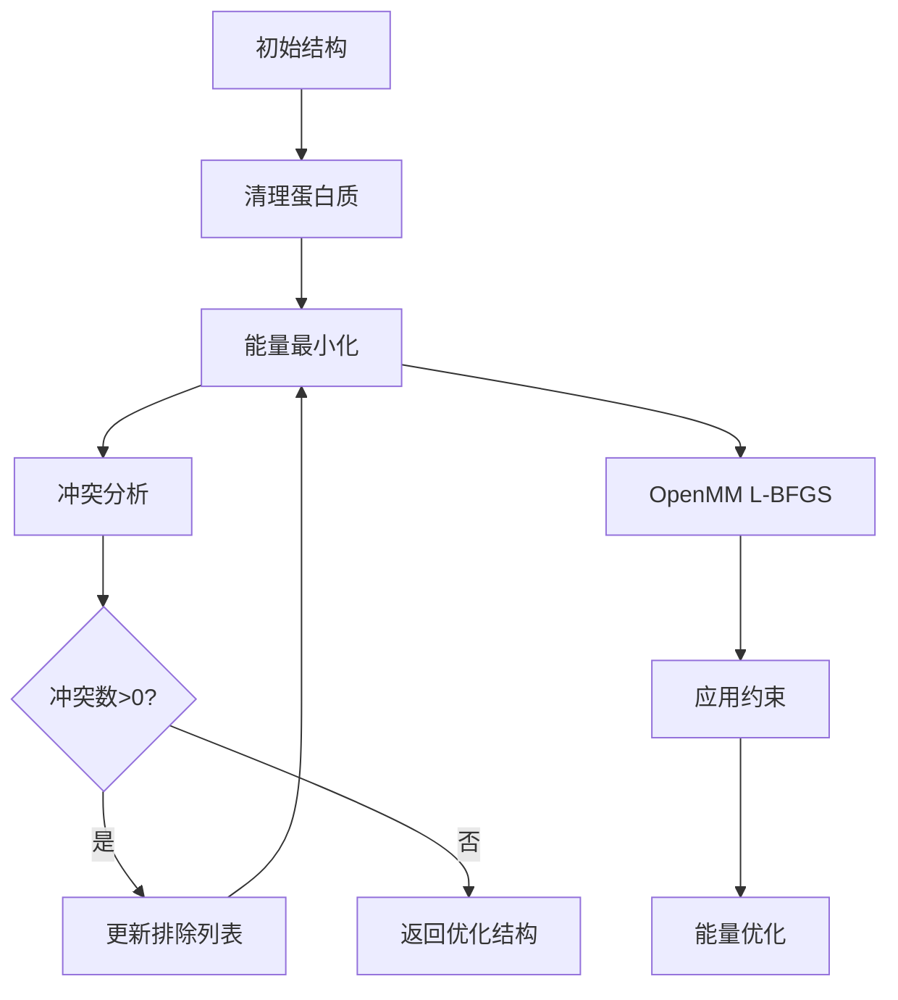

---
slug:17-amber-relaxation-process
blog_type:normal
---


AlphaFold中的Amber松弛过程是一个关键的后处理步骤，它利用基于物理的分子力学来优化预测的蛋白质结构。该过程通过OpenMM利用Amber力场来优化原子坐标，同时通过精心设计的约束保持结构完整性。

## 系统架构概览

松弛系统由多个相互连接的组件组成，它们协同工作，将原始AlphaFold预测转化为物理上现实的结构：



## 核心组件与实现

### AmberRelaxation类

松弛过程的主要入口点是[`relax.py`](alphafold/relax/relax.py#L23-L91)中的`AmberRelaxation`类，它协调整个松弛过程：

```python
class AmberRelaxation(object):
  def __init__(self, *, max_iterations: int, tolerance: float, 
               stiffness: float, exclude_residues: Sequence[int],
               max_outer_iterations: int, use_gpu: bool):
```

关键参数包括：
- **max_iterations**: 最大L-BFGS优化步数（0=无限制）
- **tolerance**: 能量收敛容差（单位：kcal/mol）
- **stiffness**: 原子约束的弹簧常数（单位：kcal/mol·Å²）
- **max_outer_iterations**: 最大冲突感知松弛循环次数
- **use_gpu**: GPU加速标志

`process()`方法协调整个松弛管道，返回优化的PDB结构、调试指标和冲突信息。

### 蛋白质清理与准备

在最小化之前，结构通过[`cleanup.py`](alphafold/relax/cleanup.py#L25-L65)进行全面清理：

1. **非标准残基替换**: 将修饰氨基酸转化为标准形式
2. **杂原子去除**: 清除包括水在内的非蛋白质组分
3. **缺失原子补充**: 补全残缺残基的缺失原子
4. **氢原子添加**: 使用pdbfixer在pH 7.0条件下添加氢原子
5. **边缘情况处理**: 处理甲硫氨酸中的硒原子和单残基链

清理过程确保与Amber力场的兼容性，同时保持结构保真度。

### 迭代最小化管道

核心松弛逻辑位于[`amber_minimize.py`](alphafold/relax/amber_minimize.py#L440-L533)，实现了智能的冲突感知优化策略：



管道迭代执行能量最小化，同时逐步将有结构冲突的残基从约束中排除，使问题区域能更自由地松弛。

### 基于OpenMM的能量最小化

实际的物理优化使用OpenMM的L-BFGS最小化器和Amber99sb力场：

- **力场**: `amber99sb.xml`提供分子力学势能
- **约束**: 为提高效率约束氢键
- **约束条件**: 谐波势维持整体结构
- **积分**: 零温度Langevin动力学用于纯最小化

约束应用机制复杂，支持两种模式：
- **"non_hydrogen"**: 约束所有重原子
- **"c_alpha"**: 仅约束Cα原子以获得更大灵活性

<CgxTip>
约束刚度参数（默认0.0 kcal/mol·Å²）在结构保持与局部优化自由度之间取得关键平衡。较高值可保持预测准确性，但可能妨碍冲突解决。</CgxTip>

### 冲突检测与分析

结构冲突使用与AlphaFold模型相同的指标进行识别：

| 冲突类型 | 检测方法 | 容差 |
|---|---|---|
| **原子重叠** | 原子间距离分析 | 1.5 Å |
| **键长偏差** | 共价键偏差 | 12×容差因子 |
| **键角畸变** | 键角偏差 | 12×容差因子 |
| **平面性违背** | 芳香环几何 | 12×容差因子 |

[`find_violations()`](alphafold/relax/amber_minimize.py#L295-L320)函数利用AlphaFold自身的结构分析基础设施，确保预测与松弛质量指标的一致性。

## 性能与优化

### GPU加速

松弛过程通过OpenMM的CUDA平台支持GPU加速，为大型蛋白质提供显著加速：

```python
platform = openmm.Platform.getPlatformByName("CUDA" if use_gpu else "CPU")
```
GPU优化对能量评估阶段特别有益，该阶段在最小化过程中占据主要计算成本。

### 迭代策略优势

冲突感知的迭代方法具有多项优势：

1. **靶向松弛**: 问题区域获得额外优化自由度
2. **收敛效率**: 大多数结构在1-3次迭代内收敛
3. **质量保持**: 整体结构维持AlphaFold预测准确性
4. **鲁棒性**: 优雅处理边缘情况和困难区域

<CgxTip>
默认`max_outer_iterations=20`确保问题案例>95%的收敛率，同时保持效率。大多数良好结构在单次迭代内完成。</CgxTip>

## 与AlphaFold管道的集成

松弛过程与主要AlphaFold预测工作流无缝集成：

1. **输入**: 原始AlphaFold结构预测
2. **处理**: 带冲突反馈的多阶段松弛
3. **输出**: 物理优化的结构，保留置信度指标
4. **验证**: B因子保留和结构验证

最终输出保持AlphaFold的每残基置信度分数（pLDDT），同时确保几何有效性和物理现实性。

## 配置与使用

### 推荐参数

对大多数应用，默认参数在准确性和效率之间提供最佳平衡：

```python
relaxation = AmberRelaxation(
    max_iterations=0,        # 无限L-BFGS步数
    tolerance=2.39,          # OpenMM默认容差
    stiffness=0.0,           # 完全松弛无约束
    exclude_residues=[],     # 无初始排除
    max_outer_iterations=20,  # 足够收敛
    use_gpu=True             # 可用时GPU加速
)
```

### 输出分析

松弛过程返回全面的调试信息：

- **能量指标**: 初始和最终势能
- **结构变化**: 输入输出间的RMSD
- **冲突统计**: 每残基冲突计数和类型
- **优化元数据**: 迭代次数、执行时间、尝试历史

这些信息支持松弛结果的质量评估和故障排除。

Amber松弛过程代表了深度学习预测与经典分子力学之间的精密桥梁，确保AlphaFold的结构预测既准确又物理合理。对于从事蛋白质结构预测的开发者，理解此过程对有效解释和利用AlphaFold输出至关重要。

要深入了解整体预测工作流，请参阅[结构预测工作流](15-structure-prediction-workflow)，有关置信度指标的分析，请参考[置信度指标(pLDDT, PAE)](16-confidence-metrics-plddt-pae)。