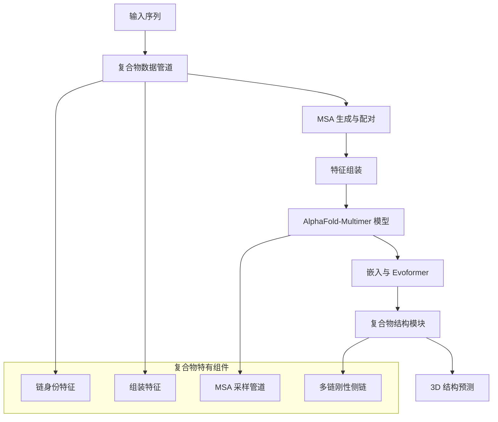

---
slug:18-alphafold-multimer-architecture
blog_type:normal
---

AlphaFold-Multimer 是原始 AlphaFold 系统的重要架构扩展，专为通过多链建模预测蛋白质复合物结构而设计。该架构引入了多项关键创新，能够准确预测蛋白质-蛋白质相互作用和组装形成。

## 核心架构概述

AlphaFold-Multimer 架构建立在单体 AlphaFold 模型的基础上，同时引入了专门用于同时处理多条蛋白质链的组件。系统保留了核心的 Evoformer 架构，但增加了关键的复合物特有模块和数据处理流程。

## 关键架构组件

### 模型架构重构

AlphaFold-Multimer 模型通过 `modules_multimer.py` 中的 `AlphaFold` 类实现 [modules_multimer.py#L427-L440]，作为主要入口点。核心架构差异在于将 MSA 采样直接集成到 JAX 模型中，从而实现更高效的循环和集成操作 [modules_multimer.py#L15-L21]。

模型通过 `AlphaFoldIteration` 实例运行 [modules_multimer.py#L310-L325]，这些实例处理单次循环迭代并从提供的特征计算集成表示。这种设计在保持计算效率的同时实现了复杂的集成平均。

### MSA 采样管道

AlphaFold-Multimer 的一项关键创新是集成的 MSA 采样机制。`sample_msa` 函数 [modules_multimer.py#L266-L300] 实现了随机 MSA 采样，其中剩余序列存储为 `extra_*` 特征。这种方法允许在训练和推理过程中动态选择 MSA，提高模型处理多样化序列信息的能力。

采样过程使用基于 Gumbel 的采样和聚类偏置掩码，在保留重要序列（如每条链的目标序列）的同时从剩余池中随机选择。这种随机采样增强了模型的鲁棒性并实现了更好的泛化能力。

### 数据处理管道

复合物特有的数据处理通过 `pipeline_multimer.py` 处理，该模块实现了专门的特征转换和组装操作。`convert_monomer_features` 函数 [pipeline_multimer.py#L79-L107] 对单体特征进行重塑和修改以适应复合物需求，包括：

- 将独热编码的氨基酸类型转换为整数格式
- 模板特征重新格式化
- 移除不必要的前导维度

`add_assembly_features` 函数 [pipeline_multimer.py#L130-L169] 引入了对复合物预测至关重要的链身份特征：
- `asym_id`：每条链的唯一标识符
- `sym_id`：对称复合物的对称标识符  
- `entity_id`：对相同序列进行分组的实体标识符

### 结构模块增强

复合物架构在 `folding_multimer.py` 中包含了专门的结构模块组件。`StructureModule` 类 [folding_multimer.py#L552-L576] 实现了考虑复合物特性的迭代折叠过程，包括增强的链边界处理和链间相互作用处理。

关键组件包括：
- `InvariantPointAttention` 用于空间推理
- `FoldIteration` 用于迭代结构优化
- `MultiRigidSidechain` 用于跨链的侧链放置

### 全原子表示

`all_atom_multimer.py` 模块提供了针对复合物结构优化的全面原子级操作。它包含专门的函数用于：
- 不同表示之间的原子坐标转换
- 跨链边界的结构违规检测
- 用于复合物评估的帧对齐点误差计算

## 架构创新

### 链身份集成

与单体 AlphaFold 不同，复合物架构在整个模型中明确整合了链身份信息。这使得网络能够区分不同的蛋白质链并有效学习链间相互作用模式。

### 动态 MSA 处理

集成的 MSA 采样管道代表了重要的架构进步，从静态 MSA 处理转向动态的、模型驱动的选择。这种方法使模型能够为每个预测场景自适应地选择最具信息量的序列比对。

### 增强的循环机制

复合物架构实现了复杂的循环机制，在迭代过程中保持链身份信息，同时实现对复合物预测的逐步优化。

## 实现考虑

AlphaFold-Multimer 架构体现了几个关键设计原则：

1. **模块化集成**：复合物特有组件与现有单体模块清晰集成，在保持代码复用的同时添加新功能。

2. **特征工程**：全面的特征工程确保链身份和组装信息在整个模型中得到正确编码。

3. **可扩展性**：该架构支持不同大小和对称性的复合物，从异源二聚体到大型对称组装体。

4. **计算效率**：尽管复杂度增加，但精心设计确保了复合物预测的合理计算需求。

这种架构设计使 AlphaFold-Multimer 能够在蛋白质复合物预测中实现最先进的性能，同时保持原始 AlphaFold 系统的效率和可靠性。