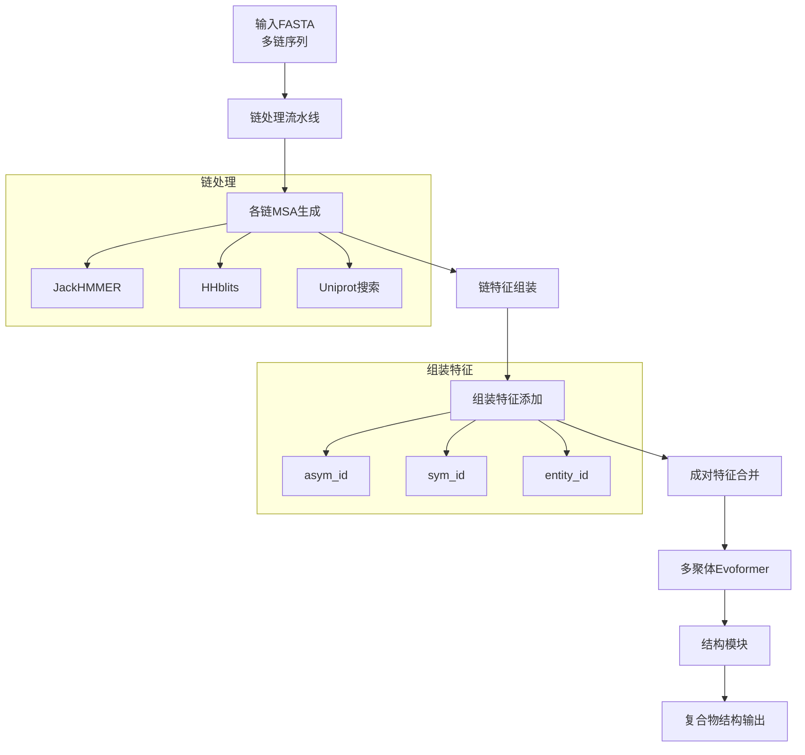

---
slug:19-protein-complex-prediction
blog_type:normal
---


AlphaFold中的蛋白质复合物预测相比单体预测实现了重大突破，能够对蛋白质-蛋白质相互作用和多链组装进行建模。该功能通过专门的多聚体架构实现，可同时处理多条蛋白质链，并利用进化信息和结构约束来预测准确的复合物形成。

## 多聚体架构概述

AlphaFold-Multimer系统在单体架构基础上进行了多项关键改进，专门针对蛋白质复合物预测设计。核心架构保留了Evoformer主干，但加入了链感知处理和专门的注意力机制。



多聚体系统在将各链合并为统一表示前会单独处理每条链。这种方法使模型能够利用链特异性的进化信息，同时通过专门特征维持链间关系。

## 数据处理流水线

多聚体数据流水线在单体处理基础上扩展了链感知特征工程和组装操作。

### 链特征处理

每条蛋白质链都经过单独的MSA生成和特征提取，通过[`pipeline_multimer.py`](alphafold/data/pipeline_multimer.py#L184-L273)中的`DataPipeline`类实现。该过程包括：

1. **单链处理**：每条链通过`_process_single_chain()`单独处理 [来源](alphafold/data/pipeline_multimer.py#L218-L247)
2. **单体特征转换**：通过`convert_monomer_features()`将链特征适配多聚体使用 [来源](alphafold/data/pipeline_multimer.py#L79-L107)
3. **组装特征添加**：通过`add_assembly_features()`添加链组装特征 [来源](alphafold/data/pipeline_multimer.py#L130-L170)

### 组装特征工程

组装过程添加了关键的链识别特征：

- **asym_id**：每个链实例的唯一标识符
- **sym_id**：同源复合物的对称性标识符  
- **entity_id**：按序列同一性分组链

这些特征使模型能够区分不同链，并识别同源复合物中的对称关系。

## 模型架构增强

### 多聚体专用模块

多聚体架构在[`modules_multimer.py`](alphafold/model/modules_multimer.py)中引入了专用模块：

1. **AlphaFold类**：扩展了多聚体专用循环功能 [来源](alphafold/model/modules_multimer.py#L427-L438)
2. **增强MSA采样**：集成了Gumbel采样用于MSA选择
3. **链感知注意力**：改进的注意力机制用于处理链间相互作用

### 配置适配

[`config.py`](alphafold/model/config.py#L460-L520)中的多聚体配置包含专用参数：

- **48个Evoformer块**以增强容量
- **多聚体专用注意力头**（MSA用8个，三角形用4个）
- **增强的dropout率**用于正则化
- **融合投影权重**以提高效率

<CgxTip>
多聚体配置使用48个Evoformer块，相比单体模型更少，这提供了额外容量来处理蛋白质-蛋白质相互作用和链间依赖关系带来的复杂性增加。
</CgxTip>

## 结构预测与折叠

[`folding_multimer.py`](alphafold/model/folding_multimer.py)中的结构模块融入了多聚体专用考量：

### 不变点注意力
`InvariantPointAttention`类[来源](alphafold/model/folding_multimer.py#L194-L383)处理不同链间残基的几何关系，在保持旋转不变性的同时捕获链间接触。

### 结构违例检测
专门的违例检测考虑了链间几何：

```python
def find_structural_violations(
    aatype: jnp.ndarray,
    residue_index: jnp.ndarray, 
    mask: jnp.ndarray,
    pred_positions: geometry.Vec3Array,
    config: ml_collections.ConfigDict,
    asym_id: jnp.ndarray,  # 链标识符
) -> Dict[str, Any]:
```

`asym_id`参数支持链特异性违例检查，确保正确的链间键合和空间约束[来源](alphafold/model/folding_multimer.py#L922-L931)。

## 使用与执行

### 命令行界面

蛋白质复合物预测通过多聚体模型预设激活：

```bash
python run_alphafold.py \
  --fasta_paths=complex.fasta \
  --model_preset=multimer \
  --max_template_date=2020-05-14
```

多聚体预测的关键参数[来源](run_alphafold.py#L168-L201)：

- **`--model_preset=multimer`**：激活多聚体架构
- **`--num_multimer_predictions_per_model`**：控制集成大小（默认：5）
- **多序列FASTA**：每个序列代表不同链

### 输入格式

多聚体预测的FASTA文件应包含多个序列：

```fasta
>chain_A
MAV... (链A序列)
>chain_B  
MKT... (链B序列)
```

系统会自动检测多序列输入并将其作为复合物处理。

## 性能考量

### 计算需求

由于以下原因，多聚体预测比单体预测需要显著更多的计算资源：

- **增加的序列长度**：所有链的组合长度
- **增强的模型容量**：48个Evoformer块 vs 单体更少
- **多次预测**：默认每个模型5次预测用于集成平均

### 内存优化

系统包含内存高效特性：
- **MSA填充**：确保最小MSA大小以避免边界情况[来源](alphafold/data/pipeline_multimer.py#L170-L173)
- **分块处理**：大型复合物分段处理
- **梯度检查点**：减少训练期间的内存占用

## 输出与分析

### 置信度指标

多聚体预测包含专用置信度分数：
- **pLDDT**：每残基置信度（与单体相同）
- **PAE**：预测对齐误差矩阵包含链间误差估计
- **iptm**：界面pTM分数专门用于界面质量

### 结构输出

系统生成完整的复合物结构，包含：
- **链特异性坐标**：以PDB/mmCIF格式维护
- **界面注释**：详细的链间接触信息
- **违例报告**：链感知结构质量评估

<CgxTip>
对于异源复合物，建议使用不同随机种子运行多次预测以提高界面预测准确性，因为界面区域可能比核心域结构更具可变性。
</CgxTip>

## 后续步骤

要全面理解蛋白质复合物预测，请探索：

- **[AlphaFold-Multimer架构](18-alphafold-multimer-architecture)**：详细架构分析
- **[异源复合物分析](20-heteromer-analysis)**：异源复合物的专门处理
- **[MSA生成与处理](12-msa-generation-and-processing)**：进化信息提取
- **[置信度指标(pLDDT, PAE)](16-confidence-metrics-plddt-pae)**：结果解释与质量评估

蛋白质复合物预测能力代表了结构生物学的重大进步，使研究人员能够以前所未有的精度对蛋白质-蛋白质相互作用进行建模，为细胞机制研究和药物靶点识别提供了深入见解。