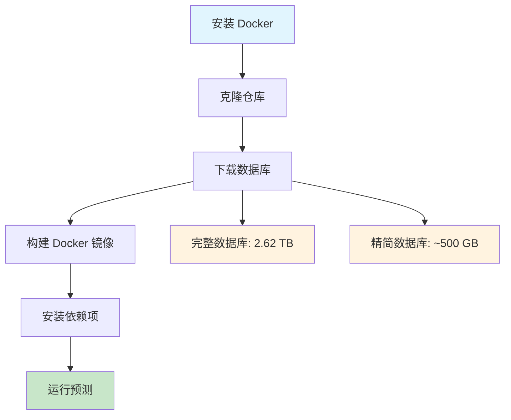
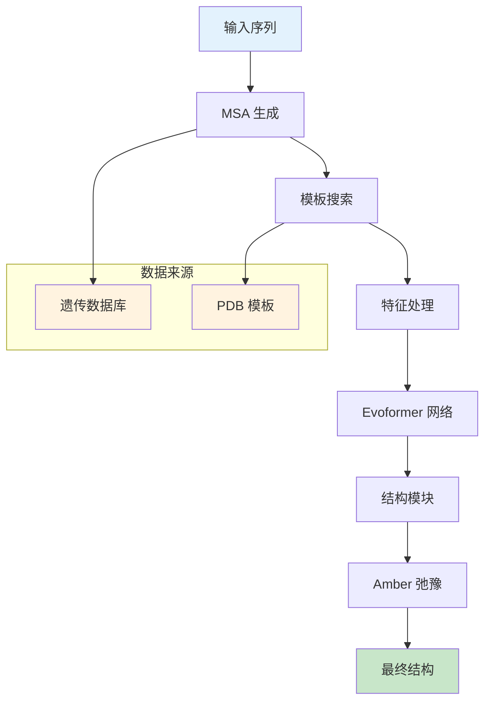

---
slug:2-quick-start
blog_type:normal
---


本指南将帮助你运行 AlphaFold 进行蛋白质结构预测。AlphaFold 使用深度学习技术，能够以卓越的精度从氨基酸序列预测 3D 蛋白质结构。

## 系统要求

在开始之前，请确保你已具备以下条件：

- **Linux 操作系统**（AlphaFold 不支持其他操作系统）
- **NVIDIA GPU** 且具备足够显存（较大的蛋白质需要更多 GPU 显存）
- **存储空间**：完整遗传数据库需要高达 3 TB（推荐使用 SSD 以获得更好性能）
- **内存**：最低 16 GB（推荐 32 GB 以上）
- **网络**：稳定的互联网连接以下载数据库

## 安装流程

完整设置包括安装 Docker、下载遗传数据库以及构建 AlphaFold 容器。工作流程如下：



### 步骤 1：安装 Docker 及 GPU 支持

首先安装 Docker 并配置 NVIDIA GPU 支持：

```bash
# 安装 Docker（如果尚未安装）
curl -fsSL https://get.docker.com -o get-docker.sh
sudo sh get-docker.sh

# 安装 NVIDIA Container Toolkit 以支持 GPU
distribution=$(. /etc/os-release;echo $ID$VERSION_ID)
curl -s -L https://nvidia.github.io/nvidia-docker/gpgkey | sudo apt-key add -
curl -s -L https://nvidia.github.io/nvidia-docker/$distribution/nvidia-docker.list | sudo tee /etc/apt/sources.list.d/nvidia-docker.list

sudo apt-get update && sudo apt-get install -y nvidia-docker2
sudo systemctl restart docker

# 将用户添加到 docker 组（可选但推荐）
sudo usermod -aG docker $USER
```

验证 GPU 访问权限：
```bash
docker run --rm --gpus all nvidia/cuda:11.0-base nvidia-smi
```

### 步骤 2：克隆仓库

```bash
git clone https://github.com/deepmind/alphafold.git
cd alphafold
```

### 步骤 3：下载遗传数据库

AlphaFold 需要多个遗传数据库进行序列比对和模板搜索。你有两种选择：

#### 选项 A：完整数据库（推荐以获得最佳精度）
```bash
# 安装必需工具
sudo apt install aria2 rsync

# 下载完整数据库（压缩后 556 GB，解压后 2.62 TB）
scripts/download_all_data.sh /path/to/download/directory > download.log 2> download_all.log &
```

#### 选项 B：精简数据库（设置更快，精度较低）
```bash
scripts/download_all_data.sh /path/to/download/directory reduced_dbs
```

<CgxTip>
**重要提示**：下载目录不应是 AlphaFold 仓库的子目录。这可以避免在创建镜像时因复制大型数据库导致 Docker 构建速度变慢。
</CgxTip>

### 步骤 4：构建 Docker 镜像

```bash
docker build -f docker/Dockerfile -t alphafold .
```

如果在构建过程中遇到 GPG 密钥错误，请参考 [README.md](README.md) 中的故障排除部分。

### 步骤 5：安装 Python 依赖项

```bash
pip3 install -r docker/requirements.txt
```

## 运行首次预测

### 准备输入

使用你的蛋白质序列创建 FASTA 文件：

```fasta
>protein_name
MAVTELRQLLQGDLKSLLEAAGANPDKGVWTYQDLPGEMKLVTLKDGKTLVQEVNKTY...
```

### 执行预测

```bash
python3 docker/run_docker.py \
  --fasta_paths=your_protein.fasta \
  --max_template_date=2022-01-01 \
  --data_dir=/path/to/download/directory \
  --output_dir=/path/to/output/directory
```

### 关键参数

| 参数 | 描述 | 默认值 | 示例 |
|-----------|-------------|---------|---------|
| `--fasta_paths` | 输入 FASTA 文件路径 | 必需 | `protein.fasta` |
| `--data_dir` | 遗传数据库目录 | 必需 | `/data/alphafold` |
| `--output_dir` | 结果输出目录 | `/tmp/alphafold` | `/results/my_protein` |
| `--max_template_date` | 使用的最新模板日期 | 当前日期 | `2022-01-01` |
| `--model_preset` | 使用的模型类型 | `monomer` | `multimer` |
| `--db_preset` | 数据库配置 | `full_dbs` | `reduced_dbs` |

### 模型预设

| 预设 | 使用场景 | 描述 |
|--------|----------|-------------|
| `monomer` | 单个蛋白质链 | 标准单体预测 |
| `monomer_casp14` | CASP14 基准测试 | 带额外集成的单体 |
| `monomer_ptm` | 置信度估计 | 带 pTM 头的单体 |
| `multimer` | 蛋白质复合物 | 用于复合物的 AlphaFold-Multimer |

## 理解输出结果

成功运行后，输出目录将包含：

- `result_model_1_pred_0.pdb` - 预测的 3D 结构
- `ranking_debug.json` - 模型置信度分数
- `timings.json` - 性能指标
- `msas/` - 使用的多重序列比对
- `features/` - 模型的输入特征

最重要的文件是 PDB 结构文件，可通过 PyMOL、Chimera 或 UCSF ChimeraX 等分子可视化工具查看。

## 架构概述

AlphaFold 采用复杂的流水线将序列数据转换为 3D 坐标：



核心组件包括：

1. **MSA 生成**：使用 JackHMMER 和 HHblits 等工具寻找同源序列
2. **模板搜索**：在 PDB 中搜索相似结构
3. **Evoformer**：处理 MSA 和配对表示的主要神经网络架构
4. **结构模块**：从学习到的表示生成 3D 坐标
5. **Amber 弛豫**：使用基于物理的优化精修结构

<CgxTip>
输出中的置信度分数（pLDDT）表示预测可靠性。值 > 90 为高置信度，70-90 为中等，< 70 为低置信度区域。
</CgxTip>

## 常见问题故障排除

### 未检测到 GPU
```bash
# 检查 NVIDIA 驱动
nvidia-smi

# 验证 Docker GPU 支持
docker run --rm --gpus all nvidia/cuda:11.0-base nvidia-smi
```

### 内存问题
- 使用 `reduced_dbs` 预设减少内存占用
- 缩短序列长度或拆分大型蛋白质
- 预测过程中监控 GPU 内存使用情况

### 数据库下载失败
- 确保足够的磁盘空间（完整数据库需 2.62 TB）
- 检查网络稳定性并恢复中断的下载
- 使用 aria2c 进行并行下载

## 后续步骤

有关特定方面的更详细信息：

- **安装详情**：[Docker 安装](3-docker-installation)
- **数据库配置**：[数据库配置](4-database-configuration)
- **GPU 设置**：[GPU 设置要求](5-gpu-setup-requirements)
- **模型架构**：[模型架构概述](11-model-architecture-overview)
- **结果解读**：[置信度指标 (pLDDT, PAE)](16-confidence-metrics-plddt-pae)

## 社区资源

- **ColabFold**：简化版 AlphaFold Google Colab 版本 ([github.com/sokrypton/ColabFold](https://github.com/sokrypton/ColabFold))
- **AlphaFold Server**：AlphaFold 3 网页界面 ([alphafoldserver.com](https://alphafoldserver.com/))
- **技术支持**：联系 [alphafold@deepmind.com](mailto:alphafold@deepmind.com)

本快速入门指南应该能帮助你使用 AlphaFold 运行蛋白质结构预测。对于生产环境使用或复杂的蛋白质复合物，建议探索高级配置选项和详细文档。