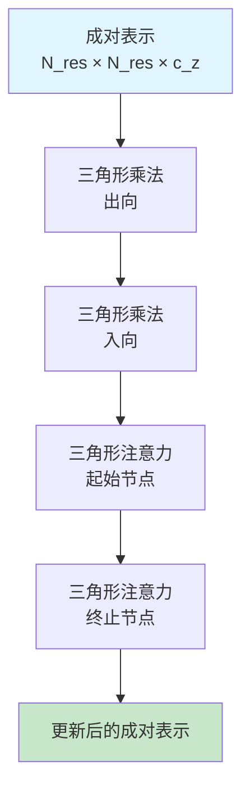

---
slug:21-triangle-attention-and-multiplication
blog_type:normal
---


三角形注意力与乘法运算是 AlphaFold 的 Evoformer 模块中的基础架构组件，能够对蛋白质序列中残基间的成对关系进行复杂推理。这些运算作用于形状为 `[N_res, N_res, c_z]` 的成对表示张量，捕获精确结构预测所需的几何与进化约束。

## 架构概述

三角形运算处理成对表示张量，其形状为 `[N_res, N_res, c_z]`，其中每个元素编码两个残基间的关系信息。核心洞察在于许多蛋白质结构约束涉及三个残基，而三角形运算能有效捕获这种三元关系。



## 三角形乘法

三角形乘法通过两种互补模式实现残基三元组推理：出向和入向边。这些运算使模型能通过残基图中的三角形关系传播信息。

### 出向三角形乘法

出向变体实现方程 `'ikc,jkc->ijc'`，信息从中心残基 `k` 通过边 `(i,k)` 和 `(j,k)` 流向目标对 `(i,j)` [modules.py#L1461-L1462](alphafold/model/modules.py#L1461-L1462)：

```python
# "出向"边方程：'ikc,jkc->ijc'
act = jnp.einsum(c.equation, left_proj_act, right_proj_act)
```

### 入向三角形乘法

入向变体交换角色，实现 `'kjc,kic->ijc'` 以捕获流向中心残基的信息 [modules.py#L1463-L1464](alphafold/model/modules.py#L1463-L1464)：

```python
# "入向"边方程：'kjc,kic->ijc'
# 注意：对于入向边，b = left_proj_act 且 a = right_proj_act
act = jnp.einsum(c.equation, left_proj_act, right_proj_act)
```

### 实现细节

两种变体共享通用架构模式 [modules.py#L1284-L1468](alphafold/model/modules.py#L1284-L1468)：

1. **输入处理**：层归一化后接双重投影
2. **门控机制**：Sigmoid 门控控制信息流
3. **Einsum 运算**：高效张量收缩实现三角形推理
4. **输出处理**：层归一化和最终门控

实现支持两种模式：
- **标准模式**：分离的左/右投影和门控
- **融合模式**：组合投影提升内存效率（用于多聚体 v3）

<CgxTip>
多聚体 v3 中的融合投影模式通过将左右投影合并为单个线性层来减少内存占用，以轻微数值精度损失换取训练过程中的显著内存节省。
</CgxTip>

## 三角形注意力

三角形注意力机制使模型能专注于三角形残基上下文中的特定关系，为不同几何约束提供自适应权重。

### 起始节点注意力

起始节点注意力以 `'per_row'` 方向处理成对表示，允许每行基于三角形关系关注其他行 [modules.py#L864-L1010](alphafold/model/modules.py#L864-L1010)：

```python
if c.orientation == 'per_column':
  pair_act = jnp.swapaxes(pair_act, -2, -3)
  pair_mask = jnp.swapaxes(pair_mask, -1, -2)
```

### 终止节点注意力

终止节点注意力使用 `'per_column'` 方向，通过跨列关注提供三角形关系的互补视角。

### 注意力机制

两种变体实现相同的核心注意力模式 [modules.py#L985-L1000](alphafold/model/modules.py#L985-L1000)：

1. **查询归一化**：对输入成对激活值进行层归一化
2. **偏置计算**：从成对表示中计算可学习偏置权重
3. **注意力应用**：带偏置注入的多头注意力
4. **方向处理**：为行/列变体正确交换轴

## Evoformer 中的集成

三角形运算在每个 Evoformer 迭代中 strategically 定位 [modules.py#L1808-L1850](alphafold/model/modules.py#L1808-L1850)：

```python
pair_act = dropout_wrapper_fn(
    TriangleMultiplication(
        c.triangle_multiplication_outgoing,
        gc,
        name='triangle_multiplication_outgoing',
    ),
    pair_act,
    pair_mask,
    safe_key=next(sub_keys),
)
pair_act = dropout_wrapper_fn(
    TriangleMultiplication(
        c.triangle_multiplication_incoming,
        gc,
        name='triangle_multiplication_incoming',
    ),
    pair_act,
    pair_mask,
    safe_key=next(sub_keys),
)

pair_act = dropout_wrapper_fn(
    TriangleAttention(
        c.triangle_attention_starting_node,
        gc,
        name='triangle_attention_starting_node',
    ),
    pair_act,
    pair_mask,
    safe_key=next(sub_keys),
)
pair_act = dropout_wrapper_fn(
    TriangleAttention(
        c.triangle_attention_ending_node,
        gc,
        name='triangle_attention_ending_node',
    ),
    pair_act,
    pair_mask,
    safe_key=next(sub_keys),
)
```

## 配置与模型变体

不同 AlphaFold 模型使用不同的三角形运算配置：

| 模型变体 | 三角形乘法 | 关键特性 |
|---------------|------------------------|--------------|
| 标准模型 | 标准投影 | 全精度，分离投影 |
| 多聚体 v3 | 融合投影 | 内存优化，组合权重 |

<CgxTip>
模型变体间的配置差异主要由内存限制和数值稳定性需求驱动，多聚体模型倾向于使用融合投影以高效处理更大的蛋白质复合物。
</CgxTip>

## 计算复杂度

由于成对表示结构，三角形运算随序列长度呈二次方扩展，使其成为长序列的主要计算瓶颈。三角形乘法中的 einsum 运算尤其消耗内存，生产环境使用时需要仔细优化。

## 后续步骤

要了解三角形运算如何与更广泛的 Evoformer 架构集成，请探索 [Evoformer 模块设计](9-evoformer-module-design) 文档。关于三角形运算中注意力机制的实现细节，请参阅 [注意力机制](10-attention-mechanisms) 页面。