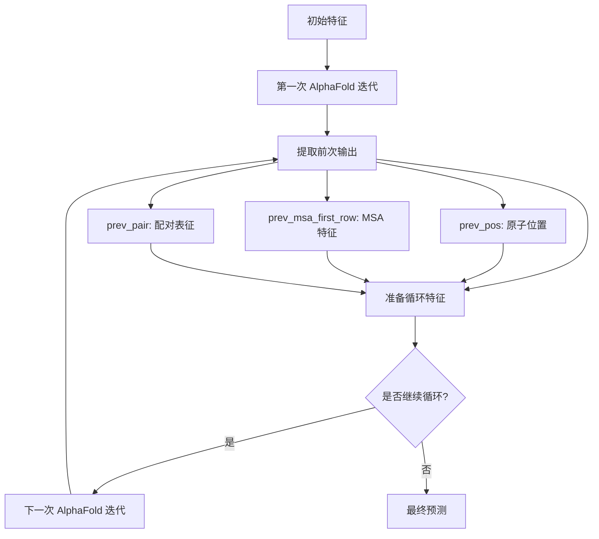

---
slug:23-recycling-mechanisms
blog_type:normal
---


<text>

循环机制是 AlphaFold 中的一个基础架构组件，它通过将前一次迭代的输出作为额外输入重新馈入模型，从而实现预测结果的迭代优化。这种方法使模型能够通过多次循环逐步改进预测结果，利用学习到的结构信息来指导后续迭代。

## 核心架构

循环机制在主 `AlphaFold` 类中实现，该类协调多个循环迭代以优化结构预测 [alphafold/model/modules.py#L289-L293]。整个过程遵循一个系统化的循环，每次迭代都基于前一次迭代学习到的表征进行构建。



## 循环组件

### 位置循环

位置循环将前一次迭代预测的原子三维坐标反馈给模型。这些坐标通过 `pseudo_beta_fn` 转换为基于距离的表征，并进一步转换为距离直方图 (`dgram`) [alphafold/model/modules.py#L1950-L1954]。距离信息随后经过线性投影并添加到配对激活中：

```python
if c.recycle_pos:
  prev_pseudo_beta = pseudo_beta_fn(
      batch['aatype'], batch['prev_pos'], None
  )
  dgram = dgram_from_positions(prev_pseudo_beta, **self.config.prev_pos)
  pair_activations += common_modules.Linear(
      c.pair_channel, name='prev_pos_linear'
  )(dgram)
```

### 特征循环

特征循环包含两个关键组件：

1. **MSA 首行循环**：提取前一次迭代的 MSA 表征首行，经过归一化处理后添加到当前 MSA 激活中 [alphafold/model/modules.py#L1956-L1960]

2. **配对表征循环**：将前一次迭代的完整配对表征进行归一化处理，并添加到当前配对激活中 [alphafold/model/modules.py#L1961-L1965]

```python
if c.recycle_features:
  prev_msa_first_row = common_modules.LayerNorm(
      axis=[-1],
      create_scale=True,
      create_offset=True,
      name='prev_msa_first_row_norm',
  )(batch['prev_msa_first_row'])
  msa_activations = msa_activations.at[0].add(prev_msa_first_row)

  pair_activations += common_modules.LayerNorm(
      axis=[-1],
      create_scale=True,
      create_offset=True,
      name='prev_pair_norm',
  )(batch['prev_pair'])
```

## 迭代过程控制

循环循环由模型配置中的 `num_recycle` 参数控制 [alphafold/model/config.py#L983]。实现使用 JAX 的 `while_loop` 构造来高效执行多次迭代：

```python
if self.config.num_recycle:
  if 'num_iter_recycling' in batch:
    # 训练时：num_iter_recycling 在批次中
    num_iter = batch['num_iter_recycling'][0]
    num_iter = jnp.minimum(num_iter, self.config.num_recycle)
  else:
    # 评估模式或测试：使用最大迭代次数
    num_iter = self.config.num_recycle

  body = lambda x: (
      x[0] + 1,
      get_prev(do_call(x[1], recycle_idx=x[0], compute_loss=False)),
  )
  _, prev = hk.while_loop(lambda x: x[0] < num_iter, body, (0, prev))
```

## 配置选项

循环行为通过多个配置参数控制：

| 参数 | 类型 | 描述 | 默认值 |
|-----------|------|-------------|---------|
| `num_recycle` | int | 循环迭代次数 | 3 |
| `recycle_pos` | bool | 启用位置循环 | true |
| `recycle_features` | bool | 启用特征循环 | true |
| `resample_msa_in_recycling` | bool | 循环过程中重新采样 MSA | false |

<CgxTip>训练期间，循环迭代次数会被随机采样，以防止模型对固定迭代次数产生过拟合；而在推理过程中则使用配置的最大迭代次数以获得最佳性能。</CgxTip>

## 内存与计算效率

循环机制通过精细的梯度管理实现内存高效。`get_prev` 函数应用 `jax.lax.stop_gradient` 来阻止推理过程中梯度通过循环迭代传播，从而降低计算开销 [alphafold/model/modules.py#L317-L321]：

```python
def get_prev(ret):
  new_prev = {
      'prev_pos': ret['structure_module']['final_atom_positions'],
      'prev_msa_first_row': ret['representations']['msa_first_row'],
      'prev_pair': ret['representations']['pair'],
  }
  return jax.tree.map(jax.lax.stop_gradient, new_prev)
```

<CgxTip>循环机制展示了 AlphaFold 迭代优化预测的能力，每个周期都提供越来越精确的结构信息，指导下一次迭代朝更好的收敛方向发展。</CgxTip>

## 与 Evoformer 的集成

循环特征通过 `EmbeddingsAndEvoformer` 模块无缝集成到 Evoformer 流水线中，该模块处理初始嵌入和后续处理周期 [alphafold/model/modules.py#L1904-L1909]。这种集成确保每次迭代时循环信息都能被适当归一化并与新的输入特征相结合。

要了解循环机制如何与其他架构组件交互，请参考 [Evoformer 模块设计](9-evoformer-module-design) 和 [注意力机制](10-attention-mechanisms)。
</text>