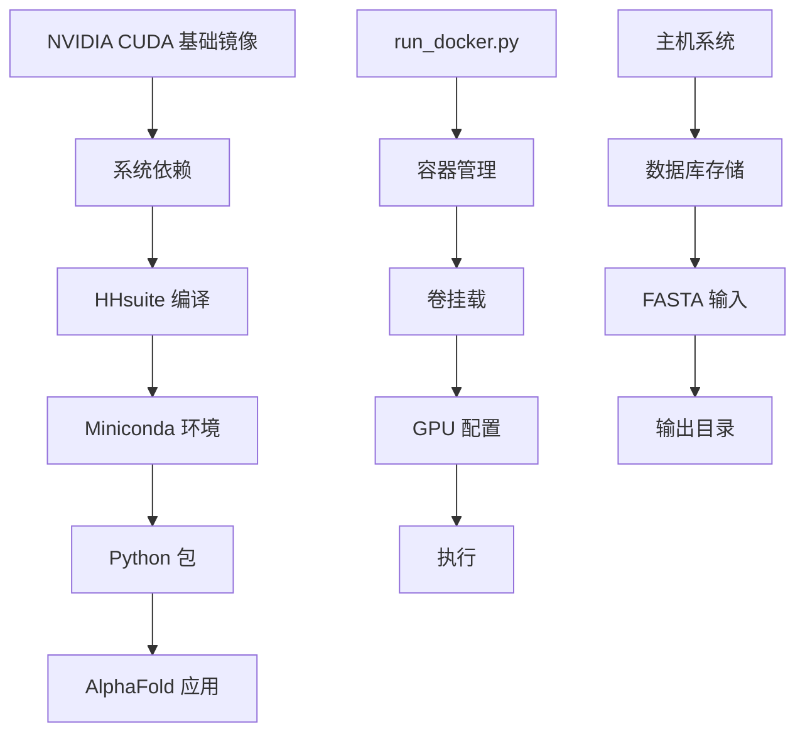
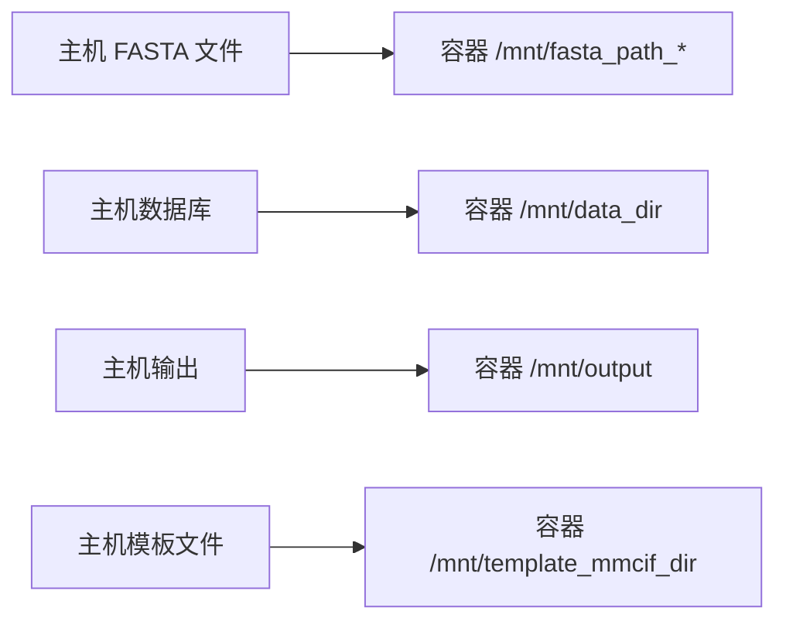

---
slug:3-docker-installation
blog_type:normal
---


本指南提供了使用 Docker 容器设置 AlphaFold 的全面说明，这是寻求简化安装体验的初学者的推荐方法。Docker 确保在不同系统上保持一致的环境，并简化依赖管理。

## 先决条件和系统要求

在开始 Docker 安装之前，请确保您的系统满足以下要求：

### 硬件要求
- **操作系统**：Linux（AlphaFold 不支持其他操作系统）
- **存储**：遗传数据库最多需要 3 TB 的磁盘空间（推荐 SSD）
- **GPU**：具有足够内存的现代 NVIDIA GPU，用于蛋白质结构预测

### 软件依赖
- Docker Engine
- NVIDIA Container Toolkit（用于 GPU 支持）
- aria2c 和 rsync 工具

## Docker 架构概述

AlphaFold Docker 实现采用分层架构，将容器环境、数据处理和执行编排分离：



## 构建 Docker 镜像

Docker 镜像采用多阶段构建方法，优化性能和可重现性。构建过程在 [`docker/Dockerfile`](docker/Dockerfile) 中定义，包含以下关键阶段：

### 基础镜像配置
Dockerfile 以 NVIDIA 的 CUDA 运行时镜像为基础，确保 GPU 兼容性：

```dockerfile
ARG CUDA=12.2.2
FROM nvidia/cuda:${CUDA}-cudnn8-runtime-ubuntu20.04
```

### 系统依赖安装
安装必要的构建工具和生物信息学包：

- **构建工具**：`build-essential`、`cmake`、`git`
- **生物信息学工具**：`hmmer`、`kalign`
- **CUDA 工具**：与 CUDA 版本匹配的命令行工具

### HHsuite 编译
从源代码编译 HHsuite v3.3.0 以确保兼容性和性能：

```dockerfile
RUN git clone --branch v3.3.0 --single-branch https://github.com/soedinglab/hh-suite.git /tmp/hh-suite \
    && mkdir /tmp/hh-suite/build \
    && pushd /tmp/hh-suite/build \
    && cmake -DCMAKE_INSTALL_PREFIX=/opt/hhsuite .. \
    && make -j && make install
```

### Python 环境设置
安装 Miniconda 来管理 Python 依赖，使用特定版本确保兼容性：

- **Python**：3.11
- **JAX**：0.4.26（支持 CUDA）
- **OpenMM**：8.0.0（用于分子动力学）
- **PDBFixer**：用于结构修复

<CgxTip>
Docker 镜像包含特定的环境变量以优化 GPU 内存使用：`TF_FORCE_UNIFIED_MEMORY=1` 和 `XLA_PYTHON_CLIENT_MEM_FRACTION=4.0`，这些变量使得预测通常超出 GPU 内存限制的蛋白质成为可能。
</CgxTip>

## 使用 Docker 运行 AlphaFold

### 容器执行脚本

运行 AlphaFold 的主要接口是 [`docker/run_docker.py`](docker/run_docker.py)，它提供全面的配置选项：

```bash
python3 docker/run_docker.py \
  --fasta_paths=example.fasta \
  --output_dir=/path/to/output \
  --data_dir=/path/to/databases \
  --max_template_date=2024-01-01
```

### 关键配置选项

| 参数 | 默认值 | 描述 |
|-----------|---------|-------------|
| `use_gpu` | `True` | 启用 NVIDIA 运行时以加速 GPU |
| `models_to_relax` | `best` | 最终松弛的模型（`best`、`all`、`none`） |
| `db_preset` | `full_dbs` | 数据库配置（`full_dbs`、`reduced_dbs`） |
| `model_preset` | `monomer` | 模型类型（`monomer`、`multimer`、`monomer_casp14`） |
| `gpu_devices` | `all` | 逗号分隔的 GPU 设备列表 |

### 卷管理

Docker 脚本会自动挂载必要的目录：



## 数据库设置

### 下载必需的数据库

AlphaFold 需要大量的遗传数据库来进行准确预测。使用提供的下载脚本：

```bash
# 完整数据库（推荐以获得最佳性能）
scripts/download_all_data.sh /path/to/download/directory

# 精简数据库（设置更快，精度较低）
scripts/download_all_data.sh /path/to/download/directory reduced_dbs
```

### 数据库组件

| 数据库 | 大小 | 用途 | 必需于 |
|----------|------|---------|--------------|
| Uniref90 | ~48 GB | 序列同源性 | 所有模型 |
| MGnify | ~46 GB | 宏基因组序列 | 所有模型 |
| PDB70 | ~20 GB | 模板结构 | 单体模型 |
| BFD | ~1.8 TB | 序列多样性 | 完整数据库预设 |
| Small BFD | ~100 GB | 精简多样性 | 精简数据库预设 |

<CgxTip>
下载目录不应是 AlphaFold 仓库的子目录，因为在镜像创建过程中复制大型数据库会显著降低 Docker 构建速度。
</CgxTip>

## GPU 配置

### NVIDIA Container Toolkit 设置

通过安装 NVIDIA Container Toolkit 确保正确的 GPU 支持：

```bash
# 测试 GPU 可见性
docker run --rm --gpus all nvidia/cuda:11.0-base nvidia-smi
```

### GPU 内存优化

Docker 配置包含处理大型蛋白质的优化：

- **统一内存**：启用 CPU 和 GPU 之间的内存共享
- **扩展内存分数**：允许分配超出物理 GPU 内存
- **选择性 GPU 使用**：通过 `NVIDIA_VISIBLE_DEVICES` 控制使用的 GPU

## 常见问题排查

### 容器构建失败
- 确保构建期间有足够的磁盘空间
- 验证包下载的网络连接
- 检查 CUDA 版本与主机驱动的兼容性

### GPU 访问问题
- 确认 NVIDIA Container Toolkit 安装
- 验证 GPU 驱动兼容性
- 检查容器运行时权限

### 数据库挂载错误
- 确保数据库目录路径是绝对路径
- 验证容器用户的目录权限
- 确认数据库下载完成

## 后续步骤

成功安装 Docker 并设置数据库后，继续执行以下步骤：

1. **[数据库配置](4-database-configuration)** 了解详细的数据库管理
2. **[GPU 设置要求](5-gpu-setup-requirements)** 了解高级 GPU 优化
3. **[快速入门](2-quick-start)** 运行您的第一个蛋白质预测

Docker 安装为探索 AlphaFold 的功能提供了坚实的基础，同时保持系统隔离和可重现性。