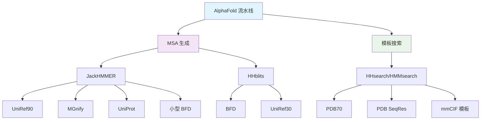

---
slug:4-database-configuration
blog_type:normal
---


AlphaFold 需要多个生物数据库来执行多序列比对 (MSA) 搜索和模板识别，以实现准确的蛋白质结构预测。本指南涵盖完整的数据库配置流程，从下载到设置所需路径。

## 数据库预设

AlphaFold 提供两种数据库配置预设，以平衡计算资源和预测精度：

### 完整数据库 (full_dbs)
完整的数据库配置为蛋白质结构预测提供最高精度：

- **BFD 数据库**：来自 Big Fantastic Database 的 22 亿条序列
- **UniRef30**：最新的 30% 相似度聚类蛋白质序列
- **UniRef90**：90% 相似度聚类序列
- **MGnify**：宏基因组蛋白质序列
- **UniProt**：完整的 UniProtKB/Swiss-Prot 数据库
- **PDB70**：70% 相似度聚类的 PDB 序列

### 精简数据库 (reduced_dbs)
适用于资源受限环境的轻量级配置：

- **小型 BFD**：来自 BFD 的首组非共识序列
- **UniRef90**：与完整配置相同
- **MGnify**：与完整配置相同
- **UniProt**：与完整配置相同
- **PDB70**：与完整配置相同

<CgxTip>
精简数据库预设可将存储需求从约 2.2TB 降低至约 400GB，同时为大多数用例保持合理的预测精度。
</CgxTip>

## 数据库下载流程

### 自动化下载脚本

使用提供的脚本下载所有必需的数据库：

```bash
# 下载完整数据库
bash scripts/download_all_data.sh /path/to/download/directory full_dbs

# 下载精简数据库  
bash scripts/download_all_data.sh /path/to/download/directory reduced_dbs
```

下载脚本需要 `aria2c` 和 `rsync` 工具以实现高效的并行下载 [scripts/download_all_data.sh](scripts/download_all_data.sh#L16-L21)。

### 单独数据库下载

如果需要，每个数据库都可以单独下载：

- **BFD**：`bash scripts/download_bfd.sh /path/to/download/directory`
- **小型 BFD**：`bash scripts/download_small_bfd.sh /path/to/download/directory`
- **UniRef90**：`bash scripts/download_uniref90.sh /path/to/download/directory`
- **MGnify**：`bash scripts/download_mgnify.sh /path/to/download/directory`
- **UniProt**：`bash scripts/download_uniprot.sh /path/to/download/directory`
- **PDB70**：`bash scripts/download_pdb70.sh /path/to/download/directory`
- **PDB mmCIF**：`bash scripts/download_pdb_mmcif.sh /path/to/download/directory`
- **PDB SeqRes**：`bash scripts/download_pdb_seqres.sh /path/to/download/directory`

## 数据库路径配置

### 必需参数

运行 AlphaFold 时，必须使用以下标志指定已下载数据库的路径 [run_alphafold.py](run_alphafold.py#L102-L140)：

| 参数 | 描述 | 所需场景 |
|-----------|-------------|--------------|
| `uniref90_database_path` | UniRef90 数据库路径 | 所有预设 |
| `mgnify_database_path` | MGnify 数据库路径 | 所有预设 |
| `bfd_database_path` | BFD 数据库路径 | full_dbs 预设 |
| `small_bfd_database_path` | 小型 BFD 数据库路径 | reduced_dbs 预设 |
| `uniref30_database_path` | UniRef30 数据库路径 | full_dbs 预设 |
| `uniprot_database_path` | UniProt 数据库路径 | 所有预设 |
| `pdb70_database_path` | PDB70 数据库路径 | 所有预设 |
| `pdb_seqres_database_path` | PDB SeqRes 数据库路径 | 所有预设 |

### 模板数据库配置

模板数据库需要额外配置：

| 参数 | 描述 | 必需性 |
|-----------|-------------|----------|
| `template_mmcif_dir` | 包含 mmCIF 模板文件的目录 | 是 |
| `max_template_date` | 要考虑的最大模板发布日期 | 是 |
| `obsolete_pdbs_path` | 过时 PDB 映射文件路径 | 是 |

## 数据库架构



数据库配置直接影响 DataPipeline 初始化 [alphafold/data/pipeline.py](alphafold/data/pipeline.py#L126-L143)，在此过程中不同的数据库路径会被分配给相应的搜索工具。

## 存储需求

| 数据库类型 | 大小 | 预设 |
|---------------|------|--------|
| BFD | ~1.7TB | full_dbs |
| 小型 BFD | ~50GB | reduced_dbs |
| UniRef30 | ~100GB | full_dbs |
| UniRef90 | ~40GB | 全部 |
| MGnify | ~50GB | 全部 |
| UniProt | ~30GB | 全部 |
| PDB70 | ~20GB | 全部 |
| PDB mmCIF | ~200GB | 全部 |
| PDB SeqRes | ~10GB | 全部 |

**总存储需求**：约 2.2TB (full_dbs) 或约 400GB (reduced_dbs)

## 配置验证

AlphaFold 在启动时会验证数据库配置 [run_alphafold.py](run_alphafold.py#L578-L580)：

```python
use_small_bfd = FLAGS.db_preset == 'reduced_dbs'
_check_flag('small_bfd_database_path', 'db_preset', should_be_set=use_small_bfd)
_check_flag('bfd_database_path', 'db_preset', should_be_set=not use_small_bfd)
```

<CgxTip>
运行 AlphaFold 前请确保所有必需的数据库路径都已正确设置。缺失的数据库将导致流水线在 MSA 生成或模板搜索阶段失败。
</CgxTip>

## 后续步骤

配置数据库后，请继续阅读 [GPU 设置要求](5-gpu-setup-requirements) 以确保你的系统具备运行 AlphaFold 所需的计算资源。

关于这些数据库在 MSA 生成过程中的使用详情，请参阅 [MSA 生成与处理](12-msa-generation-and-processing)。