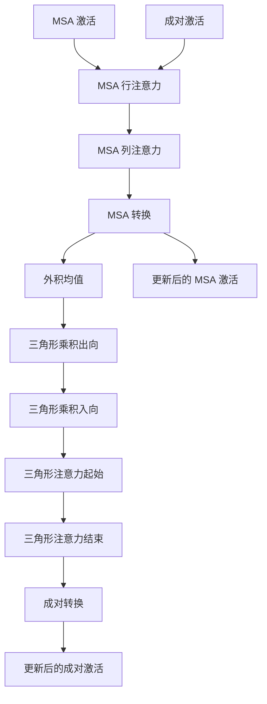

---
slug:9-evoformer-module-design
blog_type:normal
---


Evoformer 模块代表了 AlphaFold 的核心架构创新，实现了一种精密的基于注意力机制的处理流程，用于处理多重序列比对（MSA）和成对表示，以提取进化和结构信息。该设计使模型能够同时捕获序列级别的进化约束和残基间的相互作用。

## 核心架构概述

Evoformer 由多个堆叠的迭代组成，每个迭代通过精心编排的注意力和转换操作序列处理 MSA 和成对表示。该架构遵循 Jumper 等人（2021）在 Suppl. Alg. 6 "EvoformerStack" 中描述的实现 [modules.py#L1751-L1755](alphafold/model/modules.py#L1751-L1755)。

### 基础组件

EvoformerIteration 类作为基础构建块，实现了 Evoformer 堆栈的单次迭代 [modules.py#L1751-L1901](alphafold/model/modules.py#L1751-L1901)。每次迭代处理两个主要表示：

- **MSA 激活**：形状为 `[N_seq, N_res, c_m]`，表示多重序列比对信息
- **成对激活**：形状为 `[N_res, N_res, c_z]`，表示残基间关系

## 信息流架构



## MSA 处理流程

### 带成对偏置的行注意力

MSA 处理以 `MSARowAttentionWithPairBias` 开始，它在序列维度上应用注意力，同时整合来自成对表示的偏置 [modules.py#L795-L850](alphafold/model/modules.py#L795-L850)。这种机制使 MSA 中的进化信息能够受到预测的残基间关系的影响。

关键创新在于偏置计算：
```python
nonbatched_bias = jnp.einsum('qkc,ch->hqk', pair_act, weights)
```
这创建了一个基于成对关系调制注意力分数的偏置项 [modules.py#L844](alphafold/model/modules.py#L844)。

### 列注意力和全局注意力

在行注意力之后，系统对标准 MSA 处理应用 `MSAColumnAttention`，或对额外 MSA 特征应用 `MSAColumnGlobalAttention` [modules.py#L1824-L1834](alphafold/model/modules.py#L1824-L1834)。这种双重方法使模型能够以不同方式处理主要 MSA 数据和额外的进化信息。

### MSA 转换

MSA 转换层应用带有 dropout 和残差连接的前馈变换 [modules.py#L1836-L1841](alphafold/model/modules.py#L1836-L1841)，实现了 Suppl. Alg. 9 "MSATransition" 中描述的转换操作。

## 成对表示处理

### 外积均值

`OuterProductMean` 模块通过计算均值外积来实现 MSA 和成对表示之间的通信 [modules.py#L1600-L1675](alphafold/model/modules.py#L1600-L1675)。该操作实现了 Suppl. Alg. 10，并基于 MSA 信息创建对成对表示的更新：

```python
left_act = mask * common_modules.Linear(c.num_outer_channel, name='left_projection')(act)
right_act = mask * common_modules.Linear(c.num_outer_channel, name='right_projection')(act)
```

### 三角形操作

成对表示经过复杂的基于三角形的操作，这些操作捕获残基之间的三元关系：

#### 三角形乘积

出向和入向的三角形乘积层都通过门控投影处理成对表示 [modules.py#L1358-L1430](alphafold/model/modules.py#L1358-L1430)。这些操作实现了 Suppl. Alg. 11 和 12，使模型能够捕获高阶残基关系：

```python
left_gate_values = jax.nn.sigmoid(common_modules.Linear(c.num_intermediate_channel, bias_init=1.0, name='left_gate')(act))
right_gate_values = jax.nn.sigmoid(common_modules.Linear(c.num_intermediate_channel, bias_init=1.0, name='right_gate')(act))
```

#### 三角形注意力

三角形注意力机制在成对表示上运行，以捕获方向性关系 [modules.py#L963-L1024](alphafold/model/modules.py#L963-L1024)。系统支持 "per_row" 和 "per_column" 两种方向，实现了 Suppl. Alg. 13 和 14：

```python
if c.orientation == 'per_column':
    pair_act = jnp.swapaxes(pair_act, -2, -3)
    pair_mask = jnp.swapaxes(pair_mask, -1, -2)
```

<CgxTip>三角形操作对于捕获蛋白质结构中的几何约束至关重要，因为它们建模的是三个残基之间的关系，而不仅仅是成对关系。</CgxTip>

## 嵌入和集成

`EmbeddingsAndEvoformer` 类协调整个过程，从输入嵌入到 Evoformer 处理 [modules.py#L1904-L2147](alphafold/model/modules.py#L1904-L2147)。该模块实现了 Suppl. Alg. 2 "Inference" 的第 5-18 行，处理：

- MSA 和目标特征的输入嵌入
- 模板集成
- 额外 MSA 处理
- 回收机制
- 相对位置编码

### 模板集成

模板通过专用的嵌入模块被嵌入并集成到成对表示中 [modules.py#L1994-L2001](alphafold/model/modules.py#L1994-L2001)，使已知的结构信息能够指导预测过程。

### 回收机制

该架构通过专用的嵌入机制支持先前预测的回收 [modules.py#L1946-L1972](alphafold/model/modules.py#L1946-L1972)，实现了 Suppl. Alg. 32 "RecyclingEmbedder"。这允许对预测进行迭代优化。

## 配置和堆叠

Evoformer 通过 `layer_stack` 机制使用可配置的堆叠 [modules.py#L2126-L2129](alphafold/model/modules.py#L2126-L2129)，允许灵活的深度控制：

```python
evoformer_stack = layer_stack.layer_stack(c.evoformer_num_block)(evoformer_fn)
```

<CgxTip>模块化设计允许相同的 EvoformerIteration 用于主要 MSA 处理和额外 MSA 处理，其行为由 `is_extra_msa` 标志控制。</CgxTip>

## 关键设计原则

1. **双向信息流**：MSA 和成对表示通过多个路径持续交换信息
2. **三元关系建模**：三角形操作捕获高阶几何约束
3. **渐进式优化**：多次迭代允许表示的逐步优化
4. **灵活集成**：模板和回收机制可以有选择地启用
5. **内存效率**：子批次处理和梯度检查点支持大规模蛋白质

Evoformer 的精密架构使 AlphaFold 能够通过统一的基于注意力的框架有效整合进化信息、几何约束和结构模板，从而在蛋白质结构预测中实现前所未有的准确性。

## 下一步

要详细了解具体的注意力机制，请继续阅读 [注意力机制](10-attention-mechanisms)。如需更广泛的架构视角，请参阅 [模型架构概述](11-model-architecture-overview)。