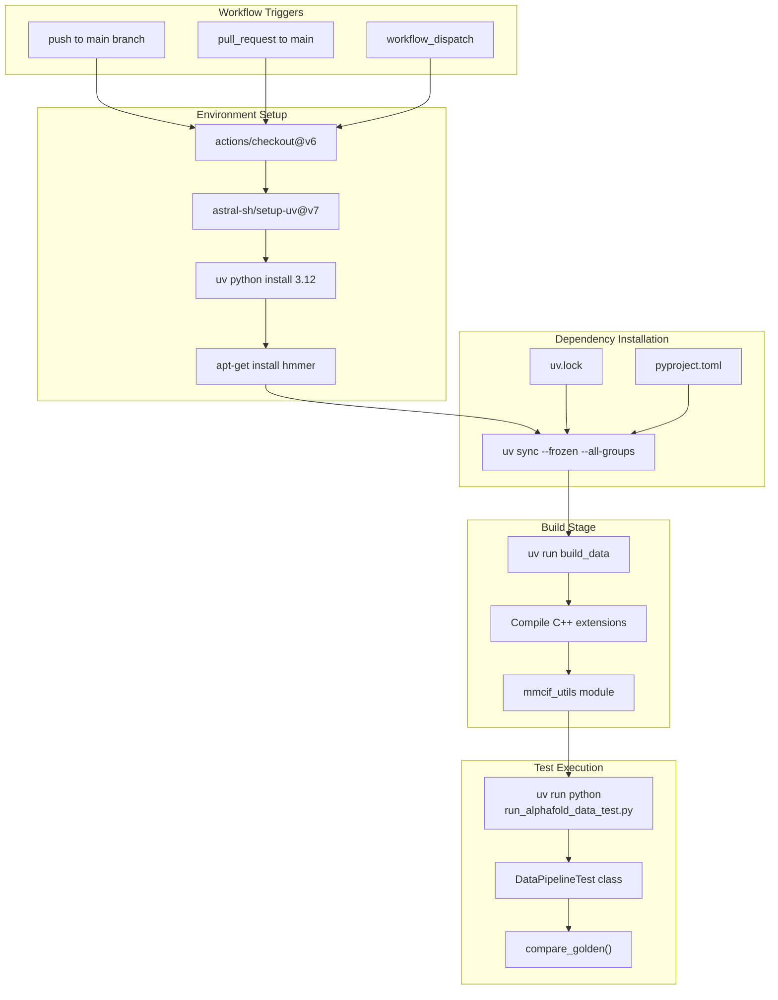
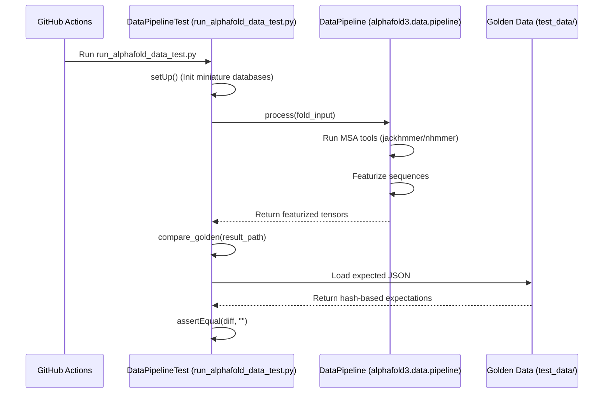

# CI/CD Pipeline

> **Relevant source files**
> * [.github/workflows/ci.yaml](https://github.com/google-deepmind/alphafold3/blob/97639fff/.github/workflows/ci.yaml)
> * [CONTRIBUTING.md](https://github.com/google-deepmind/alphafold3/blob/97639fff/CONTRIBUTING.md?plain=1)
> * [run_alphafold_data_test.py](https://github.com/google-deepmind/alphafold3/blob/97639fff/run_alphafold_data_test.py)
> * [src/alphafold3/test_data/featurised_example.json](https://github.com/google-deepmind/alphafold3/blob/97639fff/src/alphafold3/test_data/featurised_example.json)

## Purpose and Scope

This document describes the continuous integration (CI) infrastructure for AlphaFold 3. It covers the GitHub Actions workflow configuration, automated test execution, and dependency management. The pipeline is designed to validate the core data processing and featurization logic on every code change. For information about the build system configuration, see [Build System](https://github.com/google-deepmind/alphafold3/blob/97639fff/Build System)

 For details about the testing framework and test data, see [Test Infrastructure](https://github.com/google-deepmind/alphafold3/blob/97639fff/Test Infrastructure)

**Sources:** [.github/workflows/ci.yaml L1-L45](https://github.com/google-deepmind/alphafold3/blob/97639fff/.github/workflows/ci.yaml#L1-L45)

## Overview

The AlphaFold 3 CI pipeline is implemented using GitHub Actions and provides automated testing for code changes. The pipeline focuses on CPU-only testing to verify the data pipeline, input processing, and featurization without requiring GPU resources. It integrates with the `uv` package manager for fast, reproducible dependency installation and uses the `scikit-build-core` build backend for compiling C++ extensions like `mmcif_utils`.

**Sources:** [.github/workflows/ci.yaml L1-L45](https://github.com/google-deepmind/alphafold3/blob/97639fff/.github/workflows/ci.yaml#L1-L45)

 [run_alphafold_data_test.py L41-L45](https://github.com/google-deepmind/alphafold3/blob/97639fff/run_alphafold_data_test.py#L41-L45)

## Workflow Architecture

**Workflow Execution Flow**

The CI pipeline executes in a linear sequence. GitHub Actions triggers the workflow on commits to the `main` branch, pull requests targeting `main`, or manual dispatch. The core validation happens in `run_alphafold_data_test.py`, which instantiates a `DataPipeline` and compares its output against "golden" reference files.

**Sources:** [.github/workflows/ci.yaml L3-L10](https://github.com/google-deepmind/alphafold3/blob/97639fff/.github/workflows/ci.yaml#L3-L10)

 [.github/workflows/ci.yaml L23-L44](https://github.com/google-deepmind/alphafold3/blob/97639fff/.github/workflows/ci.yaml#L23-L44)

 [run_alphafold_data_test.py L100-L101](https://github.com/google-deepmind/alphafold3/blob/97639fff/run_alphafold_data_test.py#L100-L101)

 [run_alphafold_data_test.py L180-L181](https://github.com/google-deepmind/alphafold3/blob/97639fff/run_alphafold_data_test.py#L180-L181)

## GitHub Actions Configuration

### Workflow Definition

The CI workflow is defined in `.github/workflows/ci.yaml` with the following key characteristics:

| Property | Value | Purpose |
| --- | --- | --- |
| Name | `Continuous Integration` | Identifies the workflow in GitHub UI |
| Triggers | `push`, `pull_request`, `workflow_dispatch` | Automatic and manual execution |
| OS | `ubuntu-latest` | Linux environment for compatibility |
| Python Version | `3.12` | Required version for runtime |
| Job Name | `build` | Single job for all CI tasks |

**Sources:** [.github/workflows/ci.yaml L1-L22](https://github.com/google-deepmind/alphafold3/blob/97639fff/.github/workflows/ci.yaml#L1-L22)

### Workflow Steps

The workflow executes the following steps in order:

1. **Code Checkout**: Uses `actions/checkout@v6` to clone the repository.
2. **uv Setup**: Uses `astral-sh/setup-uv@v7` with caching enabled based on `uv.lock`.
3. **Python Installation**: Installs Python 3.12 using uv.
4. **System Dependencies**: Installs `hmmer` via `apt-get` to provide binaries like `jackhmmer` and `nhmmer` required for MSA generation.
5. **Python Dependencies**: Runs `uv sync --frozen --all-groups` to install exact versions from the lock file.
6. **Build Data**: Executes `uv run build_data` to compile C++ extensions.
7. **Run Tests**: Executes `uv run python run_alphafold_data_test.py`.

**Sources:** [.github/workflows/ci.yaml L23-L44](https://github.com/google-deepmind/alphafold3/blob/97639fff/.github/workflows/ci.yaml#L23-L44)

 [run_alphafold_data_test.py L41-L45](https://github.com/google-deepmind/alphafold3/blob/97639fff/run_alphafold_data_test.py#L41-L45)

## Test Execution

### CPU-Only Test Strategy

The CI pipeline runs `run_alphafold_data_test.py`, which performs integration testing of the data pipeline without requiring a GPU.

**Test Coverage and Validation**

* **Miniature Databases**: The `setUp` method configures paths to subsampled versions of BFD, MGnify, UniProt, and PDB databases stored in `test_data/miniature_databases/`.
* **Featurization Validation**: The `test_featurisation` method runs the full `DataPipeline.process` flow and validates the resulting feature tensors.
* **Golden Comparison**: The `compare_golden` function compares the generated JSON outputs (containing hashed data) against reference files like `featurised_example.json`.
* **Data Hashing**: To handle large tensors and complex objects, the test uses a `_hash_data` singledispatch function to generate stable SHA256 hashes for comparison.

**Sources:** [run_alphafold_data_test.py L103-L157](https://github.com/google-deepmind/alphafold3/blob/97639fff/run_alphafold_data_test.py#L103-L157)

 [run_alphafold_data_test.py L180-L192](https://github.com/google-deepmind/alphafold3/blob/97639fff/run_alphafold_data_test.py#L180-L192)

 [run_alphafold_data_test.py L203-L207](https://github.com/google-deepmind/alphafold3/blob/97639fff/run_alphafold_data_test.py#L203-L207)

 [run_alphafold_data_test.py L54-L86](https://github.com/google-deepmind/alphafold3/blob/97639fff/run_alphafold_data_test.py#L54-L86)

 [src/alphafold3/test_data/featurised_example.json L1-L67](https://github.com/google-deepmind/alphafold3/blob/97639fff/src/alphafold3/test_data/featurised_example.json#L1-L67)

## Dependency Management

### uv Package Manager Integration

The CI pipeline leverages `uv` for fast, deterministic dependency installation. The `--frozen` flag ensures that `uv.lock` is used without modification, preventing non-deterministic dependency resolution during CI runs.

**Sources:** [.github/workflows/ci.yaml L25-L30](https://github.com/google-deepmind/alphafold3/blob/97639fff/.github/workflows/ci.yaml#L25-L30)

 [.github/workflows/ci.yaml L38](https://github.com/google-deepmind/alphafold3/blob/97639fff/.github/workflows/ci.yaml#L38-L38)

### System Tool Integration

The pipeline relies on external bioinformatics tools that are installed via `apt-get` in the CI environment. The `run_alphafold_data_test.py` script detects these binaries using `shutil.which`.

| Binary | Source | Role in Pipeline |
| --- | --- | --- |
| `jackhmmer` | `hmmer` package | Protein MSA generation |
| `nhmmer` | `hmmer` package | RNA/DNA MSA generation |
| `hmmsearch` | `hmmer` package | Template search |
| `hmmbuild` | `hmmer` package | Profile construction |

**Sources:** [run_alphafold_data_test.py L41-L45](https://github.com/google-deepmind/alphafold3/blob/97639fff/run_alphafold_data_test.py#L41-L45)

 [.github/workflows/ci.yaml L34-L35](https://github.com/google-deepmind/alphafold3/blob/97639fff/.github/workflows/ci.yaml#L34-L35)

## Caching Strategy

The CI workflow enables caching through the `astral-sh/setup-uv@v7` action. This significantly reduces CI execution time by persisting the Python virtual environment and package cache between runs.

* **Cache Key**: The cache is keyed by the `uv.lock` file.
* **Cache Content**: uv's internal package cache and the installed Python toolchains.

**Sources:** [.github/workflows/ci.yaml L25-L29](https://github.com/google-deepmind/alphafold3/blob/97639fff/.github/workflows/ci.yaml#L25-L29)

## CI/CD Limitations

The AlphaFold 3 CI pipeline has several intentional limitations:

| Limitation | Rationale | Impact |
| --- | --- | --- |
| CPU-only tests | GitHub Actions standard runners lack GPUs | Model inference and JAX JIT compilation are not verified in CI |
| Miniature Databases | Full databases (PDB, UniRef90) are multi-terabyte | MSA results in CI are based on subsampled data |
| No Weights Testing | Model weights require a separate license/download | The CI does not test weight loading or inference accuracy |

**Sources:** [.github/workflows/ci.yaml L43-L44](https://github.com/google-deepmind/alphafold3/blob/97639fff/.github/workflows/ci.yaml#L43-L44)

 [run_alphafold_data_test.py L105-L140](https://github.com/google-deepmind/alphafold3/blob/97639fff/run_alphafold_data_test.py#L105-L140)

## Related Pages

* [Build System](https://github.com/google-deepmind/alphafold3/blob/97639fff/Build System)  - Detailed build system configuration with `scikit-build-core`.
* [Test Infrastructure](https://github.com/google-deepmind/alphafold3/blob/97639fff/Test Infrastructure)  - Detailed organization of the `DataPipelineTest` and unit tests.
* [Test Data and Validation](https://github.com/google-deepmind/alphafold3/blob/97639fff/Test Data and Validation)  - Explanation of the golden data format and hashing strategy.