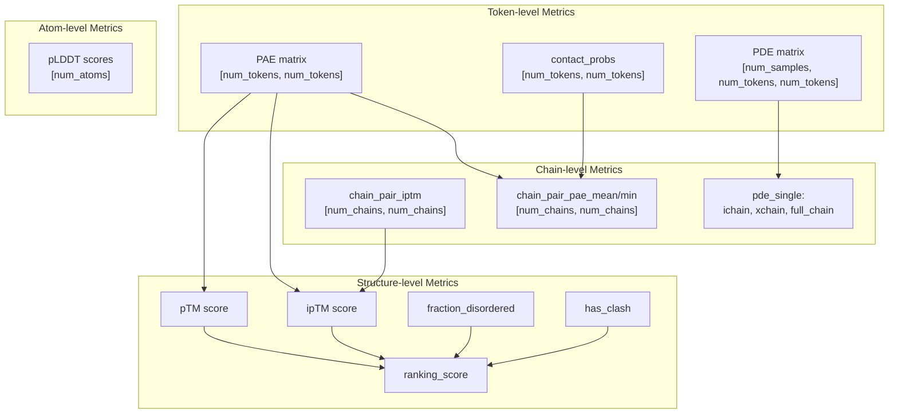
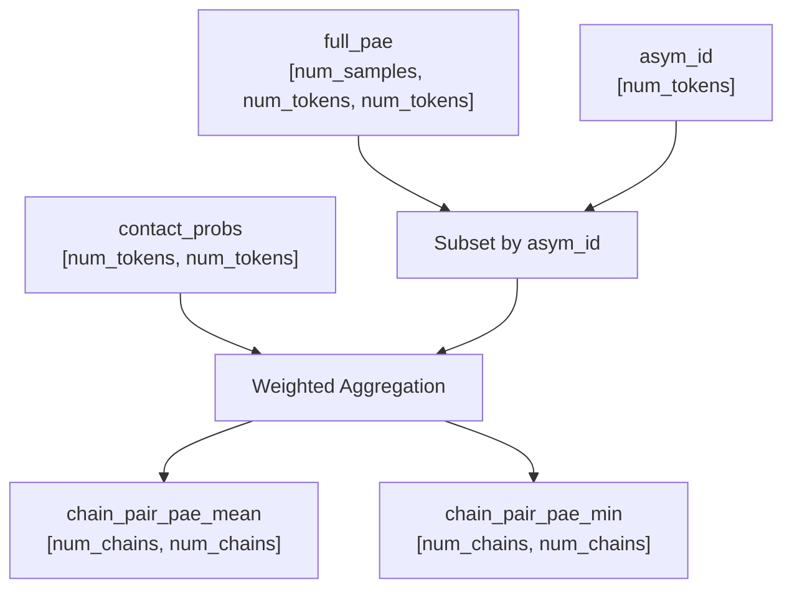

# Confidence Metrics

> **Relevant source files**
> * [src/alphafold3/data/templates.py](https://github.com/google-deepmind/alphafold3/blob/97639fff/src/alphafold3/data/templates.py)
> * [src/alphafold3/model/components/mapping.py](https://github.com/google-deepmind/alphafold3/blob/97639fff/src/alphafold3/model/components/mapping.py)
> * [src/alphafold3/model/confidence_types.py](https://github.com/google-deepmind/alphafold3/blob/97639fff/src/alphafold3/model/confidence_types.py)
> * [src/alphafold3/model/confidences.py](https://github.com/google-deepmind/alphafold3/blob/97639fff/src/alphafold3/model/confidences.py)
> * [src/alphafold3/model/model_config.py](https://github.com/google-deepmind/alphafold3/blob/97639fff/src/alphafold3/model/model_config.py)
> * [src/alphafold3/model/network/evoformer.py](https://github.com/google-deepmind/alphafold3/blob/97639fff/src/alphafold3/model/network/evoformer.py)
> * [src/alphafold3/model/scoring/scoring.py](https://github.com/google-deepmind/alphafold3/blob/97639fff/src/alphafold3/model/scoring/scoring.py)
> * [src/alphafold3/test_data/alphafold_run_outputs/run_alphafold_test_output_bucket_1024.pkl](https://github.com/google-deepmind/alphafold3/blob/97639fff/src/alphafold3/test_data/alphafold_run_outputs/run_alphafold_test_output_bucket_1024.pkl)
> * [src/alphafold3/test_data/alphafold_run_outputs/run_alphafold_test_output_bucket_default.pkl](https://github.com/google-deepmind/alphafold3/blob/97639fff/src/alphafold3/test_data/alphafold_run_outputs/run_alphafold_test_output_bucket_default.pkl)

This page documents the confidence metrics used in AlphaFold 3 to evaluate prediction quality and rank candidate structures. These metrics include pTM, ipTM, PAE, PDE, disorder detection, clash detection, and composite ranking scores.

## Overview

AlphaFold 3 computes confidence metrics at multiple structural levels to assess prediction quality. The primary metrics are:

* **pTM (predicted TM-score)**: Overall structural alignment quality.
* **ipTM (interface pTM)**: Quality of inter-chain interfaces.
* **PAE (Predicted Aligned Error)**: Expected positional error between residue pairs.
* **PDE (Predicted Distance Error)**: Expected distance error between tokens.
* **pLDDT (per-atom)**: Local per-atom confidence scores stored in the B-factor column of output CIFs.
* **Disorder metrics**: Fraction of disordered residues via AlphaFold-RSA.
* **Clash detection**: Identification of overlapping chains based on steric hindrance.
* **Ranking score**: Composite metric combining structural quality, disorder, and clash penalties.

**Confidence Metrics Hierarchy**



Sources: [src/alphafold3/model/confidences.py L11-L212](https://github.com/google-deepmind/alphafold3/blob/97639fff/src/alphafold3/model/confidences.py#L11-L212)

 [src/alphafold3/model/confidence_types.py L186-L210](https://github.com/google-deepmind/alphafold3/blob/97639fff/src/alphafold3/model/confidence_types.py#L186-L210)

## Predicted TM-score (pTM and ipTM)

The predicted TM-score estimates the alignment quality using the Template Modeling score metric.

### pTM and ipTM Computation

The metrics are derived from a TM-adjusted PAE matrix.

* **pTM**: Considers all residue pairs within the structure.
* **ipTM**: Restricts calculations to inter-chain pairs (where `asym_id` differs).

For single-chain structures, ipTM is `NaN` as there are no interfaces to evaluate. The `get_ranking_score` function handles this by falling back to pTM only [src/alphafold3/model/confidences.py L188-L192](https://github.com/google-deepmind/alphafold3/blob/97639fff/src/alphafold3/model/confidences.py#L188-L192)

### Chain-Pairwise pTM

The system can compute pTM between each pair of chains independently, resulting in a `[num_chains, num_chains]` matrix where entry (i, j) represents the predicted quality of the interface between chain i and chain j.

Sources: [src/alphafold3/model/confidences.py L185-L197](https://github.com/google-deepmind/alphafold3/blob/97639fff/src/alphafold3/model/confidences.py#L185-L197)

 [src/alphafold3/model/confidence_types.py L186-L210](https://github.com/google-deepmind/alphafold3/blob/97639fff/src/alphafold3/model/confidence_types.py#L186-L210)

## Predicted Aligned Error (PAE)

PAE estimates the expected positional error (in Ångströms) when residues are aligned. The model outputs a full PAE matrix of shape `[num_samples, num_tokens, num_tokens]`.

### Chain-Pair PAE Metrics

Aggregate PAE metrics are computed for each chain pair, including `chain_pair_pae_min` and `chain_pair_pae_mean`. These are often weighted by `contact_probs` (the probability of tokens being within 8Å) to focus on interface regions.

**Chain-Pair PAE Computation Flow**



Sources: [src/alphafold3/model/confidence_types.py L186-L210](https://github.com/google-deepmind/alphafold3/blob/97639fff/src/alphafold3/model/confidence_types.py#L186-L210)

 [src/alphafold3/model/confidence_types.py L36-L41](https://github.com/google-deepmind/alphafold3/blob/97639fff/src/alphafold3/model/confidence_types.py#L36-L41)

## Predicted Distance Error (PDE)

PDE represents the expected error in the distance between token pairs. This is a primary output of the confidence head.

### Ranking via PDE

The `rank_metric()` function computes a scalar ranking score used during the diffusion sampling process to select the best structure among samples. It calculates a contact-weighted average of the PDE (negated, so higher is better).

```python
def rank_metric(full_pde, contact_probs):  # Higher is better  return -jnp.sum(full_pde * contact_probs) / (jnp.sum(contact_probs) + 1e-6)
```

Sources: [src/alphafold3/model/confidences.py L200-L212](https://github.com/google-deepmind/alphafold3/blob/97639fff/src/alphafold3/model/confidences.py#L200-L212)

## Disorder Detection

AlphaFold 3 detects disordered regions using **AlphaFold-RSA** (Relative Solvent Accessibility).

### Windowed Solvent Accessible Area

The `windowed_solvent_accessible_area()` function implements the RSA-based disorder prediction:

1. It uses `mkdssp.get_dssp()` to calculate solvent accessibility from the predicted CIF [src/alphafold3/model/confidences.py L66-L69](https://github.com/google-deepmind/alphafold3/blob/97639fff/src/alphafold3/model/confidences.py#L66-L69)
2. Values are normalized by `MAX_ACCESSIBLE_SURFACE_AREA` for the specific residue type [src/alphafold3/model/confidences.py L74-L77](https://github.com/google-deepmind/alphafold3/blob/97639fff/src/alphafold3/model/confidences.py#L74-L77)
3. A sliding window average (default `window=25`) is applied to the normalized accessibility [src/alphafold3/model/confidences.py L84-L87](https://github.com/google-deepmind/alphafold3/blob/97639fff/src/alphafold3/model/confidences.py#L84-L87)

### Fraction Disordered

The `fraction_disordered()` function computes the overall proportion of protein residues considered disordered based on a `rasa_disorder_cutoff` (default 0.581) [src/alphafold3/model/confidences.py L90-L128](https://github.com/google-deepmind/alphafold3/blob/97639fff/src/alphafold3/model/confidences.py#L90-L128)

Sources: [src/alphafold3/model/confidences.py L23-L87](https://github.com/google-deepmind/alphafold3/blob/97639fff/src/alphafold3/model/confidences.py#L23-L87)

 [src/alphafold3/model/confidences.py L90-L128](https://github.com/google-deepmind/alphafold3/blob/97639fff/src/alphafold3/model/confidences.py#L90-L128)

## Clash Detection

The `has_clash()` function identifies if the predicted structure contains significant steric overlaps between chains.

### Clash Detection Algorithm

1. **Filtering**: The structure is filtered to include only polymer entities (Protein, RNA, DNA) [src/alphafold3/model/confidences.py L154](https://github.com/google-deepmind/alphafold3/blob/97639fff/src/alphafold3/model/confidences.py#L154-L154)
2. **Spatial Query**: A `spatial.cKDTree` is built from atom coordinates to find pairs within a `cutoff_radius` (default 1.1Å) [src/alphafold3/model/confidences.py L158-L161](https://github.com/google-deepmind/alphafold3/blob/97639fff/src/alphafold3/model/confidences.py#L158-L161)
3. **Validation**: Clashes are ignored if they involve the same or adjacent residues in the same chain [src/alphafold3/model/confidences.py L165-L167](https://github.com/google-deepmind/alphafold3/blob/97639fff/src/alphafold3/model/confidences.py#L165-L167)
4. **Thresholds**: A chain is flagged as clashing if it has >100 clashing atoms or if >50% of its atoms are involved in clashes [src/alphafold3/model/confidences.py L177-L181](https://github.com/google-deepmind/alphafold3/blob/97639fff/src/alphafold3/model/confidences.py#L177-L181)

Sources: [src/alphafold3/model/confidences.py L131-L182](https://github.com/google-deepmind/alphafold3/blob/97639fff/src/alphafold3/model/confidences.py#L131-L182)

## Ranking Score

The `get_ranking_score()` function produces the final composite score used to rank multiple model predictions (e.g., from different seeds).

### Ranking Score Formula

The score is a weighted combination of structural confidence, disorder, and a heavy penalty for clashes:

| Component | Weight | Source |
| --- | --- | --- |
| `iptm` | 0.8 | `_IPTM_WEIGHT` [src/alphafold3/model/confidences.py L48](https://github.com/google-deepmind/alphafold3/blob/97639fff/src/alphafold3/model/confidences.py#L48-L48) |
| `ptm` | 0.2 | `1.0 - _IPTM_WEIGHT` |
| `fraction_disordered` | 0.5 | `_FRACTION_DISORDERED_WEIGHT` [src/alphafold3/model/confidences.py L49](https://github.com/google-deepmind/alphafold3/blob/97639fff/src/alphafold3/model/confidences.py#L49-L49) |
| `has_clash` | -100.0 | `_CLASH_PENALIZATION_WEIGHT` [src/alphafold3/model/confidences.py L50](https://github.com/google-deepmind/alphafold3/blob/97639fff/src/alphafold3/model/confidences.py#L50-L50) |

```markdown
# Composite Score Logicscore = ptm_iptm_average + (0.5 * fraction_disordered) - (100.0 * has_clash)
```

Sources: [src/alphafold3/model/confidences.py L48-L50](https://github.com/google-deepmind/alphafold3/blob/97639fff/src/alphafold3/model/confidences.py#L48-L50)

 [src/alphafold3/model/confidences.py L185-L197](https://github.com/google-deepmind/alphafold3/blob/97639fff/src/alphafold3/model/confidences.py#L185-L197)

## Data Structures and Serialization

Confidence metrics are encapsulated in specific dataclasses and can be serialized to JSON.

### StructureConfidenceSummary

This class holds the high-level metrics for a single structure prediction:

* `ptm`, `iptm`, `ranking_score`
* `fraction_disordered`, `has_clash`
* Chain-level matrices: `chain_pair_pae_min`, `chain_pair_iptm`, `chain_ptm`, `chain_iptm`

Sources: [src/alphafold3/model/confidence_types.py L186-L210](https://github.com/google-deepmind/alphafold3/blob/97639fff/src/alphafold3/model/confidence_types.py#L186-L210)

### AtomConfidence (pLDDT)

Per-atom confidences (pLDDT) are categorized into four levels:

* **HIGH** (90-100): 'H'
* **MEDIUM** (70-90): 'M'
* **LOW** (50-70): 'L'
* **DISORDERED** (0-50): 'D'

Sources: [src/alphafold3/model/confidence_types.py L72-L117](https://github.com/google-deepmind/alphafold3/blob/97639fff/src/alphafold3/model/confidence_types.py#L72-L117)

 [src/alphafold3/model/confidence_types.py L121-L128](https://github.com/google-deepmind/alphafold3/blob/97639fff/src/alphafold3/model/confidence_types.py#L121-L128)

### JSON Encoding

The `StructureConfidenceFullEncoder` ensures that large matrices (PAE, contact probabilities) are rounded to save space and that `NaN` values are converted to `null` for JSON compatibility. Atom pLDDTs are rounded to 2 decimal places [src/alphafold3/model/confidence_types.py L33-L35](https://github.com/google-deepmind/alphafold3/blob/97639fff/src/alphafold3/model/confidence_types.py#L33-L35)

 while PAE is rounded to 1 decimal place [src/alphafold3/model/confidence_types.py L39-L41](https://github.com/google-deepmind/alphafold3/blob/97639fff/src/alphafold3/model/confidence_types.py#L39-L41)

Sources: [src/alphafold3/model/confidence_types.py L24-L57](https://github.com/google-deepmind/alphafold3/blob/97639fff/src/alphafold3/model/confidence_types.py#L24-L57)