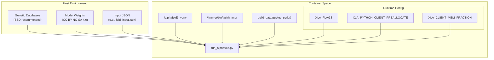
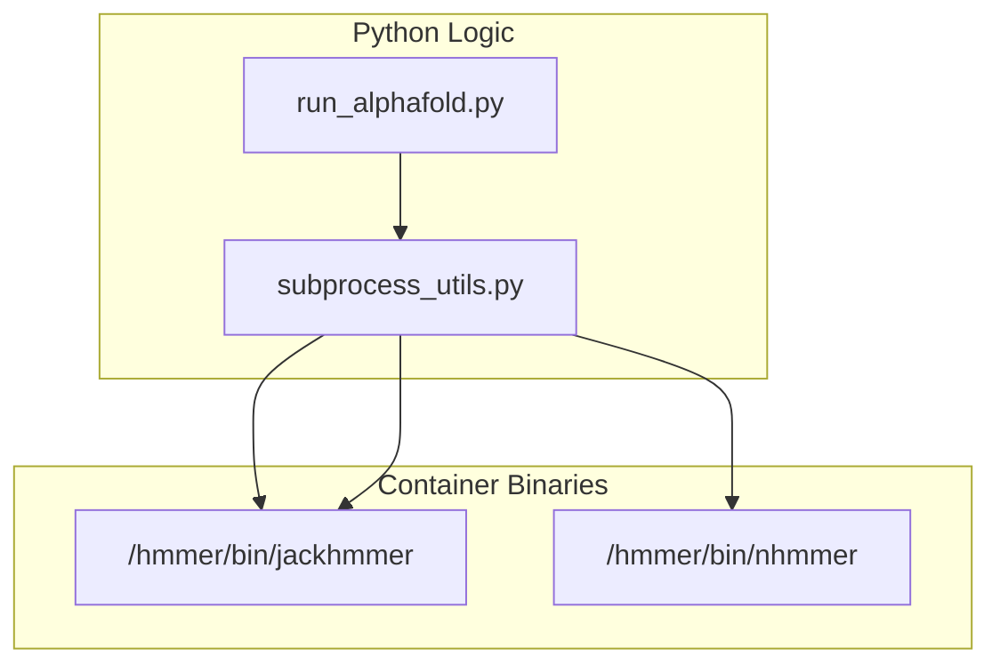

# Container Setup

> **Relevant source files**
> * [docker/Dockerfile](https://github.com/google-deepmind/alphafold3/blob/97639fff/docker/Dockerfile)
> * [docker/jackhmmer_seq_limit.patch](https://github.com/google-deepmind/alphafold3/blob/97639fff/docker/jackhmmer_seq_limit.patch)
> * [pyproject.toml](https://github.com/google-deepmind/alphafold3/blob/97639fff/pyproject.toml)
> * [src/alphafold3/data/tools/subprocess_utils.py](https://github.com/google-deepmind/alphafold3/blob/97639fff/src/alphafold3/data/tools/subprocess_utils.py)
> * [src/alphafold3/version.py](https://github.com/google-deepmind/alphafold3/blob/97639fff/src/alphafold3/version.py)
> * [uv.lock](https://github.com/google-deepmind/alphafold3/blob/97639fff/uv.lock)

## Purpose and Scope

This document provides detailed instructions for building and configuring Docker and Singularity containers for AlphaFold 3. Containers ensure a reproducible environment by bundling the specific versions of Python 3.12, CUDA 12.6, and the patched HMMER suite required for accurate predictions. The setup utilizes `uv` for dependency management and `scikit-build-core` for compiling C++ extensions like `mmcif_utils`.

## Container Architecture and Data Flow

The AlphaFold 3 container acts as a compute engine that requires external data (databases and model weights) to be mounted from the host system. It encapsulates the execution of `run_alphafold.py` within a specialized virtual environment.

### System Interaction Diagram

The following diagram maps the high-level system components to the specific code entities and environment variables defined in the `Dockerfile`.



Sources: [docker/Dockerfile L11-L88](https://github.com/google-deepmind/alphafold3/blob/97639fff/docker/Dockerfile#L11-L88)

 [pyproject.toml L63-L64](https://github.com/google-deepmind/alphafold3/blob/97639fff/pyproject.toml#L63-L64)

## Docker Setup

### Dockerfile Implementation Details

The Docker image is based on `nvidia/cuda:12.6.3-base-ubuntu24.04` [docker/Dockerfile L11](https://github.com/google-deepmind/alphafold3/blob/97639fff/docker/Dockerfile#L11-L11)

 It uses the `uv` package manager (pinned to version 0.9.24) for fast, reproducible dependency resolution [docker/Dockerfile L25](https://github.com/google-deepmind/alphafold3/blob/97639fff/docker/Dockerfile#L25-L25)

Key build stages:

1. **System Dependencies**: Installs `python3.12`, `git`, `gcc`, `g++`, `make`, and `zlib1g-dev`. `git` is specifically required for the `pyproject.toml` toolchain's interaction with `CMakeLists.txt` [docker/Dockerfile L15-L21](https://github.com/google-deepmind/alphafold3/blob/97639fff/docker/Dockerfile#L15-L21)
2. **HMMER Compilation**: Downloads HMMER 3.4, applies a custom sequence limit patch, and compiles from source to `/hmmer` [docker/Dockerfile L44-L58](https://github.com/google-deepmind/alphafold3/blob/97639fff/docker/Dockerfile#L44-L58)
3. **Python Environment**: Creates a virtual environment at `/alphafold3_venv` [docker/Dockerfile L30-L31](https://github.com/google-deepmind/alphafold3/blob/97639fff/docker/Dockerfile#L30-L31)  It syncs dependencies using `uv sync --frozen --all-groups` to include development/test dependencies like `pytest` [docker/Dockerfile L71-L72](https://github.com/google-deepmind/alphafold3/blob/97639fff/docker/Dockerfile#L71-L72)  [pyproject.toml L29-L32](https://github.com/google-deepmind/alphafold3/blob/97639fff/pyproject.toml#L29-L32)
4. **Data Preparation**: Executes the `build_data` script (mapped to `alphafold3.build_data:build_data`) to initialize the chemical components database [docker/Dockerfile L75](https://github.com/google-deepmind/alphafold3/blob/97639fff/docker/Dockerfile#L75-L75)  [pyproject.toml L63-L64](https://github.com/google-deepmind/alphafold3/blob/97639fff/pyproject.toml#L63-L64)

### The HMMER Patch

AlphaFold 3 requires a specific modification to `jackhmmer` to support the `--seq_limit` flag. This prevents memory exhaustion during the MSA generation stage for very deep alignments by truncating hits after a specified threshold.

| Code Entity | File | Description |
| --- | --- | --- |
| `jackhmmer_seq_limit.patch` | [docker/jackhmmer_seq_limit.patch L1-L33](https://github.com/google-deepmind/alphafold3/blob/97639fff/docker/jackhmmer_seq_limit.patch#L1-L33) | Modifies `src/jackhmmer.c` to add `--seq_limit` logic [docker/jackhmmer_seq_limit.patch L7-L28](https://github.com/google-deepmind/alphafold3/blob/97639fff/docker/jackhmmer_seq_limit.patch#L7-L28) |
| `jackhmmer_seq_limit_supported` | [src/alphafold3/data/tools/subprocess_utils.py L39-L51](https://github.com/google-deepmind/alphafold3/blob/97639fff/src/alphafold3/data/tools/subprocess_utils.py#L39-L51) | Validation function checking for the patch's existence via a help-flag check. |

Sources: [docker/Dockerfile L49-L51](https://github.com/google-deepmind/alphafold3/blob/97639fff/docker/Dockerfile#L49-L51)

 [src/alphafold3/data/tools/subprocess_utils.py L39-L51](https://github.com/google-deepmind/alphafold3/blob/97639fff/src/alphafold3/data/tools/subprocess_utils.py#L39-L51)

## GPU Configuration

The container is optimized for NVIDIA Ampere (A100) and Hopper (H100) architectures. Specific environment variables are set in the `Dockerfile` to manage XLA compilation and JAX memory allocation.

### Default Runtime Environment

| Variable | Value | Purpose |
| --- | --- | --- |
| `XLA_FLAGS` | `--xla_gpu_enable_triton_gemm=false` | Disables Triton GEMM to avoid a known XLA compilation hang [docker/Dockerfile L83](https://github.com/google-deepmind/alphafold3/blob/97639fff/docker/Dockerfile#L83-L83) |
| `XLA_PYTHON_CLIENT_PREALLOCATE` | `true` | Enables JAX memory preallocation for performance [docker/Dockerfile L85](https://github.com/google-deepmind/alphafold3/blob/97639fff/docker/Dockerfile#L85-L85) |
| `XLA_CLIENT_MEM_FRACTION` | `0.95` | Allocates 95% of VRAM to the AlphaFold process, sufficient for 5,120 tokens on A100 80GB [docker/Dockerfile L84-L86](https://github.com/google-deepmind/alphafold3/blob/97639fff/docker/Dockerfile#L84-L86) |

### Support for Older GPUs (CUDA Capability 7.x)

For NVIDIA V100 or other Capability 7.x GPUs, the `XLA_FLAGS` must be overridden because Triton GEMM is not supported, and custom kernel fusion can cause issues:
`ENV XLA_FLAGS="--xla_disable_hlo_passes=custom-kernel-fusion-rewriter"` [docker/Dockerfile L79-L81](https://github.com/google-deepmind/alphafold3/blob/97639fff/docker/Dockerfile#L79-L81)

Sources: [docker/Dockerfile L77-L87](https://github.com/google-deepmind/alphafold3/blob/97639fff/docker/Dockerfile#L77-L87)

 [pyproject.toml L20-L21](https://github.com/google-deepmind/alphafold3/blob/97639fff/pyproject.toml#L20-L21)

## Singularity for HPC Environments

In high-performance computing (HPC) environments where root access for Docker is unavailable, AlphaFold 3 can be run via Singularity (Apptainer).

### Dependency Resolution in HPC

Because `pyproject.toml` specifies platform-specific dependencies (e.g., `jax[cuda12]`), Singularity images should ideally be built on the target architecture (x86_64 or aarch64) to ensure the `uv.lock` resolution matches the hardware [pyproject.toml L34-L39](https://github.com/google-deepmind/alphafold3/blob/97639fff/pyproject.toml#L34-L39)

 [uv.lock L12-L15](https://github.com/google-deepmind/alphafold3/blob/97639fff/uv.lock#L12-L15)

### Building from Docker

To convert the Docker image to a Singularity Image File (`.sif`), the recommended path is via a local registry:

1. **Tag and Push**: ``` docker tag alphafold3 localhost:5000/alphafold3docker push localhost:5000/alphafold3 ```
2. **Build SIF**: ``` SINGULARITY_NOHTTPS=1 singularity build alphafold3.sif docker://localhost:5000/alphafold3:latest ```

### Execution with Singularity

When running with Singularity, the `--nv` flag is required for GPU passthrough. Note that the `UV_PROJECT_ENVIRONMENT` path [docker/Dockerfile L30](https://github.com/google-deepmind/alphafold3/blob/97639fff/docker/Dockerfile#L30-L30)

 must be accessible within the container.

```
singularity exec \    --nv \    --bind /path/to/databases:/root/public_databases \    --bind /path/to/weights:/root/models \    --bind $PWD/input:/root/af_input \    --bind $PWD/output:/root/af_output \    alphafold3.sif \    python3 run_alphafold.py \    --json_path=/root/af_input/input.json \    --model_dir=/root/models \    --output_dir=/root/af_output
```

## Internal Tool Integration

The container setup ensures that external binaries are correctly mapped and accessible to the Python runtime via `subprocess_utils.py`.



| Function | File | Role |
| --- | --- | --- |
| `run` | [src/alphafold3/data/tools/subprocess_utils.py L53-L120](https://github.com/google-deepmind/alphafold3/blob/97639fff/src/alphafold3/data/tools/subprocess_utils.py#L53-L120) | Executes commands, handles logging, and times process duration. |
| `check_binary_exists` | [src/alphafold3/data/tools/subprocess_utils.py L33-L37](https://github.com/google-deepmind/alphafold3/blob/97639fff/src/alphafold3/data/tools/subprocess_utils.py#L33-L37) | Verifies that HMMER binaries are in the container's `PATH`. |

Sources: [docker/Dockerfile L33](https://github.com/google-deepmind/alphafold3/blob/97639fff/docker/Dockerfile#L33-L33)

 [src/alphafold3/data/tools/subprocess_utils.py L33-L120](https://github.com/google-deepmind/alphafold3/blob/97639fff/src/alphafold3/data/tools/subprocess_utils.py#L33-L120)