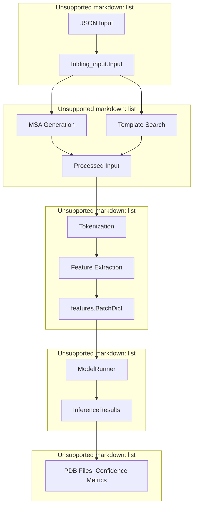
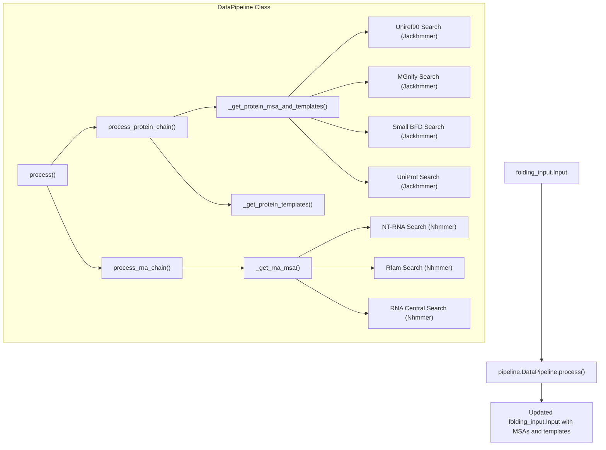
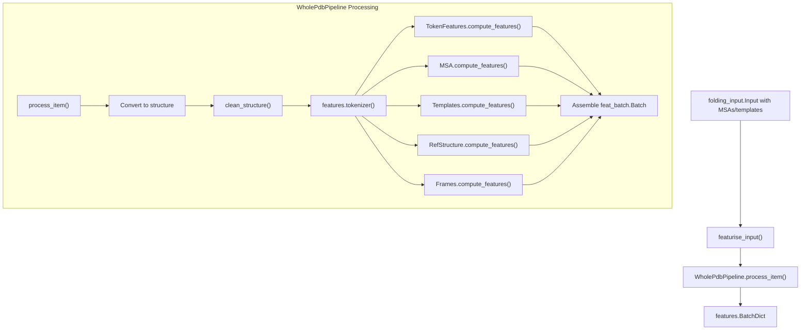
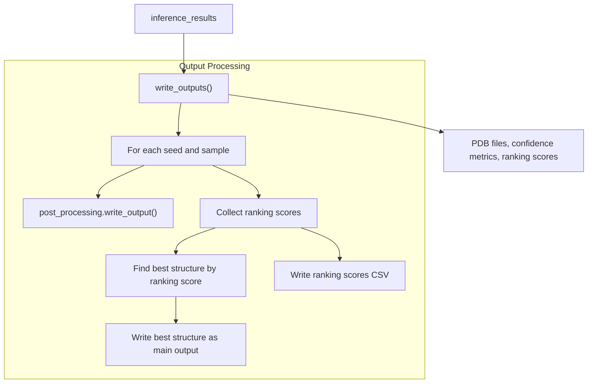

# Core Pipeline

> **Relevant source files**
> * [run_alphafold.py](https://github.com/google-deepmind/alphafold3/blob/97639fff/run_alphafold.py)
> * [src/alphafold3/data/featurisation.py](https://github.com/google-deepmind/alphafold3/blob/97639fff/src/alphafold3/data/featurisation.py)
> * [src/alphafold3/model/pipeline/pipeline.py](https://github.com/google-deepmind/alphafold3/blob/97639fff/src/alphafold3/model/pipeline/pipeline.py)
> * [src/alphafold3/model/pipeline/structure_cleaning.py](https://github.com/google-deepmind/alphafold3/blob/97639fff/src/alphafold3/model/pipeline/structure_cleaning.py)

The Core Pipeline in AlphaFold 3 is the complete sequence of operations that transforms input biological sequences (proteins, RNA, DNA, and ligands) into predicted 3D structures. This document provides a technical overview of the pipeline's components, data flow, and implementation details.

For specific details about the model architecture internals, see [Data Structures](/google-deepmind/alphafold3/5-data-structures). For information about running AlphaFold 3, see [Running AlphaFold 3](/google-deepmind/alphafold3/3.2-running-alphafold-3).

## Pipeline Overview

The AlphaFold 3 core pipeline consists of five main stages that process input data sequentially:



Sources: [run_alphafold.py L63-L94](https://github.com/google-deepmind/alphafold3/blob/97639fff/run_alphafold.py#L63-L94)

 [src/alphafold3/data/featurisation.py L38-L104](https://github.com/google-deepmind/alphafold3/blob/97639fff/src/alphafold3/data/featurisation.py#L38-L104)

 [src/alphafold3/model/pipeline/pipeline.py L153-L162](https://github.com/google-deepmind/alphafold3/blob/97639fff/src/alphafold3/model/pipeline/pipeline.py#L153-L162)

## Input Processing

AlphaFold 3 accepts input specifications in JSON format, which are parsed into the `folding_input.Input` data structure. This structure contains all the necessary information for structure prediction.

### Input Structure

Sources: [run_alphafold.py L38-L39](https://github.com/google-deepmind/alphafold3/blob/97639fff/run_alphafold.py#L38-L39)

 [src/alphafold3/data/featurisation.py L24-L36](https://github.com/google-deepmind/alphafold3/blob/97639fff/src/alphafold3/data/featurisation.py#L24-L36)

The input structure is loaded via command-line arguments, either from a single JSON file (`--json_path`) or a directory containing multiple JSON files (`--input_dir`) [run_alphafold.py L63-L72](https://github.com/google-deepmind/alphafold3/blob/97639fff/run_alphafold.py#L63-L72)

 For details, see [Input Processing](/google-deepmind/alphafold3/4.1-input-processing).

## Data Pipeline

The data pipeline generates multiple sequence alignments (MSAs) and finds templates for protein and RNA chains. This stage is controlled by the `--run_data_pipeline` flag [run_alphafold.py L85-L89](https://github.com/google-deepmind/alphafold3/blob/97639fff/run_alphafold.py#L85-L89)

 and can be bypassed if MSAs and templates are already provided in the input.

### Data Pipeline Components



Sources: [run_alphafold.py L97-L215](https://github.com/google-deepmind/alphafold3/blob/97639fff/run_alphafold.py#L97-L215)

 [src/alphafold3/data/pipeline.py L202-L551](https://github.com/google-deepmind/alphafold3/blob/97639fff/src/alphafold3/data/pipeline.py#L202-L551)

For details, see [Data Pipeline](/google-deepmind/alphafold3/4.2-data-pipeline).

## Featurization

The featurization stage converts biological data into numerical features. This process is orchestrated by `featurise_input` [src/alphafold3/data/featurisation.py L38-L46](https://github.com/google-deepmind/alphafold3/blob/97639fff/src/alphafold3/data/featurisation.py#L38-L46)

 which utilizes the `WholePdbPipeline` class [src/alphafold3/model/pipeline/pipeline.py L77-L143](https://github.com/google-deepmind/alphafold3/blob/97639fff/src/alphafold3/model/pipeline/pipeline.py#L77-L143)

### Featurization Process



Sources: [src/alphafold3/data/featurisation.py L77-L102](https://github.com/google-deepmind/alphafold3/blob/97639fff/src/alphafold3/data/featurisation.py#L77-L102)

 [src/alphafold3/model/pipeline/pipeline.py L153-L162](https://github.com/google-deepmind/alphafold3/blob/97639fff/src/alphafold3/model/pipeline/pipeline.py#L153-L162)

 [src/alphafold3/model/pipeline/structure_cleaning.py L64-L77](https://github.com/google-deepmind/alphafold3/blob/97639fff/src/alphafold3/model/pipeline/structure_cleaning.py#L64-L77)

### Key Featurization Components

1. **Structure Cleaning**: Handled by `structure_cleaning.clean_structure` [src/alphafold3/model/pipeline/structure_cleaning.py L64-L77](https://github.com/google-deepmind/alphafold3/blob/97639fff/src/alphafold3/model/pipeline/structure_cleaning.py#L64-L77)  this removes unwanted atoms (e.g., hydrogens, water) and handles leaving atoms for ligands and glycans [src/alphafold3/model/pipeline/structure_cleaning.py L116-L160](https://github.com/google-deepmind/alphafold3/blob/97639fff/src/alphafold3/model/pipeline/structure_cleaning.py#L116-L160)
2. **Tokenization**: Dividing the input into representative tokens (residues or atoms) via `features.tokenizer`.
3. **Bucket Size Calculation**: `calculate_bucket_size` [src/alphafold3/model/pipeline/pipeline.py L34-L62](https://github.com/google-deepmind/alphafold3/blob/97639fff/src/alphafold3/model/pipeline/pipeline.py#L34-L62)  determines padding to a strictly increasing sequence of sizes to avoid excessive JAX re-compilation.

For details, see [Featurization](/google-deepmind/alphafold3/4.3-featurization).

## Model Inference

The model inference stage uses featurized data to predict 3D structures. This is controlled by the `--run_inference` flag [run_alphafold.py L90-L94](https://github.com/google-deepmind/alphafold3/blob/97639fff/run_alphafold.py#L90-L94)

 and implemented by the `ModelRunner` class.

### Model Runner

Sources: [run_alphafold.py L304-L378](https://github.com/google-deepmind/alphafold3/blob/97639fff/run_alphafold.py#L304-L378)

 [run_alphafold.py L399-L463](https://github.com/google-deepmind/alphafold3/blob/97639fff/run_alphafold.py#L399-L463)

The model generates multiple diffusion samples for each seed provided in the input. For details, see [Model Inference](/google-deepmind/alphafold3/4.4-model-inference).

## Post-Processing

The post-processing stage converts model outputs into final structures and confidence metrics. This is handled by `write_outputs` [run_alphafold.py L478-L533](https://github.com/google-deepmind/alphafold3/blob/97639fff/run_alphafold.py#L478-L533)

### Output Generation



Sources: [run_alphafold.py L478-L533](https://github.com/google-deepmind/alphafold3/blob/97639fff/run_alphafold.py#L478-L533)

 [run_alphafold.py L519-L523](https://github.com/google-deepmind/alphafold3/blob/97639fff/run_alphafold.py#L519-L523)

For details, see [Post-Processing](/google-deepmind/alphafold3/4.5-post-processing).

## Pipeline Orchestration

The entire pipeline is orchestrated by the `process_fold_input` function in `run_alphafold.py`, which coordinates the data pipeline, inference, and output writing [run_alphafold.py L580-L673](https://github.com/google-deepmind/alphafold3/blob/97639fff/run_alphafold.py#L580-L673)

```mermaid
flowchart TD

Check["Check for existing output dir"]
RunDataPipeline["Run data pipeline (if enabled)"]
WriteJSON["Write fold_input JSON"]
RunInference["Run inference (if enabled)"]
PredictStructure["predict_structure()"]
WriteOutputs["write_outputs()"]
Input["folding_input.Input"]
ProcessFoldInput["process_fold_input()"]
FinalOutput["Output files"]

Input --> ProcessFoldInput
ProcessFoldInput --> FinalOutput

subgraph process_fold_input() ["process_fold_input()"]
    Check
    RunDataPipeline
    WriteJSON
    RunInference
    PredictStructure
    WriteOutputs
    Check --> RunDataPipeline
    RunDataPipeline --> WriteJSON
    WriteJSON --> RunInference
    RunInference --> PredictStructure
    PredictStructure --> WriteOutputs
end
```

Sources: [run_alphafold.py L580-L673](https://github.com/google-deepmind/alphafold3/blob/97639fff/run_alphafold.py#L580-L673)