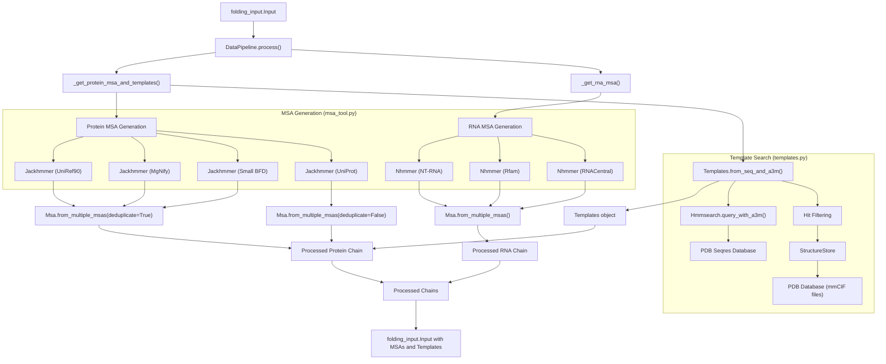
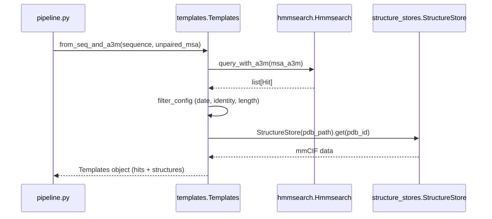

# Data Pipeline

> **Relevant source files**
> * [docs/input.md](https://github.com/google-deepmind/alphafold3/blob/97639fff/docs/input.md?plain=1)
> * [src/alphafold3/data/msa_config.py](https://github.com/google-deepmind/alphafold3/blob/97639fff/src/alphafold3/data/msa_config.py)
> * [src/alphafold3/data/pipeline.py](https://github.com/google-deepmind/alphafold3/blob/97639fff/src/alphafold3/data/pipeline.py)
> * [src/alphafold3/data/templates.py](https://github.com/google-deepmind/alphafold3/blob/97639fff/src/alphafold3/data/templates.py)
> * [src/alphafold3/data/tools/jackhmmer.py](https://github.com/google-deepmind/alphafold3/blob/97639fff/src/alphafold3/data/tools/jackhmmer.py)
> * [src/alphafold3/data/tools/msa_tool.py](https://github.com/google-deepmind/alphafold3/blob/97639fff/src/alphafold3/data/tools/msa_tool.py)
> * [src/alphafold3/data/tools/nhmmer.py](https://github.com/google-deepmind/alphafold3/blob/97639fff/src/alphafold3/data/tools/nhmmer.py)
> * [src/alphafold3/data/tools/shards.py](https://github.com/google-deepmind/alphafold3/blob/97639fff/src/alphafold3/data/tools/shards.py)
> * [src/alphafold3/model/confidences.py](https://github.com/google-deepmind/alphafold3/blob/97639fff/src/alphafold3/model/confidences.py)

The Data Pipeline is responsible for generating Multiple Sequence Alignments (MSAs) and searching for structural templates for protein and RNA chains in AlphaFold 3. This stage transforms raw sequences from the input JSON into the rich evolutionary and structural context required by the model.

## Architecture Overview

The Data Pipeline processes each chain in the input structure separately based on its polymer type (protein, RNA, or DNA). It utilizes parallel execution of external genetic search tools to optimize throughput.

Sources: [src/alphafold3/data/pipeline.py L70-L151](https://github.com/google-deepmind/alphafold3/blob/97639fff/src/alphafold3/data/pipeline.py#L70-L151)

 [src/alphafold3/data/pipeline.py L156-L191](https://github.com/google-deepmind/alphafold3/blob/97639fff/src/alphafold3/data/pipeline.py#L156-L191)

 [src/alphafold3/data/templates.py L429-L523](https://github.com/google-deepmind/alphafold3/blob/97639fff/src/alphafold3/data/templates.py#L429-L523)

 [src/alphafold3/data/msa.py L202-L229](https://github.com/google-deepmind/alphafold3/blob/97639fff/src/alphafold3/data/msa.py#L202-L229)

## Configuration

The pipeline behavior is governed by `msa_config.py`, which defines dataclasses for tool parameters and database paths.

### Key Configuration Classes

| Class | Purpose |
| --- | --- |
| `JackhmmerConfig` | Parameters for `Jackhmmer`, including E-values, Z-values, and CPU allocation [src/alphafold3/data/msa_config.py L36-L65](https://github.com/google-deepmind/alphafold3/blob/97639fff/src/alphafold3/data/msa_config.py#L36-L65) |
| `NhmmerConfig` | Parameters for `Nhmmer`, including HMMER binary paths and RNA/DNA alphabets [src/alphafold3/data/msa_config.py L69-L98](https://github.com/google-deepmind/alphafold3/blob/97639fff/src/alphafold3/data/msa_config.py#L69-L98) |
| `TemplatesConfig` | Orchestrates template tool settings and filtering logic [src/alphafold3/data/msa_config.py L180-L185](https://github.com/google-deepmind/alphafold3/blob/97639fff/src/alphafold3/data/msa_config.py#L180-L185) |
| `TemplateFilterConfig` | Criteria for hit selection: date cutoffs, identity ratios, and hit limits [src/alphafold3/data/msa_config.py L156-L178](https://github.com/google-deepmind/alphafold3/blob/97639fff/src/alphafold3/data/msa_config.py#L156-L178) |

Sources: [src/alphafold3/data/msa_config.py L36-L185](https://github.com/google-deepmind/alphafold3/blob/97639fff/src/alphafold3/data/msa_config.py#L36-L185)

## MSA Generation

### Protein MSA Generation

Protein chains are processed by `_get_protein_msa_and_templates`. The pipeline executes searches against four primary databases in parallel using a `futures.ThreadPoolExecutor` [src/alphafold3/data/pipeline.py L86-L110](https://github.com/google-deepmind/alphafold3/blob/97639fff/src/alphafold3/data/pipeline.py#L86-L110)

1. **Search Phase**: `msa.get_msa` is called for UniRef90, MgNify, Small BFD, and UniProt [src/alphafold3/data/pipeline.py L87-L110](https://github.com/google-deepmind/alphafold3/blob/97639fff/src/alphafold3/data/pipeline.py#L87-L110)
2. **Deduplication**: Results from UniRef90, Small BFD, and MgNify are merged and deduplicated to form the `unpaired_protein_msa` [src/alphafold3/data/pipeline.py L124-L128](https://github.com/google-deepmind/alphafold3/blob/97639fff/src/alphafold3/data/pipeline.py#L124-L128)
3. **Pairing**: The UniProt search result forms the `paired_protein_msa`, which is used for identifying evolutionary constraints across different chains [src/alphafold3/data/pipeline.py L129-L131](https://github.com/google-deepmind/alphafold3/blob/97639fff/src/alphafold3/data/pipeline.py#L129-L131)

**Sharded Database Support:**
The `Jackhmmer` wrapper supports sharded databases using the `@num_shards` syntax [src/alphafold3/data/tools/shards.py L11-L22](https://github.com/google-deepmind/alphafold3/blob/97639fff/src/alphafold3/data/tools/shards.py#L11-L22)

 When sharding is used, the query is run against each shard in parallel. Results are merged using `tblout` files to ensure E-values are correctly scaled according to the provided `z_value` [src/alphafold3/data/tools/jackhmmer.py L52-L110](https://github.com/google-deepmind/alphafold3/blob/97639fff/src/alphafold3/data/tools/jackhmmer.py#L52-L110)

Sources: [src/alphafold3/data/pipeline.py L70-L151](https://github.com/google-deepmind/alphafold3/blob/97639fff/src/alphafold3/data/pipeline.py#L70-L151)

 [src/alphafold3/data/tools/jackhmmer.py L52-L110](https://github.com/google-deepmind/alphafold3/blob/97639fff/src/alphafold3/data/tools/jackhmmer.py#L52-L110)

 [src/alphafold3/data/tools/shards.py L11-L22](https://github.com/google-deepmind/alphafold3/blob/97639fff/src/alphafold3/data/tools/shards.py#L11-L22)

### RNA MSA Generation

RNA chains are processed via `_get_rna_msa` [src/alphafold3/data/pipeline.py L156-L161](https://github.com/google-deepmind/alphafold3/blob/97639fff/src/alphafold3/data/pipeline.py#L156-L161)

1. **Parallel Search**: Runs `Nhmmer` against NT-RNA, Rfam, and RNACentral [src/alphafold3/data/pipeline.py L167-L185](https://github.com/google-deepmind/alphafold3/blob/97639fff/src/alphafold3/data/pipeline.py#L167-L185)
2. **Short Sequence Optimization**: For sequences shorter than 50 nucleotides, `Nhmmer` behavior may differ; for longer sequences, the pipeline typically builds an HMM profile first [src/alphafold3/data/tools/nhmmer.py L32-L35](https://github.com/google-deepmind/alphafold3/blob/97639fff/src/alphafold3/data/tools/nhmmer.py#L32-L35)
3. **Merging**: Hits are combined into a single `Msa` object using `msa.Msa.from_multiple_msas` [src/alphafold3/data/pipeline.py L189-L191](https://github.com/google-deepmind/alphafold3/blob/97639fff/src/alphafold3/data/pipeline.py#L189-L191)

Sources: [src/alphafold3/data/pipeline.py L156-L191](https://github.com/google-deepmind/alphafold3/blob/97639fff/src/alphafold3/data/pipeline.py#L156-L191)

 [src/alphafold3/data/tools/nhmmer.py L32-L35](https://github.com/google-deepmind/alphafold3/blob/97639fff/src/alphafold3/data/tools/nhmmer.py#L32-L35)

## Template Search

The template search identifies structural homologs for protein chains to provide the model with known structural motifs.

1. **Query Generation**: The `unpaired_protein_msa` (in A3M format) is used as the basis for the template search [src/alphafold3/data/pipeline.py L145](https://github.com/google-deepmind/alphafold3/blob/97639fff/src/alphafold3/data/pipeline.py#L145-L145)
2. **Hmmsearch**: The `Hmmsearch` tool builds a profile and queries the PDB Seqres database [src/alphafold3/data/tools/hmmsearch.py L97-L132](https://github.com/google-deepmind/alphafold3/blob/97639fff/src/alphafold3/data/tools/hmmsearch.py#L97-L132)
3. **Filtering**: Hits are filtered based on the `max_template_date` and other criteria in `TemplateFilterConfig` [src/alphafold3/data/templates.py L429-L523](https://github.com/google-deepmind/alphafold3/blob/97639fff/src/alphafold3/data/templates.py#L429-L523)
4. **Structure Retrieval**: For the top hits, atom positions and masks are retrieved from the `StructureStore`, which manages access to the local mmCIF database [src/alphafold3/data/templates.py L541-L551](https://github.com/google-deepmind/alphafold3/blob/97639fff/src/alphafold3/data/templates.py#L541-L551)

Sources: [src/alphafold3/data/pipeline.py L28-L66](https://github.com/google-deepmind/alphafold3/blob/97639fff/src/alphafold3/data/pipeline.py#L28-L66)

 [src/alphafold3/data/templates.py L429-L551](https://github.com/google-deepmind/alphafold3/blob/97639fff/src/alphafold3/data/templates.py#L429-L551)

 [src/alphafold3/data/tools/hmmsearch.py L97-L132](https://github.com/google-deepmind/alphafold3/blob/97639fff/src/alphafold3/data/tools/hmmsearch.py#L97-L132)

## Implementation Details

### Homomer Optimization

The pipeline uses `@functools.cache` on `_get_protein_msa_and_templates` and `_get_rna_msa` [src/alphafold3/data/pipeline.py L29-L30](https://github.com/google-deepmind/alphafold3/blob/97639fff/src/alphafold3/data/pipeline.py#L29-L30)

 [src/alphafold3/data/pipeline.py L70-L71](https://github.com/google-deepmind/alphafold3/blob/97639fff/src/alphafold3/data/pipeline.py#L70-L71)

 In complexes with multiple identical chains (homomers), the MSA and template searches are performed only once per unique sequence, significantly reducing computation time.

### External Tool Wrappers

AlphaFold 3 interacts with HMMER binaries through dedicated wrapper classes in `src/alphafold3/data/tools/`. These classes:

* Check for binary existence [src/alphafold3/data/tools/jackhmmer.py L116-L118](https://github.com/google-deepmind/alphafold3/blob/97639fff/src/alphafold3/data/tools/jackhmmer.py#L116-L118)
* Manage temporary files for queries and results [src/alphafold3/data/tools/jackhmmer.py L149-L172](https://github.com/google-deepmind/alphafold3/blob/97639fff/src/alphafold3/data/tools/jackhmmer.py#L149-L172)
* Support a patched version of `Jackhmmer` that includes the `--seq_limit` flag to reduce peak memory usage [src/alphafold3/data/tools/jackhmmer.py L131-L136](https://github.com/google-deepmind/alphafold3/blob/97639fff/src/alphafold3/data/tools/jackhmmer.py#L131-L136)

### Feature Processing (Preview)

While the Data Pipeline generates the raw MSA and Template objects, these are later converted into numerical tensors (e.g., `template_all_atom_positions`, `template_aatype`) during the **Featurization** stage [src/alphafold3/data/templates.py L36-L43](https://github.com/google-deepmind/alphafold3/blob/97639fff/src/alphafold3/data/templates.py#L36-L43)

Sources: [src/alphafold3/data/pipeline.py L29-L71](https://github.com/google-deepmind/alphafold3/blob/97639fff/src/alphafold3/data/pipeline.py#L29-L71)

 [src/alphafold3/data/tools/jackhmmer.py L116-L136](https://github.com/google-deepmind/alphafold3/blob/97639fff/src/alphafold3/data/tools/jackhmmer.py#L116-L136)

 [src/alphafold3/data/templates.py L36-L43](https://github.com/google-deepmind/alphafold3/blob/97639fff/src/alphafold3/data/templates.py#L36-L43)