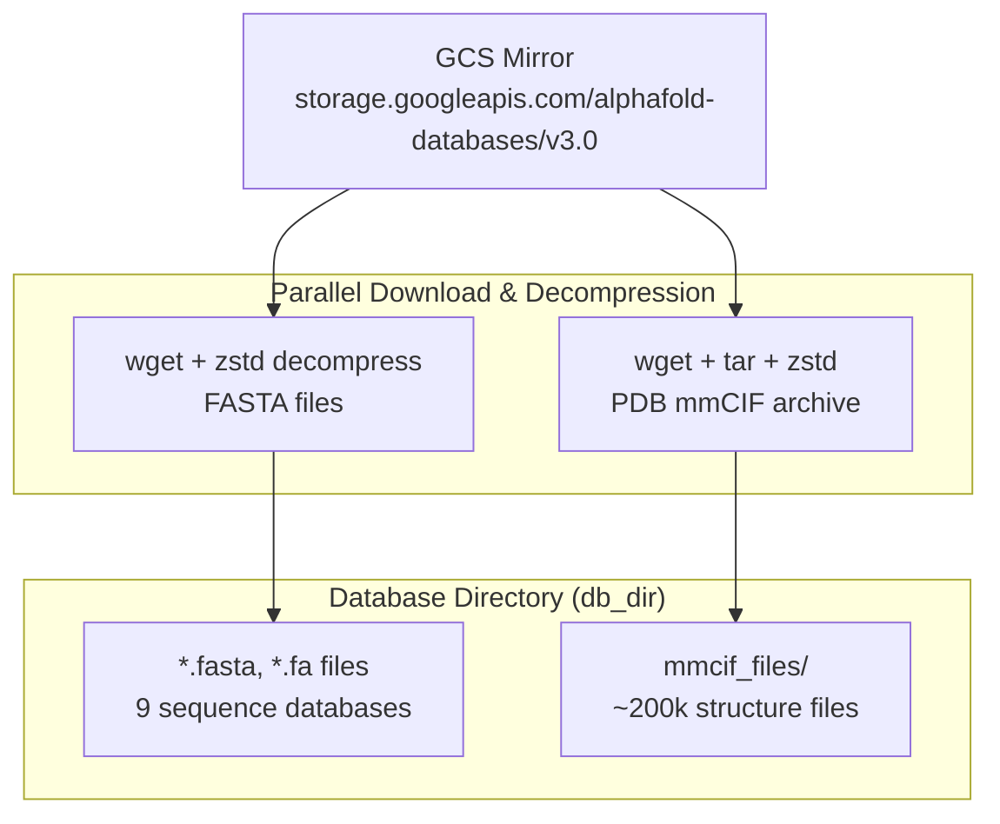
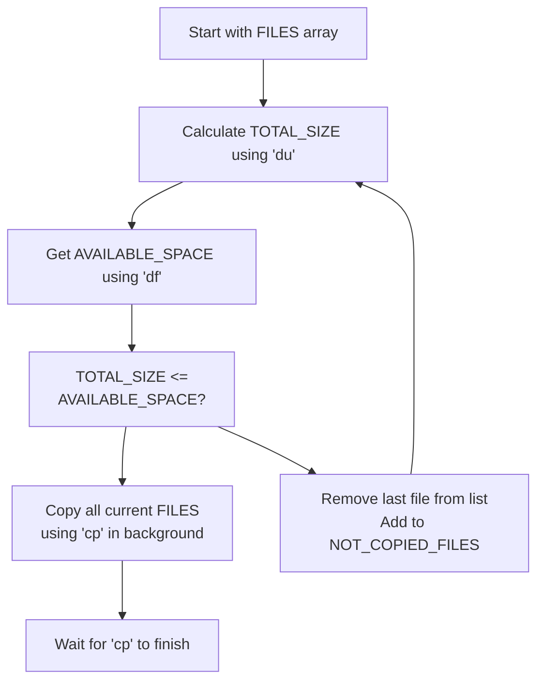

# Database Setup

> **Relevant source files**
> * [docs/installation.md](https://github.com/google-deepmind/alphafold3/blob/97639fff/docs/installation.md?plain=1)
> * [fetch_databases.sh](https://github.com/google-deepmind/alphafold3/blob/97639fff/fetch_databases.sh)
> * [src/alphafold3/scripts/copy_to_ssd.sh](https://github.com/google-deepmind/alphafold3/blob/97639fff/src/alphafold3/scripts/copy_to_ssd.sh)
> * [src/alphafold3/scripts/gcp_mount_ssd.sh](https://github.com/google-deepmind/alphafold3/blob/97639fff/src/alphafold3/scripts/gcp_mount_ssd.sh)

## Purpose and Scope

This document provides detailed instructions for downloading, organizing, and optimizing the genetic databases required by AlphaFold 3. It covers the use of the `fetch_databases.sh` script, database directory structure, and SSD optimization strategies for improved search performance.

For instructions on building the Docker container that will use these databases, see [Container Setup](/google-deepmind/alphafold3/2.2-container-setup). For information on running AlphaFold 3 with these databases, see [Running AlphaFold 3](/google-deepmind/alphafold3/3.2-running-alphafold-3).

## Prerequisites

Before downloading databases, ensure the following tools are installed on your system:

| Tool | Purpose | Installation (Debian-based) |
| --- | --- | --- |
| `wget` | Database download | `sudo apt install wget` |
| `zstd` | Database decompression | `sudo apt install zstd` |
| `tar` | Archive extraction | Usually pre-installed |

**Disk Space Requirements:**

* Download size: ~252 GB
* Uncompressed size: ~630 GB
* Recommended: 1 TB total storage with SSD for optimal performance [docs/installation.md L4-L5](https://github.com/google-deepmind/alphafold3/blob/97639fff/docs/installation.md?plain=1#L4-L5)

**Sources:** [docs/installation.md L4-L5](https://github.com/google-deepmind/alphafold3/blob/97639fff/docs/installation.md?plain=1#L4-L5)

 [fetch_databases.sh L16-L21](https://github.com/google-deepmind/alphafold3/blob/97639fff/fetch_databases.sh#L16-L21)

## Required Genetic Databases

AlphaFold 3 requires multiple genetic databases for protein and RNA Multiple Sequence Alignment (MSA) generation and template search. The following table describes each database:

| Database | Type | Purpose | Size (Uncompressed) |
| --- | --- | --- | --- |
| BFD (small) | Protein sequences | MSA generation for proteins | ~272 GB |
| UniRef90 | Protein sequences | MSA generation for proteins | ~59 GB |
| MGnify | Metagenomic clusters | MSA generation for proteins | ~120 GB |
| UniProt | Protein sequences | Reference protein sequences | ~99 GB |
| PDB seqres | Protein sequences | Template search sequences | ~0.2 GB |
| PDB mmCIF | Protein structures | Template structures (~200k files) | ~78 GB |
| RNACentral | RNA sequences | MSA generation for RNA | ~0.5 GB |
| NT | Nucleotide sequences | MSA generation for RNA/DNA | ~1.5 GB |
| RFam | RNA families | MSA generation for RNA | ~0.05 GB |

**Sources:** [fetch_databases.sh L34-L41](https://github.com/google-deepmind/alphafold3/blob/97639fff/fetch_databases.sh#L34-L41)

 [src/alphafold3/scripts/copy_to_ssd.sh L19-L26](https://github.com/google-deepmind/alphafold3/blob/97639fff/src/alphafold3/scripts/copy_to_ssd.sh#L19-L26)

### Data Flow Overview

The following diagram illustrates how external databases are utilized by the AlphaFold 3 pipeline.

```mermaid
flowchart TD

BFD["bfd-first_non_consensus_sequences.fasta<br>272 GB"]
UniRef90["uniref90_2022_05.fa<br>59 GB"]
MGnify["mgy_clusters_2022_05.fa<br>120 GB"]
UniProt["uniprot_all_2021_04.fa<br>99 GB"]
PDBSeqres["pdb_seqres_2022_09_28.fasta<br>0.2 GB"]
RNACentral["rnacentral_active_seq_id_90_cov_80_linclust.fasta<br>0.5 GB"]
NT["nt_rna_2023_02_23_clust_seq_id_90_cov_80_rep_seq.fasta<br>1.5 GB"]
RFam["rfam_14_9_clust_seq_id_90_cov_80_rep_seq.fasta<br>0.05 GB"]
PDBMMCIF["pdb_2022_09_28_mmcif_files.tar<br>~200k PDB structures<br>78 GB"]
DataPipeline["Data Pipeline<br>MSA & Template Search"]

BFD --> DataPipeline
UniRef90 --> DataPipeline
MGnify --> DataPipeline
UniProt --> DataPipeline
PDBSeqres --> DataPipeline
RNACentral --> DataPipeline
NT --> DataPipeline
RFam --> DataPipeline
PDBMMCIF --> DataPipeline

subgraph StructureDatabases ["Structure Databases"]
    PDBMMCIF
end

subgraph RNADatabases ["RNA/DNA Sequence Databases"]
    RNACentral
    NT
    RFam
end

subgraph ProteinDatabases ["Protein Sequence Databases"]
    BFD
    UniRef90
    MGnify
    UniProt
    PDBSeqres
end
```



**Sources:** [fetch_databases.sh L28-L45](https://github.com/google-deepmind/alphafold3/blob/97639fff/fetch_databases.sh#L28-L45)

 [src/alphafold3/scripts/copy_to_ssd.sh L19-L26](https://github.com/google-deepmind/alphafold3/blob/97639fff/src/alphafold3/scripts/copy_to_ssd.sh#L19-L26)

## Database Download with fetch_databases.sh

### Basic Usage

The `fetch_databases.sh` script downloads all required databases from a Google Cloud Storage mirror. All database versions match those used in the AlphaFold 3 paper.

```markdown
cd alphafold3  # Navigate to AlphaFold 3 repository./fetch_databases.sh [<DB_DIR>]
```

**Default directory:** `$HOME/public_databases` (if `<DB_DIR>` is not specified) [fetch_databases.sh L14](https://github.com/google-deepmind/alphafold3/blob/97639fff/fetch_databases.sh#L14-L14)

**Important:** The download directory should NOT be a subdirectory of the AlphaFold 3 repository. This prevents slow Docker builds caused by copying large databases during image creation.

**Sources:** [fetch_databases.sh L14-L26](https://github.com/google-deepmind/alphafold3/blob/97639fff/fetch_databases.sh#L14-L26)

### Script Implementation Details

The `fetch_databases.sh` script performs parallel downloads and decompression using background tasks.



**Key implementation details:**

* Uses `wget --quiet --output-document=-` to stream downloads [fetch_databases.sh L29-L30](https://github.com/google-deepmind/alphafold3/blob/97639fff/fetch_databases.sh#L29-L30)
* Pipes directly to `zstd --decompress` or `tar` for decompression [fetch_databases.sh L31-L44](https://github.com/google-deepmind/alphafold3/blob/97639fff/fetch_databases.sh#L31-L44)
* Background processes (`&`) enable parallel downloads [fetch_databases.sh L32-L44](https://github.com/google-deepmind/alphafold3/blob/97639fff/fetch_databases.sh#L32-L44)
* `wait` command ensures all downloads complete before script exits [fetch_databases.sh L47](https://github.com/google-deepmind/alphafold3/blob/97639fff/fetch_databases.sh#L47-L47)

**Sources:** [fetch_databases.sh L26-L48](https://github.com/google-deepmind/alphafold3/blob/97639fff/fetch_databases.sh#L26-L48)

## Database Directory Structure

After successful download, the database directory should contain:

```markdown
<DB_DIR>/
├── mmcif_files/                                                    # ~200k files
├── bfd-first_non_consensus_sequences.fasta                        # 272 GB
├── mgy_clusters_2022_05.fa                                        # 120 GB
├── nt_rna_2023_02_23_clust_seq_id_90_cov_80_rep_seq.fasta       # 1.5 GB
├── pdb_seqres_2022_09_28.fasta                                    # 0.2 GB
├── rfam_14_9_clust_seq_id_90_cov_80_rep_seq.fasta               # 0.05 GB
├── rnacentral_active_seq_id_90_cov_80_linclust.fasta            # 0.5 GB
├── uniprot_all_2021_04.fa                                         # 99 GB
└── uniref90_2022_05.fa                                            # 59 GB
```

**Sources:** [fetch_databases.sh L34-L41](https://github.com/google-deepmind/alphafold3/blob/97639fff/fetch_databases.sh#L34-L41)

 [src/alphafold3/scripts/copy_to_ssd.sh L19-L26](https://github.com/google-deepmind/alphafold3/blob/97639fff/src/alphafold3/scripts/copy_to_ssd.sh#L19-L26)

## SSD Optimization for Performance

Database I/O is a significant bottleneck during MSA generation and template search. Storing databases on SSDs dramatically improves performance. AlphaFold 3 provides scripts to automate the mounting of local SSDs and the migration of database files.

### GCP SSD Setup (gcp_mount_ssd.sh)

For Google Cloud Platform deployments, the `gcp_mount_ssd.sh` script mounts and formats local NVMe SSDs.

```
src/alphafold3/scripts/gcp_mount_ssd.sh [<SSD_MOUNT_PATH>]
```

**Default mount path:** `/mnt/disks/ssd` [src/alphafold3/scripts/gcp_mount_ssd.sh L14](https://github.com/google-deepmind/alphafold3/blob/97639fff/src/alphafold3/scripts/gcp_mount_ssd.sh#L14-L14)

**Script behavior:**

1. Searches for Google Cloud local SSD devices in `/dev/disk/by-id/` [src/alphafold3/scripts/gcp_mount_ssd.sh L21](https://github.com/google-deepmind/alphafold3/blob/97639fff/src/alphafold3/scripts/gcp_mount_ssd.sh#L21-L21)
2. Checks if disk is already formatted using `blkid` [src/alphafold3/scripts/gcp_mount_ssd.sh L24](https://github.com/google-deepmind/alphafold3/blob/97639fff/src/alphafold3/scripts/gcp_mount_ssd.sh#L24-L24)
3. Formats with `ext4` if needed [src/alphafold3/scripts/gcp_mount_ssd.sh L26](https://github.com/google-deepmind/alphafold3/blob/97639fff/src/alphafold3/scripts/gcp_mount_ssd.sh#L26-L26)
4. Checks if already mounted via `/proc/mounts` [src/alphafold3/scripts/gcp_mount_ssd.sh L30](https://github.com/google-deepmind/alphafold3/blob/97639fff/src/alphafold3/scripts/gcp_mount_ssd.sh#L30-L30)
5. Creates mount directory and mounts the SSD [src/alphafold3/scripts/gcp_mount_ssd.sh L38-L40](https://github.com/google-deepmind/alphafold3/blob/97639fff/src/alphafold3/scripts/gcp_mount_ssd.sh#L38-L40)

**Sources:** [src/alphafold3/scripts/gcp_mount_ssd.sh L12-L48](https://github.com/google-deepmind/alphafold3/blob/97639fff/src/alphafold3/scripts/gcp_mount_ssd.sh#L12-L48)

### Copying Databases to SSD (copy_to_ssd.sh)

The `copy_to_ssd.sh` script intelligently copies as many databases as will fit on the SSD, prioritizing files based on the list order.

```
src/alphafold3/scripts/copy_to_ssd.sh [<SOURCE_DIR>] [<TARGET_DIR>]
```

**Default source:** `$HOME/public_databases` [src/alphafold3/scripts/copy_to_ssd.sh L14](https://github.com/google-deepmind/alphafold3/blob/97639fff/src/alphafold3/scripts/copy_to_ssd.sh#L14-L14)

**Default target:** `/mnt/disks/ssd/public_databases` [src/alphafold3/scripts/copy_to_ssd.sh L15](https://github.com/google-deepmind/alphafold3/blob/97639fff/src/alphafold3/scripts/copy_to_ssd.sh#L15-L15)



**Priority order for migration:**

1. `pdb_seqres_2022_09_28.fasta`
2. `uniprot_all_2021_04.fa`
3. `mgy_clusters_2022_05.fa`
4. `uniref90_2022_05.fa`
5. `bfd-first_non_consensus_sequences.fasta`
6. `rfam_14_9_clust_seq_id_90_cov_80_rep_seq.fasta`
7. `nt_rna_2023_02_23_clust_seq_id_90_cov_80_rep_seq.fasta`
8. `rnacentral_active_seq_id_90_cov_80_linclust.fasta`

The script uses `du -sbc` to calculate sizes [src/alphafold3/scripts/copy_to_ssd.sh L33](https://github.com/google-deepmind/alphafold3/blob/97639fff/src/alphafold3/scripts/copy_to_ssd.sh#L33-L33)

 and `df --portability` to check available space [src/alphafold3/scripts/copy_to_ssd.sh L36](https://github.com/google-deepmind/alphafold3/blob/97639fff/src/alphafold3/scripts/copy_to_ssd.sh#L36-L36)

 Files are copied in parallel using background processes [src/alphafold3/scripts/copy_to_ssd.sh L44](https://github.com/google-deepmind/alphafold3/blob/97639fff/src/alphafold3/scripts/copy_to_ssd.sh#L44-L44)

**Sources:** [src/alphafold3/scripts/copy_to_ssd.sh L12-L55](https://github.com/google-deepmind/alphafold3/blob/97639fff/src/alphafold3/scripts/copy_to_ssd.sh#L12-L55)

## Integration with Runtime

When running AlphaFold 3 via Docker, the database directory must be mounted as a volume. If databases are split across multiple storage locations (e.g., some on SSD, some on HDD), multiple `--db_dir` flags can be used to provide fallback paths.

**Example configuration:**

```
docker run -it \    --volume /mnt/disks/ssd/public_databases:/root/public_databases \    --volume $HOME/public_databases:/root/public_databases_fallback \    alphafold3 \    python run_alphafold.py \    --db_dir=/root/public_databases \    --db_dir=/root/public_databases_fallback
```

**Sources:** [docs/installation.md L23-L30](https://github.com/google-deepmind/alphafold3/blob/97639fff/docs/installation.md?plain=1#L23-L30)

 [docs/installation.md L182-L200](https://github.com/google-deepmind/alphafold3/blob/97639fff/docs/installation.md?plain=1#L182-L200)

 (Implicitly described via the directory setup and Docker execution instructions)