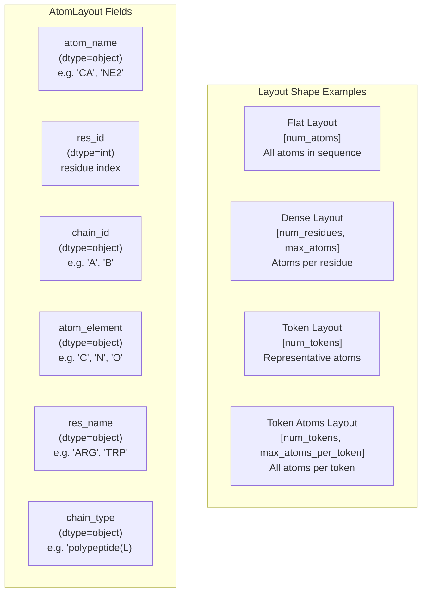
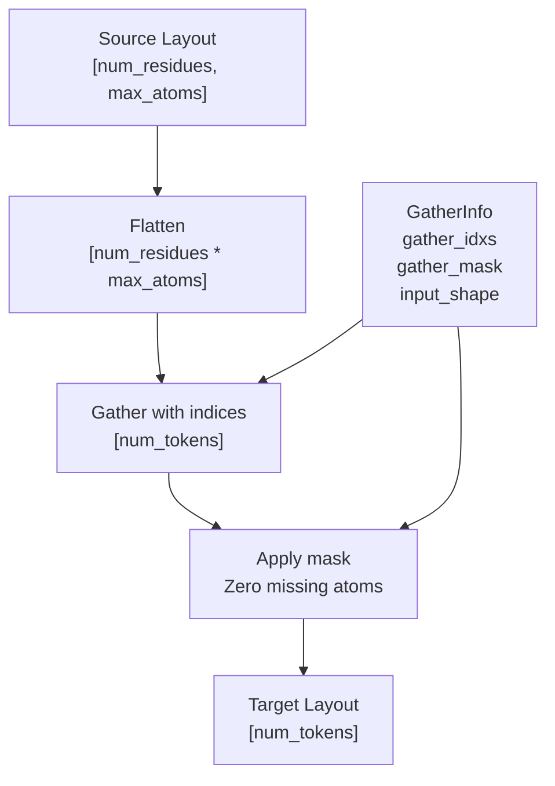
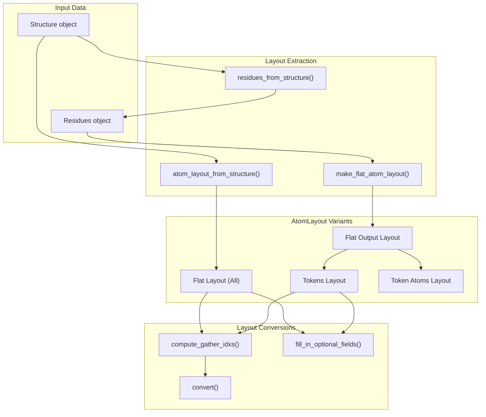
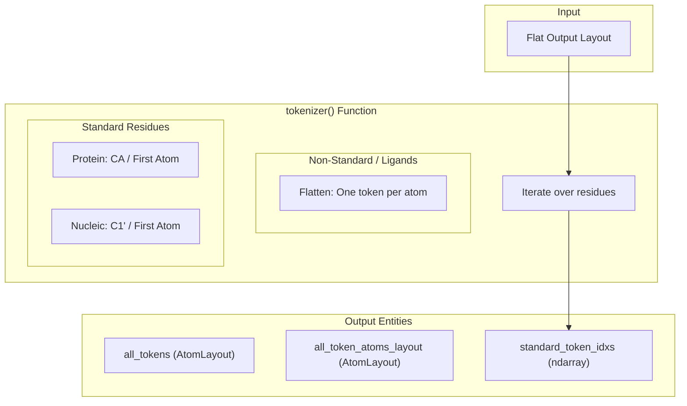
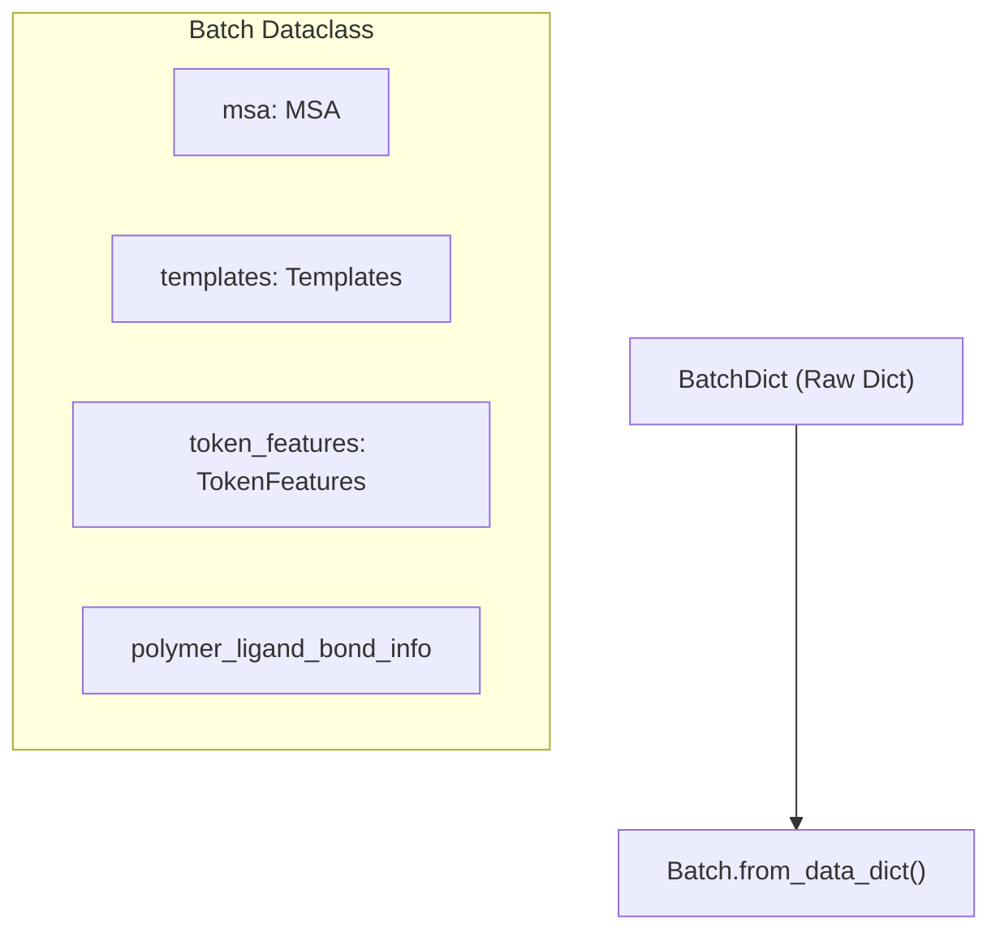

# Feature Tensors

> **Relevant source files**
> * [src/alphafold3/data/msa.py](https://github.com/google-deepmind/alphafold3/blob/97639fff/src/alphafold3/data/msa.py)
> * [src/alphafold3/model/atom_layout/atom_layout.py](https://github.com/google-deepmind/alphafold3/blob/97639fff/src/alphafold3/model/atom_layout/atom_layout.py)
> * [src/alphafold3/model/components/mapping.py](https://github.com/google-deepmind/alphafold3/blob/97639fff/src/alphafold3/model/components/mapping.py)
> * [src/alphafold3/model/confidence_types.py](https://github.com/google-deepmind/alphafold3/blob/97639fff/src/alphafold3/model/confidence_types.py)
> * [src/alphafold3/model/data3.py](https://github.com/google-deepmind/alphafold3/blob/97639fff/src/alphafold3/model/data3.py)
> * [src/alphafold3/model/features.py](https://github.com/google-deepmind/alphafold3/blob/97639fff/src/alphafold3/model/features.py)
> * [src/alphafold3/model/model_config.py](https://github.com/google-deepmind/alphafold3/blob/97639fff/src/alphafold3/model/model_config.py)
> * [src/alphafold3/model/msa_pairing.py](https://github.com/google-deepmind/alphafold3/blob/97639fff/src/alphafold3/model/msa_pairing.py)
> * [src/alphafold3/model/network/evoformer.py](https://github.com/google-deepmind/alphafold3/blob/97639fff/src/alphafold3/model/network/evoformer.py)

This page documents the feature tensor system in AlphaFold 3, which transforms biological data (sequences, MSAs, templates, structures) into numerical tensors suitable for model inference. This includes the `AtomLayout` system for representing atomic structures in various coordinate systems, feature dataclasses that encapsulate different types of biological information, and the featurization pipeline that produces the final `BatchDict` fed to the neural network.

For information about the input data structures that feed into this system, see [Input Data Model](/google-deepmind/alphafold3/5.1-input-data-model). For the `Structure` representation used to manipulate molecular data, see [Structure Representation](/google-deepmind/alphafold3/5.2-structure-representation).

## Overview

The feature tensor system bridges the gap between biological data and neural network inputs through several key abstractions:

* **AtomLayout**: A flexible coordinate system for representing atoms in fixed-shape arrays (1D flat, 2D dense, etc.) [src/alphafold3/model/atom_layout/atom_layout.py L37-L67](https://github.com/google-deepmind/alphafold3/blob/97639fff/src/alphafold3/model/atom_layout/atom_layout.py#L37-L67)
* **Feature Dataclasses**: Strongly-typed containers for MSA, template, token, and bond features [src/alphafold3/model/features.py L401-L1326](https://github.com/google-deepmind/alphafold3/blob/97639fff/src/alphafold3/model/features.py#L401-L1326)
* **Tokenization**: Conversion from residue-based representation to token-based representation (one token per polymer residue, one token per ligand atom) [src/alphafold3/model/features.py L164-L196](https://github.com/google-deepmind/alphafold3/blob/97639fff/src/alphafold3/model/features.py#L164-L196)
* **Padding**: All features are padded to fixed shapes determined by `PaddingShapes` [src/alphafold3/model/features.py L51-L58](https://github.com/google-deepmind/alphafold3/blob/97639fff/src/alphafold3/model/features.py#L51-L58)
* **BatchDict**: The final dictionary of NumPy/JAX arrays passed to the model [src/alphafold3/model/features.py L43](https://github.com/google-deepmind/alphafold3/blob/97639fff/src/alphafold3/model/features.py#L43-L43)

Sources: [src/alphafold3/model/features.py L11-L100](https://github.com/google-deepmind/alphafold3/blob/97639fff/src/alphafold3/model/features.py#L11-L100)

 [src/alphafold3/model/atom_layout/atom_layout.py L11-L35](https://github.com/google-deepmind/alphafold3/blob/97639fff/src/alphafold3/model/atom_layout/atom_layout.py#L11-L35)

## AtomLayout System

The `AtomLayout` system provides a unified way to represent atoms in various coordinate systems while maintaining metadata about atomic identity.

### AtomLayout Class

`AtomLayout` is an immutable dataclass that represents atoms in a fixed shape (typically 1D or 2D). All fields are NumPy arrays with identical shapes [src/alphafold3/model/atom_layout/atom_layout.py L37-L90](https://github.com/google-deepmind/alphafold3/blob/97639fff/src/alphafold3/model/atom_layout/atom_layout.py#L37-L90)

**Key Properties:**

* **Essential fields**: `atom_name`, `res_id`, `chain_id` (always present) [src/alphafold3/model/atom_layout/atom_layout.py L69-L71](https://github.com/google-deepmind/alphafold3/blob/97639fff/src/alphafold3/model/atom_layout/atom_layout.py#L69-L71)
* **Optional fields**: `atom_element`, `res_name`, `chain_type` (can be None) [src/alphafold3/model/atom_layout/atom_layout.py L72-L74](https://github.com/google-deepmind/alphafold3/blob/97639fff/src/alphafold3/model/atom_layout/atom_layout.py#L72-L74)
* **Padding**: Empty strings ('') in `atom_name` indicate padding/missing atoms [src/alphafold3/model/atom_layout/atom_layout.py L49-L51](https://github.com/google-deepmind/alphafold3/blob/97639fff/src/alphafold3/model/atom_layout/atom_layout.py#L49-L51)
* **Indexing**: Supports NumPy-style indexing to extract sub-layouts [src/alphafold3/model/atom_layout/atom_layout.py L99-L111](https://github.com/google-deepmind/alphafold3/blob/97639fff/src/alphafold3/model/atom_layout/atom_layout.py#L99-L111)
* **Equality**: Compares only non-padding elements [src/alphafold3/model/atom_layout/atom_layout.py L113-L136](https://github.com/google-deepmind/alphafold3/blob/97639fff/src/alphafold3/model/atom_layout/atom_layout.py#L113-L136)

Sources: [src/alphafold3/model/atom_layout/atom_layout.py L36-L233](https://github.com/google-deepmind/alphafold3/blob/97639fff/src/alphafold3/model/atom_layout/atom_layout.py#L36-L233)

### GatherInfo Class

`GatherInfo` stores the indices and masks needed to convert arrays from one `AtomLayout` to another [src/alphafold3/model/atom_layout/atom_layout.py L305-L318](https://github.com/google-deepmind/alphafold3/blob/97639fff/src/alphafold3/model/atom_layout/atom_layout.py#L305-L318)

| Field | Type | Description |
| --- | --- | --- |
| `gather_idxs` | `ndarray[int]` | Indices into flattened source array |
| `gather_mask` | `ndarray[bool]` | Mask for valid elements in target |
| `input_shape` | `ndarray[int]` | Shape of source layout (unflattened) |

**Conversion Process:**

1. Source layout is flattened to 1D.
2. Gather indices select elements from flattened array via `convert()` [src/alphafold3/model/atom_layout/atom_layout.py L906-L974](https://github.com/google-deepmind/alphafold3/blob/97639fff/src/alphafold3/model/atom_layout/atom_layout.py#L906-L974)
3. Gather mask zeros out missing elements.
4. Result is reshaped to target layout shape.

**Usage Example:**

* Converting from flat atom layout to token layout using `compute_gather_idxs()` [src/alphafold3/model/atom_layout/atom_layout.py L866-L904](https://github.com/google-deepmind/alphafold3/blob/97639fff/src/alphafold3/model/atom_layout/atom_layout.py#L866-L904)
* Converting from token atoms layout to bond layout.

Sources: [src/alphafold3/model/atom_layout/atom_layout.py L305-L377](https://github.com/google-deepmind/alphafold3/blob/97639fff/src/alphafold3/model/atom_layout/atom_layout.py#L305-L377)

 [src/alphafold3/model/atom_layout/atom_layout.py L866-L974](https://github.com/google-deepmind/alphafold3/blob/97639fff/src/alphafold3/model/atom_layout/atom_layout.py#L866-L974)

### Residues Class

`Residues` represents a list of residues with metadata, used to construct flat atom layouts [src/alphafold3/model/atom_layout/atom_layout.py L235-L263](https://github.com/google-deepmind/alphafold3/blob/97639fff/src/alphafold3/model/atom_layout/atom_layout.py#L235-L263)

| Field | Type | Description |
| --- | --- | --- |
| `res_name` | `ndarray[str]` | Residue names (e.g., 'ARG', 'TRP') |
| `res_id` | `ndarray[int]` | Residue indices |
| `chain_id` | `ndarray[str]` | Chain identifiers |
| `chain_type` | `ndarray[str]` | Chain types (e.g., 'polypeptide(L)') |
| `is_start_terminus` | `ndarray[bool]` | N-terminus flags |
| `is_end_terminus` | `ndarray[bool]` | C-terminus flags |

The `Residues` class is used by `make_flat_atom_layout()` to generate complete atom lists from CCD or SMILES [src/alphafold3/model/atom_layout/atom_layout.py L737-L864](https://github.com/google-deepmind/alphafold3/blob/97639fff/src/alphafold3/model/atom_layout/atom_layout.py#L737-L864)

Sources: [src/alphafold3/model/atom_layout/atom_layout.py L235-L303](https://github.com/google-deepmind/alphafold3/blob/97639fff/src/alphafold3/model/atom_layout/atom_layout.py#L235-L303)

 [src/alphafold3/model/atom_layout/atom_layout.py L737-L864](https://github.com/google-deepmind/alphafold3/blob/97639fff/src/alphafold3/model/atom_layout/atom_layout.py#L737-L864)

### Layout Construction and Conversion

**Key Functions:**

* **`atom_layout_from_structure()`**: Extracts `AtomLayout` from `Structure` object [src/alphafold3/model/atom_layout/atom_layout.py L455-L502](https://github.com/google-deepmind/alphafold3/blob/97639fff/src/alphafold3/model/atom_layout/atom_layout.py#L455-L502)
* **`residues_from_structure()`**: Extracts `Residues` metadata from `Structure` [src/alphafold3/model/atom_layout/atom_layout.py L504-L634](https://github.com/google-deepmind/alphafold3/blob/97639fff/src/alphafold3/model/atom_layout/atom_layout.py#L504-L634)
* **`make_flat_atom_layout()`**: Builds complete atom list from `Residues` and CCD [src/alphafold3/model/atom_layout/atom_layout.py L737-L864](https://github.com/google-deepmind/alphafold3/blob/97639fff/src/alphafold3/model/atom_layout/atom_layout.py#L737-L864)
* **`compute_gather_idxs()`**: Computes `GatherInfo` to convert between layouts [src/alphafold3/model/atom_layout/atom_layout.py L866-L904](https://github.com/google-deepmind/alphafold3/blob/97639fff/src/alphafold3/model/atom_layout/atom_layout.py#L866-L904)
* **`convert()`**: Applies `GatherInfo` to convert arrays between layouts [src/alphafold3/model/atom_layout/atom_layout.py L906-L974](https://github.com/google-deepmind/alphafold3/blob/97639fff/src/alphafold3/model/atom_layout/atom_layout.py#L906-L974)
* **`make_structure()`**: Creates `Structure` object from flat layout and coordinates [src/alphafold3/model/atom_layout/atom_layout.py L379-L426](https://github.com/google-deepmind/alphafold3/blob/97639fff/src/alphafold3/model/atom_layout/atom_layout.py#L379-L426)

Sources: [src/alphafold3/model/atom_layout/atom_layout.py L379-L974](https://github.com/google-deepmind/alphafold3/blob/97639fff/src/alphafold3/model/atom_layout/atom_layout.py#L379-L974)

## Tokenization

Tokenization converts a flat atom layout into tokens suitable for the model [src/alphafold3/model/features.py L164-L196](https://github.com/google-deepmind/alphafold3/blob/97639fff/src/alphafold3/model/features.py#L164-L196)

**Token Atoms Layout Construction:**

* For **standard residues**: Atoms are ordered according to CCD entry [src/alphafold3/model/features.py L255-L267](https://github.com/google-deepmind/alphafold3/blob/97639fff/src/alphafold3/model/features.py#L255-L267)
* For **ligands**: Each atom becomes its own token (one atom per token) [src/alphafold3/model/features.py L321-L331](https://github.com/google-deepmind/alphafold3/blob/97639fff/src/alphafold3/model/features.py#L321-L331)

Sources: [src/alphafold3/model/features.py L164-L398](https://github.com/google-deepmind/alphafold3/blob/97639fff/src/alphafold3/model/features.py#L164-L398)

## Feature Dataclasses

All feature dataclasses follow a common pattern: registered with JAX tree utilities and providing methods to convert to/from dictionaries [src/alphafold3/model/feat_batch.py L19-L84](https://github.com/google-deepmind/alphafold3/blob/97639fff/src/alphafold3/model/feat_batch.py#L19-L84)

### MSA Dataclass

The `MSA` dataclass encapsulates multiple sequence alignment features [src/alphafold3/model/features.py L401-L413](https://github.com/google-deepmind/alphafold3/blob/97639fff/src/alphafold3/model/features.py#L401-L413)

| Field | Type | Description |
| --- | --- | --- |
| `rows` | `xnp_ndarray` | MSA sequences encoded as integers [msa_size, num_tokens] |
| `mask` | `xnp_ndarray` | Boolean mask for valid positions |
| `deletion_matrix` | `xnp_ndarray` | Number of deletions at each position |
| `profile` | `xnp_ndarray` | Frequency of residue types per position |
| `deletion_mean` | `xnp_ndarray` | Average deletions per position |

**Feature Computation Details:**

* **Profile Computation**: Residue type frequencies and deletion means are computed via `data3.get_profile_features()` [src/alphafold3/model/data3.py L26-L38](https://github.com/google-deepmind/alphafold3/blob/97639fff/src/alphafold3/model/data3.py#L26-L38)
* **MSA Pairing**: Paired and unpaired features are produced to align related sequences across chains [src/alphafold3/model/msa_pairing.py L11-L24](https://github.com/google-deepmind/alphafold3/blob/97639fff/src/alphafold3/model/msa_pairing.py#L11-L24)
* **Truncation**: MSA rows can be limited using `truncate_msa_batch()` [src/alphafold3/model/network/featurization.py L131-L133](https://github.com/google-deepmind/alphafold3/blob/97639fff/src/alphafold3/model/network/featurization.py#L131-L133)

Sources: [src/alphafold3/model/features.py L401-L701](https://github.com/google-deepmind/alphafold3/blob/97639fff/src/alphafold3/model/features.py#L401-L701)

 [src/alphafold3/model/data3.py L26-L38](https://github.com/google-deepmind/alphafold3/blob/97639fff/src/alphafold3/model/data3.py#L26-L38)

 [src/alphafold3/model/msa_pairing.py L11-L172](https://github.com/google-deepmind/alphafold3/blob/97639fff/src/alphafold3/model/msa_pairing.py#L11-L172)

### Templates Dataclass

The `Templates` dataclass stores structural template information [src/alphafold3/model/features.py L704-L713](https://github.com/google-deepmind/alphafold3/blob/97639fff/src/alphafold3/model/features.py#L704-L713)

| Field | Type | Description |
| --- | --- | --- |
| `aatype` | `xnp_ndarray` | Amino acid types [num_templates, num_tokens] |
| `atom_positions` | `xnp_ndarray` | Template coordinates [num_templates, num_tokens, 24, 3] |
| `atom_mask` | `xnp_ndarray` | Mask for valid template atoms |

**Template Processing:**

* **Layout Conversion**: `data3.fix_template_features()` converts from standard atom37 to the AlphaFold 3 dense atom layout [src/alphafold3/model/data3.py L41-L89](https://github.com/google-deepmind/alphafold3/blob/97639fff/src/alphafold3/model/data3.py#L41-L89)
* **Empty Templates**: `data3.empty_template_features()` creates masked-out arrays when no templates are found [src/alphafold3/model/data3.py L92-L112](https://github.com/google-deepmind/alphafold3/blob/97639fff/src/alphafold3/model/data3.py#L92-L112)

Sources: [src/alphafold3/model/features.py L704-L870](https://github.com/google-deepmind/alphafold3/blob/97639fff/src/alphafold3/model/features.py#L704-L870)

 [src/alphafold3/model/data3.py L41-L112](https://github.com/google-deepmind/alphafold3/blob/97639fff/src/alphafold3/model/data3.py#L41-L112)

### TokenFeatures Dataclass

`TokenFeatures` stores per-token metadata and type flags [src/alphafold3/model/features.py L891-L916](https://github.com/google-deepmind/alphafold3/blob/97639fff/src/alphafold3/model/features.py#L891-L916)

| Field | Type | Shape | Description |
| --- | --- | --- | --- |
| `residue_index` | `int32` | `[num_tokens]` | Residue ID from structure |
| `token_index` | `int32` | `[num_tokens]` | Sequential token index |
| `aatype` | `int32` | `[num_tokens]` | Amino acid/nucleotide type |
| `asym_id` | `int32` | `[num_tokens]` | Asymmetric chain ID |
| `entity_id` | `int32` | `[num_tokens]` | Entity ID (identical sequences) |
| `sym_id` | `int32` | `[num_tokens]` | Symmetry ID within entity |

Sources: [src/alphafold3/model/features.py L891-L1037](https://github.com/google-deepmind/alphafold3/blob/97639fff/src/alphafold3/model/features.py#L891-L1037)

## Featurization Pipeline

The complete featurization pipeline transforms biological data into the `Batch` dataclass consumed by the model [src/alphafold3/model/feat_batch.py L20-L34](https://github.com/google-deepmind/alphafold3/blob/97639fff/src/alphafold3/model/feat_batch.py#L20-L34)

### Batch Object Construction

The `Batch` class provides a unified interface for all feature tensors [src/alphafold3/model/feat_batch.py L20-L34](https://github.com/google-deepmind/alphafold3/blob/97639fff/src/alphafold3/model/feat_batch.py#L20-L34)

Sources: [src/alphafold3/model/feat_batch.py L39-L60](https://github.com/google-deepmind/alphafold3/blob/97639fff/src/alphafold3/model/feat_batch.py#L39-L60)

### Network Embedding

In the `Evoformer`, features are further processed into embeddings:

* **Relative Encoding**: `_relative_encoding()` computes position encodings based on `token_features` [src/alphafold3/model/network/evoformer.py L77-L91](https://github.com/google-deepmind/alphafold3/blob/97639fff/src/alphafold3/model/network/evoformer.py#L77-L91)
* **Bond Embedding**: `_embed_bonds()` incorporates chemical bond information into the pair activations [src/alphafold3/model/network/evoformer.py L120-L168](https://github.com/google-deepmind/alphafold3/blob/97639fff/src/alphafold3/model/network/evoformer.py#L120-L168)
* **Template Embedding**: `_embed_template_pair()` merges template structural information [src/alphafold3/model/network/evoformer.py L170-L197](https://github.com/google-deepmind/alphafold3/blob/97639fff/src/alphafold3/model/network/evoformer.py#L170-L197)

Sources: [src/alphafold3/model/network/evoformer.py L77-L197](https://github.com/google-deepmind/alphafold3/blob/97639fff/src/alphafold3/model/network/evoformer.py#L77-L197)

## Performance Optimization

For large-scale processing, AlphaFold 3 utilizes `sharded_map` and `sharded_apply` to process features in chunks, balancing memory usage and throughput [src/alphafold3/model/components/mapping.py L55-L124](https://github.com/google-deepmind/alphafold3/blob/97639fff/src/alphafold3/model/components/mapping.py#L55-L124)

Sources: [src/alphafold3/model/components/mapping.py L55-L209](https://github.com/google-deepmind/alphafold3/blob/97639fff/src/alphafold3/model/components/mapping.py#L55-L209)