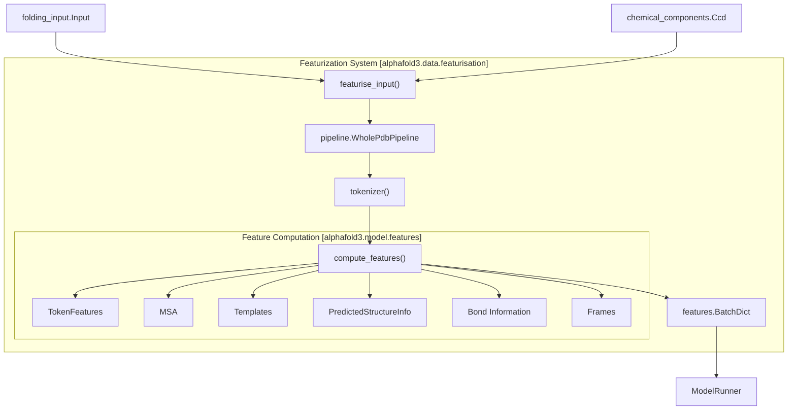

# Featurization

> **Relevant source files**
> * [src/alphafold3/data/featurisation.py](https://github.com/google-deepmind/alphafold3/blob/97639fff/src/alphafold3/data/featurisation.py)
> * [src/alphafold3/data/msa.py](https://github.com/google-deepmind/alphafold3/blob/97639fff/src/alphafold3/data/msa.py)
> * [src/alphafold3/model/atom_layout/atom_layout.py](https://github.com/google-deepmind/alphafold3/blob/97639fff/src/alphafold3/model/atom_layout/atom_layout.py)
> * [src/alphafold3/model/data3.py](https://github.com/google-deepmind/alphafold3/blob/97639fff/src/alphafold3/model/data3.py)
> * [src/alphafold3/model/features.py](https://github.com/google-deepmind/alphafold3/blob/97639fff/src/alphafold3/model/features.py)
> * [src/alphafold3/model/pipeline/pipeline.py](https://github.com/google-deepmind/alphafold3/blob/97639fff/src/alphafold3/model/pipeline/pipeline.py)
> * [src/alphafold3/model/pipeline/structure_cleaning.py](https://github.com/google-deepmind/alphafold3/blob/97639fff/src/alphafold3/model/pipeline/structure_cleaning.py)

## Purpose and Scope

This document describes the featurization system in AlphaFold 3, which is responsible for converting raw biological data (proteins, RNA, DNA, and ligands) into numerical representations suitable for the neural network model. Featurization sits between the data pipeline (which performs MSA generation and template searching) and the model inference components.

For details about the input data processing prior to featurization, see [Data Pipeline](/google-deepmind/alphafold3/4.2-data-pipeline). For information about model inference, see [Model Inference](/google-deepmind/alphafold3/4.4-model-inference).

## Overview

The featurization system transforms the structured biological data from the data pipeline into a comprehensive set of features encoded as NumPy arrays. These features capture various aspects of the input molecules, including sequence information, evolutionary information from MSAs, structural information from templates, and chemical properties of the molecules.

### Featurization Data Flow



Sources:

* [src/alphafold3/data/featurisation.py L38-L104](https://github.com/google-deepmind/alphafold3/blob/97639fff/src/alphafold3/data/featurisation.py#L38-L104)
* [src/alphafold3/model/pipeline/pipeline.py L153-L447](https://github.com/google-deepmind/alphafold3/blob/97639fff/src/alphafold3/model/pipeline/pipeline.py#L153-L447)
* [src/alphafold3/model/features.py L11-L43](https://github.com/google-deepmind/alphafold3/blob/97639fff/src/alphafold3/model/features.py#L11-L43)

## Featurization Process

The featurization process consists of several steps that transform the biological input data into a structured representation suitable for deep learning models:

### Featurization Sequence

```

```

Sources:

* [src/alphafold3/data/featurisation.py L38-L104](https://github.com/google-deepmind/alphafold3/blob/97639fff/src/alphafold3/data/featurisation.py#L38-L104)
* [src/alphafold3/model/pipeline/pipeline.py L153-L447](https://github.com/google-deepmind/alphafold3/blob/97639fff/src/alphafold3/model/pipeline/pipeline.py#L153-L447)

### 1. Input Validation

The process begins with `validate_fold_input`, ensuring that the input contains the necessary data, such as MSAs and templates for protein chains and MSAs for RNA chains.

Sources:

* [src/alphafold3/data/featurisation.py L24-L36](https://github.com/google-deepmind/alphafold3/blob/97639fff/src/alphafold3/data/featurisation.py#L24-L36)

### 2. Structure Cleaning

The input structure is cleaned via `structure_cleaning.clean_structure` to remove unwanted elements such as clashing chains, non-standard atoms, waters, and hydrogens. It also handles the filtering of leaving atoms based on covalent bonds via `_get_leaving_atom_mask`.

Sources:

* [src/alphafold3/model/pipeline/pipeline.py L172-L186](https://github.com/google-deepmind/alphafold3/blob/97639fff/src/alphafold3/model/pipeline/pipeline.py#L172-L186)
* [src/alphafold3/model/pipeline/structure_cleaning.py L23-L61](https://github.com/google-deepmind/alphafold3/blob/97639fff/src/alphafold3/model/pipeline/structure_cleaning.py#L23-L61)
* [src/alphafold3/model/pipeline/structure_cleaning.py L64-L160](https://github.com/google-deepmind/alphafold3/blob/97639fff/src/alphafold3/model/pipeline/structure_cleaning.py#L64-L160)

### 3. Tokenization

The `tokenizer` function maps a flat atom layout to tokens for the Evoformer neural network. It creates one token per polymer residue (protein or nucleic acid) and one token per ligand atom. Optionally, non-standard residues can be "flattened" (represented as one token per atom) if `flatten_non_standard_residues` is enabled.

```

```

Sources:

* [src/alphafold3/model/features.py L164-L214](https://github.com/google-deepmind/alphafold3/blob/97639fff/src/alphafold3/model/features.py#L164-L214)
* [src/alphafold3/model/pipeline/pipeline.py L231-L239](https://github.com/google-deepmind/alphafold3/blob/97639fff/src/alphafold3/model/pipeline/pipeline.py#L231-L239)

### 4. Feature Computation

After tokenization, the system computes various types of features:

* **TokenFeatures**: Basic information about each token, including residue index, atom type, chain identifiers, and molecule type flags.
* **MSA**: Evolutionary information. This involves `msa_pairing.create_paired_features` to align sequences across chains by species and `data3.get_profile_features` for MSA profiles.
* **Templates**: Structural information from template structures, converted to AlphaFold 3 format using `data3.fix_template_features`.
* **AtomCrossAtt**: Features for atom-level cross-attention in the model.
* **RefStructure**: Reference structure features, including atom coordinates.
* **PolymerLigandBondInfo** and **LigandLigandBondInfo**: Information about covalent bonds derived from the input structure.
* **PseudoBetaInfo**: Features for the backbone atoms for distance calculations.
* **Frames**: Local coordinate frames for structural predictions.

Sources:

* [src/alphafold3/model/pipeline/pipeline.py L289-L414](https://github.com/google-deepmind/alphafold3/blob/97639fff/src/alphafold3/model/pipeline/pipeline.py#L289-L414)
* [src/alphafold3/model/features.py L394-L1124](https://github.com/google-deepmind/alphafold3/blob/97639fff/src/alphafold3/model/features.py#L394-L1124)
* [src/alphafold3/model/data3.py L26-L38](https://github.com/google-deepmind/alphafold3/blob/97639fff/src/alphafold3/model/data3.py#L26-L38)
* [src/alphafold3/model/data3.py L41-L89](https://github.com/google-deepmind/alphafold3/blob/97639fff/src/alphafold3/model/data3.py#L41-L89)

### 5. Batch Assembly and Padding

All computed features are assembled into a `feat_batch.Batch` object. The pipeline uses `calculate_bucket_size` to determine the appropriate padding size based on the `buckets` configuration to minimize JAX re-compilation.

Sources:

* [src/alphafold3/model/pipeline/pipeline.py L34-L62](https://github.com/google-deepmind/alphafold3/blob/97639fff/src/alphafold3/model/pipeline/pipeline.py#L34-L62)
* [src/alphafold3/model/pipeline/pipeline.py L417-L447](https://github.com/google-deepmind/alphafold3/blob/97639fff/src/alphafold3/model/pipeline/pipeline.py#L417-L447)

## Key Data Structures

### PaddingShapes

Defines padding dimensions for different feature types to ensure consistent batch sizes during JAX compilation:

```python
@dataclasses.dataclass(frozen=True)class PaddingShapes:  num_tokens: int    # Number of tokens (residues/atoms)  msa_size: int      # Size of MSA features  num_chains: int    # Number of chains  num_templates: int # Number of templates  num_atoms: int     # Number of atoms
```

Sources:

* [src/alphafold3/model/features.py L51-L58](https://github.com/google-deepmind/alphafold3/blob/97639fff/src/alphafold3/model/features.py#L51-L58)

### Chains

Contains information about chain identifiers and symmetry, computed via `_compute_asym_entity_and_sym_id`:

```python
@dataclasses.dataclass(frozen=True)class Chains:  chain_id: np.ndarray  asym_id: np.ndarray  entity_id: np.ndarray  sym_id: np.ndarray
```

Sources:

* [src/alphafold3/model/features.py L104-L110](https://github.com/google-deepmind/alphafold3/blob/97639fff/src/alphafold3/model/features.py#L104-L110)
* [src/alphafold3/model/features.py L119-L161](https://github.com/google-deepmind/alphafold3/blob/97639fff/src/alphafold3/model/features.py#L119-L161)

### Feature Classes

The following dataclasses represent different types of features:

| Feature Class | Purpose | Main Features |
| --- | --- | --- |
| `MSA` | Multiple sequence alignment | `msa`, `msa_mask`, `deletion_matrix`, `profile` |
| `Templates` | Template structures | `template_aatype`, `template_atom_mask`, `template_atom_positions` |
| `TokenFeatures` | Token information | `res_id`, `token_index`, `asym_id`, `is_protein`, `is_ligand` |
| `PredictedStructureInfo` | Structure info | `atom_mask`, `residue_center_index` |
| `PolymerLigandBondInfo` | Polymer-ligand bonds | `bond_indices`, `bond_type` |
| `LigandLigandBondInfo` | Ligand-ligand bonds | `bond_indices`, `bond_type` |
| `PseudoBetaInfo` | Backbone atoms | `pseudo_beta`, `pseudo_beta_mask` |
| `AtomCrossAtt` | Atom attention | `atom_to_token_queries`, `atom_to_token_keys` |
| `Frames` | Coordinate frames | `rigidgroups_gt_frames`, `rigidgroups_gt_exists` |

Sources:

* [src/alphafold3/model/features.py L394-L1124](https://github.com/google-deepmind/alphafold3/blob/97639fff/src/alphafold3/model/features.py#L394-L1124)

## Tokenization Details

The `tokenizer` function maps a flat atom layout to tokens for the Evoformer neural network:

```

```

For standard residues (protein and nucleic acids), one token represents the entire residue, with a representative atom (CA for proteins, C1' for nucleic acids) chosen as the token's position. For ligands and optionally for non-standard residues, each atom is represented by its own token.

Sources:

* [src/alphafold3/model/features.py L164-L391](https://github.com/google-deepmind/alphafold3/blob/97639fff/src/alphafold3/model/features.py#L164-L391)

## Feature Computation Details

### MSA Features

MSA features include:

* Aligned sequences from the MSA.
* Sequence masks and deletion matrices.
* Profile information via `msa_profile.compute_msa_profile` called within `data3.get_profile_features`.
* Deletion mean (average number of deletions at each position).

The system handles both paired and unpaired MSAs. The `Msa` container in `alphafold3.data.msa` provides methods like `from_multiple_msas` and `from_a3m` to handle raw search results before featurization.

Sources:

* [src/alphafold3/model/features.py L394-L689](https://github.com/google-deepmind/alphafold3/blob/97639fff/src/alphafold3/model/features.py#L394-L689)
* [src/alphafold3/model/data3.py L26-L38](https://github.com/google-deepmind/alphafold3/blob/97639fff/src/alphafold3/model/data3.py#L26-L38)
* [src/alphafold3/data/msa.py L52-L153](https://github.com/google-deepmind/alphafold3/blob/97639fff/src/alphafold3/data/msa.py#L52-L153)

### Template Features

Template features include residue types, 3D positions, and masks. The `data3.fix_template_features` function maps `atom37` representations to the AlphaFold 3 dense atom format. If no templates are found, `data3.empty_template_features` generates masked-out features to maintain tensor shape consistency.

Sources:

* [src/alphafold3/model/features.py L691-L850](https://github.com/google-deepmind/alphafold3/blob/97639fff/src/alphafold3/model/features.py#L691-L850)
* [src/alphafold3/model/data3.py L41-L89](https://github.com/google-deepmind/alphafold3/blob/97639fff/src/alphafold3/model/data3.py#L41-L89)
* [src/alphafold3/model/data3.py L92-L112](https://github.com/google-deepmind/alphafold3/blob/97639fff/src/alphafold3/model/data3.py#L92-L112)

### Token Features

Token features encode the identity and hierarchy of each token:

* `res_id` and `token_index`.
* Chain identifiers (`asym_id`, `entity_id`, `sym_id`).
* Molecule type flags (`is_protein`, `is_rna`, `is_dna`, `is_ligand`).

Sources:

* [src/alphafold3/model/features.py L871-L1010](https://github.com/google-deepmind/alphafold3/blob/97639fff/src/alphafold3/model/features.py#L871-L1010)

## Configuration Options

The `WholePdbPipeline.Config` class provides numerous configuration options for the featurization process:

```python
class Config(base_config.BaseConfig):  max_atoms_per_token: int = 24                 # Atoms per token slot  pad_num_chains: int = 1000                    # Padding size for chains  buckets: list[int] | None = None              # Size buckets for compilation  msa_crop_size: int = 16384                    # Maximum MSA size  max_templates: int = 4                        # Maximum number of templates  flatten_non_standard_residues: bool = True    # Expand non-standard residues to atoms  deterministic_frames: bool = True             # Use fixed-seed reference frames  resolve_msa_overlaps: bool = True             # Deduplicate MSA sequences
```

Sources:

* [src/alphafold3/model/pipeline/pipeline.py L80-L144](https://github.com/google-deepmind/alphafold3/blob/97639fff/src/alphafold3/model/pipeline/pipeline.py#L80-L144)

## AtomLayout System

The `AtomLayout` system provides a consistent representation of atom arrangements:

```

```

The `AtomLayout` contains:

* `atom_name`: Atom names (e.g., 'CA', 'NE2').
* `res_id`: Residue indices.
* `chain_id`: Chain identifiers.
* `atom_element`: Element types.
* `res_name`: Residue names.
* `chain_type`: Chain types.

Sources:

* [src/alphafold3/model/atom_layout/atom_layout.py L37-L111](https://github.com/google-deepmind/alphafold3/blob/97639fff/src/alphafold3/model/atom_layout/atom_layout.py#L37-L111)
* [src/alphafold3/model/atom_layout/atom_layout.py L138-L182](https://github.com/google-deepmind/alphafold3/blob/97639fff/src/alphafold3/model/atom_layout/atom_layout.py#L138-L182)

## Conclusion

The featurization system is a critical component of AlphaFold 3 that transforms biological data into a structured representation suitable for neural network processing. It handles various types of biomolecules, accounts for their chemical properties, and incorporates evolutionary and structural information to create a comprehensive feature set that enables accurate structure prediction.