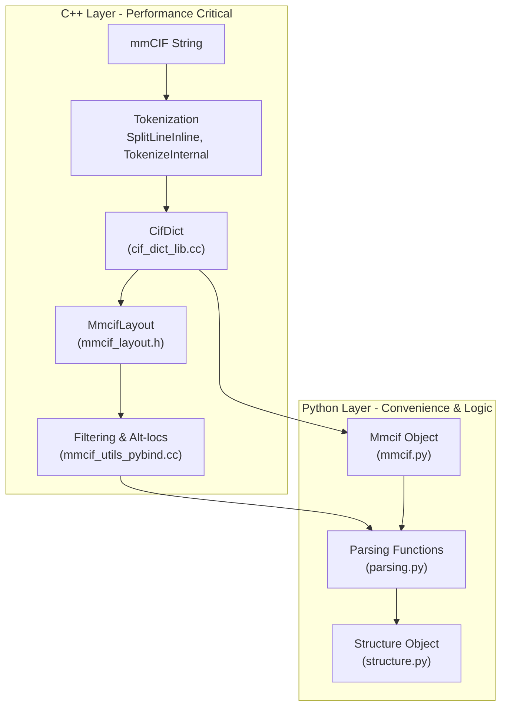
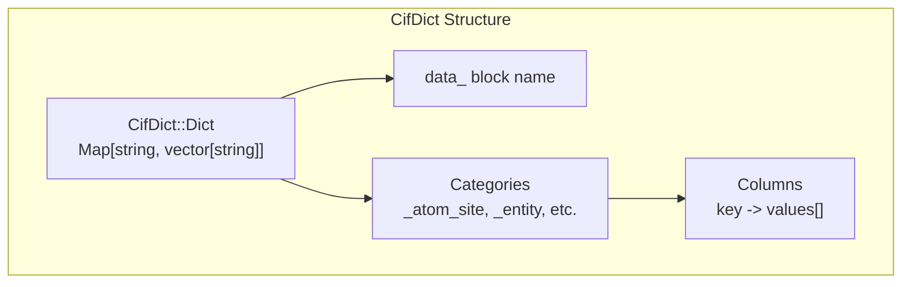
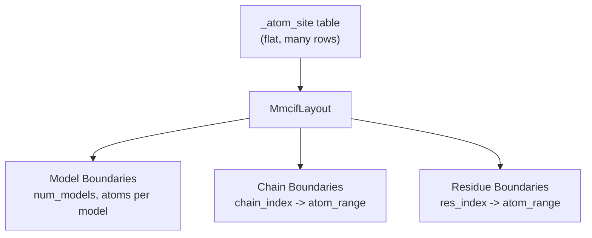
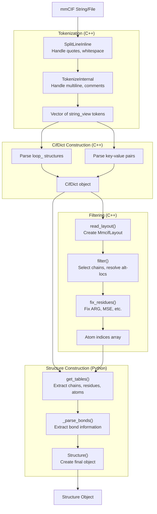

# File Format Reference

> **Relevant source files**
> * [src/alphafold3/parsers/cpp/cif_dict_lib.cc](https://github.com/google-deepmind/alphafold3/blob/97639fff/src/alphafold3/parsers/cpp/cif_dict_lib.cc)
> * [src/alphafold3/structure/cpp/mmcif_utils.pyi](https://github.com/google-deepmind/alphafold3/blob/97639fff/src/alphafold3/structure/cpp/mmcif_utils.pyi)
> * [src/alphafold3/structure/cpp/mmcif_utils_pybind.cc](https://github.com/google-deepmind/alphafold3/blob/97639fff/src/alphafold3/structure/cpp/mmcif_utils_pybind.cc)
> * [src/alphafold3/structure/parsing.py](https://github.com/google-deepmind/alphafold3/blob/97639fff/src/alphafold3/structure/parsing.py)

This page provides a technical reference for the file formats used by AlphaFold 3, with a focus on the mmCIF (macromolecular Crystallographic Information File) format used for representing molecular structures. For information about the JSON input format used to specify prediction jobs, see [Input Format](/google-deepmind/alphafold3/3.1-input-format). For information about the Structure data representation used internally, see [Structure Representation](/google-deepmind/alphafold3/5.2-structure-representation).

## Overview

AlphaFold 3 primarily works with two file formats:

| Format | Purpose | Direction | Key Classes |
| --- | --- | --- | --- |
| **mmCIF** | Structural data (coordinates, metadata) | Input/Output | `CifDict`, `Mmcif`, `Structure` |
| **JSON** | Prediction job specification | Input | `Input`, `ProteinChain`, etc. |

The mmCIF format is the primary structural representation used throughout the system. Input structures (e.g., templates from the PDB) are parsed from mmCIF, and predicted structures are written as mmCIF files. The system uses a layered parsing architecture with C++ for performance-critical operations and Python for high-level structure manipulation.

## Parsing Architecture

AlphaFold 3 uses a two-layer architecture for file format processing:

**Diagram: mmCIF Parsing Architecture**

The C++ layer handles:

* **Tokenization**: Breaking mmCIF text into tokens while handling quotes, multiline values, and comments [src/alphafold3/parsers/cpp/cif_dict_lib.cc L47-L154](https://github.com/google-deepmind/alphafold3/blob/97639fff/src/alphafold3/parsers/cpp/cif_dict_lib.cc#L47-L154)
* **CifDict Construction**: Building a dictionary-like data structure mapping keys to value lists [src/alphafold3/parsers/cpp/cif_dict_lib.cc L358-L478](https://github.com/google-deepmind/alphafold3/blob/97639fff/src/alphafold3/parsers/cpp/cif_dict_lib.cc#L358-L478)
* **Layout Analysis**: Computing efficient indexing structures for residues, chains, and atoms [src/alphafold3/structure/cpp/mmcif_utils_pybind.cc L346-L356](https://github.com/google-deepmind/alphafold3/blob/97639fff/src/alphafold3/structure/cpp/mmcif_utils_pybind.cc#L346-L356)
* **Filtering**: Selecting atoms based on entity types and resolving alternate locations (alt-locs) [src/alphafold3/structure/cpp/mmcif_utils_pybind.cc L148-L225](https://github.com/google-deepmind/alphafold3/blob/97639fff/src/alphafold3/structure/cpp/mmcif_utils_pybind.cc#L148-L225)

The Python layer handles:

* **High-level Parsing**: Converting CifDict data to `Structure` objects with chains, residues, and atoms [src/alphafold3/structure/parsing.py L307-L396](https://github.com/google-deepmind/alphafold3/blob/97639fff/src/alphafold3/structure/parsing.py#L307-L396)
* **Validation**: Checking consistency and applying structural fixes [src/alphafold3/structure/parsing.py L29-L37](https://github.com/google-deepmind/alphafold3/blob/97639fff/src/alphafold3/structure/parsing.py#L29-L37)
* **Construction**: Building structures from sequences, arrays, or mmCIF sources [src/alphafold3/structure/parsing.py L399-L453](https://github.com/google-deepmind/alphafold3/blob/97639fff/src/alphafold3/structure/parsing.py#L399-L453)

**Sources:** [src/alphafold3/parsers/cpp/cif_dict_lib.cc L40-L478](https://github.com/google-deepmind/alphafold3/blob/97639fff/src/alphafold3/parsers/cpp/cif_dict_lib.cc#L40-L478)

 [src/alphafold3/structure/cpp/mmcif_utils_pybind.cc L1-L225](https://github.com/google-deepmind/alphafold3/blob/97639fff/src/alphafold3/structure/cpp/mmcif_utils_pybind.cc#L1-L225)

 [src/alphafold3/structure/parsing.py L11-L396](https://github.com/google-deepmind/alphafold3/blob/97639fff/src/alphafold3/structure/parsing.py#L11-L396)

## Core Data Structures

### CifDict

The `CifDict` class is the foundational data structure for mmCIF parsing, implemented in C++ for performance.

**Diagram: CifDict Internal Structure**

Key characteristics:

* **Dictionary-based**: Maps mmCIF keys (e.g., `_atom_site.label_atom_id`) to vectors of string values [src/alphafold3/parsers/cpp/cif_dict_lib.cc L415-L420](https://github.com/google-deepmind/alphafold3/blob/97639fff/src/alphafold3/parsers/cpp/cif_dict_lib.cc#L415-L420)
* **Preserves Structure**: Maintains loop structures and data block organization [src/alphafold3/parsers/cpp/cif_dict_lib.cc L358-L410](https://github.com/google-deepmind/alphafold3/blob/97639fff/src/alphafold3/parsers/cpp/cif_dict_lib.cc#L358-L410)
* **Serialization**: Can convert back to mmCIF format with proper formatting via `ToString()` [src/alphafold3/parsers/cpp/cif_dict_lib.cc L480-L612](https://github.com/google-deepmind/alphafold3/blob/97639fff/src/alphafold3/parsers/cpp/cif_dict_lib.cc#L480-L612)

**Key Methods:**

| Method | Purpose | Signature |
| --- | --- | --- |
| `FromString` | Parse mmCIF string into CifDict | `static CifDict FromString(string_view)` [src/alphafold3/parsers/cpp/cif_dict_lib.cc L473](https://github.com/google-deepmind/alphafold3/blob/97639fff/src/alphafold3/parsers/cpp/cif_dict_lib.cc#L473-L473) |
| `ToString` | Serialize CifDict back to mmCIF | `string ToString()` [src/alphafold3/parsers/cpp/cif_dict_lib.cc L480](https://github.com/google-deepmind/alphafold3/blob/97639fff/src/alphafold3/parsers/cpp/cif_dict_lib.cc#L480-L480) |
| `ExtractLoopAsList` | Extract loop data as list of dictionaries | `vector<map<string_view, string_view>> ExtractLoopAsList(prefix)` [src/alphafold3/parsers/cpp/cif_dict_lib.cc L614](https://github.com/google-deepmind/alphafold3/blob/97639fff/src/alphafold3/parsers/cpp/cif_dict_lib.cc#L614-L614) |

**Sources:** [src/alphafold3/parsers/cpp/cif_dict_lib.cc L415-L614](https://github.com/google-deepmind/alphafold3/blob/97639fff/src/alphafold3/parsers/cpp/cif_dict_lib.cc#L415-L614)

### MmcifLayout

The `MmcifLayout` class provides efficient indexing structures for accessing mmCIF atom site data.

**Diagram: MmcifLayout Indexing Structure**

The layout pre-computes boundaries and indices to enable:

* **Fast Filtering**: Select atoms by chain, residue, or model without scanning [src/alphafold3/structure/cpp/mmcif_utils_pybind.cc L189-L225](https://github.com/google-deepmind/alphafold3/blob/97639fff/src/alphafold3/structure/cpp/mmcif_utils_pybind.cc#L189-L225)
* **Residue Iteration**: Iterate over residues and their atoms efficiently [src/alphafold3/structure/cpp/mmcif_utils.pyi L29-L37](https://github.com/google-deepmind/alphafold3/blob/97639fff/src/alphafold3/structure/cpp/mmcif_utils.pyi#L29-L37)
* **Alt-loc Resolution**: Handle alternate conformations during filtering [src/alphafold3/structure/cpp/mmcif_utils_pybind.cc L390-L394](https://github.com/google-deepmind/alphafold3/blob/97639fff/src/alphafold3/structure/cpp/mmcif_utils_pybind.cc#L390-L394)

**Sources:** [src/alphafold3/structure/cpp/mmcif_utils_pybind.cc L148-L225](https://github.com/google-deepmind/alphafold3/blob/97639fff/src/alphafold3/structure/cpp/mmcif_utils_pybind.cc#L148-L225)

 [src/alphafold3/structure/cpp/mmcif_utils.pyi L29-L37](https://github.com/google-deepmind/alphafold3/blob/97639fff/src/alphafold3/structure/cpp/mmcif_utils.pyi#L29-L37)

## mmCIF Data Flow

The following diagram illustrates the complete data flow from raw mmCIF text to `Structure` objects:

**Diagram: mmCIF to Structure Data Flow**

**Key Stages:**

1. **Tokenization** ([src/alphafold3/parsers/cpp/cif_dict_lib.cc L111-L154](https://github.com/google-deepmind/alphafold3/blob/97639fff/src/alphafold3/parsers/cpp/cif_dict_lib.cc#L111-L154) ): Splits mmCIF text into tokens while preserving structure.
2. **CifDict Construction** ([src/alphafold3/parsers/cpp/cif_dict_lib.cc L358-L478](https://github.com/google-deepmind/alphafold3/blob/97639fff/src/alphafold3/parsers/cpp/cif_dict_lib.cc#L358-L478) ): Parses tokens into a dictionary structure.
3. **Filtering** ([src/alphafold3/structure/cpp/mmcif_utils_pybind.cc L148-L225](https://github.com/google-deepmind/alphafold3/blob/97639fff/src/alphafold3/structure/cpp/mmcif_utils_pybind.cc#L148-L225) ): Selects atoms based on entity types and resolves alternate locations.
4. **Structure Construction** ([src/alphafold3/structure/parsing.py L307-L396](https://github.com/google-deepmind/alphafold3/blob/97639fff/src/alphafold3/structure/parsing.py#L307-L396) ): Converts filtered data into `Structure` objects.

**Sources:** [src/alphafold3/parsers/cpp/cif_dict_lib.cc L111-L478](https://github.com/google-deepmind/alphafold3/blob/97639fff/src/alphafold3/parsers/cpp/cif_dict_lib.cc#L111-L478)

 [src/alphafold3/structure/cpp/mmcif_utils_pybind.cc L148-L225](https://github.com/google-deepmind/alphafold3/blob/97639fff/src/alphafold3/structure/cpp/mmcif_utils_pybind.cc#L148-L225)

 [src/alphafold3/structure/parsing.py L307-L396](https://github.com/google-deepmind/alphafold3/blob/97639fff/src/alphafold3/structure/parsing.py#L307-L396)

## Key Parsing Operations

### Entity and Chain Selection

The mmCIF filter operation selects atoms based on entity types defined in `_entity` [src/alphafold3/structure/cpp/mmcif_utils_pybind.cc L116-L127](https://github.com/google-deepmind/alphafold3/blob/97639fff/src/alphafold3/structure/cpp/mmcif_utils_pybind.cc#L116-L127)

 and `_entity_poly` [src/alphafold3/structure/cpp/mmcif_utils_pybind.cc L131-L144](https://github.com/google-deepmind/alphafold3/blob/97639fff/src/alphafold3/structure/cpp/mmcif_utils_pybind.cc#L131-L144)

Entity types handled:

* **Polymer**: `polypeptide(L)`, `polydeoxyribonucleotide`, `polyribonucleotide` [src/alphafold3/structure/cpp/mmcif_utils_pybind.cc L155-L165](https://github.com/google-deepmind/alphafold3/blob/97639fff/src/alphafold3/structure/cpp/mmcif_utils_pybind.cc#L155-L165)
* **Non-polymer**: Ligands and small molecules [src/alphafold3/structure/cpp/mmcif_utils_pybind.cc L169-L175](https://github.com/google-deepmind/alphafold3/blob/97639fff/src/alphafold3/structure/cpp/mmcif_utils_pybind.cc#L169-L175)
* **Water**: HOH molecules [src/alphafold3/structure/cpp/mmcif_utils_pybind.cc L176-L181](https://github.com/google-deepmind/alphafold3/blob/97639fff/src/alphafold3/structure/cpp/mmcif_utils_pybind.cc#L176-L181)

**Sources:** [src/alphafold3/structure/cpp/mmcif_utils_pybind.cc L148-L225](https://github.com/google-deepmind/alphafold3/blob/97639fff/src/alphafold3/structure/cpp/mmcif_utils_pybind.cc#L148-L225)

### Alternate Location Resolution

Alternate locations (alt-locs) represent alternative conformations of atoms. The system resolves these during filtering by selecting the highest-occupancy alternate location for each atom within a residue [src/alphafold3/structure/cpp/mmcif_utils_pybind.cc L390-L394](https://github.com/google-deepmind/alphafold3/blob/97639fff/src/alphafold3/structure/cpp/mmcif_utils_pybind.cc#L390-L394)

### Structure Construction Methods

The `parsing.py` module provides multiple ways to construct `Structure` objects:

| Function | Input | Use Case |
| --- | --- | --- |
| `from_mmcif` | mmCIF string | Parse structures from files or PDB [src/alphafold3/structure/parsing.py L399-L418](https://github.com/google-deepmind/alphafold3/blob/97639fff/src/alphafold3/structure/parsing.py#L399-L418) |
| `from_parsed_mmcif` | `Mmcif` object | Reuse parsed mmCIF with different options [src/alphafold3/structure/parsing.py L307-L396](https://github.com/google-deepmind/alphafold3/blob/97639fff/src/alphafold3/structure/parsing.py#L307-L396) |

**Sources:** [src/alphafold3/structure/parsing.py L307-L453](https://github.com/google-deepmind/alphafold3/blob/97639fff/src/alphafold3/structure/parsing.py#L307-L453)

## Tokenization Rules

mmCIF tokenization handles several special cases:

### Quoted Strings

Quotes are only recognized at token boundaries [src/alphafold3/parsers/cpp/cif_dict_lib.cc L69-L75](https://github.com/google-deepmind/alphafold3/blob/97639fff/src/alphafold3/parsers/cpp/cif_dict_lib.cc#L69-L75)

 Example: `A'B` is a single token, not a quoted string.

### Multiline Values

Multiline tokens start and end with `;` at the beginning of a line [src/alphafold3/parsers/cpp/cif_dict_lib.cc L125-L142](https://github.com/google-deepmind/alphafold3/blob/97639fff/src/alphafold3/parsers/cpp/cif_dict_lib.cc#L125-L142)

 Leading whitespace is preserved.

### Comments

Comments start with `#` and continue to the end of the line [src/alphafold3/parsers/cpp/cif_dict_lib.cc L63-L65](https://github.com/google-deepmind/alphafold3/blob/97639fff/src/alphafold3/parsers/cpp/cif_dict_lib.cc#L63-L65)

**Sources:** [src/alphafold3/parsers/cpp/cif_dict_lib.cc L43-L154](https://github.com/google-deepmind/alphafold3/blob/97639fff/src/alphafold3/parsers/cpp/cif_dict_lib.cc#L43-L154)

## Loop Structures

mmCIF loops represent tabular data. The `CifDict` parser recognizes and preserves loop structures starting with `loop_` [src/alphafold3/parsers/cpp/cif_dict_lib.cc L364-L370](https://github.com/google-deepmind/alphafold3/blob/97639fff/src/alphafold3/parsers/cpp/cif_dict_lib.cc#L364-L370)

**Extraction Methods:**

* `ExtractLoopAsList`: Returns a vector of maps representing rows [src/alphafold3/parsers/cpp/cif_dict_lib.cc L614-L650](https://github.com/google-deepmind/alphafold3/blob/97639fff/src/alphafold3/parsers/cpp/cif_dict_lib.cc#L614-L650)
* `ExtractLoopAsDict`: Returns a nested map indexed by a specific column [src/alphafold3/parsers/cpp/cif_dict_lib.cc L652-L680](https://github.com/google-deepmind/alphafold3/blob/97639fff/src/alphafold3/parsers/cpp/cif_dict_lib.cc#L652-L680)

**Sources:** [src/alphafold3/parsers/cpp/cif_dict_lib.cc L614-L680](https://github.com/google-deepmind/alphafold3/blob/97639fff/src/alphafold3/parsers/cpp/cif_dict_lib.cc#L614-L680)

## Serialization

The `CifDict::ToString()` method serializes the dictionary back to mmCIF format [src/alphafold3/parsers/cpp/cif_dict_lib.cc L480-L612](https://github.com/google-deepmind/alphafold3/blob/97639fff/src/alphafold3/parsers/cpp/cif_dict_lib.cc#L480-L612)

**Quote Selection Logic:**

* `IsTrivialToken`: Checks for [A-Za-z0-9.?-] [src/alphafold3/parsers/cpp/cif_dict_lib.cc L158-L166](https://github.com/google-deepmind/alphafold3/blob/97639fff/src/alphafold3/parsers/cpp/cif_dict_lib.cc#L158-L166)
* `IsMultiLineToken`: Checks for newlines or conflicting quote types [src/alphafold3/parsers/cpp/cif_dict_lib.cc L170-L183](https://github.com/google-deepmind/alphafold3/blob/97639fff/src/alphafold3/parsers/cpp/cif_dict_lib.cc#L170-L183)
* `GetEscapeQuote`: Determines the correct quote character for non-trivial tokens [src/alphafold3/parsers/cpp/cif_dict_lib.cc L185-L229](https://github.com/google-deepmind/alphafold3/blob/97639fff/src/alphafold3/parsers/cpp/cif_dict_lib.cc#L185-L229)

**Sources:** [src/alphafold3/parsers/cpp/cif_dict_lib.cc L158-L229](https://github.com/google-deepmind/alphafold3/blob/97639fff/src/alphafold3/parsers/cpp/cif_dict_lib.cc#L158-L229)

 [src/alphafold3/parsers/cpp/cif_dict_lib.cc L480-L612](https://github.com/google-deepmind/alphafold3/blob/97639fff/src/alphafold3/parsers/cpp/cif_dict_lib.cc#L480-L612)

## Related Topics

For detailed information about specific aspects of file format handling:

* **mmCIF Format Details**: See [mmCIF Format](/google-deepmind/alphafold3/10.1-mmcif-format) for comprehensive documentation of the CifDict API, tokenization rules, and serialization.
* **Structure Parsing**: See [Structure Parsing](/google-deepmind/alphafold3/10.2-structure-parsing) for details on mmCIF to Structure conversion and the `mmcif_utils` C++ module.
* **Structure Representation**: See [Structure Representation](/google-deepmind/alphafold3/5.2-structure-representation) for information about the `Structure` class and its table-based architecture.
* **Input Format**: See [Input Format](/google-deepmind/alphafold3/3.1-input-format) for JSON input format specification.