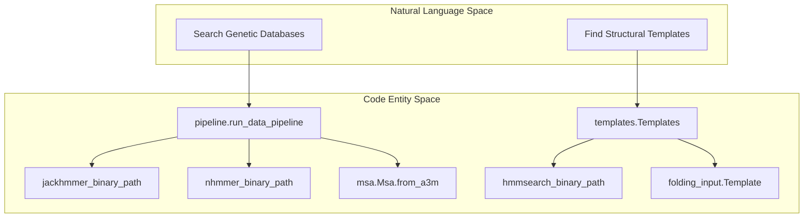
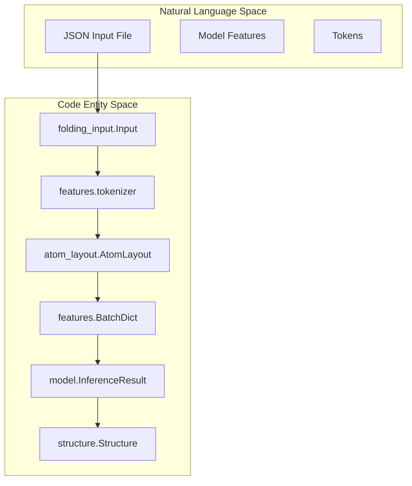

# Glossary

> **Relevant source files**
> * [docs/known_issues.md](https://github.com/google-deepmind/alphafold3/blob/97639fff/docs/known_issues.md?plain=1)
> * [docs/performance.md](https://github.com/google-deepmind/alphafold3/blob/97639fff/docs/performance.md?plain=1)
> * [run_alphafold.py](https://github.com/google-deepmind/alphafold3/blob/97639fff/run_alphafold.py)
> * [src/alphafold3/common/folding_input.py](https://github.com/google-deepmind/alphafold3/blob/97639fff/src/alphafold3/common/folding_input.py)
> * [src/alphafold3/data/msa.py](https://github.com/google-deepmind/alphafold3/blob/97639fff/src/alphafold3/data/msa.py)
> * [src/alphafold3/model/data3.py](https://github.com/google-deepmind/alphafold3/blob/97639fff/src/alphafold3/model/data3.py)
> * [src/alphafold3/model/features.py](https://github.com/google-deepmind/alphafold3/blob/97639fff/src/alphafold3/model/features.py)
> * [src/alphafold3/test_data/alphafold_run_outputs/run_alphafold_test_output_bucket_1024.pkl](https://github.com/google-deepmind/alphafold3/blob/97639fff/src/alphafold3/test_data/alphafold_run_outputs/run_alphafold_test_output_bucket_1024.pkl)
> * [src/alphafold3/test_data/alphafold_run_outputs/run_alphafold_test_output_bucket_default.pkl](https://github.com/google-deepmind/alphafold3/blob/97639fff/src/alphafold3/test_data/alphafold_run_outputs/run_alphafold_test_output_bucket_default.pkl)

This page provides definitions for codebase-specific terms, biological domain concepts, and computational jargon used throughout AlphaFold 3. It serves as a technical reference for onboarding engineers to navigate the system's architecture and data flow.

## Biological and Domain Concepts

### CCD (Chemical Component Dictionary)

A reference library of all standard and non-standard residues, ligands, and ions found in the PDB. AlphaFold 3 uses this dictionary for featurization, looking up SMILES strings, and generating atom layouts.

* **Implementation**: `Ccd` class in [src/alphafold3/constants/chemical_components.py L179-L199](https://github.com/google-deepmind/alphafold3/blob/97639fff/src/alphafold3/constants/chemical_components.py#L179-L199)
* **Usage**: Used during tokenization to retrieve the layout of standard residues [src/alphafold3/model/features.py L177-L183](https://github.com/google-deepmind/alphafold3/blob/97639fff/src/alphafold3/model/features.py#L177-L183)

### MSA (Multiple Sequence Alignment)

A collection of sequences evolutionary related to a query sequence. AlphaFold 3 uses MSAs to extract co-evolutionary signals.

* **Paired MSA**: Sequences from the same organism across different chains, used to compute paired features [src/alphafold3/common/folding_input.py L155-L159](https://github.com/google-deepmind/alphafold3/blob/97639fff/src/alphafold3/common/folding_input.py#L155-L159)
* **Unpaired MSA**: Deduplicated sequences used for single-chain features [src/alphafold3/common/folding_input.py L160-L164](https://github.com/google-deepmind/alphafold3/blob/97639fff/src/alphafold3/common/folding_input.py#L160-L164)
* **Container**: Managed by the `Msa` class, which handles deduplication and merging [src/alphafold3/data/msa.py L52-L111](https://github.com/google-deepmind/alphafold3/blob/97639fff/src/alphafold3/data/msa.py#L52-L111)

### Template

A known 3D structure of a protein that is homologous to the query sequence. Templates provide structural hints to the model during the initial stages of folding.

* **Implementation**: `Template` class in [src/alphafold3/common/folding_input.py L86-L121](https://github.com/google-deepmind/alphafold3/blob/97639fff/src/alphafold3/common/folding_input.py#L86-L121)
* **Features**: Converted into AlphaFold 3 format (e.g., `template_aatype`, `template_atom_positions`) for model consumption [src/alphafold3/model/data3.py L41-L89](https://github.com/google-deepmind/alphafold3/blob/97639fff/src/alphafold3/model/data3.py#L41-L89)

**Sources**: [src/alphafold3/common/folding_input.py L86-L164](https://github.com/google-deepmind/alphafold3/blob/97639fff/src/alphafold3/common/folding_input.py#L86-L164)

 [src/alphafold3/data/msa.py L52-L111](https://github.com/google-deepmind/alphafold3/blob/97639fff/src/alphafold3/data/msa.py#L52-L111)

 [src/alphafold3/model/data3.py L41-L89](https://github.com/google-deepmind/alphafold3/blob/97639fff/src/alphafold3/model/data3.py#L41-L89)

 [src/alphafold3/constants/chemical_components.py L179-L199](https://github.com/google-deepmind/alphafold3/blob/97639fff/src/alphafold3/constants/chemical_components.py#L179-L199)

---

## Computational and Model Terms

### AtomLayout

A structural representation that maps atoms to their metadata (chain ID, residue ID, element) and positions. It acts as the bridge between raw coordinates and tokenized features.

* **Implementation**: `AtomLayout` in [src/alphafold3/model/atom_layout/atom_layout.py](https://github.com/google-deepmind/alphafold3/blob/97639fff/src/alphafold3/model/atom_layout/atom_layout.py)
* **Tokenization**: The `tokenizer` function converts a flat `AtomLayout` into a token-based layout for the Evoformer [src/alphafold3/model/features.py L164-L220](https://github.com/google-deepmind/alphafold3/blob/97639fff/src/alphafold3/model/features.py#L164-L220)

### Token

The fundamental unit of processing in the AlphaFold 3 model. A token typically represents one polymer residue (amino acid or nucleotide) or one atom in a ligand.

* **Max Atoms per Token**: Defined by `max_atoms_per_token` (typically 47). This constant determines the padding size for atom-level features within a token [src/alphafold3/model/features.py L167-L183](https://github.com/google-deepmind/alphafold3/blob/97639fff/src/alphafold3/model/features.py#L167-L183)

### Z-Value

A normalization constant representing the database size (number of sequences for protein or megabases for RNA) used for E-value calculation in sharded genetic searches.

* **Configuration**: Defined via flags such as `small_bfd_z_value` or `ntrna_z_value` [run_alphafold.py L136-L215](https://github.com/google-deepmind/alphafold3/blob/97639fff/run_alphafold.py#L136-L215)
* **Significance**: Must be set correctly for sharded databases to ensure E-value calculations remain consistent with non-sharded runs [docs/performance.md L118-L124](https://github.com/google-deepmind/alphafold3/blob/97639fff/docs/performance.md?plain=1#L118-L124)

**Sources**: [src/alphafold3/model/features.py L164-L220](https://github.com/google-deepmind/alphafold3/blob/97639fff/src/alphafold3/model/features.py#L164-L220)

 [run_alphafold.py L136-L215](https://github.com/google-deepmind/alphafold3/blob/97639fff/run_alphafold.py#L136-L215)

 [docs/performance.md L118-L124](https://github.com/google-deepmind/alphafold3/blob/97639fff/docs/performance.md?plain=1#L118-L124)

---

## Software Engineering and Pipeline Terms

### Dialect

Refers to the specific JSON schema used for input. AlphaFold 3 supports two dialects: `alphafold3` (native) and `alphafoldserver` (compatibility mode).

* **Constants**: Defined in [src/alphafold3/common/folding_input.py L38-L43](https://github.com/google-deepmind/alphafold3/blob/97639fff/src/alphafold3/common/folding_input.py#L38-L43)
* **Versions**: Native dialect currently supports versions 1 through 4 [src/alphafold3/common/folding_input.py L39-L40](https://github.com/google-deepmind/alphafold3/blob/97639fff/src/alphafold3/common/folding_input.py#L39-L40)

### Sharding

The process of splitting large genetic databases into smaller pieces (shards) to allow parallel search across multiple CPU cores, significantly reducing data pipeline runtime.

* **Implementation**: Logic for handling sharded paths (e.g., `prefix@N`) is found in [src/alphafold3/data/tools/shards.py](https://github.com/google-deepmind/alphafold3/blob/97639fff/src/alphafold3/data/tools/shards.py)
* **Performance**: Sharding can provide a 10–30× speedup for genetic searches [docs/known_issues.md L57-L58](https://github.com/google-deepmind/alphafold3/blob/97639fff/docs/known_issues.md?plain=1#L57-L58)

### PaddingShapes

A dataclass used to define the target dimensions for padding feature tensors before batching.

* **Fields**: Includes `num_tokens`, `msa_size`, `num_chains`, `num_templates`, and `num_atoms` [src/alphafold3/model/features.py L51-L57](https://github.com/google-deepmind/alphafold3/blob/97639fff/src/alphafold3/model/features.py#L51-L57)

**Sources**: [src/alphafold3/common/folding_input.py L38-L43](https://github.com/google-deepmind/alphafold3/blob/97639fff/src/alphafold3/common/folding_input.py#L38-L43)

 [docs/known_issues.md L57-L58](https://github.com/google-deepmind/alphafold3/blob/97639fff/docs/known_issues.md?plain=1#L57-L58)

 [src/alphafold3/model/features.py L51-L57](https://github.com/google-deepmind/alphafold3/blob/97639fff/src/alphafold3/model/features.py#L51-L57)

---

## System Architecture Diagrams

### From Natural Language to Code Entities: Data Pipeline

This diagram maps high-level data acquisition concepts to the specific classes and binaries used in the AlphaFold 3 pipeline.

**Data Search Flow**

**Sources**: [run_alphafold.py L97-L121](https://github.com/google-deepmind/alphafold3/blob/97639fff/run_alphafold.py#L97-L121)

 [src/alphafold3/data/pipeline.py L30-L151](https://github.com/google-deepmind/alphafold3/blob/97639fff/src/alphafold3/data/pipeline.py#L30-L151)

 [src/alphafold3/data/msa.py L199-L210](https://github.com/google-deepmind/alphafold3/blob/97639fff/src/alphafold3/data/msa.py#L199-L210)

### From Natural Language to Code Entities: Featurization

This diagram maps the conceptual "Data Prep" phase to the internal JAX/Numpy feature processing logic.

**Featurization Mapping**

**Sources**: [src/alphafold3/common/folding_input.py L123-L203](https://github.com/google-deepmind/alphafold3/blob/97639fff/src/alphafold3/common/folding_input.py#L123-L203)

 [src/alphafold3/model/features.py L164-L196](https://github.com/google-deepmind/alphafold3/blob/97639fff/src/alphafold3/model/features.py#L164-L196)

 [run_alphafold.py L43-L48](https://github.com/google-deepmind/alphafold3/blob/97639fff/run_alphafold.py#L43-L48)

---

## Summary Table of Key Classes

| Term | Class / File | Description |
| --- | --- | --- |
| **Input Model** | `folding_input.Input` | Root dataclass for a prediction job [src/alphafold3/common/folding_input.py L204-L205](https://github.com/google-deepmind/alphafold3/blob/97639fff/src/alphafold3/common/folding_input.py#L204-L205) |
| **Protein Chain** | `folding_input.ProteinChain` | Metadata and sequence for a protein, including MSAs [src/alphafold3/common/folding_input.py L123-L146](https://github.com/google-deepmind/alphafold3/blob/97639fff/src/alphafold3/common/folding_input.py#L123-L146) |
| **Ligand** | `folding_input.Ligand` | Represents small molecules (SMILES/CCD) [src/alphafold3/common/folding_input.py L178-L184](https://github.com/google-deepmind/alphafold3/blob/97639fff/src/alphafold3/common/folding_input.py#L178-L184) |
| **Structure** | `structure.Structure` | Internal 3D representation [src/alphafold3/test_data/alphafold_run_outputs/run_alphafold_test_output_bucket_default.pkl L1](https://github.com/google-deepmind/alphafold3/blob/97639fff/src/alphafold3/test_data/alphafold_run_outputs/run_alphafold_test_output_bucket_default.pkl#L1-L1) |
| **Chains** | `features.Chains` | Dataclass for `asym_id`, `entity_id`, and `sym_id` [src/alphafold3/model/features.py L105-L110](https://github.com/google-deepmind/alphafold3/blob/97639fff/src/alphafold3/model/features.py#L105-L110) |
| **Inference Result** | `model.InferenceResult` | Contains predicted structure and confidence scores [src/alphafold3/test_data/alphafold_run_outputs/run_alphafold_test_output_bucket_default.pkl L1](https://github.com/google-deepmind/alphafold3/blob/97639fff/src/alphafold3/test_data/alphafold_run_outputs/run_alphafold_test_output_bucket_default.pkl#L1-L1) |
| **Profile Features** | `data3.get_profile_features` | Computes MSA profiles and deletion means [src/alphafold3/model/data3.py L26-L38](https://github.com/google-deepmind/alphafold3/blob/97639fff/src/alphafold3/model/data3.py#L26-L38) |

**Sources**: [src/alphafold3/common/folding_input.py L123-L205](https://github.com/google-deepmind/alphafold3/blob/97639fff/src/alphafold3/common/folding_input.py#L123-L205)

 [src/alphafold3/model/features.py L105-L110](https://github.com/google-deepmind/alphafold3/blob/97639fff/src/alphafold3/model/features.py#L105-L110)

 [src/alphafold3/model/data3.py L26-L38](https://github.com/google-deepmind/alphafold3/blob/97639fff/src/alphafold3/model/data3.py#L26-L38)