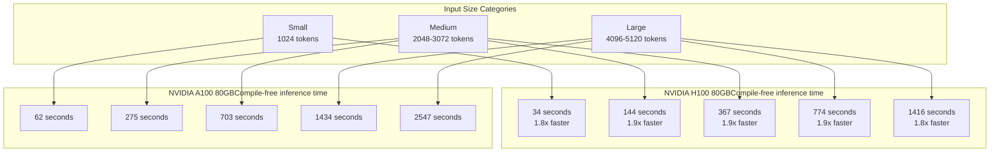
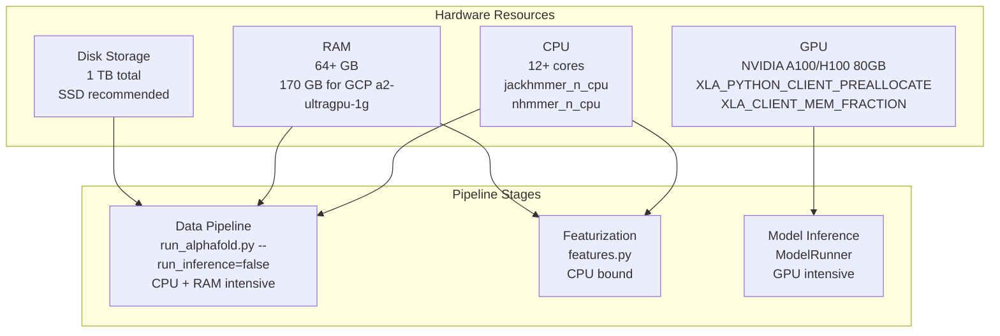
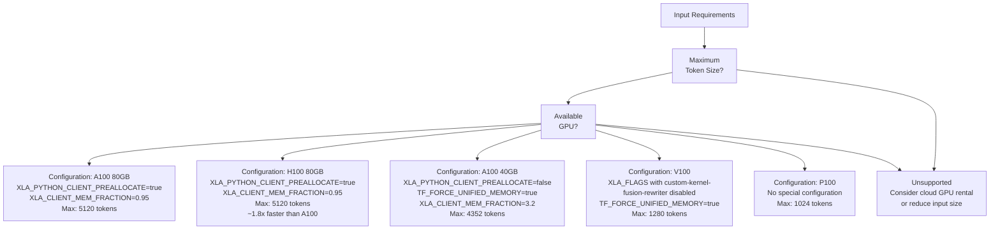

# Hardware Configuration

> **Relevant source files**
> * [docs/installation.md](https://github.com/google-deepmind/alphafold3/blob/97639fff/docs/installation.md?plain=1)
> * [docs/known_issues.md](https://github.com/google-deepmind/alphafold3/blob/97639fff/docs/known_issues.md?plain=1)
> * [docs/performance.md](https://github.com/google-deepmind/alphafold3/blob/97639fff/docs/performance.md?plain=1)
> * [fetch_databases.sh](https://github.com/google-deepmind/alphafold3/blob/97639fff/fetch_databases.sh)
> * [src/alphafold3/scripts/copy_to_ssd.sh](https://github.com/google-deepmind/alphafold3/blob/97639fff/src/alphafold3/scripts/copy_to_ssd.sh)
> * [src/alphafold3/scripts/gcp_mount_ssd.sh](https://github.com/google-deepmind/alphafold3/blob/97639fff/src/alphafold3/scripts/gcp_mount_ssd.sh)

This page details the GPU, CPU, and memory hardware requirements for running AlphaFold 3. It covers officially supported GPU configurations, compute capability requirements, CPU allocation recommendations, and performance characteristics across different hardware setups.

For memory management strategies specific to different GPU sizes, see [Memory Management](/google-deepmind/alphafold3/8.2-memory-management). For optimization of compilation and execution, see [Compilation and Execution](/google-deepmind/alphafold3/8.3-compilation-and-execution).

## GPU Requirements

### Officially Supported Configurations

AlphaFold 3 has been extensively tested and verified for numerical accuracy and throughput efficiency on the following GPU configurations:

| GPU Model | Memory | Max Token Support | Status |
| --- | --- | --- | --- |
| NVIDIA A100 | 80 GB | 5,120 tokens | Officially supported |
| NVIDIA H100 | 80 GB | 5,120 tokens | Officially supported |

These configurations represent the primary deployment targets for the codebase. The repository is optimized to maximize throughput when running on a single GPU of these types, achieving 2-5× better efficiency (in GPU-seconds) compared to the 16-GPU A100 40GB setup used in the AlphaFold 3 paper [docs/performance.md L166-L175](https://github.com/google-deepmind/alphafold3/blob/97639fff/docs/performance.md?plain=1#L166-L175)

**Performance Comparison: A100 80GB vs H100 80GB**

Title: Inference Performance by Input Size



Sources: [docs/performance.md L166-L203](https://github.com/google-deepmind/alphafold3/blob/97639fff/docs/performance.md?plain=1#L166-L203)

 [docs/installation.md L7-L9](https://github.com/google-deepmind/alphafold3/blob/97639fff/docs/installation.md?plain=1#L7-L9)

### Compute Capability Requirements

**Minimum Compute Capability:** CUDA Compute Capability **8.0 or greater** [docs/installation.md L5-L6](https://github.com/google-deepmind/alphafold3/blob/97639fff/docs/installation.md?plain=1#L5-L6)

This requirement excludes older GPU architectures:

* **Supported:** Ampere (A100, A30), Ada (RTX 4090), Hopper (H100), and newer architectures.
* **Not Recommended:** Volta (V100, compute capability 7.0), Pascal (P100, compute capability 6.0).

Numerical accuracy has been specifically verified on NVIDIA A100 and H100 GPUs [docs/installation.md L9](https://github.com/google-deepmind/alphafold3/blob/97639fff/docs/installation.md?plain=1#L9-L9)

Sources: [docs/performance.md L236-L257](https://github.com/google-deepmind/alphafold3/blob/97639fff/docs/performance.md?plain=1#L236-L257)

 [docs/installation.md L3-L9](https://github.com/google-deepmind/alphafold3/blob/97639fff/docs/installation.md?plain=1#L3-L9)

### Hardware-to-Pipeline Stage Mapping

Title: Resource Allocation for run_alphafold.py



Sources: [docs/performance.md L19-L25](https://github.com/google-deepmind/alphafold3/blob/97639fff/docs/performance.md?plain=1#L19-L25)

 [docs/installation.md L11-L13](https://github.com/google-deepmind/alphafold3/blob/97639fff/docs/installation.md?plain=1#L11-L13)

 [docs/installation.md L57-L58](https://github.com/google-deepmind/alphafold3/blob/97639fff/docs/installation.md?plain=1#L57-L58)

## CPU and Memory Requirements

### CPU Allocation

**Minimum:** 12 CPU cores (recommended for single-chain predictions, as seen in the GCP `a2-ultragpu-1g` configuration) [docs/installation.md L57-L58](https://github.com/google-deepmind/alphafold3/blob/97639fff/docs/installation.md?plain=1#L57-L58)

**Optimal Configuration:** The CPU requirements scale with parallelization strategy:

* **Base usage:** Each `Jackhmmer` or `Nhmmer` process uses `jackhmmer_n_cpu` or `nhmmer_n_cpu` cores [docs/performance.md L144-L147](https://github.com/google-deepmind/alphafold3/blob/97639fff/docs/performance.md?plain=1#L144-L147)
* **Database parallelization:** When using sharded databases, total cores = `n_cpu × max_parallel_shards × num_databases_searched_in_parallel`. AlphaFold 3 runs genetic search against 4 databases in parallel [docs/performance.md L79-L81](https://github.com/google-deepmind/alphafold3/blob/97639fff/docs/performance.md?plain=1#L79-L81)

**Example calculation for sharded databases:**

```
Total cores = (2 CPUs per process) × (16 parallel shards) × (4 protein databases)
           = 128 cores for protein chains
```

Sources: [docs/performance.md L70-L162](https://github.com/google-deepmind/alphafold3/blob/97639fff/docs/performance.md?plain=1#L70-L162)

### RAM Requirements

**Minimum:** 64 GB [docs/installation.md L11-L12](https://github.com/google-deepmind/alphafold3/blob/97639fff/docs/installation.md?plain=1#L11-L12)

**Recommended:** 170 GB (as provisioned in GCP `a2-ultragpu-1g` configuration) [docs/installation.md L58](https://github.com/google-deepmind/alphafold3/blob/97639fff/docs/installation.md?plain=1#L58-L58)

RAM usage patterns:

* **Data pipeline stage:** Can require substantial RAM for sequences with deep MSAs during `Jackhmmer` or `Nhmmer` execution beyond the recommended 64 GB [docs/performance.md L82-L83](https://github.com/google-deepmind/alphafold3/blob/97639fff/docs/performance.md?plain=1#L82-L83)
* **Model inference:** GPU memory is the primary constraint; host RAM usage is minimal during this stage.
* **Peak usage:** Occurs during genetic database searches, particularly for highly homologous sequences.

Sources: [docs/performance.md L82-L83](https://github.com/google-deepmind/alphafold3/blob/97639fff/docs/performance.md?plain=1#L82-L83)

 [docs/installation.md L11-L13](https://github.com/google-deepmind/alphafold3/blob/97639fff/docs/installation.md?plain=1#L11-L13)

### Disk Storage

**Total requirement:** Up to 1 TB for genetic databases [docs/installation.md L4-L5](https://github.com/google-deepmind/alphafold3/blob/97639fff/docs/installation.md?plain=1#L4-L5)

**Storage type:** SSD strongly recommended for optimal performance. The disk speed directly influences genetic search speed during the data pipeline stage [docs/performance.md L74-L78](https://github.com/google-deepmind/alphafold3/blob/97639fff/docs/performance.md?plain=1#L74-L78)

 Scripts like `copy_to_ssd.sh` and `gcp_mount_ssd.sh` are provided to assist in managing SSD-backed database storage [src/alphafold3/scripts/copy_to_ssd.sh L1-L26](https://github.com/google-deepmind/alphafold3/blob/97639fff/src/alphafold3/scripts/copy_to_ssd.sh#L1-L26)

 [src/alphafold3/scripts/gcp_mount_ssd.sh L1-L14](https://github.com/google-deepmind/alphafold3/blob/97639fff/src/alphafold3/scripts/gcp_mount_ssd.sh#L1-L14)

Sources: [docs/performance.md L76-L78](https://github.com/google-deepmind/alphafold3/blob/97639fff/docs/performance.md?plain=1#L76-L78)

 [docs/installation.md L4-L5](https://github.com/google-deepmind/alphafold3/blob/97639fff/docs/installation.md?plain=1#L4-L5)

## Hardware Configuration Selection

Title: Hardware Selection Logic



Sources: [docs/performance.md L186-L257](https://github.com/google-deepmind/alphafold3/blob/97639fff/docs/performance.md?plain=1#L186-L257)

 [docs/installation.md L7-L9](https://github.com/google-deepmind/alphafold3/blob/97639fff/docs/installation.md?plain=1#L7-L9)

## Alternative Hardware Configurations

### NVIDIA A100 40GB

**Maximum token support:** 4,352 tokens [docs/performance.md L213](https://github.com/google-deepmind/alphafold3/blob/97639fff/docs/performance.md?plain=1#L213-L213)

**Required configuration changes:**

1. **Enable unified memory**: ``` XLA_PYTHON_CLIENT_PREALLOCATE=falseTF_FORCE_UNIFIED_MEMORY=trueXLA_CLIENT_MEM_FRACTION=3.2 ```
2. **Adjust `pair_transition_shard_spec`** in model configuration to control memory sharding for the pair transition module [docs/performance.md L225-L234](https://github.com/google-deepmind/alphafold3/blob/97639fff/docs/performance.md?plain=1#L225-L234)

Sources: [docs/performance.md L207-L234](https://github.com/google-deepmind/alphafold3/blob/97639fff/docs/performance.md?plain=1#L207-L234)

### NVIDIA V100 (Compute Capability 7.x)

**Maximum token support:** 1,280 tokens (with unified memory) [docs/performance.md L243](https://github.com/google-deepmind/alphafold3/blob/97639fff/docs/performance.md?plain=1#L243-L243)

**Known issues:** CUDA Capability 7.x devices (e.g., V100) produce bad output with clashing residues (ranking scores of -99 or lower) unless specific XLA flags are set [docs/known_issues.md L3-L8](https://github.com/google-deepmind/alphafold3/blob/97639fff/docs/known_issues.md?plain=1#L3-L8)

**Required workaround:**

```
XLA_FLAGS="--xla_disable_hlo_passes=custom-kernel-fusion-rewriter"
```

Sources: [docs/performance.md L236-L243](https://github.com/google-deepmind/alphafold3/blob/97639fff/docs/performance.md?plain=1#L236-L243)

 [docs/known_issues.md L3-L8](https://github.com/google-deepmind/alphafold3/blob/97639fff/docs/known_issues.md?plain=1#L3-L8)

### NVIDIA P100 (Compute Capability 6.0)

**Maximum token support:** 1,024 tokens [docs/performance.md L248](https://github.com/google-deepmind/alphafold3/blob/97639fff/docs/performance.md?plain=1#L248-L248)

**Configuration:** No special configuration changes needed beyond standard setup [docs/performance.md L245-L248](https://github.com/google-deepmind/alphafold3/blob/97639fff/docs/performance.md?plain=1#L245-L248)

Sources: [docs/performance.md L245-L248](https://github.com/google-deepmind/alphafold3/blob/97639fff/docs/performance.md?plain=1#L245-L248)

## Summary of Environment Variables

The following environment variables are critical for hardware performance and stability:

| Variable | Recommended Value | Purpose |
| --- | --- | --- |
| `XLA_PYTHON_CLIENT_PREALLOCATE` | `true` (for 80GB) | Enables JAX memory preallocation. [docs/performance.md L186-L189](https://github.com/google-deepmind/alphafold3/blob/97639fff/docs/performance.md?plain=1#L186-L189) |
| `XLA_CLIENT_MEM_FRACTION` | `0.95` (for 80GB) | Allocates 95% of GPU memory. [docs/performance.md L186-L189](https://github.com/google-deepmind/alphafold3/blob/97639fff/docs/performance.md?plain=1#L186-L189) |
| `TF_FORCE_UNIFIED_MEMORY` | `true` (for <80GB) | Enables CUDA Unified Memory for larger inputs. [docs/performance.md L213-L217](https://github.com/google-deepmind/alphafold3/blob/97639fff/docs/performance.md?plain=1#L213-L217) |
| `XLA_FLAGS` | (See Workarounds) | Disables specific HLO passes for older GPUs. [docs/known_issues.md L7-L8](https://github.com/google-deepmind/alphafold3/blob/97639fff/docs/known_issues.md?plain=1#L7-L8) |

Sources: [docs/performance.md L186-L217](https://github.com/google-deepmind/alphafold3/blob/97639fff/docs/performance.md?plain=1#L186-L217)

 [docs/known_issues.md L3-L8](https://github.com/google-deepmind/alphafold3/blob/97639fff/docs/known_issues.md?plain=1#L3-L8)