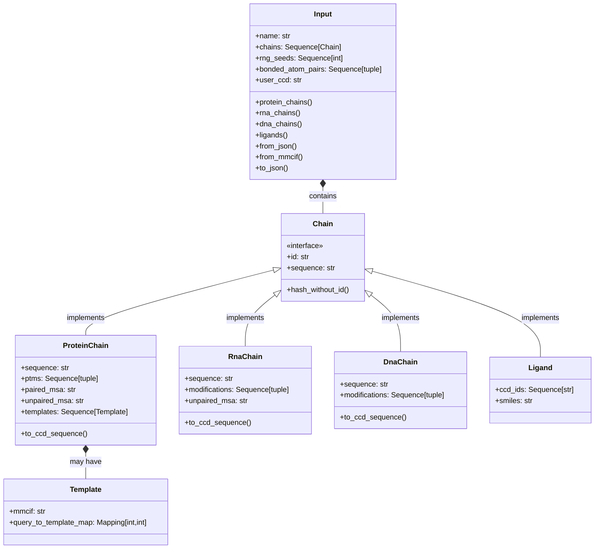
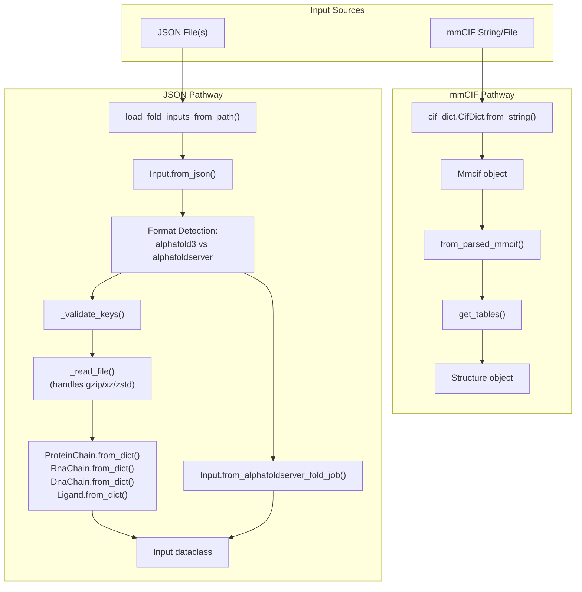
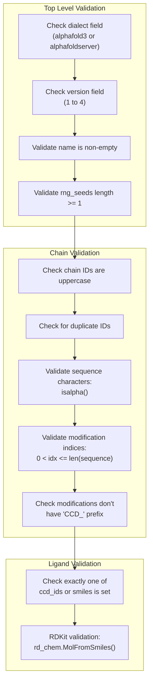

# Input Processing

> **Relevant source files**
> * [src/alphafold3/common/folding_input.py](https://github.com/google-deepmind/alphafold3/blob/97639fff/src/alphafold3/common/folding_input.py)
> * [src/alphafold3/structure/cpp/mmcif_utils.pyi](https://github.com/google-deepmind/alphafold3/blob/97639fff/src/alphafold3/structure/cpp/mmcif_utils.pyi)
> * [src/alphafold3/structure/cpp/mmcif_utils_pybind.cc](https://github.com/google-deepmind/alphafold3/blob/97639fff/src/alphafold3/structure/cpp/mmcif_utils_pybind.cc)
> * [src/alphafold3/structure/parsing.py](https://github.com/google-deepmind/alphafold3/blob/97639fff/src/alphafold3/structure/parsing.py)

## Purpose and Scope

The Input Processing system transforms user inputs into internal data structures that the AlphaFold 3 pipeline can process. The system consists of two primary pathways:

1. **JSON Input Pathway**: Parses JSON files via `folding_input.py` into `Input` dataclasses.
2. **mmCIF Input Pathway**: Parses mmCIF structure files via `parsing.py` into `Structure` objects.

Key modules:

* `src/alphafold3/common/folding_input.py`: JSON parsing and `Input` dataclass definition. [src/alphafold3/common/folding_input.py L11-L34](https://github.com/google-deepmind/alphafold3/blob/97639fff/src/alphafold3/common/folding_input.py#L11-L34)
* `src/alphafold3/structure/parsing.py`: mmCIF to `Structure` conversion. [src/alphafold3/structure/parsing.py L11-L31](https://github.com/google-deepmind/alphafold3/blob/97639fff/src/alphafold3/structure/parsing.py#L11-L31)
* `src/alphafold3/cpp/cif_dict.py`: C++ accelerated CIF tokenization and parsing. [src/alphafold3/common/folding_input.py L30](https://github.com/google-deepmind/alphafold3/blob/97639fff/src/alphafold3/common/folding_input.py#L30-L30)
* `src/alphafold3/cpp/mmcif_utils.py`: C++ accelerated mmCIF filtering and alt-loc resolution. [src/alphafold3/structure/parsing.py L24](https://github.com/google-deepmind/alphafold3/blob/97639fff/src/alphafold3/structure/parsing.py#L24-L24)

This page covers the input parsing and validation components. For the data pipeline that enriches these inputs with MSA and templates, see page 4.2. For feature extraction from these inputs, see page 4.3.

Sources: [src/alphafold3/common/folding_input.py L1-L34](https://github.com/google-deepmind/alphafold3/blob/97639fff/src/alphafold3/common/folding_input.py#L1-L34)

 [src/alphafold3/structure/parsing.py L1-L31](https://github.com/google-deepmind/alphafold3/blob/97639fff/src/alphafold3/structure/parsing.py#L1-L31)

## Input Data Model Architecture

The Input Processing system is built around a set of specialized classes that represent different molecular entities and their relationships.

**Input Model Class Diagram**

The diagram above shows the core classes in the input data model:

1. `Input`: The top-level container holding all input information. [src/alphafold3/common/folding_input.py L843-L855](https://github.com/google-deepmind/alphafold3/blob/97639fff/src/alphafold3/common/folding_input.py#L843-L855)
2. Chain types: * `ProteinChain`: For protein sequences. [src/alphafold3/common/folding_input.py L123-L146](https://github.com/google-deepmind/alphafold3/blob/97639fff/src/alphafold3/common/folding_input.py#L123-L146) * `RnaChain`: For RNA sequences. [src/alphafold3/common/folding_input.py L423-L450](https://github.com/google-deepmind/alphafold3/blob/97639fff/src/alphafold3/common/folding_input.py#L423-L450) * `DnaChain`: For DNA sequences. [src/alphafold3/common/folding_input.py L596-L619](https://github.com/google-deepmind/alphafold3/blob/97639fff/src/alphafold3/common/folding_input.py#L596-L619) * `Ligand`: For ligands and ions. [src/alphafold3/common/folding_input.py L721-L738](https://github.com/google-deepmind/alphafold3/blob/97639fff/src/alphafold3/common/folding_input.py#L721-L738)
3. `Template`: For protein structure templates. [src/alphafold3/common/folding_input.py L86-L103](https://github.com/google-deepmind/alphafold3/blob/97639fff/src/alphafold3/common/folding_input.py#L86-L103)

Sources: [src/alphafold3/common/folding_input.py L86-L103](https://github.com/google-deepmind/alphafold3/blob/97639fff/src/alphafold3/common/folding_input.py#L86-L103)

 [src/alphafold3/common/folding_input.py L123-L146](https://github.com/google-deepmind/alphafold3/blob/97639fff/src/alphafold3/common/folding_input.py#L123-L146)

 [src/alphafold3/common/folding_input.py L423-L450](https://github.com/google-deepmind/alphafold3/blob/97639fff/src/alphafold3/common/folding_input.py#L423-L450)

 [src/alphafold3/common/folding_input.py L596-L619](https://github.com/google-deepmind/alphafold3/blob/97639fff/src/alphafold3/common/folding_input.py#L596-L619)

 [src/alphafold3/common/folding_input.py L721-L738](https://github.com/google-deepmind/alphafold3/blob/97639fff/src/alphafold3/common/folding_input.py#L721-L738)

 [src/alphafold3/common/folding_input.py L843-L855](https://github.com/google-deepmind/alphafold3/blob/97639fff/src/alphafold3/common/folding_input.py#L843-L855)

## Input Processing Flow

**Input Processing Flow Diagram**

The flow has two distinct pathways:

**JSON Pathway** (`folding_input.py`):

1. `load_fold_inputs_from_path()` loads JSON files. [src/alphafold3/common/folding_input.py L1407-L1423](https://github.com/google-deepmind/alphafold3/blob/97639fff/src/alphafold3/common/folding_input.py#L1407-L1423)
2. Format detection via `dialect` field determines parser. [src/alphafold3/common/folding_input.py L1022-L1033](https://github.com/google-deepmind/alphafold3/blob/97639fff/src/alphafold3/common/folding_input.py#L1022-L1033)
3. `_validate_keys()` ensures required fields are present. [src/alphafold3/common/folding_input.py L46-L49](https://github.com/google-deepmind/alphafold3/blob/97639fff/src/alphafold3/common/folding_input.py#L46-L49)
4. `_read_file()` handles compressed MSA/template files (gzip, xz, zstd). [src/alphafold3/common/folding_input.py L52-L83](https://github.com/google-deepmind/alphafold3/blob/97639fff/src/alphafold3/common/folding_input.py#L52-L83)
5. Chain-specific `from_dict()` methods construct chain objects. [src/alphafold3/common/folding_input.py L255-L361](https://github.com/google-deepmind/alphafold3/blob/97639fff/src/alphafold3/common/folding_input.py#L255-L361)  [src/alphafold3/common/folding_input.py L504-L552](https://github.com/google-deepmind/alphafold3/blob/97639fff/src/alphafold3/common/folding_input.py#L504-L552)
6. Result: `Input` dataclass. [src/alphafold3/common/folding_input.py L843-L855](https://github.com/google-deepmind/alphafold3/blob/97639fff/src/alphafold3/common/folding_input.py#L843-L855)

**mmCIF Pathway** (`parsing.py`):

1. `cif_dict.CifDict.from_string()` parses mmCIF using C++ tokenizer. [src/alphafold3/structure/parsing.py L313](https://github.com/google-deepmind/alphafold3/blob/97639fff/src/alphafold3/structure/parsing.py#L313-L313)
2. Creates `Mmcif` object wrapping parsed CIF data. [src/alphafold3/structure/parsing.py L314](https://github.com/google-deepmind/alphafold3/blob/97639fff/src/alphafold3/structure/parsing.py#L314-L314)
3. `from_parsed_mmcif()` extracts header and calls `get_tables()`. [src/alphafold3/structure/parsing.py L307-L336](https://github.com/google-deepmind/alphafold3/blob/97639fff/src/alphafold3/structure/parsing.py#L307-L336)
4. `get_tables()` uses C++ `mmcif_utils.filter()` for alt-loc resolution. [src/alphafold3/structure/parsing.py L421-L428](https://github.com/google-deepmind/alphafold3/blob/97639fff/src/alphafold3/structure/parsing.py#L421-L428)
5. Result: `Structure` object with tables. [src/alphafold3/structure/parsing.py L452-L453](https://github.com/google-deepmind/alphafold3/blob/97639fff/src/alphafold3/structure/parsing.py#L452-L453)

Sources: [src/alphafold3/common/folding_input.py L46-L1033](https://github.com/google-deepmind/alphafold3/blob/97639fff/src/alphafold3/common/folding_input.py#L46-L1033)

 [src/alphafold3/structure/parsing.py L307-L453](https://github.com/google-deepmind/alphafold3/blob/97639fff/src/alphafold3/structure/parsing.py#L307-L453)

## Input Formats Support

AlphaFold 3 supports two primary JSON dialects and the structural mmCIF format.

### JSON Dialects

| Dialect | Version | Purpose |
| --- | --- | --- |
| `alphafold3` | 1, 2, 3, 4 | Native AF3 format. [src/alphafold3/common/folding_input.py L38-L40](https://github.com/google-deepmind/alphafold3/blob/97639fff/src/alphafold3/common/folding_input.py#L38-L40) |
| `alphafoldserver` | 1 | Compatibility with AlphaFold Server inputs. [src/alphafold3/common/folding_input.py L42-L43](https://github.com/google-deepmind/alphafold3/blob/97639fff/src/alphafold3/common/folding_input.py#L42-L43) |

### JSON Format Versions (Native)

The `alphafold3` dialect versioning:

* **Version 1-2**: Initial support for sequences and basic MSAs.
* **Version 3**: Added support for user-provided CCD strings. [src/alphafold3/common/folding_input.py L1081](https://github.com/google-deepmind/alphafold3/blob/97639fff/src/alphafold3/common/folding_input.py#L1081-L1081)
* **Version 4**: Current version, includes support for user CCD paths. [src/alphafold3/common/folding_input.py L1082](https://github.com/google-deepmind/alphafold3/blob/97639fff/src/alphafold3/common/folding_input.py#L1082-L1082)

Sources: [src/alphafold3/common/folding_input.py L38-L43](https://github.com/google-deepmind/alphafold3/blob/97639fff/src/alphafold3/common/folding_input.py#L38-L43)

 [src/alphafold3/common/folding_input.py L1081-L1082](https://github.com/google-deepmind/alphafold3/blob/97639fff/src/alphafold3/common/folding_input.py#L1081-L1082)

## JSON Parsing and Validation

### Validation Functions

The `_validate_keys()` function checks JSON structure against expected fields. [src/alphafold3/common/folding_input.py L46-L49](https://github.com/google-deepmind/alphafold3/blob/97639fff/src/alphafold3/common/folding_input.py#L46-L49)

**JSON Validation Flow**

### Key Validation Rules

| Component | Validation | Code Location |
| --- | --- | --- |
| **Protein Sequences** | Must contain only letters (`isalpha()`). | [src/alphafold3/common/folding_input.py L169-L170](https://github.com/google-deepmind/alphafold3/blob/97639fff/src/alphafold3/common/folding_input.py#L169-L170) |
| **Protein PTMs** | Index must be 1-based and within sequence length. | [src/alphafold3/common/folding_input.py L171-L172](https://github.com/google-deepmind/alphafold3/blob/97639fff/src/alphafold3/common/folding_input.py#L171-L172) |
| **PTM Prefix** | Must not contain the "CCD_" prefix. | [src/alphafold3/common/folding_input.py L173-L176](https://github.com/google-deepmind/alphafold3/blob/97639fff/src/alphafold3/common/folding_input.py#L173-L176) |
| **RNA/DNA Sequences** | Must contain only letters. | [src/alphafold3/common/folding_input.py L477-L478](https://github.com/google-deepmind/alphafold3/blob/97639fff/src/alphafold3/common/folding_input.py#L477-L478)    [src/alphafold3/common/folding_input.py L671-L672](https://github.com/google-deepmind/alphafold3/blob/97639fff/src/alphafold3/common/folding_input.py#L671-L672) |
| **Ligands** | Exactly one of `ccd_ids` or `smiles` must be provided. | [src/alphafold3/common/folding_input.py L810-L811](https://github.com/google-deepmind/alphafold3/blob/97639fff/src/alphafold3/common/folding_input.py#L810-L811) |
| **SMILES** | Must be valid according to RDKit. | [src/alphafold3/common/folding_input.py L814-L816](https://github.com/google-deepmind/alphafold3/blob/97639fff/src/alphafold3/common/folding_input.py#L814-L816) |

Sources: [src/alphafold3/common/folding_input.py L169-L176](https://github.com/google-deepmind/alphafold3/blob/97639fff/src/alphafold3/common/folding_input.py#L169-L176)

 [src/alphafold3/common/folding_input.py L477-L478](https://github.com/google-deepmind/alphafold3/blob/97639fff/src/alphafold3/common/folding_input.py#L477-L478)

 [src/alphafold3/common/folding_input.py L671-L672](https://github.com/google-deepmind/alphafold3/blob/97639fff/src/alphafold3/common/folding_input.py#L671-L672)

 [src/alphafold3/common/folding_input.py L810-L816](https://github.com/google-deepmind/alphafold3/blob/97639fff/src/alphafold3/common/folding_input.py#L810-L816)

## mmCIF Pathway Implementation

The mmCIF pathway uses a combination of Python logic and C++ utilities for high-performance structure parsing.

### Structure Parsing Flow

1. **C++ Tokenization**: `cif_dict.CifDict` parses the file into a dictionary-like structure. [src/alphafold3/structure/parsing.py L313](https://github.com/google-deepmind/alphafold3/blob/97639fff/src/alphafold3/structure/parsing.py#L313-L313)
2. **Filtering**: `mmcif_utils.filter()` (C++ binding) handles: * Selecting specific models (`model_id`). [src/alphafold3/structure/cpp/mmcif_utils_pybind.cc L148-L152](https://github.com/google-deepmind/alphafold3/blob/97639fff/src/alphafold3/structure/cpp/mmcif_utils_pybind.cc#L148-L152) * Filtering by entity type (polymers, ligands, water). [src/alphafold3/structure/cpp/mmcif_utils_pybind.cc L153-L156](https://github.com/google-deepmind/alphafold3/blob/97639fff/src/alphafold3/structure/cpp/mmcif_utils_pybind.cc#L153-L156) * Resolving alternative locations (alt-locs) based on occupancy. [src/alphafold3/structure/cpp/mmcif_utils_pybind.cc L87-L111](https://github.com/google-deepmind/alphafold3/blob/97639fff/src/alphafold3/structure/cpp/mmcif_utils_pybind.cc#L87-L111)
3. **Table Generation**: `get_tables()` constructs the `structure_tables.Chains`, `Residues`, and `Atoms` tables. [src/alphafold3/structure/parsing.py L399-L453](https://github.com/google-deepmind/alphafold3/blob/97639fff/src/alphafold3/structure/parsing.py#L399-L453)
4. **Bond Extraction**: `_parse_bonds()` extracts intra-residue and inter-residue bonds from `_struct_conn` and `_chem_comp_bond`. [src/alphafold3/structure/parsing.py L202-L237](https://github.com/google-deepmind/alphafold3/blob/97639fff/src/alphafold3/structure/parsing.py#L202-L237)

### C++ Accelerated Utilities

The `mmcif_utils` module provides critical performance for large structures:

* `filter()`: Returns a mask of atoms to keep and a layout object. [src/alphafold3/structure/cpp/mmcif_utils.pyi L19-L26](https://github.com/google-deepmind/alphafold3/blob/97639fff/src/alphafold3/structure/cpp/mmcif_utils.pyi#L19-L26)
* `read_layout()`: Efficiently scans the mmCIF to determine chain and residue boundaries. [src/alphafold3/structure/cpp/mmcif_utils.pyi L40-L42](https://github.com/google-deepmind/alphafold3/blob/97639fff/src/alphafold3/structure/cpp/mmcif_utils.pyi#L40-L42)

Sources: [src/alphafold3/structure/parsing.py L307-L453](https://github.com/google-deepmind/alphafold3/blob/97639fff/src/alphafold3/structure/parsing.py#L307-L453)

 [src/alphafold3/structure/cpp/mmcif_utils_pybind.cc L87-L156](https://github.com/google-deepmind/alphafold3/blob/97639fff/src/alphafold3/structure/cpp/mmcif_utils_pybind.cc#L87-L156)

 [src/alphafold3/structure/cpp/mmcif_utils.pyi L19-L42](https://github.com/google-deepmind/alphafold3/blob/97639fff/src/alphafold3/structure/cpp/mmcif_utils.pyi#L19-L42)

## Chain Type Processing

### Protein Chain

Handles `ptms`, `paired_msa`, `unpaired_msa`, and `templates`. [src/alphafold3/common/folding_input.py L136-L146](https://github.com/google-deepmind/alphafold3/blob/97639fff/src/alphafold3/common/folding_input.py#L136-L146)

The `to_ccd_sequence()` method converts the one-letter sequence into CCD-compliant residue names, incorporating PTMs. [src/alphafold3/common/folding_input.py L401-L409](https://github.com/google-deepmind/alphafold3/blob/97639fff/src/alphafold3/common/folding_input.py#L401-L409)

### RNA and DNA Chains

Support `modifications` and `unpaired_msa` (RNA only). [src/alphafold3/common/folding_input.py L431-L450](https://github.com/google-deepmind/alphafold3/blob/97639fff/src/alphafold3/common/folding_input.py#L431-L450)

 [src/alphafold3/common/folding_input.py L604-L619](https://github.com/google-deepmind/alphafold3/blob/97639fff/src/alphafold3/common/folding_input.py#L604-L619)

Like proteins, they use `to_ccd_sequence()` to map sequences to CCD codes. [src/alphafold3/common/folding_input.py L576-L582](https://github.com/google-deepmind/alphafold3/blob/97639fff/src/alphafold3/common/folding_input.py#L576-L582)

 [src/alphafold3/common/folding_input.py L710-L718](https://github.com/google-deepmind/alphafold3/blob/97639fff/src/alphafold3/common/folding_input.py#L710-L718)

### Ligand

Supports `ccd_ids` (for known components) or `smiles` (for arbitrary molecules). [src/alphafold3/common/folding_input.py L721-L738](https://github.com/google-deepmind/alphafold3/blob/97639fff/src/alphafold3/common/folding_input.py#L721-L738)

If `smiles` is used, RDKit is employed to validate the structure. [src/alphafold3/common/folding_input.py L814-L816](https://github.com/google-deepmind/alphafold3/blob/97639fff/src/alphafold3/common/folding_input.py#L814-L816)

Sources: [src/alphafold3/common/folding_input.py L136-L816](https://github.com/google-deepmind/alphafold3/blob/97639fff/src/alphafold3/common/folding_input.py#L136-L816)

## Bond Specification

The `Input` class allows for manual bond specification via `bonded_atom_pairs`. [src/alphafold3/common/folding_input.py L853](https://github.com/google-deepmind/alphafold3/blob/97639fff/src/alphafold3/common/folding_input.py#L853-L853)

Each bond is a tuple of two `BondAtomId`s, where a `BondAtomId` is `(chain_id, residue_index, atom_name)`. [src/alphafold3/common/folding_input.py L36](https://github.com/google-deepmind/alphafold3/blob/97639fff/src/alphafold3/common/folding_input.py#L36-L36)

Validation of bonds ensures:

* Chain IDs exist in the input. [src/alphafold3/common/folding_input.py L978-L980](https://github.com/google-deepmind/alphafold3/blob/97639fff/src/alphafold3/common/folding_input.py#L978-L980)
* Residue indices are within the chain length. [src/alphafold3/common/folding_input.py L981-L983](https://github.com/google-deepmind/alphafold3/blob/97639fff/src/alphafold3/common/folding_input.py#L981-L983)

Sources: [src/alphafold3/common/folding_input.py L36](https://github.com/google-deepmind/alphafold3/blob/97639fff/src/alphafold3/common/folding_input.py#L36-L36)

 [src/alphafold3/common/folding_input.py L853-L983](https://github.com/google-deepmind/alphafold3/blob/97639fff/src/alphafold3/common/folding_input.py#L853-L983)