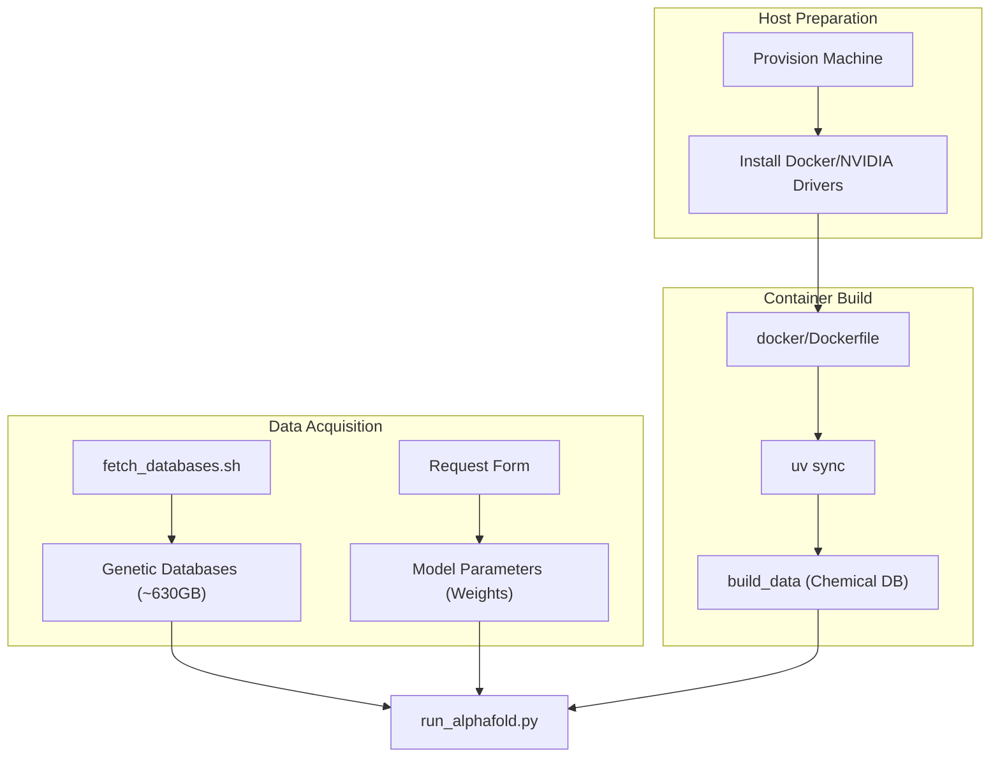

# Installation Guide

> **Relevant source files**
> * [docker/Dockerfile](https://github.com/google-deepmind/alphafold3/blob/97639fff/docker/Dockerfile)
> * [docker/jackhmmer_seq_limit.patch](https://github.com/google-deepmind/alphafold3/blob/97639fff/docker/jackhmmer_seq_limit.patch)
> * [docs/installation.md](https://github.com/google-deepmind/alphafold3/blob/97639fff/docs/installation.md?plain=1)
> * [fetch_databases.sh](https://github.com/google-deepmind/alphafold3/blob/97639fff/fetch_databases.sh)
> * [pyproject.toml](https://github.com/google-deepmind/alphafold3/blob/97639fff/pyproject.toml)
> * [src/alphafold3/data/tools/subprocess_utils.py](https://github.com/google-deepmind/alphafold3/blob/97639fff/src/alphafold3/data/tools/subprocess_utils.py)
> * [src/alphafold3/scripts/copy_to_ssd.sh](https://github.com/google-deepmind/alphafold3/blob/97639fff/src/alphafold3/scripts/copy_to_ssd.sh)
> * [src/alphafold3/scripts/gcp_mount_ssd.sh](https://github.com/google-deepmind/alphafold3/blob/97639fff/src/alphafold3/scripts/gcp_mount_ssd.sh)
> * [src/alphafold3/version.py](https://github.com/google-deepmind/alphafold3/blob/97639fff/src/alphafold3/version.py)
> * [uv.lock](https://github.com/google-deepmind/alphafold3/blob/97639fff/uv.lock)

This guide provides an overview of the installation and setup process for AlphaFold 3. It covers hardware requirements, environment configuration, and initial setup steps.

## System Requirements

AlphaFold 3 is designed for high-performance structural biology tasks and has specific hardware and software prerequisites.

* **Operating System**: Linux is the only supported operating system [docs/installation.md L3-L4](https://github.com/google-deepmind/alphafold3/blob/97639fff/docs/installation.md?plain=1#L3-L4)
* **GPU**: NVIDIA GPU with Compute Capability 8.0 or greater (e.g., A100 or H100 80 GB). Numerical accuracy has been verified on these specific architectures [docs/installation.md L5-L9](https://github.com/google-deepmind/alphafold3/blob/97639fff/docs/installation.md?plain=1#L5-L9)
* **Memory**: At least 64 GB of RAM is recommended due to the memory-intensive genetic search stage [docs/installation.md L11-L12](https://github.com/google-deepmind/alphafold3/blob/97639fff/docs/installation.md?plain=1#L11-L12)
* **Storage**: Up to 1 TB of disk space for genetic databases; SSD storage is highly recommended for performance [docs/installation.md L4-L5](https://github.com/google-deepmind/alphafold3/blob/97639fff/docs/installation.md?plain=1#L4-L5)
* **Software**: Python 3.12 or higher is required [pyproject.toml L14](https://github.com/google-deepmind/alphafold3/blob/97639fff/pyproject.toml#L14-L14)

Sources: [docs/installation.md L1-L12](https://github.com/google-deepmind/alphafold3/blob/97639fff/docs/installation.md?plain=1#L1-L12)

 [pyproject.toml L11-L14](https://github.com/google-deepmind/alphafold3/blob/97639fff/pyproject.toml#L11-L14)

## Installation Workflow

The setup process involves preparing the host environment, acquiring data, and building the execution container.

### High-Level Setup Diagram

This diagram maps the high-level installation steps to the scripts and configurations found in the codebase.



Sources: [docs/installation.md L23-L31](https://github.com/google-deepmind/alphafold3/blob/97639fff/docs/installation.md?plain=1#L23-L31)

 [docker/Dockerfile L71-L75](https://github.com/google-deepmind/alphafold3/blob/97639fff/docker/Dockerfile#L71-L75)

 [fetch_databases.sh L1-L49](https://github.com/google-deepmind/alphafold3/blob/97639fff/fetch_databases.sh#L1-L49)

 [docker/Dockerfile L88](https://github.com/google-deepmind/alphafold3/blob/97639fff/docker/Dockerfile#L88-L88)

## Component Overview

### 1. Database Setup

AlphaFold 3 relies on several large genetic databases (UniRef90, BFD, MGnify, etc.) and structural databases (PDB). The `fetch_databases.sh` script automates the download and decompression of these assets using `zstd` [fetch_databases.sh L26-L45](https://github.com/google-deepmind/alphafold3/blob/97639fff/fetch_databases.sh#L26-L45)

 Additionally, the system provides `src/alphafold3/scripts/copy_to_ssd.sh` to facilitate moving these databases to high-speed storage [src/alphafold3/scripts/copy_to_ssd.sh L1-L55](https://github.com/google-deepmind/alphafold3/blob/97639fff/src/alphafold3/scripts/copy_to_ssd.sh#L1-L55)

For detailed instructions on organizing and optimizing these databases, see **[Database Setup](/google-deepmind/alphafold3/2.1-database-setup)**.

### 2. Container Configuration

The system is primarily distributed as a Docker-based environment to ensure reproducible builds of complex dependencies like HMMER 3.4 (with a custom sequence limit patch) and RDKit [docker/Dockerfile L11-L58](https://github.com/google-deepmind/alphafold3/blob/97639fff/docker/Dockerfile#L11-L58)

 The container uses `uv` for fast, reproducible Python dependency management [docker/Dockerfile L25-L31](https://github.com/google-deepmind/alphafold3/blob/97639fff/docker/Dockerfile#L25-L31)

For building Docker/Singularity images and configuring GPU support, see **[Container Setup](/google-deepmind/alphafold3/2.2-container-setup)**.

### 3. Build System and Dependencies

The project uses `scikit-build-core` as the build backend [pyproject.toml L9](https://github.com/google-deepmind/alphafold3/blob/97639fff/pyproject.toml#L9-L9)

 and `uv` for environment management [docker/Dockerfile L71-L72](https://github.com/google-deepmind/alphafold3/blob/97639fff/docker/Dockerfile#L71-L72)

 Key dependencies include `jax` for high-performance numerical computing and `dm-haiku` for neural network modules [pyproject.toml L17-L27](https://github.com/google-deepmind/alphafold3/blob/97639fff/pyproject.toml#L17-L27)

```

```

Sources: [pyproject.toml L1-L27](https://github.com/google-deepmind/alphafold3/blob/97639fff/pyproject.toml#L1-L27)

 [docker/Dockerfile L13-L58](https://github.com/google-deepmind/alphafold3/blob/97639fff/docker/Dockerfile#L13-L58)

 [uv.lock L35-L47](https://github.com/google-deepmind/alphafold3/blob/97639fff/uv.lock#L35-L47)

## Initial Execution Environment

The default entry point for the system is `run_alphafold.py` [docker/Dockerfile L88](https://github.com/google-deepmind/alphafold3/blob/97639fff/docker/Dockerfile#L88-L88)

 This script orchestrates the pipeline from JSON input to structure prediction. Before running, the system must build the chemical components database using the `build_data` script [pyproject.toml L64](https://github.com/google-deepmind/alphafold3/blob/97639fff/pyproject.toml#L64-L64)

 [docker/Dockerfile L75](https://github.com/google-deepmind/alphafold3/blob/97639fff/docker/Dockerfile#L75-L75)

To avoid performance degradation on certain NVIDIA architectures, specific XLA flags are configured in the environment:

* `XLA_FLAGS="--xla_gpu_enable_triton_gemm=false"` [docker/Dockerfile L83](https://github.com/google-deepmind/alphafold3/blob/97639fff/docker/Dockerfile#L83-L83)
* `XLA_PYTHON_CLIENT_PREALLOCATE=true` [docker/Dockerfile L85](https://github.com/google-deepmind/alphafold3/blob/97639fff/docker/Dockerfile#L85-L85)
* `XLA_CLIENT_MEM_FRACTION=0.95` [docker/Dockerfile L86](https://github.com/google-deepmind/alphafold3/blob/97639fff/docker/Dockerfile#L86-L86)

For a complete guide on running your first prediction, see the **[User Guide](/google-deepmind/alphafold3/3-user-guide)**.

## Troubleshooting and Known Issues

Common setup hurdles include Docker rootless configuration, NVIDIA driver mismatches, and specific XLA compilation issues on older GPU architectures (Compute Capability 7.x) which require alternative `XLA_FLAGS` [docs/installation.md L107-L150](https://github.com/google-deepmind/alphafold3/blob/97639fff/docs/installation.md?plain=1#L107-L150)

 [docker/Dockerfile L77-L81](https://github.com/google-deepmind/alphafold3/blob/97639fff/docker/Dockerfile#L77-L81)

For a catalog of workarounds and known bugs, see **[Known Issues](/google-deepmind/alphafold3/2.3-known-issues)**.

Sources: [docs/installation.md L23-L31](https://github.com/google-deepmind/alphafold3/blob/97639fff/docs/installation.md?plain=1#L23-L31)

 [docker/Dockerfile L77-L86](https://github.com/google-deepmind/alphafold3/blob/97639fff/docker/Dockerfile#L77-L86)

 [src/alphafold3/version.py L13](https://github.com/google-deepmind/alphafold3/blob/97639fff/src/alphafold3/version.py#L13-L13)