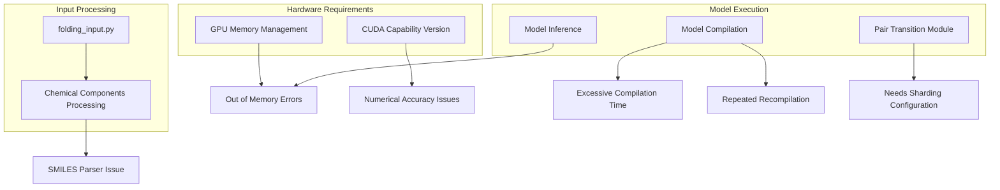
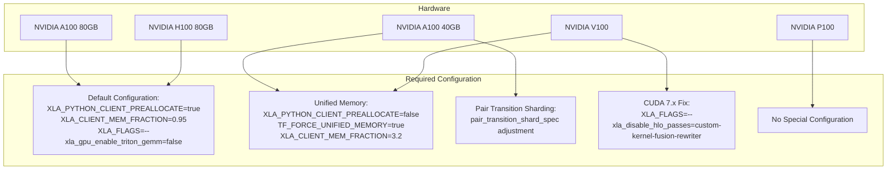
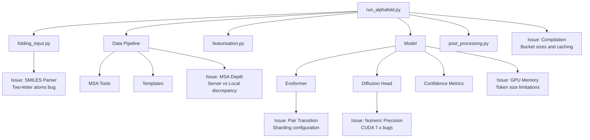

# Known Issues

> **Relevant source files**
> * [docs/known_issues.md](https://github.com/google-deepmind/alphafold3/blob/97639fff/docs/known_issues.md?plain=1)
> * [docs/performance.md](https://github.com/google-deepmind/alphafold3/blob/97639fff/docs/performance.md?plain=1)

This document provides a comprehensive list of known issues and workarounds when running AlphaFold 3. It covers hardware compatibility problems, memory limitations, and other technical challenges you may encounter during installation and execution. For performance optimization strategies, see [Performance Optimization](/google-deepmind/alphafold3/8-performance-optimization). For installation instructions, see [Installation Guide](/google-deepmind/alphafold3/2-installation-guide).

## Hardware Compatibility Issues

### CUDA Capability 7.x GPUs

GPUs with CUDA Capability 7.x (e.g., NVIDIA V100) require special configuration to avoid numerical issues that result in obviously incorrect predictions.

```yaml
Symptoms: Predictions show severe atomic clashes, resulting in ranking scores of -99 or lower.
```

**Workaround:** Set the following environment variable:

```
XLA_FLAGS="--xla_disable_hlo_passes=custom-kernel-fusion-rewriter"
```

Note that for these GPUs, you don't need to disable Triton GEMM kernels as they aren't supported for these devices.

Sources: [docs/known_issues.md L3-L9](https://github.com/google-deepmind/alphafold3/blob/97639fff/docs/known_issues.md?plain=1#L3-L9)

 [docs/performance.md L113-L132](https://github.com/google-deepmind/alphafold3/blob/97639fff/docs/performance.md?plain=1#L113-L132)

### Memory Limitations by GPU Type

Different GPU models have different maximum token limits when running AlphaFold 3:

| GPU Model | Memory | Maximum Tokens | Special Configuration Required |
| --- | --- | --- | --- |
| NVIDIA A100 | 80 GB | 5,120 | Default configuration |
| NVIDIA H100 | 80 GB | 5,120 | Default configuration |
| NVIDIA A100 | 40 GB | 4,352 | Unified Memory + Adjusted shard specs |
| NVIDIA V100 | 16/32 GB | 1,280 | Unified Memory + XLA flags |
| NVIDIA P100 | 16 GB | 1,024 | None |

Sources: [docs/performance.md L62-L132](https://github.com/google-deepmind/alphafold3/blob/97639fff/docs/performance.md?plain=1#L62-L132)

## Memory Management Issues

### Out of Memory Errors

For inputs larger than the default maximum size (5,120 tokens) or when using GPUs with less memory, you may encounter out-of-memory errors.

**Workaround:** Enable unified memory to allow GPU memory to spill into host memory:

```
XLA_PYTHON_CLIENT_PREALLOCATE=falseTF_FORCE_UNIFIED_MEMORY=trueXLA_CLIENT_MEM_FRACTION=3.2
```

Note: This workaround trades performance for memory capacity.

Sources: [docs/performance.md L203-L221](https://github.com/google-deepmind/alphafold3/blob/97639fff/docs/performance.md?plain=1#L203-L221)

### Pair Transition Shard Specification

For A100 (40 GB) GPUs, you'll need to adjust the pair transition shard specification in the model configuration:

```yaml
pair_transition_shard_spec: Sequence[_Shape2DType] = (    (2048, None),    (3072, 1024),    (None, 512),)
```

This tells the model:

* For sequences up to 2,048 tokens: no sharding
* For sequences up to 3,072 tokens: shard in chunks of 1,024
* For larger sequences: shard in chunks of 512

Sources: [docs/performance.md L84-L107](https://github.com/google-deepmind/alphafold3/blob/97639fff/docs/performance.md?plain=1#L84-L107)

## Performance and Compilation Issues

### Excessive Compilation Time

AlphaFold 3 may experience extremely long compilation times due to a known XLA issue.

**Workaround:** Set the following environment variable (included by default in the provided Dockerfile):

```
XLA_FLAGS="--xla_gpu_enable_triton_gemm=false"
```

Sources: [docs/performance.md L171-L179](https://github.com/google-deepmind/alphafold3/blob/97639fff/docs/performance.md?plain=1#L171-L179)

### Repeated Model Compilation

When processing inputs of different sizes, the model may need to be recompiled for each unique size, leading to excessive compilation time.

**Workaround:** Use the JAX persistent compilation cache and adjust compilation bucket sizes:

1. Enable the compilation cache via the `run_alphafold.py` flag: `--jax_compilation_cache_dir <YOUR_DIRECTORY>`
2. For large inputs exceeding the default 5,120 token limit, redefine bucket sizes using the `--buckets` flag: `--buckets 256,512,768,1024,1280,1536,2048,2560,3072,3584,4096,4608,5120,5376,6144`

Sources: [docs/performance.md L134-L167](https://github.com/google-deepmind/alphafold3/blob/97639fff/docs/performance.md?plain=1#L134-L167)

 [docs/performance.md L222-L236](https://github.com/google-deepmind/alphafold3/blob/97639fff/docs/performance.md?plain=1#L222-L236)

## Input and Pipeline Discrepancies

### Two-Letter Atoms in SMILES Ligands

AlphaFold 3 incorrectly handled two-letter atoms (e.g., Cl, Br) in ligands defined using SMILES strings in versions between commits `f8df1c7` and `4e4023c`.

**Workaround:** Ensure you are using a version of the code after commit `4e4023c`.

Sources: [docs/known_issues.md L10-L15](https://github.com/google-deepmind/alphafold3/blob/97639fff/docs/known_issues.md?plain=1#L10-L15)

### MSA Discrepancy vs AlphaFold Server

Local AlphaFold 3 runs may produce shallower Multiple Sequence Alignments (MSAs) than the AlphaFold Server, occasionally leading to lower accuracy (e.g., lower ipTM/pTM for complex structures). This is caused by the Server running sharded Jackhmmer without the `--domZ` flag, resulting in a ~100x more permissive `--domE` filter.

**Workaround:**

1. Increase the Jackhmmer/Nhmmer `--domE` flag value by 100x compared to its default value.
2. Alternatively, implement sharded database searches as documented in [Performance Optimization](/google-deepmind/alphafold3/8.3-compilation-and-execution) without setting the `--domZ` value.

Sources: [docs/known_issues.md L17-L63](https://github.com/google-deepmind/alphafold3/blob/97639fff/docs/known_issues.md?plain=1#L17-L63)

 [docs/performance.md L85-L148](https://github.com/google-deepmind/alphafold3/blob/97639fff/docs/performance.md?plain=1#L85-L148)

## Integration Points Where Issues Occur

The following diagram illustrates the key components of AlphaFold 3 and where known issues typically occur:

Title: "Mapping Known Issues to Code Components"



Sources: [docs/known_issues.md L1-L63](https://github.com/google-deepmind/alphafold3/blob/97639fff/docs/known_issues.md?plain=1#L1-L63)

 [docs/performance.md L1-L236](https://github.com/google-deepmind/alphafold3/blob/97639fff/docs/performance.md?plain=1#L1-L236)

## Hardware Compatibility and Configuration Matrix

This diagram shows how different hardware configurations relate to required configuration changes and environment variables:

Title: "Hardware and Configuration Mapping"



Sources: [docs/performance.md L62-L132](https://github.com/google-deepmind/alphafold3/blob/97639fff/docs/performance.md?plain=1#L62-L132)

 [docs/known_issues.md L3-L9](https://github.com/google-deepmind/alphafold3/blob/97639fff/docs/known_issues.md?plain=1#L3-L9)

## System Architecture and Issue Locations

This diagram maps specific issues to their location in the AlphaFold 3 system architecture:

Title: "System Architecture and Issue Hotspots"



Sources: [docs/known_issues.md L1-L63](https://github.com/google-deepmind/alphafold3/blob/97639fff/docs/known_issues.md?plain=1#L1-L63)

 [docs/performance.md L1-L236](https://github.com/google-deepmind/alphafold3/blob/97639fff/docs/performance.md?plain=1#L1-L236)