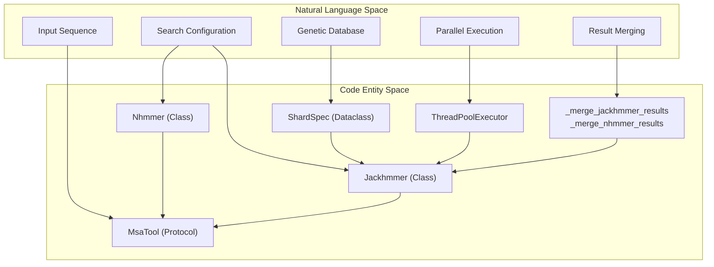
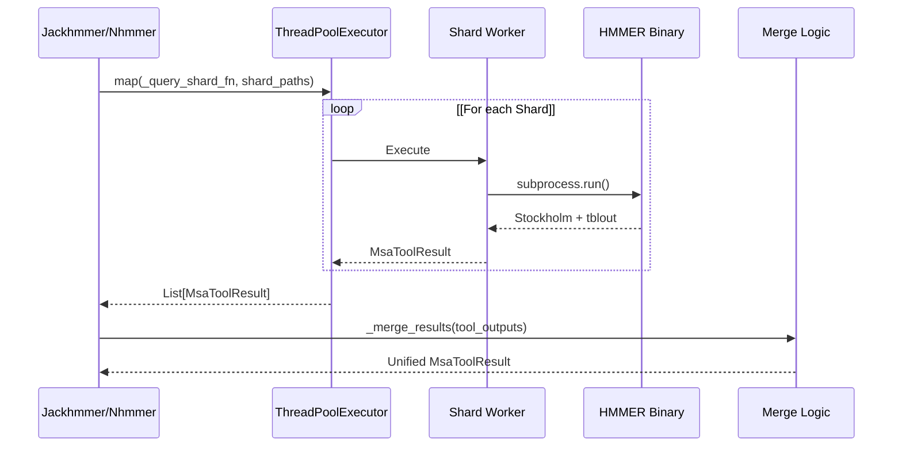

# MSA Tools

> **Relevant source files**
> * [src/alphafold3/data/msa_config.py](https://github.com/google-deepmind/alphafold3/blob/97639fff/src/alphafold3/data/msa_config.py)
> * [src/alphafold3/data/tools/jackhmmer.py](https://github.com/google-deepmind/alphafold3/blob/97639fff/src/alphafold3/data/tools/jackhmmer.py)
> * [src/alphafold3/data/tools/msa_tool.py](https://github.com/google-deepmind/alphafold3/blob/97639fff/src/alphafold3/data/tools/msa_tool.py)
> * [src/alphafold3/data/tools/nhmmer.py](https://github.com/google-deepmind/alphafold3/blob/97639fff/src/alphafold3/data/tools/nhmmer.py)
> * [src/alphafold3/data/tools/shards.py](https://github.com/google-deepmind/alphafold3/blob/97639fff/src/alphafold3/data/tools/shards.py)

## Purpose and Scope

This document describes the Multiple Sequence Alignment (MSA) generation tools used in AlphaFold 3's data pipeline. These tools wrap the HMMER suite binaries (`jackhmmer` and `nhmmer`) to search biological databases and produce MSAs that provide evolutionary information for structure prediction.

The implementation handles the complexity of sharded database support, parallel execution via thread pools, and the subsequent merging of results based on E-values to ensure consistency across distributed search environments.

**Sources:** [src/alphafold3/data/tools/jackhmmer.py L11-L30](https://github.com/google-deepmind/alphafold3/blob/97639fff/src/alphafold3/data/tools/jackhmmer.py#L11-L30)

 [src/alphafold3/data/tools/nhmmer.py L11-L36](https://github.com/google-deepmind/alphafold3/blob/97639fff/src/alphafold3/data/tools/nhmmer.py#L11-L36)

## Overview

AlphaFold 3 provides two primary Python wrappers for MSA generation, both implementing the `MsaTool` protocol defined in [src/alphafold3/data/tools/msa_tool.py L35-L40](https://github.com/google-deepmind/alphafold3/blob/97639fff/src/alphafold3/data/tools/msa_tool.py#L35-L40)

| Tool | Class | Purpose | Primary Databases |
| --- | --- | --- | --- |
| **Jackhmmer** | `Jackhmmer` | Protein sequence alignment | UniRef90, BFD, MGnify |
| **Nhmmer** | `Nhmmer` | Nucleic acid sequence alignment | RNAcentral, NT |

Both tools support **sharded databases** using a specific syntax (`path@N`) which triggers parallel execution across multiple database shards. Results from these parallel searches are merged by E-value to produce a single unified MSA.

### System Architecture: Code Entity Map

The following diagram maps high-level system components to the specific code entities that implement them.

**Sources:** [src/alphafold3/data/tools/msa_tool.py L35-L40](https://github.com/google-deepmind/alphafold3/blob/97639fff/src/alphafold3/data/tools/msa_tool.py#L35-L40)

 [src/alphafold3/data/tools/jackhmmer.py L29-L32](https://github.com/google-deepmind/alphafold3/blob/97639fff/src/alphafold3/data/tools/jackhmmer.py#L29-L32)

 [src/alphafold3/data/tools/nhmmer.py L35-L38](https://github.com/google-deepmind/alphafold3/blob/97639fff/src/alphafold3/data/tools/nhmmer.py#L35-L38)

 [src/alphafold3/data/tools/shards.py L41-L46](https://github.com/google-deepmind/alphafold3/blob/97639fff/src/alphafold3/data/tools/shards.py#L41-L46)

## Jackhmmer: Protein MSA Generation

### Implementation Details

The `Jackhmmer` class wraps the HMMER `jackhmmer` binary. It supports iterative searching, though sharded searches are restricted to a single iteration (`n_iter=1`) to maintain consistency [src/alphafold3/data/tools/jackhmmer.py L93-L94](https://github.com/google-deepmind/alphafold3/blob/97639fff/src/alphafold3/data/tools/jackhmmer.py#L93-L94)

A key optimization is the use of the `--seq_limit` flag. If the binary is detected to support this (via a custom patch), it is used to limit the number of sequences written to disk, reducing peak memory usage [src/alphafold3/data/tools/jackhmmer.py L131-L136](https://github.com/google-deepmind/alphafold3/blob/97639fff/src/alphafold3/data/tools/jackhmmer.py#L131-L136)

### Configuration and Execution

The tool is configured via `JackhmmerConfig` [src/alphafold3/data/msa_config.py L36-L66](https://github.com/google-deepmind/alphafold3/blob/97639fff/src/alphafold3/data/msa_config.py#L36-L66)

 When `query()` is called:

1. It checks for sharded paths using `shards.get_sharded_paths()` [src/alphafold3/data/tools/jackhmmer.py L92](https://github.com/google-deepmind/alphafold3/blob/97639fff/src/alphafold3/data/tools/jackhmmer.py#L92-L92)
2. If sharded, it uses a `ThreadPoolExecutor` to run `_query_db_shard()` in parallel [src/alphafold3/data/tools/jackhmmer.py L163-L164](https://github.com/google-deepmind/alphafold3/blob/97639fff/src/alphafold3/data/tools/jackhmmer.py#L163-L164)
3. If not sharded, it executes a single subprocess via `subprocess_utils.run()` [src/alphafold3/data/tools/jackhmmer.py L252-L261](https://github.com/google-deepmind/alphafold3/blob/97639fff/src/alphafold3/data/tools/jackhmmer.py#L252-L261)

**Sources:** [src/alphafold3/data/tools/jackhmmer.py L32-L137](https://github.com/google-deepmind/alphafold3/blob/97639fff/src/alphafold3/data/tools/jackhmmer.py#L32-L137)

 [src/alphafold3/data/tools/jackhmmer.py L138-L173](https://github.com/google-deepmind/alphafold3/blob/97639fff/src/alphafold3/data/tools/jackhmmer.py#L138-L173)

 [src/alphafold3/data/msa_config.py L36-L66](https://github.com/google-deepmind/alphafold3/blob/97639fff/src/alphafold3/data/msa_config.py#L36-L66)

## Nhmmer: Nucleic Acid MSA Generation

### Post-Processing Pipeline

`Nhmmer` hits often represent local alignments. To produce a full MSA, the wrapper implements a multi-step pipeline:

1. **Search**: Run `nhmmer` to find hits [src/alphafold3/data/tools/nhmmer.py L228-L253](https://github.com/google-deepmind/alphafold3/blob/97639fff/src/alphafold3/data/tools/nhmmer.py#L228-L253)
2. **Build**: Use `hmmbuild` to create a profile from the query [src/alphafold3/data/tools/nhmmer.py L261-L265](https://github.com/google-deepmind/alphafold3/blob/97639fff/src/alphafold3/data/tools/nhmmer.py#L261-L265)
3. **Align**: Use `hmmalign` to align the discovered hits to that profile [src/alphafold3/data/tools/nhmmer.py L267-L273](https://github.com/google-deepmind/alphafold3/blob/97639fff/src/alphafold3/data/tools/nhmmer.py#L267-L273)

For short sequences (length < 50), the tool automatically relaxes the `filter_f3` threshold to `0.02` to improve sensitivity [src/alphafold3/data/tools/nhmmer.py L236-L241](https://github.com/google-deepmind/alphafold3/blob/97639fff/src/alphafold3/data/tools/nhmmer.py#L236-L241)

**Sources:** [src/alphafold3/data/tools/nhmmer.py L32](https://github.com/google-deepmind/alphafold3/blob/97639fff/src/alphafold3/data/tools/nhmmer.py#L32-L32)

 [src/alphafold3/data/tools/nhmmer.py L228-L278](https://github.com/google-deepmind/alphafold3/blob/97639fff/src/alphafold3/data/tools/nhmmer.py#L228-L278)

 [src/alphafold3/data/msa_config.py L69-L98](https://github.com/google-deepmind/alphafold3/blob/97639fff/src/alphafold3/data/msa_config.py#L69-L98)

## Sharded Database Support

AlphaFold 3 implements a robust sharding system in `shards.py`. A path like `/db/file@20` is expanded into 20 shards with the pattern `/db/file-00000-of-00020` [src/alphafold3/data/tools/shards.py L11-L22](https://github.com/google-deepmind/alphafold3/blob/97639fff/src/alphafold3/data/tools/shards.py#L11-L22)

### Parallel Data Flow

### Result Merging Logic

Merging is critical because E-values are calculated per-shard. To ensure correctness:

1. **Z-value scaling**: Users must provide a `z_value` representing the *total* database size so that E-values are comparable across shards [src/alphafold3/data/tools/jackhmmer.py L95-L99](https://github.com/google-deepmind/alphafold3/blob/97639fff/src/alphafold3/data/tools/jackhmmer.py#L95-L99)  [src/alphafold3/data/tools/nhmmer.py L97-L101](https://github.com/google-deepmind/alphafold3/blob/97639fff/src/alphafold3/data/tools/nhmmer.py#L97-L101)
2. **Tabular Parsing**: The `tblout` files are parsed to extract E-values for every hit [src/alphafold3/data/tools/jackhmmer.py L280-L285](https://github.com/google-deepmind/alphafold3/blob/97639fff/src/alphafold3/data/tools/jackhmmer.py#L280-L285)
3. **Heap Merge**: Sequences are merged using `heapq.merge`, using the E-value as the primary sort key [src/alphafold3/data/tools/jackhmmer.py L317-L321](https://github.com/google-deepmind/alphafold3/blob/97639fff/src/alphafold3/data/tools/jackhmmer.py#L317-L321)
4. **Deduplication**: While HMMER deduplicates within a shard, the merge logic ensures the query sequence is only included once in the final MSA [src/alphafold3/data/tools/jackhmmer.py L310-L312](https://github.com/google-deepmind/alphafold3/blob/97639fff/src/alphafold3/data/tools/jackhmmer.py#L310-L312)

**Sources:** [src/alphafold3/data/tools/shards.py L77-L94](https://github.com/google-deepmind/alphafold3/blob/97639fff/src/alphafold3/data/tools/shards.py#L77-L94)

 [src/alphafold3/data/tools/jackhmmer.py L276-L334](https://github.com/google-deepmind/alphafold3/blob/97639fff/src/alphafold3/data/tools/jackhmmer.py#L276-L334)

 [src/alphafold3/data/tools/nhmmer.py L295-L360](https://github.com/google-deepmind/alphafold3/blob/97639fff/src/alphafold3/data/tools/nhmmer.py#L295-L360)

## Key Classes and Functions

| Entity | Location | Role |
| --- | --- | --- |
| `MsaToolResult` | [src/alphafold3/data/tools/msa_tool.py L18-L32](https://github.com/google-deepmind/alphafold3/blob/97639fff/src/alphafold3/data/tools/msa_tool.py#L18-L32) | Dataclass holding `a3m`, `tblout`, and metadata. |
| `get_sharded_paths` | [src/alphafold3/data/tools/shards.py L77-L94](https://github.com/google-deepmind/alphafold3/blob/97639fff/src/alphafold3/data/tools/shards.py#L77-L94) | Resolves `@N` or `@*` syntax into concrete file lists. |
| `_query_db_shard` | [src/alphafold3/data/tools/jackhmmer.py L189-L209](https://github.com/google-deepmind/alphafold3/blob/97639fff/src/alphafold3/data/tools/jackhmmer.py#L189-L209) | Executes the binary against a single shard. |
| `_merge_jackhmmer_results` | [src/alphafold3/data/tools/jackhmmer.py L276-L334](https://github.com/google-deepmind/alphafold3/blob/97639fff/src/alphafold3/data/tools/jackhmmer.py#L276-L334) | Combines sharded protein results into a single A3M string. |
| `_merge_nhmmer_results` | [src/alphafold3/data/tools/nhmmer.py L295-L360](https://github.com/google-deepmind/alphafold3/blob/97639fff/src/alphafold3/data/tools/nhmmer.py#L295-L360) | Combines sharded nucleic results using unique hit IDs. |
| `DatabaseConfig` | [src/alphafold3/data/msa_config.py L28-L33](https://github.com/google-deepmind/alphafold3/blob/97639fff/src/alphafold3/data/msa_config.py#L28-L33) | Container for database name and path. |
| `JackhmmerConfig` | [src/alphafold3/data/msa_config.py L36-L66](https://github.com/google-deepmind/alphafold3/blob/97639fff/src/alphafold3/data/msa_config.py#L36-L66) | Configuration parameters for `Jackhmmer` execution. |
| `NhmmerConfig` | [src/alphafold3/data/msa_config.py L69-L98](https://github.com/google-deepmind/alphafold3/blob/97639fff/src/alphafold3/data/msa_config.py#L69-L98) | Configuration parameters for `Nhmmer` execution. |

**Sources:** [src/alphafold3/data/tools/msa_tool.py L18-L32](https://github.com/google-deepmind/alphafold3/blob/97639fff/src/alphafold3/data/tools/msa_tool.py#L18-L32)

 [src/alphafold3/data/tools/shards.py L77-L94](https://github.com/google-deepmind/alphafold3/blob/97639fff/src/alphafold3/data/tools/shards.py#L77-L94)

 [src/alphafold3/data/tools/jackhmmer.py L189-L334](https://github.com/google-deepmind/alphafold3/blob/97639fff/src/alphafold3/data/tools/jackhmmer.py#L189-L334)

 [src/alphafold3/data/tools/nhmmer.py L295-L360](https://github.com/google-deepmind/alphafold3/blob/97639fff/src/alphafold3/data/tools/nhmmer.py#L295-L360)

 [src/alphafold3/data/msa_config.py L28-L98](https://github.com/google-deepmind/alphafold3/blob/97639fff/src/alphafold3/data/msa_config.py#L28-L98)