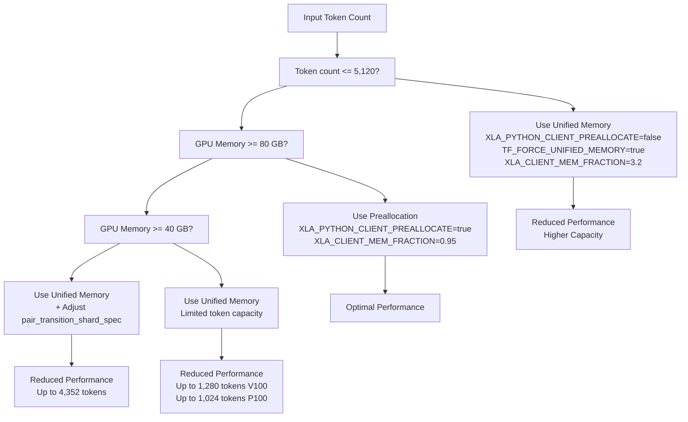
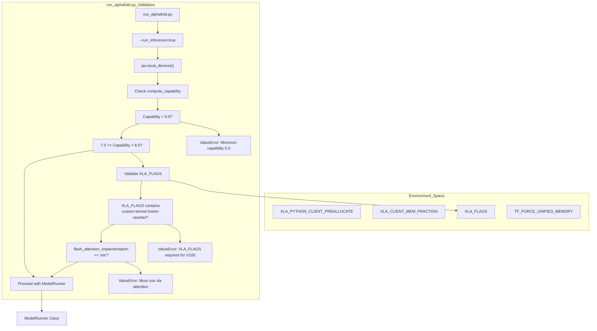
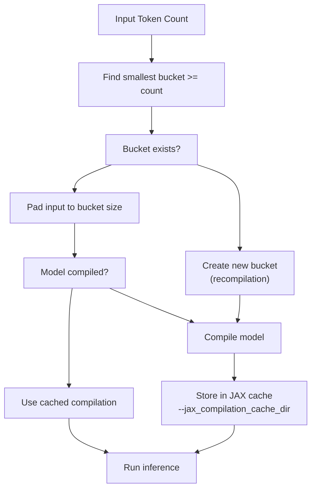

# Memory Management

> **Relevant source files**
> * [docker/Dockerfile](https://github.com/google-deepmind/alphafold3/blob/97639fff/docker/Dockerfile)
> * [docker/jackhmmer_seq_limit.patch](https://github.com/google-deepmind/alphafold3/blob/97639fff/docker/jackhmmer_seq_limit.patch)
> * [docs/known_issues.md](https://github.com/google-deepmind/alphafold3/blob/97639fff/docs/known_issues.md?plain=1)
> * [docs/performance.md](https://github.com/google-deepmind/alphafold3/blob/97639fff/docs/performance.md?plain=1)
> * [src/alphafold3/data/tools/subprocess_utils.py](https://github.com/google-deepmind/alphafold3/blob/97639fff/src/alphafold3/data/tools/subprocess_utils.py)

## Purpose and Scope

This document explains memory management strategies for running AlphaFold 3 model inference on GPUs. It covers memory preallocation, unified memory configurations, XLA memory settings, and hardware-specific optimization strategies for different GPU sizes. For general performance optimization including compilation and data pipeline parallelization, see [8. Performance Optimization](https://github.com/google-deepmind/alphafold3/blob/97639fff/8. Performance Optimization)

 For hardware requirements and compute capabilities, see [8.1. Hardware Configuration](https://github.com/google-deepmind/alphafold3/blob/97639fff/8.1. Hardware Configuration)

## Memory Allocation Strategies

AlphaFold 3 supports two primary memory allocation strategies for GPU execution: preallocation and unified memory. The choice between these strategies depends on the input size (measured in tokens) and available GPU memory.

### Preallocation Strategy

The preallocation strategy reserves a fixed fraction of GPU memory at startup, preventing fragmentation and ensuring consistent performance. This is the default configuration for standard workloads.

**Configuration:**

```
XLA_PYTHON_CLIENT_PREALLOCATE=trueXLA_CLIENT_MEM_FRACTION=0.95
```

The `XLA_CLIENT_MEM_FRACTION` value of `0.95` means AlphaFold 3 will preallocate 95% of available GPU memory. This configuration enables folding inputs up to 5,120 tokens on an A100 (80 GB) or H100 (80 GB) [docker/Dockerfile L84-L86](https://github.com/google-deepmind/alphafold3/blob/97639fff/docker/Dockerfile#L84-L86)

**Characteristics:**

* **Performance:** Optimal performance with no memory access overhead.
* **Capacity:** Limited to preallocated memory size.
* **Use Case:** Standard inputs (≤ 5,120 tokens) on 80 GB GPUs.
* **OOM Behavior:** Will fail with out-of-memory error if input exceeds capacity.

Sources: [docs/performance.md L318-L326](https://github.com/google-deepmind/alphafold3/blob/97639fff/docs/performance.md?plain=1#L318-L326)

 [docker/Dockerfile L85-L86](https://github.com/google-deepmind/alphafold3/blob/97639fff/docker/Dockerfile#L85-L86)

### Unified Memory Strategy

The unified memory strategy allows GPU memory to spill to host (CPU) RAM when GPU memory is exhausted. This enables processing larger inputs or running on GPUs with less memory at the cost of reduced performance.

**Configuration:**

```
XLA_PYTHON_CLIENT_PREALLOCATE=falseTF_FORCE_UNIFIED_MEMORY=trueXLA_CLIENT_MEM_FRACTION=3.2
```

The `XLA_CLIENT_MEM_FRACTION` value of `3.2` allows the system to use up to 3.2× the physical GPU memory by spilling to host RAM [docs/performance.md L332-L336](https://github.com/google-deepmind/alphafold3/blob/97639fff/docs/performance.md?plain=1#L332-L336)

**Characteristics:**

* **Performance:** Slower than preallocation due to host memory access.
* **Capacity:** Can handle inputs larger than GPU memory.
* **Use Case:** Large inputs (> 5,120 tokens) or smaller GPUs (< 80 GB).
* **OOM Behavior:** Requires sufficient host RAM; will use swap if needed.

Sources: [docs/performance.md L328-L345](https://github.com/google-deepmind/alphafold3/blob/97639fff/docs/performance.md?plain=1#L328-L345)

### Memory Strategy Selection



Sources: [docs/performance.md L206-L248](https://github.com/google-deepmind/alphafold3/blob/97639fff/docs/performance.md?plain=1#L206-L248)

 [docs/performance.md L318-L345](https://github.com/google-deepmind/alphafold3/blob/97639fff/docs/performance.md?plain=1#L318-L345)

## XLA Memory Configuration

### Core Environment Variables

AlphaFold 3 uses several XLA-specific environment variables to control memory allocation and GPU behavior:

| Environment Variable | Purpose | Default Value | Usage |
| --- | --- | --- | --- |
| `XLA_PYTHON_CLIENT_PREALLOCATE` | Enable/disable memory preallocation | `true` | Set to `false` for unified memory [docker/Dockerfile L85](https://github.com/google-deepmind/alphafold3/blob/97639fff/docker/Dockerfile#L85-L85) |
| `XLA_CLIENT_MEM_FRACTION` | Fraction of GPU memory to use | `0.95` | Higher values allow more memory usage [docker/Dockerfile L86](https://github.com/google-deepmind/alphafold3/blob/97639fff/docker/Dockerfile#L86-L86) |
| `TF_FORCE_UNIFIED_MEMORY` | Enable unified memory | Not set | Set to `true` for unified memory [docs/performance.md L334](https://github.com/google-deepmind/alphafold3/blob/97639fff/docs/performance.md?plain=1#L334-L334) |
| `XLA_FLAGS` | Compiler optimization flags | See below | Additional flags for specific GPUs [docker/Dockerfile L83](https://github.com/google-deepmind/alphafold3/blob/97639fff/docker/Dockerfile#L83-L83) |

Sources: [docs/performance.md L296-L345](https://github.com/google-deepmind/alphafold3/blob/97639fff/docs/performance.md?plain=1#L296-L345)

 [docker/Dockerfile L83-L86](https://github.com/google-deepmind/alphafold3/blob/97639fff/docker/Dockerfile#L83-L86)

### Required XLA Flags

#### Standard Configuration

The following XLA flag is required to work around a known XLA compilation time issue:

```
XLA_FLAGS="--xla_gpu_enable_triton_gemm=false"
```

This flag is set by default in the provided `Dockerfile` [docker/Dockerfile L83](https://github.com/google-deepmind/alphafold3/blob/97639fff/docker/Dockerfile#L83-L83)

 and must be present for all GPU configurations [docs/performance.md L296-L304](https://github.com/google-deepmind/alphafold3/blob/97639fff/docs/performance.md?plain=1#L296-L304)

#### CUDA Capability 7.x GPUs

GPUs with CUDA Capability 7.x (e.g., NVIDIA V100) require an additional XLA flag to avoid numerical issues:

```
XLA_FLAGS="--xla_disable_hlo_passes=custom-kernel-fusion-rewriter"
```

This flag disables the custom kernel fusion rewriter, which produces incorrect results on these GPUs [docs/known_issues.md L5-L8](https://github.com/google-deepmind/alphafold3/blob/97639fff/docs/known_issues.md?plain=1#L5-L8)

 When using this flag, you must also set `--flash_attention_implementation=xla` in `run_alphafold.py` [docs/performance.md L312-L315](https://github.com/google-deepmind/alphafold3/blob/97639fff/docs/performance.md?plain=1#L312-L315)

Sources: [docs/performance.md L306-L315](https://github.com/google-deepmind/alphafold3/blob/97639fff/docs/performance.md?plain=1#L306-L315)

 [docs/known_issues.md L3-L8](https://github.com/google-deepmind/alphafold3/blob/97639fff/docs/known_issues.md?plain=1#L3-L8)

 [docker/Dockerfile L77-L81](https://github.com/google-deepmind/alphafold3/blob/97639fff/docker/Dockerfile#L77-L81)

### XLA Configuration and Hardware Validation

The following diagram illustrates how the system validates hardware compatibility and applies memory-related flags during initialization.



Sources: [docs/known_issues.md L3-L8](https://github.com/google-deepmind/alphafold3/blob/97639fff/docs/known_issues.md?plain=1#L3-L8)

 [docker/Dockerfile L83-L86](https://github.com/google-deepmind/alphafold3/blob/97639fff/docker/Dockerfile#L83-L86)

 [docs/performance.md L306-L315](https://github.com/google-deepmind/alphafold3/blob/97639fff/docs/performance.md?plain=1#L306-L315)

## Hardware-Specific Configurations

### NVIDIA A100 (80 GB) - Default Configuration

The default configuration is optimized for A100 (80 GB) GPUs [docs/performance.md L186-L188](https://github.com/google-deepmind/alphafold3/blob/97639fff/docs/performance.md?plain=1#L186-L188)

**Memory Settings:**

```
XLA_PYTHON_CLIENT_PREALLOCATE=trueXLA_CLIENT_MEM_FRACTION=0.95
```

**Capacity:**

* Maximum tokens: 5,120 (with default preallocation) [docs/performance.md L204](https://github.com/google-deepmind/alphafold3/blob/97639fff/docs/performance.md?plain=1#L204-L204)
* Can handle larger inputs with unified memory.

Sources: [docs/performance.md L186-L205](https://github.com/google-deepmind/alphafold3/blob/97639fff/docs/performance.md?plain=1#L186-L205)

 [docker/Dockerfile L83-L86](https://github.com/google-deepmind/alphafold3/blob/97639fff/docker/Dockerfile#L83-L86)

### NVIDIA A100 (40 GB)

Running on A100 (40 GB) requires unified memory and model configuration adjustments [docs/performance.md L207-L209](https://github.com/google-deepmind/alphafold3/blob/97639fff/docs/performance.md?plain=1#L207-L209)

**Memory Settings:**

```
XLA_PYTHON_CLIENT_PREALLOCATE=falseTF_FORCE_UNIFIED_MEMORY=trueXLA_CLIENT_MEM_FRACTION=3.2
```

**Model Configuration:**
Adjust `pair_transition_shard_spec` in the model configuration to reduce memory usage [docs/performance.md L221-L231](https://github.com/google-deepmind/alphafold3/blob/97639fff/docs/performance.md?plain=1#L221-L231)

**Capacity:**

* Maximum tokens: 4,352 (with unified memory and sharding) [docs/performance.md L234](https://github.com/google-deepmind/alphafold3/blob/97639fff/docs/performance.md?plain=1#L234-L234)

Sources: [docs/performance.md L207-L234](https://github.com/google-deepmind/alphafold3/blob/97639fff/docs/performance.md?plain=1#L207-L234)

### NVIDIA H100 (80 GB)

H100 (80 GB) uses the same configuration as A100 (80 GB) with improved performance [docs/performance.md L186-L204](https://github.com/google-deepmind/alphafold3/blob/97639fff/docs/performance.md?plain=1#L186-L204)

**Performance Comparison:**

| Tokens | A100 80 GB (seconds) | H100 80 GB (seconds) | Speedup |
| --- | --- | --- | --- |
| 1024 | 62 | 34 | 1.8× |
| 2048 | 275 | 144 | 1.9× |
| 5120 | 2547 | 1416 | 1.8× |

Sources: [docs/performance.md L186-L204](https://github.com/google-deepmind/alphafold3/blob/97639fff/docs/performance.md?plain=1#L186-L204)

### NVIDIA V100

V100 GPUs (CUDA Capability 7.x) require special XLA flags and have limited capacity [docs/known_issues.md L5-L8](https://github.com/google-deepmind/alphafold3/blob/97639fff/docs/known_issues.md?plain=1#L5-L8)

**XLA Flags:**

```
XLA_FLAGS="--xla_disable_hlo_passes=custom-kernel-fusion-rewriter"
```

**Flash Attention:**

* Must use `--flash_attention_implementation=xla` [docs/performance.md L312-L315](https://github.com/google-deepmind/alphafold3/blob/97639fff/docs/performance.md?plain=1#L312-L315)

**Capacity:**

* Maximum tokens: 1,280 (with unified memory) [docs/performance.md L243](https://github.com/google-deepmind/alphafold3/blob/97639fff/docs/performance.md?plain=1#L243-L243)

Sources: [docs/performance.md L236-L243](https://github.com/google-deepmind/alphafold3/blob/97639fff/docs/performance.md?plain=1#L236-L243)

 [docs/known_issues.md L3-L8](https://github.com/google-deepmind/alphafold3/blob/97639fff/docs/known_issues.md?plain=1#L3-L8)

 [docker/Dockerfile L79-L81](https://github.com/google-deepmind/alphafold3/blob/97639fff/docker/Dockerfile#L79-L81)

## Compilation Buckets and Memory

### Bucket Mechanism

AlphaFold 3 uses compilation buckets to avoid recompiling the model for every input size. When featurizing an input, the system determines the smallest bucket that accommodates the input and pads it accordingly [docs/performance.md L259-L265](https://github.com/google-deepmind/alphafold3/blob/97639fff/docs/performance.md?plain=1#L259-L265)

**Bucket Selection Process:**



Sources: [docs/performance.md L259-L292](https://github.com/google-deepmind/alphafold3/blob/97639fff/docs/performance.md?plain=1#L259-L292)

## Troubleshooting Memory Issues

### Out-of-Memory (OOM) Errors

| Scenario | Solution |
| --- | --- |
| Input ≤ 5,120 tokens on A100 80 GB | Ensure `XLA_PYTHON_CLIENT_PREALLOCATE=true` [docker/Dockerfile L85](https://github.com/google-deepmind/alphafold3/blob/97639fff/docker/Dockerfile#L85-L85) |
| Input > 5,120 tokens | Enable unified memory: `XLA_PYTHON_CLIENT_PREALLOCATE=false` [docs/performance.md L332](https://github.com/google-deepmind/alphafold3/blob/97639fff/docs/performance.md?plain=1#L332-L332) |
| Using A100 40 GB | Enable unified memory + adjust `pair_transition_shard_spec` [docs/performance.md L221](https://github.com/google-deepmind/alphafold3/blob/97639fff/docs/performance.md?plain=1#L221-L221) |
| Using V100 | Set `XLA_FLAGS` to disable `custom-kernel-fusion-rewriter` [docs/known_issues.md L8](https://github.com/google-deepmind/alphafold3/blob/97639fff/docs/known_issues.md?plain=1#L8-L8) |

### Performance Degradation

**Common causes:**

1. **Unified memory enabled unnecessarily:** Check if input fits in GPU memory with preallocation [docs/performance.md L323](https://github.com/google-deepmind/alphafold3/blob/97639fff/docs/performance.md?plain=1#L323-L323)
2. **Excessive padding:** Review bucket configuration to reduce padding overhead [docs/performance.md L275](https://github.com/google-deepmind/alphafold3/blob/97639fff/docs/performance.md?plain=1#L275-L275)
3. **Incorrect XLA flags:** Ensure Triton GEMM is disabled (`--xla_gpu_enable_triton_gemm=false`) [docker/Dockerfile L83](https://github.com/google-deepmind/alphafold3/blob/97639fff/docker/Dockerfile#L83-L83)

Sources: [docs/performance.md L296-L345](https://github.com/google-deepmind/alphafold3/blob/97639fff/docs/performance.md?plain=1#L296-L345)

 [docs/known_issues.md L3-L8](https://github.com/google-deepmind/alphafold3/blob/97639fff/docs/known_issues.md?plain=1#L3-L8)

 [docker/Dockerfile L83-L86](https://github.com/google-deepmind/alphafold3/blob/97639fff/docker/Dockerfile#L83-L86)