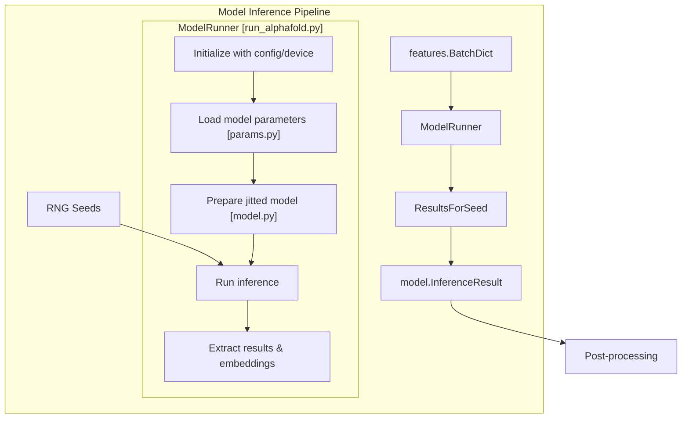
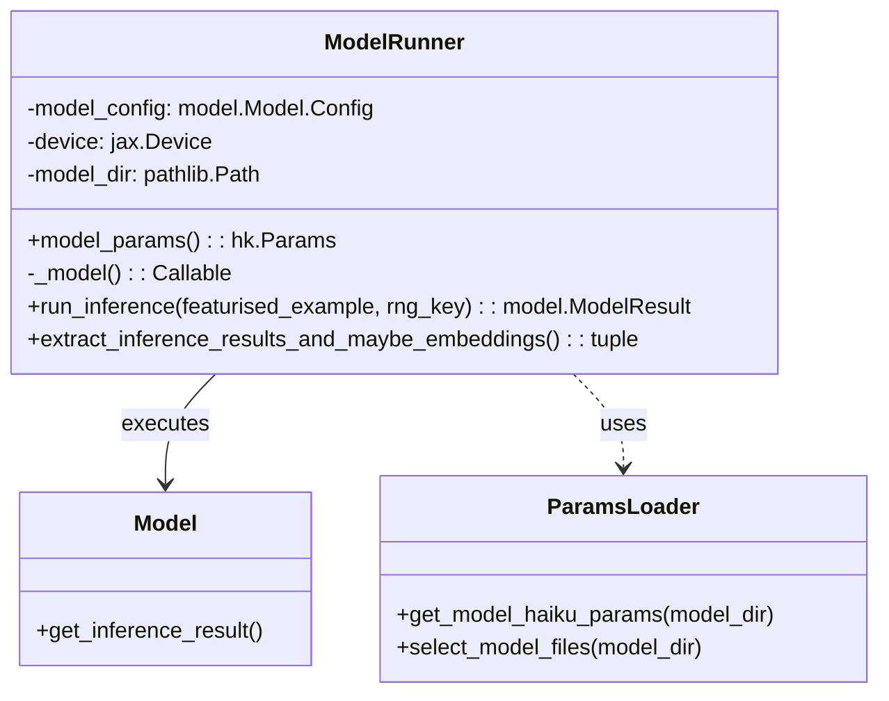
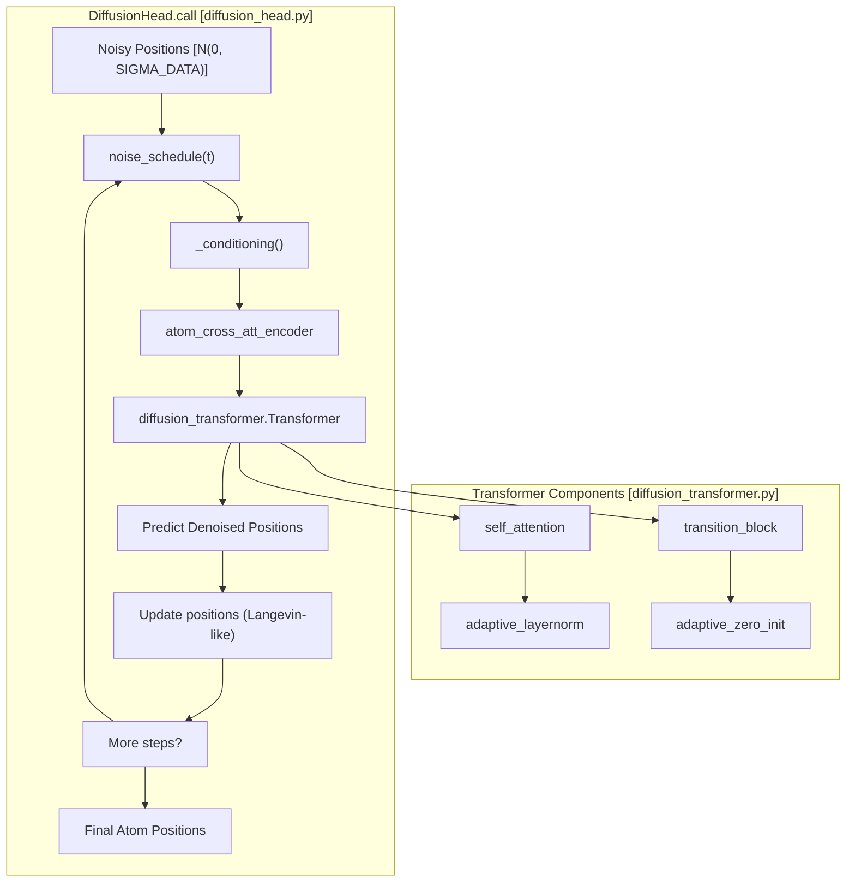
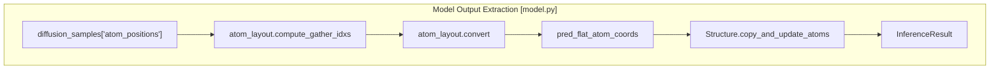

# Model Inference

> **Relevant source files**
> * [run_alphafold.py](https://github.com/google-deepmind/alphafold3/blob/97639fff/run_alphafold.py)
> * [src/alphafold3/model/feat_batch.py](https://github.com/google-deepmind/alphafold3/blob/97639fff/src/alphafold3/model/feat_batch.py)
> * [src/alphafold3/model/model.py](https://github.com/google-deepmind/alphafold3/blob/97639fff/src/alphafold3/model/model.py)
> * [src/alphafold3/model/network/atom_cross_attention.py](https://github.com/google-deepmind/alphafold3/blob/97639fff/src/alphafold3/model/network/atom_cross_attention.py)
> * [src/alphafold3/model/network/confidence_head.py](https://github.com/google-deepmind/alphafold3/blob/97639fff/src/alphafold3/model/network/confidence_head.py)
> * [src/alphafold3/model/network/diffusion_head.py](https://github.com/google-deepmind/alphafold3/blob/97639fff/src/alphafold3/model/network/diffusion_head.py)
> * [src/alphafold3/model/network/diffusion_transformer.py](https://github.com/google-deepmind/alphafold3/blob/97639fff/src/alphafold3/model/network/diffusion_transformer.py)
> * [src/alphafold3/model/network/distogram_head.py](https://github.com/google-deepmind/alphafold3/blob/97639fff/src/alphafold3/model/network/distogram_head.py)
> * [src/alphafold3/model/network/featurization.py](https://github.com/google-deepmind/alphafold3/blob/97639fff/src/alphafold3/model/network/featurization.py)
> * [src/alphafold3/model/network/modules.py](https://github.com/google-deepmind/alphafold3/blob/97639fff/src/alphafold3/model/network/modules.py)
> * [src/alphafold3/model/network/template_modules.py](https://github.com/google-deepmind/alphafold3/blob/97639fff/src/alphafold3/model/network/template_modules.py)
> * [src/alphafold3/model/params.py](https://github.com/google-deepmind/alphafold3/blob/97639fff/src/alphafold3/model/params.py)
> * [src/alphafold3/test_data/model_config.json](https://github.com/google-deepmind/alphafold3/blob/97639fff/src/alphafold3/test_data/model_config.json)

## Purpose and Scope

This document details the model inference component of AlphaFold 3, which is responsible for executing the neural network architecture to predict 3D structures based on the featurized input data. Model inference occurs after the input processing, data pipeline, and featurization stages, and produces structure predictions that are then post-processed into the final output.

Sources: [run_alphafold.py L11-L20](https://github.com/google-deepmind/alphafold3/blob/97639fff/run_alphafold.py#L11-L20)

 [src/alphafold3/model/model.py L11-L12](https://github.com/google-deepmind/alphafold3/blob/97639fff/src/alphafold3/model/model.py#L11-L12)

## Inference Pipeline Overview

AlphaFold 3's inference process involves several key components that work together to transform featurized biological data into a predicted 3D structure with confidence metrics.

Title: Model Inference Pipeline

The inference pipeline takes featurized inputs and processes them through the AlphaFold 3 model to generate structure predictions. A single input can generate multiple output structures through multiple random seeds and multiple diffusion samples per seed.

Sources: [run_alphafold.py L399-L463](https://github.com/google-deepmind/alphafold3/blob/97639fff/run_alphafold.py#L399-L463)

 [src/alphafold3/model/model.py L45-L68](https://github.com/google-deepmind/alphafold3/blob/97639fff/src/alphafold3/model/model.py#L45-L68)

## Core Components

### ModelRunner

The `ModelRunner` class is the central component that manages model inference. It handles parameter loading via `params.py`, JIT compilation via JAX, and execution on the specified device.

Title: ModelRunner Code Associations

The `ModelRunner` caches model parameters using `get_model_haiku_params` from `src/alphafold3/model/params.py` and maintains the compiled forward pass function. The parameter loading system supports reading from sharded, compressed (`.zst`), or standard binary files.

Sources: [run_alphafold.py L304-L378](https://github.com/google-deepmind/alphafold3/blob/97639fff/run_alphafold.py#L304-L378)

 [src/alphafold3/model/params.py L176-L212](https://github.com/google-deepmind/alphafold3/blob/97639fff/src/alphafold3/model/params.py#L176-L212)

### Model Configuration

The model configuration, defined in `src/alphafold3/model/model_config.py`, controls the model's behavior during inference, including the number of diffusion steps and recycling iterations.

Key configuration parameters include:

* `num_recycles`: Number of iterations through the trunk.
* `num_samples`: Number of diffusion samples generated per seed [src/alphafold3/model/network/diffusion_head.py L98](https://github.com/google-deepmind/alphafold3/blob/97639fff/src/alphafold3/model/network/diffusion_head.py#L98-L98)
* `steps`: Number of denoising steps in the diffusion head [src/alphafold3/model/network/diffusion_head.py L117](https://github.com/google-deepmind/alphafold3/blob/97639fff/src/alphafold3/model/network/diffusion_head.py#L117-L117)

Sources: [run_alphafold.py L286-L301](https://github.com/google-deepmind/alphafold3/blob/97639fff/run_alphafold.py#L286-L301)

 [src/alphafold3/model/network/diffusion_head.py L104-L122](https://github.com/google-deepmind/alphafold3/blob/97639fff/src/alphafold3/model/network/diffusion_head.py#L104-L122)

 [src/alphafold3/test_data/model_config.json L203-L228](https://github.com/google-deepmind/alphafold3/blob/97639fff/src/alphafold3/test_data/model_config.json#L203-L228)

## Diffusion Sampling Process

The diffusion process is managed by the `DiffusionHead` in `src/alphafold3/model/network/diffusion_head.py`. It implements a denoising process that starts from noise and iteratively refines atom positions.

Title: Diffusion Sampling and Transformer Interaction

The diffusion process uses a noise schedule defined by `noise_schedule(t)` with parameters `smin=0.0004` and `smax=160.0`, and a reference scale `SIGMA_DATA = 16.0`.

Sources: [src/alphafold3/model/network/diffusion_head.py L30-L31](https://github.com/google-deepmind/alphafold3/blob/97639fff/src/alphafold3/model/network/diffusion_head.py#L30-L31)

 [src/alphafold3/model/network/diffusion_head.py L79-L83](https://github.com/google-deepmind/alphafold3/blob/97639fff/src/alphafold3/model/network/diffusion_head.py#L79-L83)

 [src/alphafold3/model/network/diffusion_head.py L202-L230](https://github.com/google-deepmind/alphafold3/blob/97639fff/src/alphafold3/model/network/diffusion_head.py#L202-L230)

 [src/alphafold3/model/network/diffusion_transformer.py L23-L111](https://github.com/google-deepmind/alphafold3/blob/97639fff/src/alphafold3/model/network/diffusion_transformer.py#L23-L111)

## JAX Compilation and Execution

AlphaFold 3 leverages JAX for high-performance execution. The model is wrapped in a `haiku.transform` and then `jax.jit` compiled.

### Sharded Execution

To manage memory on large structures, AlphaFold 3 uses `sharded_map` and `sharded_apply` from `src/alphafold3/model/components/mapping.py`. For example, `GridSelfAttention` uses `get_shard_size` to determine how to partition residues during attention calculation.

Sources: [src/alphafold3/model/components/mapping.py L55-L84](https://github.com/google-deepmind/alphafold3/blob/97639fff/src/alphafold3/model/components/mapping.py#L55-L84)

 [src/alphafold3/model/network/modules.py L27-L38](https://github.com/google-deepmind/alphafold3/blob/97639fff/src/alphafold3/model/network/modules.py#L27-L38)

 [src/alphafold3/model/network/modules.py L223-L225](https://github.com/google-deepmind/alphafold3/blob/97639fff/src/alphafold3/model/network/modules.py#L223-L225)

### Precision and Context

The model utilizes `bfloat16` precision for most operations to improve performance and reduce memory usage, controlled by `utils.bfloat16_context()`. This is particularly critical in the `DiffusionHead` and `create_target_feat_embedding`.

Sources: [src/alphafold3/model/model.py L152-L156](https://github.com/google-deepmind/alphafold3/blob/97639fff/src/alphafold3/model/model.py#L152-L156)

 [src/alphafold3/model/network/diffusion_head.py L212-L213](https://github.com/google-deepmind/alphafold3/blob/97639fff/src/alphafold3/model/network/diffusion_head.py#L212-L213)

## Results and Post-processing

After the diffusion process completes, the raw tensor outputs are converted into a `structure.Structure` object via `get_predicted_structure`.

Title: Structure Construction Data Flow

The conversion process involves:

1. Rearranging coordinates from the model-specific layout to a flat output layout using `atom_layout.compute_gather_idxs`.
2. Mapping predicted confidence scores (pLDDT) to atom B-factors using `atom_layout.convert`.
3. Constructing the final structure representation by updating the `empty_output_struc` provided in the `Batch`.

Sources: [src/alphafold3/model/model.py L70-L140](https://github.com/google-deepmind/alphafold3/blob/97639fff/src/alphafold3/model/model.py#L70-L140)

 [src/alphafold3/model/feat_batch.py L32-L33](https://github.com/google-deepmind/alphafold3/blob/97639fff/src/alphafold3/model/feat_batch.py#L32-L33)

## Confidence Metrics Generation

During inference, several confidence heads produce scores alongside the structure:

* **pLDDT**: Per-atom local distance difference test score, extracted from the model result and converted to flat layout.
* **pTM/ipTM**: Predicted Template Modeling scores, computed from PAE (Predicted Aligned Error) in `_compute_ptm`.
* **Distogram**: Predicted distance distributions from `DistogramHead`, which calculates contact probabilities using a threshold of 8.0Å.

Sources: [src/alphafold3/model/model.py L95-L103](https://github.com/google-deepmind/alphafold3/blob/97639fff/src/alphafold3/model/model.py#L95-L103)

 [src/alphafold3/model/model.py L174-L193](https://github.com/google-deepmind/alphafold3/blob/97639fff/src/alphafold3/model/model.py#L174-L193)

 [src/alphafold3/model/network/distogram_head.py L24-L25](https://github.com/google-deepmind/alphafold3/blob/97639fff/src/alphafold3/model/network/distogram_head.py#L24-L25)

 [src/alphafold3/model/network/distogram_head.py L46-L83](https://github.com/google-deepmind/alphafold3/blob/97639fff/src/alphafold3/model/network/distogram_head.py#L46-L83)