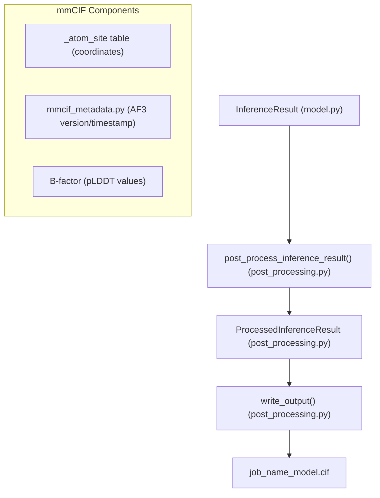
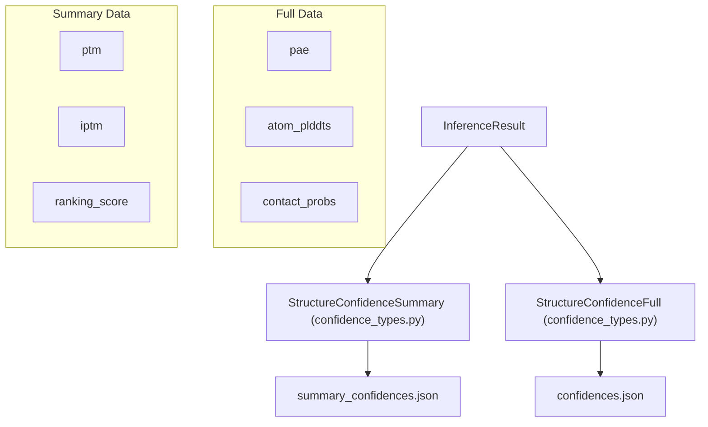
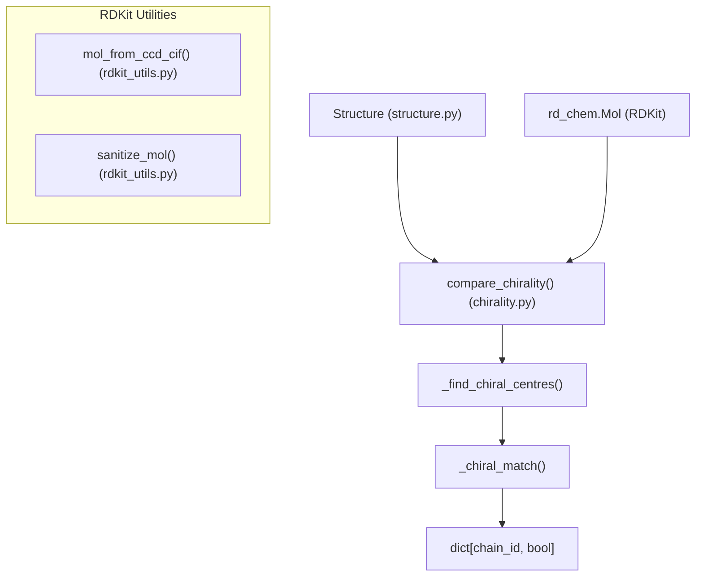

# Output Format

> **Relevant source files**
> * [docs/output.md](https://github.com/google-deepmind/alphafold3/blob/97639fff/docs/output.md?plain=1)
> * [src/alphafold3/data/tools/rdkit_utils.py](https://github.com/google-deepmind/alphafold3/blob/97639fff/src/alphafold3/data/tools/rdkit_utils.py)
> * [src/alphafold3/model/post_processing.py](https://github.com/google-deepmind/alphafold3/blob/97639fff/src/alphafold3/model/post_processing.py)
> * [src/alphafold3/model/scoring/chirality.py](https://github.com/google-deepmind/alphafold3/blob/97639fff/src/alphafold3/model/scoring/chirality.py)
> * [src/alphafold3/structure/mmcif.py](https://github.com/google-deepmind/alphafold3/blob/97639fff/src/alphafold3/structure/mmcif.py)
> * [src/alphafold3/test_data/alphafold_run_outputs/run_alphafold_test_output_bucket_1024.pkl](https://github.com/google-deepmind/alphafold3/blob/97639fff/src/alphafold3/test_data/alphafold_run_outputs/run_alphafold_test_output_bucket_1024.pkl)
> * [src/alphafold3/test_data/alphafold_run_outputs/run_alphafold_test_output_bucket_default.pkl](https://github.com/google-deepmind/alphafold3/blob/97639fff/src/alphafold3/test_data/alphafold_run_outputs/run_alphafold_test_output_bucket_default.pkl)

This page describes the outputs generated by AlphaFold 3, including their structure, format, and interpretation. It covers the directory structure, file formats, and confidence metrics provided in the output. For information about the input format, see [Input Format](/google-deepmind/alphafold3/3.1-input-format).

## Output Directory Structure

AlphaFold 3 organizes its outputs in a directory structure that makes it easy to access both the top-ranking prediction and the individual samples generated during prediction.

### Output Organization Diagram

```mermaid
flowchart TD

root["Output Directory<br>(Named after job)"]
terms["TERMS_OF_USE.md"]
topModelCif["job_name_model.cif<br>(Top-ranked structure)"]
topConfFull["job_name_confidences.json<br>(Full confidence data)"]
topConfSummary["job_name_summary_confidences.json<br>(Summary confidence metrics)"]
dataJson["job_name_data.json<br>(Processed input data)"]
rankingScores["ranking_scores.csv<br>(All samples' ranking scores)"]
sample1["seed-X_sample-0/<br>- model.cif<br>- confidences.json<br>- summary_confidences.json"]
sample2["seed-X_sample-1/<br>- model.cif<br>- confidences.json<br>- summary_confidences.json"]
sampleN["seed-X_sample-N/<br>- model.cif<br>- confidences.json<br>- summary_confidences.json"]
embeddings["seed-X_embeddings/<br>embeddings.npz<br>(Optional)"]
distogram["seed-X_distogram/<br>distogram.npz<br>(Optional)"]

root --> terms
root --> topModelCif
root --> topConfFull
root --> topConfSummary
root --> dataJson
root --> rankingScores
root --> sample1
root --> sample2
root --> sampleN
root --> embeddings
root --> distogram
```

Sources:

* [docs/output.md L5-L79](https://github.com/google-deepmind/alphafold3/blob/97639fff/docs/output.md?plain=1#L5-L79)
* [src/alphafold3/model/post_processing.py L90-L127](https://github.com/google-deepmind/alphafold3/blob/97639fff/src/alphafold3/model/post_processing.py#L90-L127)

For every input job, AlphaFold 3 writes outputs in a directory named by a sanitized version of the job name [docs/output.md L5-L10](https://github.com/google-deepmind/alphafold3/blob/97639fff/docs/output.md?plain=1#L5-L10)

 Within this directory, it produces:

1. **Top-ranking prediction files** at the root level: * `<job_name>_model.cif`: Structure in mmCIF format [docs/output.md L31-L34](https://github.com/google-deepmind/alphafold3/blob/97639fff/docs/output.md?plain=1#L31-L34) * `<job_name>_confidences.json`: Full confidence metrics [docs/output.md L35](https://github.com/google-deepmind/alphafold3/blob/97639fff/docs/output.md?plain=1#L35-L35) * `<job_name>_summary_confidences.json`: Summary confidence metrics [docs/output.md L36-L37](https://github.com/google-deepmind/alphafold3/blob/97639fff/docs/output.md?plain=1#L36-L37) * `<job_name>_data.json`: Input JSON file with MSA and template data added [docs/output.md L38-L39](https://github.com/google-deepmind/alphafold3/blob/97639fff/docs/output.md?plain=1#L38-L39)
2. **Individual sample subdirectories** for each seed and sample combination: * Named `seed-<seed_value>_sample-<sample_number>` [docs/output.md L14-L18](https://github.com/google-deepmind/alphafold3/blob/97639fff/docs/output.md?plain=1#L14-L18) * Each contains its own set of prediction files (CIF and JSONs).
3. **Optional Outputs**: * **Embeddings**: `seed-<seed_value>_embeddings/embeddings.npz` (if `--save_embeddings=true`) [docs/output.md L24-L30](https://github.com/google-deepmind/alphafold3/blob/97639fff/docs/output.md?plain=1#L24-L30) * **Distograms**: `seed-<seed_value>_distogram/distogram.npz` (if `--save_distogram=true`) [docs/output.md L19-L23](https://github.com/google-deepmind/alphafold3/blob/97639fff/docs/output.md?plain=1#L19-L23)
4. **Additional files**: * `ranking_scores.csv`: Ranking scores for all predictions [docs/output.md L40-L41](https://github.com/google-deepmind/alphafold3/blob/97639fff/docs/output.md?plain=1#L40-L41) * `TERMS_OF_USE.md`: Output terms of use [docs/output.md L42](https://github.com/google-deepmind/alphafold3/blob/97639fff/docs/output.md?plain=1#L42-L42)

## Structure Files (mmCIF)

AlphaFold 3 outputs predicted structures in the mmCIF format (`.cif`) rather than PDB format. These files contain the 3D coordinates of all atoms, along with metadata about the prediction.

### Code Entity Space: mmCIF Generation

Sources:

* [src/alphafold3/model/post_processing.py L25-L46](https://github.com/google-deepmind/alphafold3/blob/97639fff/src/alphafold3/model/post_processing.py#L25-L46)
* [src/alphafold3/model/post_processing.py L48-L87](https://github.com/google-deepmind/alphafold3/blob/97639fff/src/alphafold3/model/post_processing.py#L48-L87)
* [src/alphafold3/structure/mmcif.py L11-L31](https://github.com/google-deepmind/alphafold3/blob/97639fff/src/alphafold3/structure/mmcif.py#L11-L31)

The `post_process_inference_result` function handles the conversion from model tensors to the final CIF string [src/alphafold3/model/post_processing.py L48-L87](https://github.com/google-deepmind/alphafold3/blob/97639fff/src/alphafold3/model/post_processing.py#L48-L87)

 It adds metadata using `mmcif_metadata.add_metadata_to_mmcif` [src/alphafold3/model/post_processing.py L55-L59](https://github.com/google-deepmind/alphafold3/blob/97639fff/src/alphafold3/model/post_processing.py#L55-L59)

 and appends a legal comment [src/alphafold3/model/post_processing.py L60-L61](https://github.com/google-deepmind/alphafold3/blob/97639fff/src/alphafold3/model/post_processing.py#L60-L61)

 Internally, the system uses `cif_dict.CifDict` to represent and manipulate the mmCIF data structure [src/alphafold3/structure/mmcif.py L31](https://github.com/google-deepmind/alphafold3/blob/97639fff/src/alphafold3/structure/mmcif.py#L31-L31)

## Confidence Files

AlphaFold 3 produces two JSON files containing confidence metrics for each prediction:

1. **Full confidence JSON** (`<job_name>_confidences.json`): Contains detailed per-atom and per-token confidence scores, including PAE, pLDDT, and contact probabilities [src/alphafold3/model/post_processing.py L73-L79](https://github.com/google-deepmind/alphafold3/blob/97639fff/src/alphafold3/model/post_processing.py#L73-L79)
2. **Summary confidence JSON** (`<job_name>_summary_confidences.json`): Contains aggregated metrics for the entire structure, such as pTM and ipTM [src/alphafold3/model/post_processing.py L66-L72](https://github.com/google-deepmind/alphafold3/blob/97639fff/src/alphafold3/model/post_processing.py#L66-L72)

### Confidence Data Flow

Sources:

* [src/alphafold3/model/post_processing.py L62-L79](https://github.com/google-deepmind/alphafold3/blob/97639fff/src/alphafold3/model/post_processing.py#L62-L79)
* [docs/output.md L81-L129](https://github.com/google-deepmind/alphafold3/blob/97639fff/docs/output.md?plain=1#L81-L129)

### Key Confidence Metrics

* **pLDDT**: A per-atom confidence estimate (0-100). For proteins, this predicts a modified LDDT score. For ligand atoms, it considers errors only between the ligand and polymers [docs/output.md L86-L94](https://github.com/google-deepmind/alphafold3/blob/97639fff/docs/output.md?plain=1#L86-L94)
* **PAE (Predicted Aligned Error)**: An estimate of the error in relative position between two tokens. For small molecules, frames are constructed for each atom from its closest neighbors [docs/output.md L95-L102](https://github.com/google-deepmind/alphafold3/blob/97639fff/docs/output.md?plain=1#L95-L102)
* **pTM**: Predicted Template Modeling score, measuring global structure accuracy. Scores above 0.5 suggest a similar overall fold to the true structure [docs/output.md L103-L110](https://github.com/google-deepmind/alphafold3/blob/97639fff/docs/output.md?plain=1#L103-L110)
* **ipTM**: Interface pTM, measuring accuracy of relative positions of subunits. Values above 0.8 represent high-quality predictions [docs/output.md L110-L117](https://github.com/google-deepmind/alphafold3/blob/97639fff/docs/output.md?plain=1#L110-L117)

### Ranking Score

Predictions are ranked to determine which sample is placed at the top level. The ranking score is extracted from the `InferenceResult` metadata [src/alphafold3/model/post_processing.py L83](https://github.com/google-deepmind/alphafold3/blob/97639fff/src/alphafold3/model/post_processing.py#L83-L83)

 This score typically combines ipTM and pTM to prioritize interface and global accuracy [docs/output.md L132-L133](https://github.com/google-deepmind/alphafold3/blob/97639fff/docs/output.md?plain=1#L132-L133)

## Embeddings and Distograms

If requested via flags, AlphaFold 3 writes additional diagnostic and feature data:

* **Embeddings**: Saved as an NPZ file containing `single_embeddings` (shape `[num_tokens, 384]`) and `pair_embeddings` (shape `[num_tokens, num_tokens, 128]`) [docs/output.md L24-L30](https://github.com/google-deepmind/alphafold3/blob/97639fff/docs/output.md?plain=1#L24-L30)  These are written using `write_embeddings` [src/alphafold3/model/post_processing.py L128-L137](https://github.com/google-deepmind/alphafold3/blob/97639fff/src/alphafold3/model/post_processing.py#L128-L137)
* **Distograms**: Saved as an NPZ file containing a `distogram` key (shape `[num_tokens, num_tokens, 64]`) and dtype `np.float16` [docs/output.md L19-L23](https://github.com/google-deepmind/alphafold3/blob/97639fff/docs/output.md?plain=1#L19-L23)

Sources:

* [src/alphafold3/model/post_processing.py L128-L137](https://github.com/google-deepmind/alphafold3/blob/97639fff/src/alphafold3/model/post_processing.py#L128-L137)
* [docs/output.md L19-L30](https://github.com/google-deepmind/alphafold3/blob/97639fff/docs/output.md?plain=1#L19-L30)

## Chirality Comparison

AlphaFold 3 includes logic to validate the chirality of predicted ligands against reference structures using RDKit.

### Code Entity Space: Chirality Validation

Sources:

* [src/alphafold3/model/scoring/chirality.py L140-L190](https://github.com/google-deepmind/alphafold3/blob/97639fff/src/alphafold3/model/scoring/chirality.py#L140-L190)
* [src/alphafold3/data/tools/rdkit_utils.py L155-L188](https://github.com/google-deepmind/alphafold3/blob/97639fff/src/alphafold3/data/tools/rdkit_utils.py#L155-L188)

The `compare_chirality` function maps chain IDs to a boolean indicating whether the predicted chirality matches the reference [src/alphafold3/model/scoring/chirality.py L140-L160](https://github.com/google-deepmind/alphafold3/blob/97639fff/src/alphafold3/model/scoring/chirality.py#L140-L160)

 It uses RDKit to identify chiral centers [src/alphafold3/model/scoring/chirality.py L24-L46](https://github.com/google-deepmind/alphafold3/blob/97639fff/src/alphafold3/model/scoring/chirality.py#L24-L46)

 and compare them between the prediction and a reference. Reference molecules are often generated from the Chemical Component Dictionary (CCD) via `mol_from_ccd_cif` [src/alphafold3/model/scoring/chirality.py L118-L137](https://github.com/google-deepmind/alphafold3/blob/97639fff/src/alphafold3/model/scoring/chirality.py#L118-L137)

## Implementation Detail: Output Writing

The `write_output` function in `post_processing.py` coordinates the serialization of results [src/alphafold3/model/post_processing.py L90-L127](https://github.com/google-deepmind/alphafold3/blob/97639fff/src/alphafold3/model/post_processing.py#L90-L127)

 It supports optional compression via `zstandard` [src/alphafold3/model/post_processing.py L102-L108](https://github.com/google-deepmind/alphafold3/blob/97639fff/src/alphafold3/model/post_processing.py#L102-L108)

| Output File | Implementation Reference | Content Generation |
| --- | --- | --- |
| `model.cif` | [post_processing.py L109-L111](https://github.com/google-deepmind/alphafold3/blob/97639fff/post_processing.py#L109-L111) | `processed_result.cif` |
| `confidences.json` | [post_processing.py L113-L115](https://github.com/google-deepmind/alphafold3/blob/97639fff/post_processing.py#L113-L115) | `processed_result.structure_full_data_json` |
| `summary_confidences.json` | [post_processing.py L117-L121](https://github.com/google-deepmind/alphafold3/blob/97639fff/post_processing.py#L117-L121) | `processed_result.structure_confidence_summary_json` |
| `embeddings.npz` | [post_processing.py L128-L137](https://github.com/google-deepmind/alphafold3/blob/97639fff/post_processing.py#L128-L137) | `np.savez_compressed` |

Sources:

* [src/alphafold3/model/post_processing.py L90-L137](https://github.com/google-deepmind/alphafold3/blob/97639fff/src/alphafold3/model/post_processing.py#L90-L137)