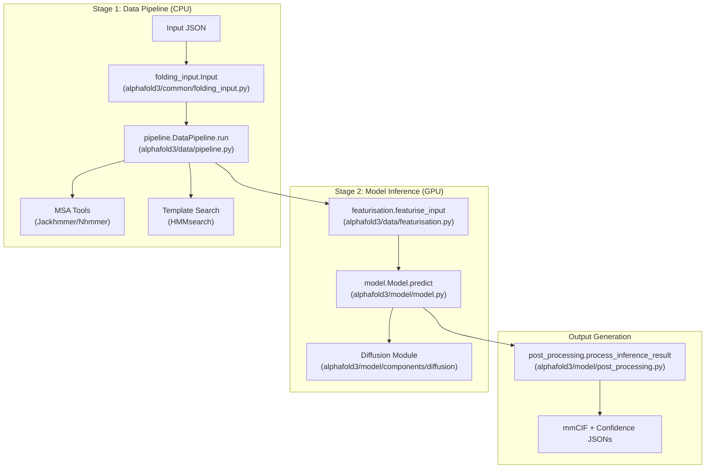
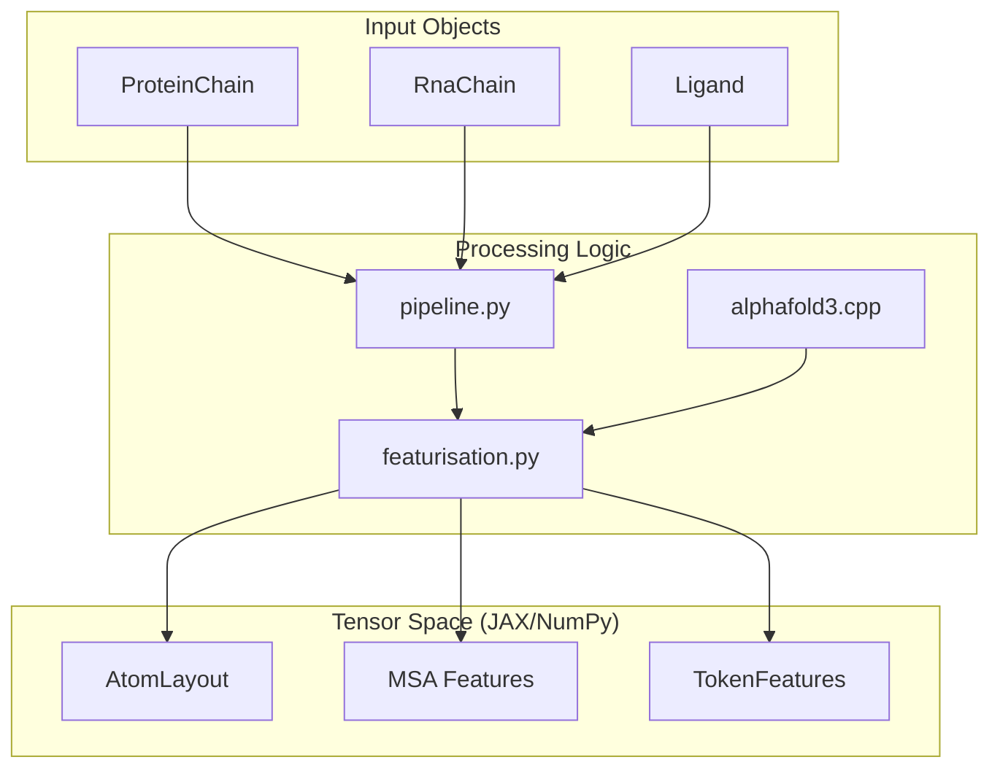

# Overview

> **Relevant source files**
> * [README.md](https://github.com/google-deepmind/alphafold3/blob/97639fff/README.md?plain=1)
> * [WEIGHTS_PROHIBITED_USE_POLICY.md](https://github.com/google-deepmind/alphafold3/blob/97639fff/WEIGHTS_PROHIBITED_USE_POLICY.md?plain=1)
> * [docs/model_parameters.md](https://github.com/google-deepmind/alphafold3/blob/97639fff/docs/model_parameters.md?plain=1)
> * [legal/WEIGHTS_PROHIBITED_USE_POLICY-Bahasa-Indonesia.md](https://github.com/google-deepmind/alphafold3/blob/97639fff/legal/WEIGHTS_PROHIBITED_USE_POLICY-Bahasa-Indonesia.md?plain=1)
> * [legal/WEIGHTS_PROHIBITED_USE_POLICY-Espanol-Latinoamerica.md](https://github.com/google-deepmind/alphafold3/blob/97639fff/legal/WEIGHTS_PROHIBITED_USE_POLICY-Espanol-Latinoamerica.md?plain=1)
> * [legal/WEIGHTS_TERMS_OF_USE-Francais-Canada.md](https://github.com/google-deepmind/alphafold3/blob/97639fff/legal/WEIGHTS_TERMS_OF_USE-Francais-Canada.md?plain=1)
> * [legal/WEIGHTS_TERMS_OF_USE-Portugues-Brazil.md](https://github.com/google-deepmind/alphafold3/blob/97639fff/legal/WEIGHTS_TERMS_OF_USE-Portugues-Brazil.md?plain=1)
> * [run_alphafold.py](https://github.com/google-deepmind/alphafold3/blob/97639fff/run_alphafold.py)

AlphaFold 3 is a state-of-the-art structure prediction system developed by Google DeepMind and Isomorphic Labs. It is capable of modeling a vast range of biomolecular systems, including proteins, nucleic acids (RNA/DNA), small molecules (ligands), and their complex interactions. The system integrates evolutionary information, chemical knowledge via the Chemical Component Dictionary (CCD), and a generative diffusion-based model to produce high-accuracy 3D coordinates and associated confidence metrics.

[README.md L3-L24](https://github.com/google-deepmind/alphafold3/blob/97639fff/README.md?plain=1#L3-L24)

 [run_alphafold.py L11-L20](https://github.com/google-deepmind/alphafold3/blob/97639fff/run_alphafold.py#L11-L20)

## Licensing and Usage Policies

The AlphaFold 3 system is subject to specific licensing terms for both its source code and its model parameters:

* **Source Code**: Licensed under **CC BY-NC-SA 4.0** (Creative Commons Attribution-NonCommercial-ShareAlike 4.0 International). [run_alphafold.py L3-L4](https://github.com/google-deepmind/alphafold3/blob/97639fff/run_alphafold.py#L3-L4)  [run_alphafold.py L13-L14](https://github.com/google-deepmind/alphafold3/blob/97639fff/run_alphafold.py#L13-L14)
* **Model Parameters**: Access to weights must be requested directly from Google via a specific form. Use is strictly limited to **non-commercial research** by non-commercial organizations (e.g., universities, non-profits, and research institutes). [README.md L26-L34](https://github.com/google-deepmind/alphafold3/blob/97639fff/README.md?plain=1#L26-L34)  [WEIGHTS_PROHIBITED_USE_POLICY.md L11-L23](https://github.com/google-deepmind/alphafold3/blob/97639fff/WEIGHTS_PROHIBITED_USE_POLICY.md?plain=1#L11-L23)
* **Prohibited Uses**: Users must not use AlphaFold 3 outputs to train or create machine learning models for biomolecular structure prediction ("Derived Models"). Sharing parameters with commercial organizations is prohibited. [WEIGHTS_PROHIBITED_USE_POLICY.md L80-L84](https://github.com/google-deepmind/alphafold3/blob/97639fff/WEIGHTS_PROHIBITED_USE_POLICY.md?plain=1#L80-L84)  [WEIGHTS_PROHIBITED_USE_POLICY.md L30-L32](https://github.com/google-deepmind/alphafold3/blob/97639fff/WEIGHTS_PROHIBITED_USE_POLICY.md?plain=1#L30-L32)
* **Citation**: Any publication disclosing findings arising from using this source code, model parameters, or outputs must cite the AlphaFold 3 Nature paper. [README.md L108-L124](https://github.com/google-deepmind/alphafold3/blob/97639fff/README.md?plain=1#L108-L124)  [WEIGHTS_PROHIBITED_USE_POLICY.md L113-L116](https://github.com/google-deepmind/alphafold3/blob/97639fff/WEIGHTS_PROHIBITED_USE_POLICY.md?plain=1#L113-L116)

Sources: [run_alphafold.py L3-L9](https://github.com/google-deepmind/alphafold3/blob/97639fff/run_alphafold.py#L3-L9)

 [README.md L3-L34](https://github.com/google-deepmind/alphafold3/blob/97639fff/README.md?plain=1#L3-L34)

 [WEIGHTS_PROHIBITED_USE_POLICY.md L1-L133](https://github.com/google-deepmind/alphafold3/blob/97639fff/WEIGHTS_PROHIBITED_USE_POLICY.md?plain=1#L1-L133)

## System Architecture

AlphaFold 3 is structured as a two-stage pipeline: a **Data Pipeline** for biological search and a **Model Inference** stage for 3D structure generation. The architecture is designed to bridge natural language/JSON specifications into high-dimensional tensor representations.

### Pipeline Design and Code Entities

The following diagram maps the logical stages of the prediction process to the specific Python modules and classes that implement them.

Sources: [run_alphafold.py L43-L48](https://github.com/google-deepmind/alphafold3/blob/97639fff/run_alphafold.py#L43-L48)

 [run_alphafold.py L438-L518](https://github.com/google-deepmind/alphafold3/blob/97639fff/run_alphafold.py#L438-L518)

 [run_alphafold.py L758-L829](https://github.com/google-deepmind/alphafold3/blob/97639fff/run_alphafold.py#L758-L829)

## Two-Stage Pipeline Flow

The system execution is orchestrated by `run_alphafold.py`, which manages the transition from biological sequences to 3D structures. The execution can be controlled via flags `--run_data_pipeline` and `--run_inference`. [run_alphafold.py L85-L94](https://github.com/google-deepmind/alphafold3/blob/97639fff/run_alphafold.py#L85-L94)

### 1. Data Pipeline

This stage is primarily CPU-bound and handles the search against large genetic and structural databases. It generates Multiple Sequence Alignments (MSAs) and structural templates.

* **MSA Generation**: Uses `Jackhmmer` for proteins and `Nhmmer` for RNA. [run_alphafold.py L97-L106](https://github.com/google-deepmind/alphafold3/blob/97639fff/run_alphafold.py#L97-L106)
* **Template Search**: Uses `HMMsearch` to find structural analogs in the PDB. [run_alphafold.py L112-L116](https://github.com/google-deepmind/alphafold3/blob/97639fff/run_alphafold.py#L112-L116)
* **Database Management**: Searches across databases like BFD, MGnify, UniProt, and RNAcentral. Database paths are configurable via flags. [run_alphafold.py L131-L210](https://github.com/google-deepmind/alphafold3/blob/97639fff/run_alphafold.py#L131-L210)

### 2. Model Inference

This stage requires a GPU and performs heavy tensor computations using JAX.

* **Featurization**: Converts biological data and pipeline results into numerical features. [run_alphafold.py L42-L45](https://github.com/google-deepmind/alphafold3/blob/97639fff/run_alphafold.py#L42-L45)
* **Model Execution**: The `model.Model` class (implemented using Haiku) loads the `params` and executes the neural network components. [run_alphafold.py L46-L47](https://github.com/google-deepmind/alphafold3/blob/97639fff/run_alphafold.py#L46-L47)  [run_alphafold.py L808-L816](https://github.com/google-deepmind/alphafold3/blob/97639fff/run_alphafold.py#L808-L816)
* **Diffusion Sampling**: Generates the final 3D coordinates through an iterative denoising process. The model parameters include specific weights for the `diffusion_head`. [docs/model_parameters.md L35-L61](https://github.com/google-deepmind/alphafold3/blob/97639fff/docs/model_parameters.md?plain=1#L35-L61)

### Data Flow: From JSON to Tensors

The diagram below illustrates how code entities transform the input data model into the feature tensors used by the neural network.

Sources: [run_alphafold.py L38-L48](https://github.com/google-deepmind/alphafold3/blob/97639fff/run_alphafold.py#L38-L48)

 [run_alphafold.py L438-L518](https://github.com/google-deepmind/alphafold3/blob/97639fff/run_alphafold.py#L438-L518)

## System Design and Performance

The codebase is built on a modern Python stack optimized for high-performance computing:

| Component | Technology | Role |
| --- | --- | --- |
| **Numerical Engine** | JAX | Automatic differentiation and GPU acceleration. [run_alphafold.py L51-L52](https://github.com/google-deepmind/alphafold3/blob/97639fff/run_alphafold.py#L51-L52) |
| **Neural Network** | Haiku | Functional neural network layers. [run_alphafold.py L50](https://github.com/google-deepmind/alphafold3/blob/97639fff/run_alphafold.py#L50-L50) |
| **C++ Extensions** | alphafold3.cpp | High-speed mmCIF parsing and structure manipulation. [run_alphafold.py L41](https://github.com/google-deepmind/alphafold3/blob/97639fff/run_alphafold.py#L41-L41) |
| **Input Parsing** | tokamax | Tokenization and sequence processing. [run_alphafold.py L54](https://github.com/google-deepmind/alphafold3/blob/97639fff/run_alphafold.py#L54-L54) |

### Performance Optimizations

* **XLA Compilation**: Uses JAX's Just-In-Time (JIT) compilation for inference speed. [run_alphafold.py L51-L52](https://github.com/google-deepmind/alphafold3/blob/97639fff/run_alphafold.py#L51-L52)
* **Staged Execution**: The separation of the data pipeline and inference allows running the CPU-heavy search on different hardware than the GPU-heavy inference. [run_alphafold.py L85-L94](https://github.com/google-deepmind/alphafold3/blob/97639fff/run_alphafold.py#L85-L94)
* **Random Parameter Generation**: Support for generating random parameters based on the schema for performance benchmarking without official weights. [docs/model_parameters.md L1-L29](https://github.com/google-deepmind/alphafold3/blob/97639fff/docs/model_parameters.md?plain=1#L1-L29)

Sources: [run_alphafold.py L1-L54](https://github.com/google-deepmind/alphafold3/blob/97639fff/run_alphafold.py#L1-L54)

 [docs/model_parameters.md L1-L31](https://github.com/google-deepmind/alphafold3/blob/97639fff/docs/model_parameters.md?plain=1#L1-L31)

## Technical Documentation Roadmap

* **[Installation Guide](/google-deepmind/alphafold3/2-installation-guide)**: System requirements and setup using Docker.
* **[User Guide](/google-deepmind/alphafold3/3-user-guide)**: Preparing JSON inputs and interpreting the output mmCIF and confidence files.
* **[Core Pipeline](/google-deepmind/alphafold3/4-core-pipeline)**: Detailed explanation of the prediction pipeline architecture.
* **[Data Structures](/google-deepmind/alphafold3/5-data-structures)**: Technical reference for the internal representations of chains and structures.
* **[Performance Optimization](/google-deepmind/alphafold3/8-performance-optimization)**: Strategies for hardware utilization and compilation.

Sources: [README.md L36-L106](https://github.com/google-deepmind/alphafold3/blob/97639fff/README.md?plain=1#L36-L106)